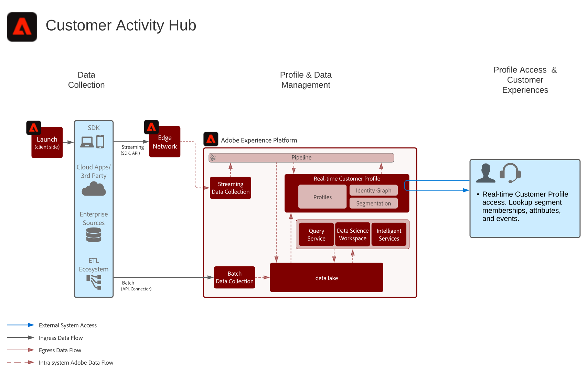

# Vervaging van de Hub voor klantactiviteiten

De Vervaging van de Hub van de Activiteit van de klant toont hoe de externe toepassingen tot het Profiel van de Klant [!UICONTROL In real time] kunnen toegang hebben.

Externe toepassingen hebben toegang tot profielen met een API-GET-aanvraag. Kenmerken, gebeurtenissen, segmentlidmaatschap en modelgestuurde functies die in het profiel zijn opgeslagen, kunnen vervolgens worden gebruikt in deze externe toepassingen die geen Adobe zijn.

Met dit vermogen, kon u rijke context oppervlakte wanneer een klant uw vraagcentrum roept. De agenten van de steun zouden zicht in de levenwaarde van de klant, neiging tot kurn of blootstelling aan marketing campagnes kunnen hebben, bijvoorbeeld. De agenten van de verkoop kunnen ook van meer context of inzicht in hun klant profiteren.

>[!NOTE]
>
>De huidige latentie die door profiel raadpleging API wordt gesteund is ongeveer 500 milliseconden, die deze benadering ongeschikt maken voor integratie van het profiel met besluitvormingsmotoren in real time zoals het Web van de zelfde pagina of mobiele verpersoonlijking.

## Gevallen gebruiken

* Verbeter de context van de consument aan agent-gesteunde interactie, zoals steun en verkoopervaringen. Gebruikend het profielraadpleging in Experience Platform, kunnen de agenten meer context op de consument, zoals recente aankopen, campagneinteractie, eigenschappen, publiekslidmaatschappen, en andere attributen en inzichten ontvangen die in het klantenprofiel in real time worden opgeslagen.

## Architectuur

## Guardrails

* [Guardrails voor  [!UICONTROL realtime ] profielgegevens van klanten](https://experienceleague.adobe.com/docs/experience-platform/profile/guardrails.html)

## Implementatiestappen

1. Vorm datasets en schema&#39;s.
1. [!UICONTROL Real-time klantprofiel] configureren: vorm het schema en de dataset voor [!UICONTROL Real-time Profiel van de Klant], en opstelling een fusiebeleid en identiteiten.
1. Gegevens in Platform opnemen en verwerken naar [!UICONTROL Real-time klantprofiel].
1. Gebruik de Entiteit-API om een profielkenmerk op te zoeken, hetzij van de verslagentiteit of de ervaringsgebeurtenisentiteit.

## Verwante documentatie

* [Productbeschrijving van Adobe Experience Platform Activation](https://helpx.adobe.com/legal/product-descriptions/adobe-experience-platform0.html)
* [[!UICONTROL Real-time ] documentatie van het Profiel van de Klant](https://experienceleague.adobe.com/docs/experience-platform/profile/home.html?lang=en)
* [Profielhulplijnen](https://experienceleague.adobe.com/docs/experience-platform/profile/guardrails.html)
* [API voor zoeken van profielen](https://www.adobe.io/apis/experienceplatform/home/api-reference.html)
