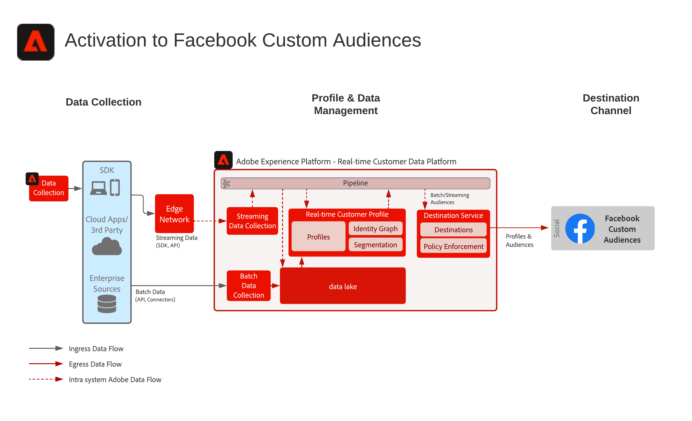

# Activering voor aangepast publiek van Facebook

Verzamel klantengegevens uit veelvoudige bronnen om één enkele profielmening van de klant te bouwen, deze profielen te segmenteren aan gebouwd publiek voor marketing en verpersoonlijking, deze toehoorders aan Sociale Advertentienetwerken zoals Facebook aan doel en verpersoonlijkingscampagnes tegen dat publiek te delen.

## Use Cases

* Publiek dat zich richt op bekende doelgroepen op sociale en reclamebestemmingen.
* Online personalisatie met online en offline kenmerken.

## Toepassingen

* Real-time Customer Data Platform

## Architectuur

## Implementatiestappen

1. Identiteitsnaamruimten configureren die moeten worden gebruikt in profielgegevensbronnen.
   * Gebruik naamruimten buiten het vak, zoals E-mail, SHA256-hash, indien beschikbaar.
   * Facebook heeft een lijst met ondersteunde identiteiten. In order to activate to Facebook custom audiences, one of the supported identities must be present in the profiles to be activated.
   * The following identities are currently supported by Facebook: GAID, IDFA, phone_sha256, email_lc_sha256, extern_id.
   * Zie voor meer informatie de [Facebook-doelgids](https://experienceleague.adobe.com/docs/experience-platform/destinations/catalog/social/facebook.html).
   * Aangepaste naamruimten maken waarin naamruimten buiten het vak niet beschikbaar zijn voor de toepasselijke id&#39;s.
1. Vorm de schema&#39;s en datasets van de gegevensbron van het Profiel.
   * Create Profile Record schemas for all profile record source data.
      * Geef de primaire identiteit en secundaire identiteiten voor elk schema op.
      * Schakel het schema in voor profielopname.
   * Creeer de datasets van het Verslag van het Profiel voor alle brongegevens van het profielverslag, toewijzend het bijbehorende schema.
      * Schakel de gegevensset in voor het opnemen van profielen.
   * Creeer de schema&#39;s van de Gebeurtenis van de Ervaring van het Profiel voor alle van de profieltijdreeks gebaseerde brongegevens.
      * Specificeer de primaire identiteit en secundaire identiteiten voor het schema.
   * Enable the schema for profile ingestion.
   * Creeer de datasets van de Gebeurtenis van de Ervaring van het Profiel voor alle gegevens van de gebeurtenisbron van de profielervaring, toewijzend het bijbehorende schema.
      * Schakel de gegevensset in voor het opnemen van profielen.
1. Ontvang de brongegevens gebruikend een bronschakelaar in de bijbehorende dataset hierboven gevormd.
   * Vorm de rekening van de bronschakelaar met geloofsbrieven.
   * Vorm een dataflow om de gegevens van het brondossier of omslagplaats bij een gespecificeerd programma aan de gespecificeerde dataset in te voeren.
   * Wijs om het even welke gebieden van de brongegevens aan het doelschema toe.
   * Transformeer alle velden naar de juiste indeling voor opname in het Experience Platform.
      * Date transformations
      * Transformeren naar kleine letters waar van toepassing - zoals e-mailadres
      * Patroontransformaties (bijvoorbeeld telefoonnummer)
      * Voeg unieke record-id&#39;s toe voor ervaringsgebeurtenisrecords als deze niet aanwezig zijn in de brongegevens.
      * Transformeer arrays en kaarttekstvelden om ervoor te zorgen dat arrays en kaarten correct worden toegewezen en gemodelleerd voor segmentatie in Experience Platform.
1. Vorm het Beleid van de Fusie van het Profiel om de correcte configuratie van de identiteitsgrafiek te verzekeren en welke datasets in de samenvoeging van profielen zouden moeten worden omvat.
1. After dataflows have executed, ensure the profile data ingestion was successful with no errors.
   * Inspect de identiteitsgrafiek van verscheidene profielen om correcte verwerking van identiteitsverhoudingen te verzekeren.
   * Inspect de kenmerken en gebeurtenissen van verschillende profielen om ervoor te zorgen dat attributen en gebeurtenissen correct worden opgenomen in de profielen.
1. Auteurssegmenten om profielpubliek te maken
   * Bouw segmenten in de segmentbouwer gebruikend regels tegen attributen en gebeurtenissen.
   * Sparen het segment voor evaluatie. De segmenten zullen bij het gespecificeerde programma eens per dag evalueren.
      * Als de segmentregels voor het stromen segmentatie verkiesbaar zijn zal het segment worden geëvalueerd aangezien de nieuwe het stromen gegevens voor de profielen worden opgenomen. Streaming segmenten worden ook één keer per dag geëvalueerd tijdens de geplande batchsegmentatie.
1. Zorg ervoor dat de segmentresultaten naar verwachting zijn.
   * Herzie de telling van segmentresultaten voor de bepaalde segmenten.
   * Onderzoek het profiel dat in het segment zou moeten worden omvat om te verifiëren het segmentlidmaatschap is inbegrepen in het gedeelte van het segmentlidmaatschap van het profiel.
1. Vorm de levering van het publiek aan de bestemming in de configuratie van de Bestemming.
   * See the [Facebook Destination Guide](https://experienceleague.adobe.com/docs/experience-platform/destinations/catalog/social/facebook.html) for further details on configuring the Facebook Destination.
   * Wanneer het vormen van een bestemming, selecteer welk publiek u aan de bestemming wilt activeren.
   * Bepaal de geplande begindatum u de bestemmingsdataflow zou willen beginnen leverend het publiek aan de bestemming.
   * Elke bestemming heeft verplichte en optionele kenmerken die worden verzonden.
      * Voor Facebook moet een van de vereiste identiteiten worden opgenomen en wordt deze gebruikt om de profielen in het publiek binnen het Experience Platform aan te passen aan een profiel dat door Facebook wordt beoogd.
   * Each destination also has a specified delivery type, whether streaming or batch, file based or JSON payload.
      * Voor Facebook worden publieksleden op streamingwijze geleverd aan een Facebook-eindpunt in JSON-indeling.
      * Audience memberships will be delivered in streaming fashion subsequent to the streaming or batch segmentation evaluation in Experience Platform.
1. Verzeker de bestemmingsstroom het publiek aan de bestemming zoals verwacht heeft geleverd.
   * Check the monitoring interface to confirm the audience was delivered with the number of profiles expected. De publieksgrootte moet het verwachte aantal geactiveerde profielen weerspiegelen. Voor specifieke doelen, zoals Facebook, zijn bepaalde velden vereist, zoals een e-mailhash-identiteit. Als deze niet voorkomen in het profiel dat lid is van het publiek, wordt de doelgroep niet geactiveerd.
   * Check for any skipped profiles for profile identities missing or attributes missing that were mandatory.
   * Check for any other errors that may need to be resolved.
1. Verifieer het publiek aan de eindbestemming met het verwachte aantal publiekslidmaatschappen werd geactiveerd.
   * Login to Facebook Custom Audience portal to verify the audience from Real-time Customer Data Platform was delivered and that the match rate of profiles in the audience in Facebook reasonably matches the number of profiles in the audience from Real-time Customer Data Platform.

## Guardrails

[Profiel en segmentatiehulplijnen](https://experienceleague.adobe.com/docs/experience-platform/profile/guardrails.html?lang=en)

## Verwante documentatie

Activering voor aangepast publiek van Facebook - [Doelconfiguratie](https://experienceleague.adobe.com/docs/experience-platform/destinations/catalog/social/facebook.html)