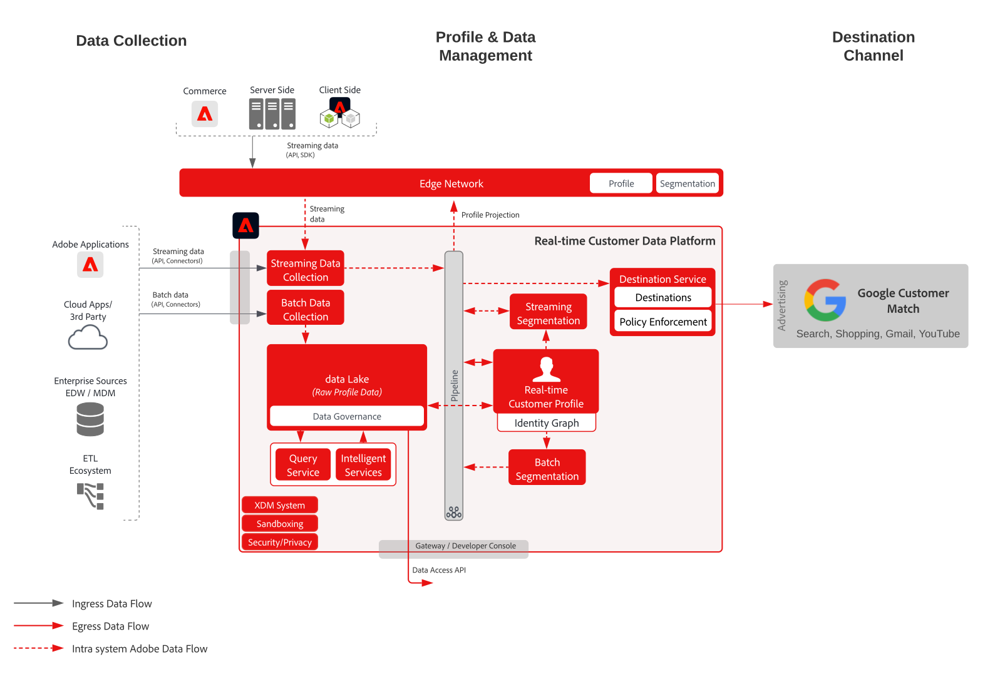

# Activering voor Google Customer Match

Verzamel klantgegevens uit meerdere bronnen om één profielweergave van de klant te maken, deze profielen te segmenteren naar een samengesteld publiek voor marketing en personalisatie, deze soorten publiek te delen naar sociale advertentienetwerken, zoals klantenservice van Google, om te zoeken naar doelgerichte en personalisatiecampagnes tegen dat publiek. Met Customer Match van Google kunt u uw online- en offline gegevens gebruiken om uw klanten te bereiken en opnieuw contact op te nemen met andere klanten van Google, zoals: Zoeken, winkelen, Gmail en YouTube.

## Gebruik hoofdletters

* Publiek dat zich richt op bekende doelgroepen op sociale en reclamebestemmingen.
* Online personalisatie met online en offline kenmerken.

## Toepassingen

* Real-time Customer Data Platform

## Architectuur

## Uitvoeringsstappen

1. Identiteitsnaamruimten configureren die moeten worden gebruikt in profielgegevensbronnen.
   * Gebruik naamruimten buiten het vak, zoals E-mail, SHA256-hash, indien beschikbaar.
   * Google Customer Match heeft een lijst met ondersteunde identiteiten. Als u wilt activeren naar Google Customer Match, moet een van de ondersteunde identiteiten aanwezig zijn in de profielen die moeten worden geactiveerd.
   * De volgende identiteiten worden momenteel ondersteund door Google Customer Match: GAID, IDFA, phone_sha256_e.164, email_lc_sha256, user_id.
   * Zie voor meer informatie de [Google Customer Match Destination Guide](https://experienceleague.adobe.com/docs/experience-platform/destinations/catalog/advertising/google-customer-match.html).
   * Aangepaste naamruimten maken waarin naamruimten buiten het vak niet beschikbaar zijn voor de toepasselijke id&#39;s.
1. Vorm de schema&#39;s en datasets van de gegevensbron van het Profiel.
   * Profielrecordschema&#39;s maken voor alle brongegevens van profielrecords.
      * Geef de primaire identiteit en secundaire identiteiten voor elk schema op.
      * Schakel het schema in voor profielopname.
   * Creeer de datasets van het Verslag van het Profiel voor alle brongegevens van het profielverslag, toewijzend het bijbehorende schema.
      * Schakel de gegevensset in voor het opnemen van profielen.
   * Creeer de schema&#39;s van de Gebeurtenis van de Ervaring van het Profiel voor alle van de profieltijdreeks gebaseerde brongegevens.
      * Specificeer de primaire identiteit en secundaire identiteiten voor het schema.
   * Schakel het schema in voor profielopname.
   * Creeer de datasets van de Gebeurtenis van de Ervaring van het Profiel voor alle gegevens van de gebeurtenisbron van de profielervaring, toewijzend het bijbehorende schema.
      * Schakel de gegevensset in voor het opnemen van profielen.
1. Ontvang de brongegevens gebruikend een bronschakelaar in de bijbehorende dataset hierboven gevormd.
   * Vorm de rekening van de bronschakelaar met geloofsbrieven.
   * Vorm een dataflow om de gegevens van het brondossier of omslagplaats bij een gespecificeerd programma aan de gespecificeerde dataset in te voeren.
   * Wijs om het even welke gebieden van de brongegevens aan het doelschema toe.
   * Transformeer alle velden naar de juiste indeling voor opname in het Experience Platform.
      * Datumtransformaties
      * Transformeren naar kleine letters waar van toepassing - zoals e-mailadres
      * Patroontransformaties (bijvoorbeeld telefoonnummer)
      * Voeg unieke record-id&#39;s toe voor ervaringsgebeurtenisrecords als deze niet aanwezig zijn in de brongegevens.
      * Transformeer arrays en kaarttekstvelden om ervoor te zorgen dat arrays en kaarten correct worden toegewezen en gemodelleerd voor segmentatie in Experience Platform.
1. Vorm het Beleid van de Fusie van het Profiel om de correcte configuratie van de identiteitsgrafiek te verzekeren en welke datasets in de samenvoeging van profielen zouden moeten worden omvat.
1. Nadat de gegevensstromen hebben uitgevoerd, zorg ervoor de de gegevensinvoer van het profiel met succes zonder fouten was.
   * Inspect de identiteitsgrafiek van verscheidene profielen om correcte verwerking van identiteitsverhoudingen te verzekeren.
   * Inspect de kenmerken en gebeurtenissen van verschillende profielen om ervoor te zorgen dat attributen en gebeurtenissen correct worden opgenomen in de profielen.
1. Auteurssegmenten om profielpubliek te maken
   * Bouw segmenten in de segmentbouwer gebruikend regels tegen attributen en gebeurtenissen.
   * Sparen het segment voor evaluatie. De segmenten zullen bij het gespecificeerde programma eens per dag evalueren.
      * Als de segmentregels voor het stromen segmentatie verkiesbaar zijn zal het segment worden geëvalueerd aangezien de nieuwe het stromen gegevens voor de profielen worden opgenomen. Streaming segmenten worden ook één keer per dag geëvalueerd tijdens de geplande batchsegmentatie.
1. Zorg ervoor dat de segmentresultaten naar verwachting zijn.
   * Herzie de telling van segmentresultaten voor de bepaalde segmenten.
   * Onderzoek het profiel dat in het segment zou moeten worden omvat om te verifiëren het segmentlidmaatschap is inbegrepen in het gedeelte van het segmentlidmaatschap van het profiel.
1. Vorm de levering van het publiek aan de bestemming in de configuratie van de Bestemming.
   * Zie de [Google Customer Match Destination Guide](https://experienceleague.adobe.com/docs/experience-platform/destinations/catalog/advertising/google-customer-match.html) voor meer informatie over het configureren van de Facebook-bestemming.
   * Wanneer het vormen van een bestemming, selecteer welk publiek u aan de bestemming wilt activeren.
   * Bepaal de geplande begindatum u de bestemmingsdataflow zou willen beginnen leverend het publiek aan de bestemming.
   * Elke bestemming heeft verplichte en optionele kenmerken die worden verzonden.
      * Voor Google Customer Match moet een van de vereiste identiteiten worden opgenomen en worden gebruikt om de profielen in het publiek in het Experience Platform aan te passen aan een profiel dat door Google Customer Match als doel wordt gesteld.
   * Elke bestemming heeft ook een opgegeven leveringstype, of het nu gaat om streaming, batch, op bestand gebaseerd of JSON-lading.
      * Voor Google Customer Match worden abonnementen voor het publiek op streamingwijze geleverd aan een Google Customer Match-eindpunt in JSON-indeling.
      * De leden van het publiek zullen op streamingwijze na het stromen of partijsegmentatie evaluatie in Experience Platform worden geleverd.
1. Verzeker de bestemmingsstroom het publiek aan de bestemming zoals verwacht heeft geleverd.
   * Controleer de controleinterface om te bevestigen dat het publiek met het verwachte aantal profielen is geleverd. De publieksgrootte moet het verwachte aantal geactiveerde profielen weerspiegelen. Voor specifieke doelen, zoals Google Customer Match, zijn bepaalde velden vereist, zoals een e-mailhash-identiteit. Als deze gebieden niet voorkomen in het profiel dat lid is van het publiek, wordt de doellocatie niet geactiveerd.
   * Controleer of overgeslagen profielen aangeven dat er ontbrekende of verplichte kenmerken ontbreken in de profiel-id.
   * Controleer op eventuele andere fouten die moeten worden opgelost.
1. Verifieer het publiek aan de eindbestemming met het verwachte aantal publiekslidmaatschappen werd geactiveerd.
   * Schakel over naar je Google Ads-account nadat je de activeringsstroom hebt voltooid. De geactiveerde segmenten worden in uw Google-account weergegeven als klantenlijsten. Houd er rekening mee dat sommige doelgroepen, afhankelijk van de grootte van uw segment, alleen worden gevuld als er meer dan 100 actieve gebruikers zijn die u kunt bedienen.

## Guardrails

[Profiel en segmentatiehulplijnen](https://experienceleague.adobe.com/docs/experience-platform/profile/guardrails.html?lang=en)

## Gerelateerde documentatie

Activering voor Google Customer Match - [Doelconfiguratie](https://experienceleague.adobe.com/docs/experience-platform/destinations/catalog/advertising/google-customer-match.html)
