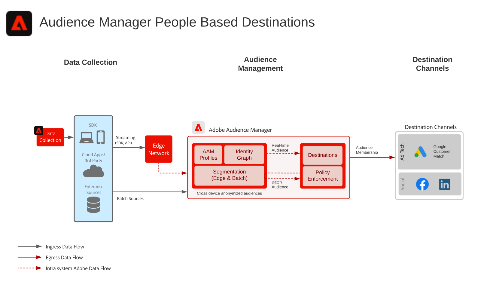

# Bekende blauwdruk voor activering door klant

Gebruik offlinekenmerken en -gebeurtenissen zoals offline bestellingen, transacties, CRM of loyaliteitsgegevens, samen met onlinegedrag voor het online aanwijzen en personaliseren.

Uitgebreide id herkenningstekens met ingebouwde beheerscontroles verstrekken meer kansen om met bekende klanten te communiceren. Activeer het publiek naar bekende, op profielen gebaseerde bestemmingen, zoals e-mailproviders, sociale netwerken en advertentiebestemmingen.

De aanvullende details zijn te vinden in het [Activering van publiek en profiel met Experience Cloud-toepassingen Bladeren](platform-and-applications.md) specifiek voor de integratie tussen Experience Platform- en Experience Cloud-toepassingen.

## Gebruik hoofdletters

* Publiek dat zich richt op bekende doelgroepen op sociale en reclamebestemmingen.
* Online personalisatie met online en offline kenmerken.
* Activeer het publiek naar bekende kanalen, zoals e-mail en SMS.

## Toepassingen

* [!UICONTROL Real-time Customer Data Platform]
* De Audience Manager Mensen Gebaseerde bestemmingen kunnen ook voor mensen gebaseerd activering aan Facebook, LinkedIn, en Klantovereenkomst van Google worden gebruikt.

## Architectuur

### Activering van bekende klanten via Real-time Customer Data Platform

 

### Bekende klantactivering via Audience Manager People-Based Doelen

 

## Guardrails

[Raadpleeg de hulplijnen die worden beschreven op de pagina Overzicht van publiek- en profielactivering](https://experienceleague.adobe.com/docs/blueprints-learn/architecture/audience-activation/overview.html?lang=en#guardrails-for-audience-and-profile-activation-blueprints).

## Implementatiestappen voor Real-time Customer Data Platform

1. [Schema&#39;s maken](https://experienceleague.adobe.com/?recommended=ExperiencePlatform-D-1-2021.1.xdm) voor gegevens die moeten worden ingevoerd.
1. [Gegevenssets maken](https://experienceleague.adobe.com/docs/platform-learn/tutorials/data-ingestion/create-datasets-and-ingest-data.html) voor gegevens die moeten worden ingevoerd.
1. [De juiste identiteiten en naamruimten configureren](https://experienceleague.adobe.com/docs/platform-learn/tutorials/identities/label-ingest-and-verify-identity-data.html) op het schema om ervoor te zorgen dat ingesloten gegevens in een verenigd profiel kunnen vastmaken.
1. [De schema&#39;s en datasets voor profiel inschakelen](https://experienceleague.adobe.com/docs/platform-learn/tutorials/profiles/bring-data-into-the-real-time-customer-profile.html).
1. [Gegevens samenvoegen](https://experienceleague.adobe.com/?recommended=ExperiencePlatform-D-1-2020.1.dataingestion) in Experience Platform.
1. [Voorziening [!UICONTROL Real-time Customer Data Platform] delen van segmenten](https://www.adobe.com/go/audiences) tussen Experience Platform en Audience Manager voor publiek dat in Experience Platform wordt gedefinieerd en aan Audience Manager wordt gedeeld.
1. [Segmenten maken](https://experienceleague.adobe.com/docs/platform-learn/tutorials/segments/create-segments.html) in Experience Platform. Het systeem bepaalt automatisch of het segment als partij of het stromen wordt geëvalueerd.
1. [Doelen configureren](https://experienceleague.adobe.com/docs/platform-learn/tutorials/destinations/create-destinations-and-activate-data.html) voor het delen van profielkenmerken en publieksleden aan gewenste bestemmingen.

## Implementatieoverwegingen

* Wanneer u profielgegevens deelt met bestemmingen, moet u de specifieke identiteitswaarde opnemen die door de bestemming wordt gebruikt in de doellading. Om het even welke identiteit die voor een doelbestemming noodzakelijk is moet in Platform worden opgenomen en als identiteit voor worden gevormd [!UICONTROL Klantprofiel in realtime].

* Zie de [Activering van publiek en profiel met Experience Cloud-toepassingen Bladeren](platform-and-applications.md) voor meer informatie over het delen van publiek van Real-time Customer Data Platform naar Audience Manager, Analytics, Target, Campaign en Journey Optimizer.

## Implementatiestappen voor op mensen gebaseerde doelen van de Audience Manager

* Zie voor meer informatie over het implementeren van Audience Manager het volgende: [documentatie](https://experienceleague.adobe.com/docs/audience-manager/user-guide/implementation-integration-guides/implement-audience-manager.html).

* Voor details over het uitvoeren van Mensen Gebaseerde Doelen in Audience Manager zie het volgende [documentatie](https://experienceleague.adobe.com/docs/audience-manager/user-guide/faqs/faq-people-based-destinations.html).

## Gerelateerde documentatie

* [[!UICONTROL Real-time Customer Data Platform] Productbeschrijving](https://helpx.adobe.com/legal/product-descriptions/real-time-customer-data-platform.html)
* [Richtlijnen voor profiel en segmentatie](https://experienceleague.adobe.com/docs/experience-platform/profile/guardrails.html?lang=en)
* [Segmenteringsdocumentatie](https://experienceleague.adobe.com/docs/experience-platform/segmentation/api/streaming-segmentation.html)
* [Doelen](https://experienceleague.adobe.com/docs/experience-platform/destinations/catalog/overview.html)

## Verwante video&#39;s en zelfstudies

* [[!UICONTROL Real-time Customer Data Platform] overzicht](https://experienceleague.adobe.com/docs/platform-learn/tutorials/application-services/rtcdp/understanding-the-real-time-customer-data-platform.html)
* [Demo van [!UICONTROL Real-time Customer Data Platform]](https://experienceleague.adobe.com/docs/platform-learn/tutorials/application-services/rtcdp/demo.html)
* [Segmenten maken](https://experienceleague.adobe.com/docs/platform-learn/tutorials/segments/create-segments.html)
