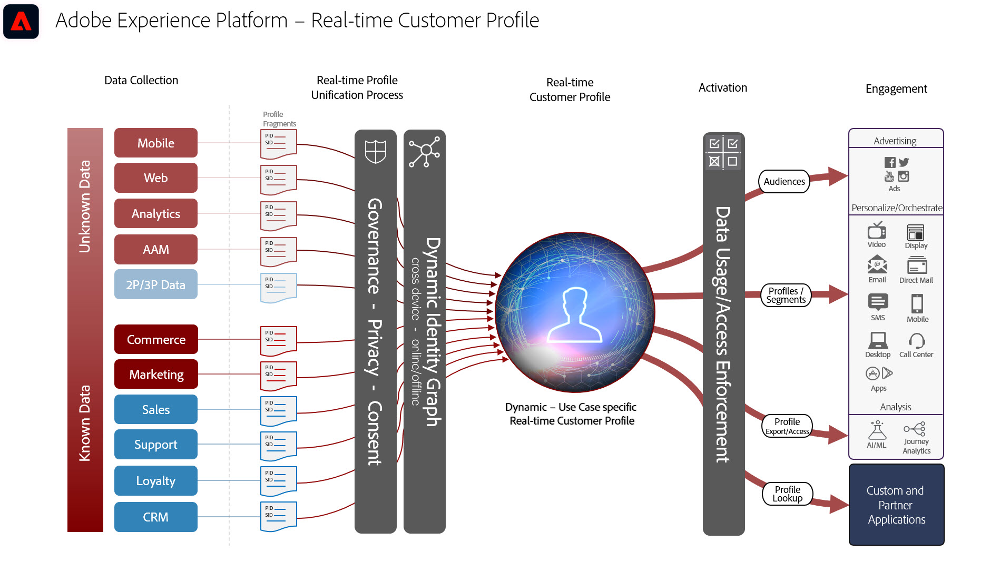

# Blauwdrukken voor activering van publiek en profiel

Activering van publiek en profiel is de sleutel tot succes in een wereld van gegevensgestuurde marketing. Veel merken richten zich echter nog steeds op activering via het kanaal, wat vaak leidt tot inconsistente bereikbaarheid en personalisatie.

Met een kanaal-eerste benadering, handelt elk kanaal als silo waarin de verpersoonlijkingsinspanningen slechts de klanten richten die met het merk op dat kanaal interactie aangaan. Deze benadering weerspiegelt niet de realiteit dat klanten met merken over vele verschillende touchpoints in wisselwerking staan. Activering van publiek en profiel maakt het voor merken mogelijk om klanteninteracties via meerdere kanalen te verbinden, zodat zij een gecentraliseerd profiel en publiek leveren dat op alle kanalen kan worden geactiveerd.

Blauwdrukken bij publiek en profielactivering

- [Anoniem Audience Activation](/help/blueprints/audience-activation/anonymous.md)
- Bekende activering van de Klant (RTCDP)
   - [Overzicht](/help/blueprints/audience-activation/known.md)
   - [Activering op sociale en reclamekanalen](/help/blueprints/audience-activation/advertising-activation.md)
   - [Activering voor streaming van bestanden en bedrijven](/help/blueprints/audience-activation/enterprise-destinations.md)
   - [Klantactiviteiten](/help/blueprints/audience-activation/customer-activity.md)
   - [Segmentovereenkomst](/help/blueprints/audience-activation/segment-match.md)
   - [Activering met Experience Cloud-toepassingen](/help/blueprints/audience-activation/platform-and-applications.md)

## Architectuur van het Profiel van de Klant in real time

In de onderstaande afbeelding worden de kernonderdelen van het realtime klantprofiel van het Experience Platform beschreven.

Zie voor meer documentatie over profiel, segmentering en activering de [Documentatie RTCDP-overzicht](https://experienceleague.adobe.com/en/docs/experience-platform/rtcdp/home) en de [Overzicht van het realtime klantprofiel](https://experienceleague.adobe.com/en/docs/experience-platform/profile/home) pagina&#39;s.

## Instructies voor blauwdrukken voor publiek en profielactivering

* Voor gedetailleerde instructies en eindlatenties raadpleegt u de [document met implementatiehandleidingen](../experience-platform/deployment/guardrails.md) en de [Profiel en segmentatiehulplijnen](https://experienceleague.adobe.com/docs/experience-platform/profile/guardrails.html?lang=en)