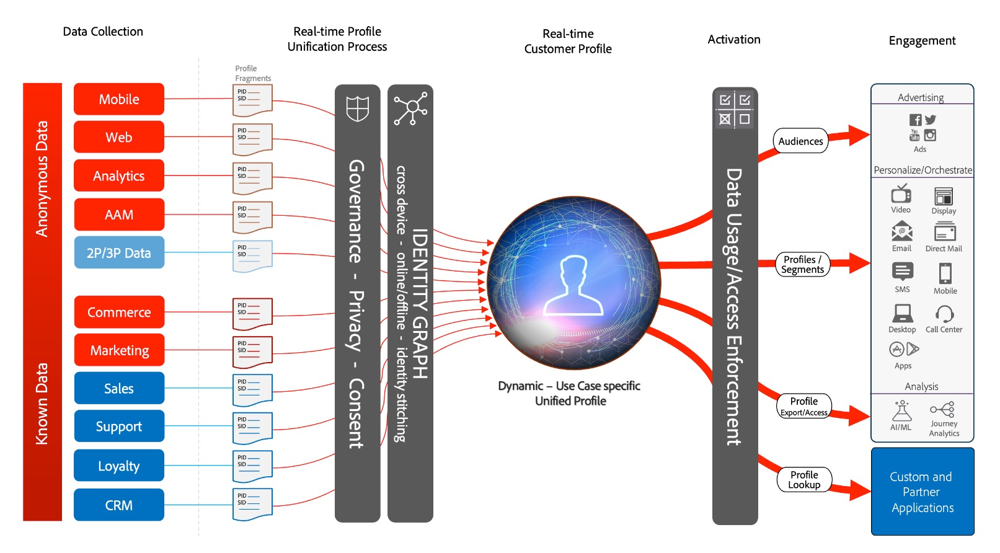

# Blauwdrukken voor activering van publiek en profiel

Activering van publiek en profiel is de sleutel tot succes in een wereld van gegevensgestuurde marketing. Veel merken richten zich echter nog steeds op activering via het kanaal, wat vaak leidt tot inconsistente bereikbaarheid en personalisatie.

Met een kanaal-eerste benadering, handelt elk kanaal als silo waarin de verpersoonlijkingsinspanningen slechts de klanten richten die met het merk op dat kanaal interactie aangaan. Deze benadering weerspiegelt niet de realiteit dat klanten met merken over vele verschillende touchpoints in wisselwerking staan. Activering van publiek en profiel maakt het voor merken mogelijk om klanteninteracties via meerdere kanalen te verbinden, zodat zij een gecentraliseerd profiel en publiek leveren dat op alle kanalen kan worden geactiveerd.

| Blauwdruk | Beschrijving | Experiencen Cloud |
|---|---|---|
| **[Anoniem Audience Activation](anonymous.md)** | <ul><li>Doelpubliek via internet en reclamekanalen voor anonieme en gedragsgegevens van klanten.</li><li>Integreren met publieksgegevens van derden voor een betere personalisatie.</li></ul> | <ul><li>Adobe Audience Manager</li></ul> |
| **[Bekende activering van klant](known.md)** | <ul><li>Activeer naar bekende, op profielen gebaseerde bestemmingen, zoals e-mailproviders, sociale netwerken en reclamebestemmingen. </li><li>Gebruik offlinekenmerken en -gebeurtenissen, zoals offlinebestellingen, transacties, CRM of loyaliteitsgegevens, samen met onlinegedrag voor het online aanwijzen en personaliseren.</li></ul> | <ul><li>Adobe Experience Platform</li><li> [!UICONTROL Real-time Customer Data Platform]</li><li>Adobe Audience Manager (optioneel)</li></ul> |
| **[Activering van publiek en profiel met Experience Cloud-toepassingen](platform-and-applications.md)** | <ul><li>Profielen en doelgroepen in Experience Platform beheren en deze delen met Experience Cloud-toepassingen</li><li>Bouw en deel rijke klantensegmenten en inzichten in Experience Platform en deel hen met de Toepassingen van het Experience Cloud</li></ul> | <ul><li>Adobe Experience Platform</li><li>[!UICONTROL Real-time Customer Data Platform]</li><li>Experience Platform activeren</li><li>Experiencen Cloud</li></ul> |
| **[Segmentovereenkomst](segment-match.md)** | <ul><li>Met betere governance, toestemmingen, en voorkeurbeheersystemen, kunnen de marketers hun eerste-partij voor authentiek verklaarde publiek met zeer belangrijke partners verder verbeteren.</li></ul> | <ul><li>Adobe Experience Platform </li></ul> |

## Architectuur van het Profiel van de Klant in real time

In de onderstaande afbeelding worden de kernonderdelen van het realtime klantprofiel van het Experience Platform beschreven.

De eerste gegevensbronnen worden opgenomen in Experience Platform. Als de gegevensbron voor profielverwerking wordt gevormd zal het in het Profiel van de Klant in real time voeren. Er wordt één profielfragment of document gemaakt voor elke gegevensbron en elke primaire id-record die voor elke gegevensbron is geconfigureerd. Aangezien gegevens aan het profiel worden toegevoegd, worden deze ook verwerkt door de identiteitsservice. Om het even welk verslag van de gegevensbronnen die meer dan één identiteit duidelijk in het schema en met de overeenkomstige waarden hebben die in het verslag worden bevolkt zal als identiteitsverhouding binnen de identiteitsdienst worden verwerkt.

Merk op dat de verslagen die slechts één identiteit hebben niet door de identiteitsdienst worden verwerkt aangezien dergelijke verslagen geen identiteitsverbindingen hebben om de grafiek met verder te bevolken. De identiteitsdienst maakt geen onderscheid tussen primaire en secundaire identiteiten. Het is gewoon het verwerken van identiteitsrelaties tussen identiteiten.

Het samenvoegen van profielfragmenten gebeurt als de identiteitsgrafiek de relaties tussen de verschillende bronprofielfragmenten biedt die verwant zijn. Het samenvoegbeleid bepaalt welke bronfragmenten en welke identiteitsgrafiek wordt gebruikt als de fragmenten worden samengevoegd. Telkens wanneer het profiel wordt geopend, wordt de samenvoeging van de profielfragmenten uitgevoerd om ervoor te zorgen dat de meest recente gecombineerde weergave van het profiel is. Regels voor bestuur en beleid zorgen ervoor dat alleen de toegestane segmenten en kenmerken kunnen worden geactiveerd voor de opgegeven doelen.

## Overzicht van segmentering en bestemming

In de onderstaande afbeelding worden de verschillende segmentatiemethoden en de verschillende activeringspatronen voor profielen en doelgroepen beschreven.

## Instructies voor blauwdrukken voor publiek en profielactivering

* Voor gedetailleerde instructies en eindlatenties raadpleegt u de [document met implementatiehandleidingen](../experience-platform/deployment/guardrails.md) en de [Profiel en segmentatiehulplijnen](https://experienceleague.adobe.com/docs/experience-platform/profile/guardrails.html?lang=en)

### Kenmerken en identiteiten activeren

* [!UICONTROL De Real-time Customer Data Platform] U kunt publieksleden en kenmerk- en identiteitswijzigingen activeren die optreden voor profielen die leden zijn van segmenten die zijn geselecteerd voor activering. Als u attributen of identiteiten wilt activeren, moet u een globaal segment definiëren dat alle profielen bevat waarnaar kenmerken en identiteitsupdates worden verzonden. Op dat punt, kunt u het segment en gewenste attributen selecteren om als deel van de bestemmingsconfiguratie te activeren.
* Merk op dat de partijbestemmingen activering van attribuut-slechts veranderingsgebeurtenissen niet steunen. Volledige of incrementele publieksleden kunnen samen met de geselecteerde kenmerken voor activering worden verzonden.

### Batchsegmenten activeren voor streamingdoelen

* Activering van batchsegmenten naar streaming doelen wordt ondersteund. Aangezien profielen in aanmerking komen voor publiekslidmaatschap van batchsegmenttaken, kunnen deze realisaties worden geactiveerd via streaming activering.

### Streaming segmenten activeren naar batchbestemmingen

* Activering van streaming segmenten naar batchbestemmingen wordt ondersteund. Het de segmentlidmaatschap van de de uitvoer van het de partijbestemmingsprogramma van de uitvoer op het programma van de partijbestemming wordt gebaseerd. Dit omvat zowel segmentlidmaatschappen die via het stromen en partijmethodes worden bepaald.

### Activering van ervaringsgebeurtenissen

* Het activeren van gebeurtenissen voor onbewerkte ervaring wordt niet ondersteund. Om tegen ervaringsgebeurtenissen te activeren, moet een segment met de noodzakelijke regels worden gecreeerd die de logica van de ervaringsgebeurtenis omvatten of uitsluiten. Dit leidt tot een segment dat tegen ervaringsgebeurtenissen wordt bepaald, en het segmentlidmaatschap kan als volmacht voor het activeren van ruwe ervaringsgebeurtenissen worden geactiveerd. Overweeg ook het gebruik van [!UICONTROL Server-kant starten] om onbewerkte ervaringsgebeurtenissen te activeren die via SDK zijn verzameld.

## Gerelateerde blogberichten

* [[!DNL Blueprints for Audience Activation in Adobe Experience Platform]](https://medium.com/adobetech/a-blueprint-for-audience-activation-in-adobe-experience-platform-b2b30fae90fd)
* [[!DNL Adobe Experience Platform Web SDK for Audience Management]](https://medium.com/adobetech/adobe-experience-platform-web-sdk-for-audience-management-751fa6d063bc)
