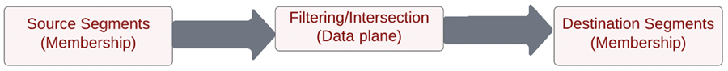

# Afstemmen op segment, blauwdruk

De Overeenkomst van het segment laat partnermerken toe om publiek over hun respectieve milieu&#39;s van het Experience Platform te delen. De sleutel voor merken is om met klanten te verbinden die op gegevens worden gebaseerd die uit hun directe relaties met consumenten worden verzameld. Met betere governance, toestemmingen, en voorkeurbeheersystemen, kunnen de marketers hun eerste-partij voor authentiek verklaarde publiek met zeer belangrijke partners verder verbeteren.

[!UICONTROL Segmentovereenkomst] is een dienst van de gegevenssamenwerking om klanten van het Experience Platform (AEP) toe te staan (die als _partners_) om gesegmenteerde gegevens uit te wisselen op basis van gemeenschappelijke industriële identificatoren op een beveiligde, beheerde en privacyvriendelijke manier.

De dienst laat klanten toe om passende IDs veilig te identificeren op een veilige, neutrale manier zonder het moeten hun volledig gegevensbestand openbaarmaken. De partners ontvangen slechts aangewezen attributen (segmentnaam) voor overlappende IDs, toelatend sneller en gemakkelijkere het delen op een controleerbare, toestemming-gestuurde manier.

[!UICONTROL Segmentovereenkomst] gebruikt het AEP-kader voor gegevensbeheer en instemming als ruggengraat. Het is beschikbaar voor alle B2C- en B2P Real-time Customer Data Platform-klanten. Belangrijkste kenmerken van [!UICONTROL [!UICONTROL Segmentovereenkomst]] omvatten:

* Segmentdeling voor overlappende klanten met toestemming
* Rapportage vóór het delen voor inzichten in het geschatte overeenkomstenvolume
* Volledig geïntegreerd DULE beleid en toestemmings handhaving
* Gegevensdeling, toestemmingskaderbackbone
* Gegevensfeeds voor het organiseren van segmenten en partners

## Toepassingen

Merk naar uitgever:

De &#39;uitgeverij-zaak&#39; is het meest beïnvloed door de afleiding van cookies van derden en gegevens van mobiele advertentie-id. Dit gebruiksgeval heeft een grote invloed op de media- en amusementsindustrie, die zich richt op het verkopen van reclame als bedrijfsmodel. [!UICONTROL Segmentovereenkomst] is een pad voor uitgevers met grote vooraanstaande doelgroepen die rechtstreeks met hun adverteerders willen samenwerken . Adverteerders kunnen rechtstreeks met uitgevers samenwerken om advertenties te maken tegen overeenkomende doelgroepen op uitgeverseigenschappen voor gerichte of prospectieve campagnes.

### Merk naar merk

Consumentenreizen zijn nooit lineair. Een klant kan bijvoorbeeld trouw zijn aan een luchtvaartmaatschappij en aan hun creditcardmaatschappij. Met [!UICONTROL Segmentovereenkomst]De luchtvaartmaatschappij en de creditcardmaatschappij kunnen een gegevenspartnerschap creëren om het overlappende publiek te begrijpen en vervolgens aanbiedingen te maken om de ervaringen aan loyale consumenten van elk van de bedrijven te personaliseren.

### BU naar BU

Internationale multinationals hebben problemen met de samenwerking van gegevens tussen onafhankelijke bedrijfseenheden. Het combineren van gegevens in één sandbox is mogelijk niet mogelijk vanwege verschillende privacybeleid, overnames of het beheer van machtigingen voor BU&#39;s.

[!UICONTROL Segmentovereenkomst] helpt ongelijksoortige marketing teams over massieve organisaties efficiënter samenwerken, terwijl het blijven onafhankelijk werken

## Architectuur

{zoomable=&quot;yes&quot;}

[!UICONTROL Segmentovereenkomst] is geen datamarkt waar gegevens kunnen worden aangeschaft. In plaats daarvan is het een AEP-functie die werkt met gegevens van de eerste partij met bepaalde partners, die privacycontroles en toestemmingscontroles gebruiken om samen te werken. [!UICONTROL Segmentovereenkomst] helpt de inspanningen richten op het verbeteren van klantenverhoudingen en het verhogen van het merk. Het is nuttig wanneer bestaande merken of partnerrelaties bestaan. [!UICONTROL Segmentovereenkomst] De ervaring is gemakkelijk te beheren, scalable, en staat voor beheerders toe om segmenten op een opt-in, controleerbare manier te delen.

[!UICONTROL Segmentovereenkomst] schakelt het volgende in:

* Segmentlidmaatschapsgegevens die veilig door organisaties moeten worden geëxporteerd met standaard id&#39;s op mensniveau, zoals gehashte e-mail of telefoonnummer
* Een gebruikersinterface en workflows delen met meldingen
* Vooraf gedeelde overlap schattingen
* Zelfserverende partneropstelling
* Overlappingen op bepaalde gestandaardiseerde naamruimten (hashed email, hashed phone, ECID, IDFA, GAID)
* Goedkeuring van gegevensuitwisseling
* Levenscyclusbeheer voor gedeeld publiek
* DULE-handhaving in workflow voor delen
* Dagelijkse batchupdates

[!UICONTROL Segmentovereenkomst] staat toe om onderling verbonden klantenervaring tot stand te brengen. De ondersteunde duurzame id&#39;s zijn gehashte e-mails, gehashte telefoonnummers en id&#39;s zoals ECID, IDFA en GAID. Klanten kunnen feeds maken die overeenkomen en publieksgegevens verplaatsen tussen merksandboxen, met een sterke governance, transparantie en intrekkingsmogelijkheden voor gebruik in reclame- en marketingactiviteiten

## Voorwaarden

Voorwaarden voor [!UICONTROL Segmentovereenkomst] zijn:

* RT-CDP actief met licentie
* Ondersteunde standaard hashed-id&#39;s zijn SHA256-hashed-e-mail, hashed phone, ECID, Apple IDFA en GAID
* Privacykader en toestemmingsstrategie
* Overeenkomsten inzake gegevensuitwisseling tussen klanten

## Beveiliging

### RBAC

De [!UICONTROL Segmentovereenkomst] De stroom om partners te beheren wordt gewaarborgd door RBAC. Alleen personen met de juiste machtiging kunnen partners initiëren, accepteren of beheren. Dit kan worden gedaan in het gedeelte Gegevensinname van het productprofiel. De volgende machtigingen zijn vereist:

{zoomable=&quot;yes&quot;}

| Machtiging | Beschrijving |
|---|---|
| **Verbindingen voor delen van publiek beheren** | Deze toestemming staat u toe om het proces van de partnerhanddruk te voltooien, dat twee organisaties IMS verbindt om toe te laten [!UICONTROL Segmentovereenkomst] stromen. |
| **Aandelen van publiek beheren** | Met deze machtiging kunt u feeds maken, bewerken en publiceren (het pakket gegevens dat wordt gebruikt voor [!UICONTROL Segmentovereenkomst]) met actieve partners (partners die door de admin gebruiker met **Aansluitingen voor delen van publiek** toegang). |

Verwijs de [officiële documentatie](https://experienceleague.adobe.com/docs/experience-platform/segmentation/ui/segment-match/overview.html?lang=en#understanding-segment-match-permissions) voor meer informatie over de machtigingen.

### Connect-id

De partner verbindt proces wordt beheerd door **[!UICONTROL Connect-id],** Dit is een willekeurig gegenereerde id die wordt toegewezen aan een specifieke AEP-sandbox. Deze Connect-id is vereist voor het initiëren en beheren van partnersandboxen. U kunt ook de Connect-id opnieuw genereren en zo nodig een partnerverbinding opnieuw configureren.

### Bestuur

Alle gegevenssets of gegevenskenmerken met *C11* het contractenetiket is beperkt voor de [!UICONTROL Segmentovereenkomst] service. Segmenten die deze kenmerken gebruiken, kunnen niet worden gebruikt voor [!UICONTROL Segmentovereenkomst]. Dit verstrekt de controle waarvoor de segmenten kunnen of niet kunnen worden gebruikt [!UICONTROL Segmentovereenkomst]. Daarnaast worden het aangepaste beleid en de gemaakte marketingacties ook afgedwongen. Het beleid is standaard uitgeschakeld en moet zijn ingeschakeld voor handhaving. Beperkingen zoals e-mailmarketing en onsite reclame die tijdens het delen van segmenten worden gekozen, worden ook verspreid en gedeeld met de partners.

### Toestemming

De toestemmingsmontages voor [!UICONTROL Segmentovereenkomst] kan op de volgende manieren worden beheerd:

* Op organisatieniveau, tijdens het instappen, gebruik makend van de opt-out of opt-in-instelling voor toestemmingscontroles.

  Deze instelling bepaalt of gebruikersgegevens kunnen worden gedeeld. De standaardinstelling is ingesteld op Weigeren om aan te geven dat gebruikersgegevens kunnen worden gedeeld met de aanname dat de AEP-klant al over de vereiste toestemmingsovereenkomst voor het gebruik van gegevens voor gegevensuitwisseling beschikt. Deze instelling kan worden gewijzigd in aanmelden door contact op te nemen met de accountmanager van de Adobe en een extra controle uit te voeren om AEP-klanten te dwingen hun toestemming expliciet bij te houden.

* Het kenmerk share dat specifiek is voor identiteiten (idSpecific) instellen met de optie [Inhoud en Veldgroep voorkeuren](https://experienceleague.adobe.com/docs/experience-platform/xdm/field-groups/profile/consents.html?lang=en).

  Deze veldgroep biedt één objecttype veld, toestemmingen, voor het vastleggen van toestemmings- en voorkeursgegevens. [!UICONTROL Segmentovereenkomst]Alle identiteiten die niet expliciet zijn uitgesloten, worden standaard opgenomen, bijvoorbeeld:

  ```
  "share": {
  `                `"val": "n"
  `     `}
  ```

  Deze instelling kan worden gewijzigd door contact op te nemen met de accountmanager van de Adobe, zodat alleen id&#39;s met een expliciete aanmeldingsnaam worden opgenomen, zoals:

  ```
  "share": {
  `                `"val": "y"
  `     `}
  ```

### Waarschuwingen

Het alarm wordt geproduceerd wanneer een partnerverbinding in werking wordt gesteld of wanneer de segmentvoer met partners wordt gedeeld.

## Workflow instellen

De workflow voor het instellen van een partnerverbinding wordt beheerd met de RBAC, zoals hierboven vermeld. Als de juiste machtigingen zijn ingesteld, moet de verbinding met een partnersandbox de Connect-id van die sandbox/instantie binnen de org van de partner delen.

Zodra een verbinding van de verzendende partner wordt gevraagd, moet het bij de ontvangende kant worden goedgekeurd om een veilige en veilige partneropstelling te verzekeren. De handdruk van de partnerverbinding zorgt ervoor dat de overeenkomst tussen de twee organisaties bestaat en staat Adobe toe om het [!UICONTROL Segmentovereenkomst] proces namens de organisatie. Met de goedgekeurde verbinding en in actieve staat, kan het segment delend proces van beide kanten in werking worden gesteld.

### Segment delen

Het delen van segmenten met partner gebeurt slechts wanneer een gelijke op het geselecteerde herkenningsteken bestaat. Er kan een één-aan-vele partnerverhouding zijn, die betekent de segmenten met veelvoudige partners kunnen worden gedeeld.

Om segment in werking te stellen delend nadat de partnerverbinding opstelling is, zou de verzendende partner een voer moeten creëren. Selecteer vervolgens de gevallen of acties waarin de segmentgegevens moeten worden uitgesloten en de duurzame id&#39;s. De relevante segmenten kunnen dan aan het voer voor het delen worden toegevoegd.

Als deel van dit segment-delend werkschema, kan de verzendende partner potentiële high-value segmenten via geschatte overlappingen ontdekken alvorens om het even welke gegevens worden bewogen.

De algemene processtroom is:

{zoomable=&quot;yes&quot;}

Deze overlappende ramingen bieden belangrijke inzichten, partnerontdekking, en gegevens aan de samenwerkingsovereenkomsten van brandstofgegevens. Er worden geen klant- of segmentgegevens over sandboxen verplaatst om deze schattingsgegevens voor overlappingen te verkrijgen. De door de klant geselecteerde, vooraf gehakte toepasselijke identiteiten in een bepaalde sandbox worden toegevoegd aan een probabilistische gegevensstructuur die Adobe toestaat om samenvoegings- en intersectiebewerkingen tussen hen uit te voeren. Deze bewerkingen helpen [!UICONTROL Segmentovereenkomst] krijgen de geschatte doorsnede van twee gegevensstructuren die bestaat uit identiteiten van twee verschillende sandboxen zonder de werkelijke waarden te hoeven vergelijken

Het overlappingsproces van de identiteit is afhankelijk van **dagelijkse volledige-profielexport** dataset van zowel afzender als ontvangerzandbakken om gemeenschappelijke profielen te identificeren die tot de gedeelde segmenten behoren. De gedetailleerde processtroom voor het overlappingsproces wordt hieronder getoond:

{zoomable=&quot;yes&quot;}

Nadat het delen van segmenten volledig van de verzendende partner is, krijgt de ontvanger een bericht over het gedeelde segmentvoer. Deze segmentvoer moet voor profiel bij de ontvanger worden toegelaten om de gegevens van het segmentlidmaatschap in werking te stellen. Alleen segmentlidmaatschap wordt opgenomen in de overlappende profielfragmenten van de IMS-organisatie van de ontvanger en er wordt geen aanvullende identiteit overgedragen van de afzender naar de ontvanger.

Het gedeelde segment is beschikbaar onder `AEPSegmentMatch` van de **[!UICONTROL Soorten publiek]** in de **[!UICONTROL Segment Builder]** en kan worden gebruikt voor het opnemen of onderdrukken van het publiek terwijl het bouwen van segmenten in de ontvangerszandbak.

Het dagelijkse overlappingsproces houdt het segmentlidmaatschap synchroon tussen de afzender en de ontvanger. De ontvanger kan profiel voor het ontvangen segmentvoer onbruikbaar maken om het segment te pauzeren delend proces.

#### Afstap/ingang van segment

Als onderdeel van de volledige profieluitvoer hebben de status voor de gedeelde segment-id&#39;s onder het segmentlidmaatschap voor profielen een van de corresponderende waarden - _gereed_, _verlaten_, of _bestaand_ om het huidige frame weer te geven.

Tijdens het dagelijkse proces van de identiteitsoverlapping, als de overeenkomstige identiteit in de ontvangerzandbak bestaat, worden deze status van het segmentlidmaatschap voor gedeelde segmenten verzonden over naar de ontvanger voor opname.

#### Intrekking van segment

De intrekking/schrapping van het segment van de afzender is een proces op bestelling waar de lijst van alle profielen met ingetrokken segment-IDs van de ontvanger wordt verkregen. De segment-IDs wordt verwijderd uit het segmentlidmaatschap van die identiteiten en bij de ontvanger hervat. Deze actie beschrijft het bestaande fragment van het segmentlidmaatschap, dat het lidmaatschap voor dat segment schrapt.

## De Overeenkomst van het Segment van het gebruik in Programmatische Overeenkomst

Met de toenemende beperkingen rond cookies en apparaat-id&#39;s van derden, zoekt programmatische reclame naar nieuwe manieren om doelgroepen op te bouwen en te richten. Er is een toenemend aantal oplossingen voor &#39;universele id&#39; voorgesteld, maar de industrie is nog steeds in volle beweging zonder een overeengekomen, schaalbare manier om hetzelfde streefniveau te bereiken en tegelijkertijd de toepasselijke privacyproblemen in evenwicht te brengen.

U kunt de Gelijke van de Segment van Adobe Experience Platform in privacy-centric publiekssamenwerking gebruiken en programmatic privé overeenkomsten tussen adverteerders en uitgevers verbeteren. Met Segment afstemmen kunt u:

* Splitsen **Ad-handel** en **Publiek** workflows.
* Sta partnermerken toe om publieksmeta-gegevens voor wederzijds gedeelde, en toestemmende identiteiten te delen gebruikend duurzame herkenningstekens zoals gehakt e-mail en gehakt telefoonaantal binnen een toestemming-gedwongen proces.

### Gebruik hoofdletters

* Het richten van het eerste-partijpubliek door programmatic privé overeenkomsten.
* Onderdrukking van het publiek van de eerste partij via programmatic privé overeenkomsten.
* Gericht publiek dat lijkt op het publiek van de eerste partij dat via programmatische privé-deals wordt voorgezeten.

>[!BEGINSHADEBOX]

**Overweeg de volgende voorbeeldworkflow tussen een merk (Luma) en een medianetwerk (ACME):**

1. Een merk (Luma) leidt een publieksgelijke met een media netwerk (ACME) via de Gelijke van het Segment.
2. ACME stuurt de doelgroep(en) via Adobe Real-Time CDP-doelen naar een server- of programmatische SSP.
3. ACME stelt een Private Inventory Deal (ID) met de toepasselijke die criteria op, met inbegrip van het publiek in de vorige stap wordt gevestigd. De persoonlijke identiteitskaart van de Overeenkomst van de Inventaris wordt dan geduwd aan de DSP van Luma.
4. Luma vestigt een Private Inventory Deal en verkeerscampagne/creatief.
5. De campagne levert dan via programmatic Private Inventory Deal.
6. Vervolgens levert de advertentieserver of SSP advertenties die voldoen aan de vastgestelde doelcriteria. (Aanvullende criteria voor het toewijzen van doelen, zoals frequentietoewijzing, zijn beschikbaar via advertentieserver en/of DSP, afhankelijk van het feit of een gegarandeerde deal of een voorkeurendeal in de overeenkomst is vastgelegd.)
7. Het verkeer wordt gedreven aan de merkeigenschappen van Luma.
8. ACME deelt vervolgens de inzichten of het publiek na de campagne via Segment Match voor heroriëntering.

>[!ENDSHADEBOX]


>[!IMPORTANT]
>
> Hoewel de hierboven geschetste oplossing een gemakkelijke manier verstrekt om eerstepartijgegevens via programmatic privé overeenkomsten te richten, kunnen er sommige overwegingen zijn alvorens uit te voeren, met inbegrip van, maar niet beperkt tot de volgende voorbeelden:
>
>* Toestemming: toepasselijke toestemmingsinzameling door het merk, de uitgever, of het netwerk van kleinhandelsmedia, aan hefboomwerking gegevens op deze manier.
>
>* Beleid en licentieovereenkomsten: naleving van alle toepasselijke beleidsregels (waaronder privacybeleid, overeenkomsten met leveranciers van derden) door het merk, de uitgever of het retail-medianetwerk om gegevens op deze manier te benutten en te activeren.


## Meer informatie

* [Segmentovereenkomst](https://experienceleague.adobe.com/docs/experience-platform/segmentation/ui/segment-match/overview.html?lang=en#)
* [Machtigingen](https://experienceleague.adobe.com/docs/experience-platform/access-control/home.html?lang=en)
* [Problemen oplossen](https://experienceleague.adobe.com/docs/experience-platform/segmentation/ui/segment-match/troubleshooting.html?lang=en)
* [XID](https://experienceleague.adobe.com/docs/experience-platform/identity/api/list-native-id.html?lang=en)
