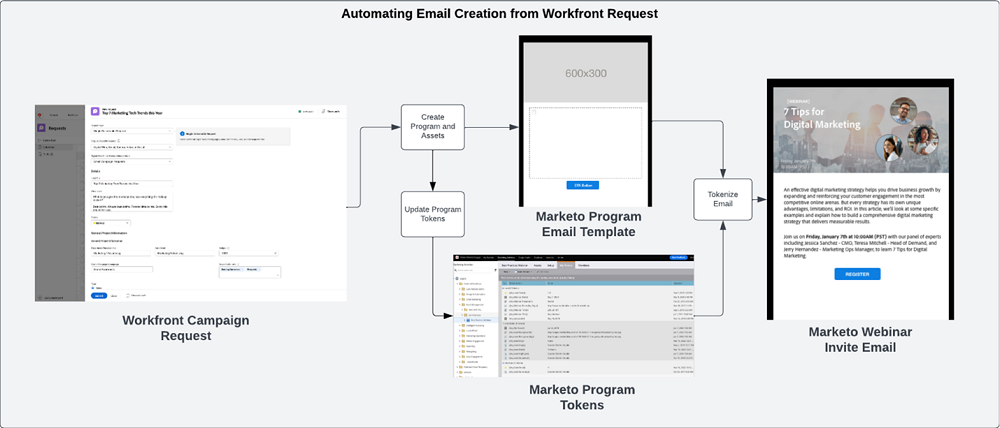
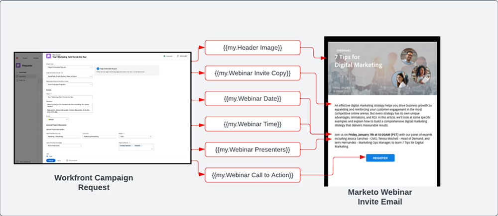
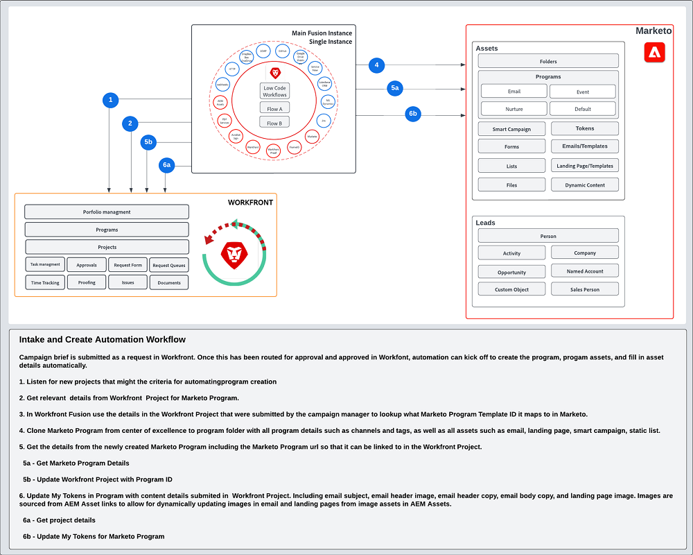

# Opname en ontwerp maken {#intake-and-create}

Het aantal marketingverzoeken dat in een marketingoperatieteam komt om nieuwe campagnes te lanceren, kan een goed functionerend team veranderen in een draaideur van herhalende taken, wat leidt tot opstand en stagnerende innovatie.

Door een proces op te zetten voor het indienen van campagneverzoeken en het automatiseren van het creëren van algemeen gevraagde marketing campagnes, kunt u: de snelheid van uw campagnes verhogen, fouten verminderen, verzoeken leiden aan het juiste lid van marketing verrichtingen, evenwicht en verbetert middelgebruik, en meer van uw marketing verrichtingen op meer strategische taken concentreren.

Met Workfront en Marketo Engage, staat een systeem-aan-systeem verbinding details van a [&#x200B; Workfront verzoekvorm &#x200B;](https://experienceleague.adobe.com/docs/workfront/using/administration-and-setup/customize/custom-forms/create-or-edit-a-custom-form.html?lang=nl-NL){target="_blank"} toe om een Programma van Marketo Engage tot stand te brengen, dan zeer belangrijke variabelen zoals: onderwerplijnen, e-mailexemplaar, beelden, data, tijden, gebeurtenisinformatie, en meer in te vullen.

Om deze integratie te bereiken, zult u Workfront Fusion, een werkautomatiseringslaag gebruiken die u toestaat om werkschema&#39;s tussen Workfront en andere systemen te automatiseren.

In de onderstaande workflow ziet u een aanvraag voor een webinar die door een campagnemanager wordt gemaakt met behulp van een Workfront-aanvraagformulier. De details die in het verzoek worden ingediend, activeren vervolgens een programma en e-mail die in Marketo Engage voor het webinar worden gemaakt. Bovendien worden gegevens uit het aanvraagformulier opgehaald om de inhoud van de e-mail te vullen.

{zoomable="yes"}

>[!TIP]
>
>Om meer over de verschillende types van voorwerpen in Workfront te leren die voor het organiseren van het marketing campagnewerk worden gebruikt en hoe het aan een programma van Marketo Engage in kaart wordt gebracht, controleer het [&#x200B; Overzicht van Marketo en van Workfront &#x200B;](/help/blueprints/b2b/marketo-engage-and-workfront-integration-blueprint/overview.md){target="_blank"}.

## Bereid uw campagneontwikkelingsproces voor automatisering voor {#prepare-your-campaign-development-process-for-automation}

Achter elke grote automatisering van workflows schuilt een gedefinieerd proces dat ervoor zorgt dat teams en belanghebbenden de meeste waarde van de automatisering krijgen.

**welke soorten marketing verzoeken zullen u ontvangen?**

Bedenk welke soorten marketing tactieken u zult lopen zoals e-mail, verpleegkunde, eerste partijwebinars, en gebeurtenissen. Werkt u ook Webinars van derden of Weergaveadvertenties? Elk van deze verzoeken moet worden overwogen aangezien zij specifieke inputgebieden in het verzoekformulier kunnen vereisen en aan verschillende programmamalplaatjes in Marketo Engage zullen in kaart brengen die zullen worden gekloond.

U zult ook willen begrijpen als u campagnes in veelvoudige gebieden in werking stelt. Als dit het geval is, zult u voor één Project in Workfront willen rekenschap geven die veelvoudige programma&#39;s in Marketo Engage creeert, met elk programma verschillende taalsteun vertegenwoordigt.

Het is belangrijk om vooraf te weten welke soorten marketing verzoeken u verwacht te ontvangen om ervoor te zorgen dat de verzoeken op een geautomatiseerde manier kunnen worden vergemakkelijkt.

**Welke informatie in het campagneverzoek zou moeten worden gevangen?**

Denk aan de belangrijkste gegevens die in uw aanvraagformulier moeten worden vastgelegd voor elk van de verschillende tactieken die u uitvoert. Hieronder volgen enkele voorbeelden van informatie die u in een Workfront-formulier kunt vastleggen om uw campagnemoditie te helpen automatiseren.

<table> 
  <tr> 
   <td><b>Tactiek voor marketing</b></td>
   <td><b>Vastleggegevens</b></td>
  </tr>
  <tr> 
   <td>E-mailbus</td>
   <td>・ Onderwerp via e-mail  
・ Geplande datum  
・ E-mailkopie  
・ Call to action  
・ Afbeelding(en) - Er kan rechtstreeks naar AEM Assets-URL's worden verwezen voor gebruik in Marketo  
・ Kwalificatiecriteria voor het publiek</td>
  </tr>
  <tr>
   <td>Webinar/gebeurtenis</td>
   <td>・ Naam van gebeurtenis  
・ Gebeurtenisdatum  
・ Tijd van gebeurtenis  
・ Gebeurtenisplaats  
・ Gebeurtenisbeschrijving  
・ Webinar Recording Page - PageURL OnDemand  
・ Sprekersnamen  
・ Titels voor luidsprekers  
・ Luidsprekerafbeeldingen  
・ E-mails vereist (Uitnodiging, Bevestiging, Herinnering, Follow-up)  
・ E-mailkoptekstafbeelding(en)  
・ Kwalificatiecriteria voor het publiek</td>
  </tr>
  <tr>
   <td>Verloop</td>
   <td>・ Aantal e-mails  
・ E-mailkopie  
・ E-mailkoppen  
・ Call to action  
・ Kwalificatiecriteria voor het publiek</td>
  </tr>
  </tbody>
</table>

>[!NOTE]
>
>Vandaag, programmatically bouwend publiek door automatisering is beperkt in Marketo Engage omdat de tokens niet in slimme lijsten worden gesteund. Dit betekent publiek of in Marketo Engage door een gebruiker zal moeten worden gecreeerd, of als u een vooraf bepaald publiek hebt u onophoudelijk met communiceren, kunt u een gevormde slimme lijst als deel van uw programmamalplaatje omvatten dat tijdens het automatiseringsproces wordt gekloond.

### Stel uw expertisecentrum in {#establish-your-center-of-excellence}

Als je het maken van programma&#39;s wilt automatiseren, heb je een centre of excellence in Marketo Engage nodig. Een expertisecentrum omvat gemoderniseerde programma&#39;s en middelen om het campagneontwikkelingsproces te versnellen en te standaardiseren. U hebt bijvoorbeeld een programmasjabloon voor uw verschillende campagnebehoeften: e-mail, verpleging, persoonlijk plaatsvinden en webinar. Bovendien hebt u mogelijk meerdere sjablonen voor e-mailprogramma&#39;s die u voor verschillende regio&#39;s of verschillende soorten e-mailberichten gebruikt.

Het opbouwen van uw centrum van excellentie met programmamalplaatjes in Marketo Engage is één van de eerste stappen aan een meer programmatic benadering van campagneuitvoering en zal als basis voor het automatiseren van campagneverzoeken fungeren.

Zodra u een reeks herbruikbare programmamalplaatjes hebt, kunt u uw inspanningen verder schrapen gebruikend automatisering die in deze blauwdruk wordt geschetst om meer snelheid aan uw campagneontwikkeling te drijven.

Meer leren bij het creëren van uw eigen centrum van excellentie, controleer de [&#x200B; Gemeenschap van Marketo &#x200B;](https://nation.marketo.com/t5/product-blogs/marketo-master-class-center-of-excellence-with-chelsea-kiko/ba-p/243221){target="_blank"} voor beste praktijken.

### Tokens gebruiken om inhoud te vullen {#use-tokens-to-populate-content}

Met Marketo Engage kunnen tokens worden gebruikt om inhoud in uw campagnemiddelen te vullen. Nadat u bijvoorbeeld een e-mailsjabloon hebt gekloond vanuit uw expertisecentrum, kan Workfront Fusion details uit het campagneverzoek in Workfront overnemen en deze doorgeven aan Mijn tokens in het Marketo Engage-programma. De symbolische waarden kunnen dan direct in e-mail worden geërft om e-mail uit te bouwen.

{zoomable="yes"} te bevolken

### Afbeeldingen uit AEM Assets vullen {#populate-images-from-aem-assets}

U kunt de ontwikkeling van uw e-mail- en bestemmingspagina verder automatiseren door Marketo Engage-tokens te gebruiken in combinatie met koppelingen naar middelen in AEM Assets. Aanvragers van campagnes kunnen gepubliceerde afbeeldingskoppelingen vanuit AEM Assets verzenden als onderdeel van het aanvraagproces. Workfront Fusion kan deze koppelingen vervolgens meenemen en insluiten in de HTML van een e-mail met Marketo Engage-tokens.

Herinner me, zult u uw Programma&#39;s en de Malplaatjes van het Programma in Marketo Engage moeten opbouwen om Mijn Tokens te gebruiken zodat de Fusion de symbolische waarden met de informatie kan bijwerken die in Workfront wordt voorgelegd.

>[!NOTE]
>
>AEM Assets is niet verplicht deze workflow te ondersteunen, maar kan een gestroomlijnder proces mogelijk maken voor het beheer van campagnemiddelen in de hele supply chain voor het ontwikkelen van campagnes.

### Stel een raadplegingsbibliotheek voor alle types van programmaverzoek samen {#assemble-a-lookup-library-for-all-program-request-types}

Wanneer het automatiseren van de verwezenlijking van nieuwe Marketo Engage programma&#39;s van Workfront verzoeken, is het belangrijk om een stap in uw automatisering van Workfront Fusion op te nemen die informatie van het verzoek van Workfront kan nemen en de correcte programmamalplaatjes die in Marketo Engage zouden moeten worden gekloond.

Hiertoe kunt u een gegevensset importeren in Workfront Fusion die een lijst bevat met alle verschillende programmasjablonen in uw Marketo Engage Center of Excellence.

Enkele basisgegevens die u wilt opnemen in de opzoekbibliotheek van het programmasjabloon zijn:

<table> 
  <tr> 
   <td><b>Kolom</b></td>
   <td><b>Beschrijving</b></td>
  </tr>
  <tr> 
   <td>Type campagne</td>
   <td>Dit kan e-mail, webinar, verpleegkunde, evenement, webinar van derden, import van lijsten enz. zijn. Het type campagne zal fungeren als een leesbare beschrijving voor wat wordt gevraagd.</td>
  </tr>
  <tr> 
   <td>Workfront-aanvraagtype</td>
   <td>Dit is het aanvraagtype dat is geselecteerd in het Workfront-formulier. Dit kan hetzelfde zijn als het type campagne, zoals e-mail, webinar, verpleging of gebeurtenis. Hiermee wordt de invoer die in het Workfront-formulier is geselecteerd, toegewezen aan een programmasjabloon in Marketo.</td>
  </tr>
  <tr> 
   <td>Workfront-formulier-id</td>
   <td>De unieke id van het Workfront-aanvraagformulier dat wordt gebruikt om de schrijfaanvraag te valideren, wordt toegewezen aan het Marketo Engage-programmasjabloon.</td>
  </tr>
  <tr> 
   <td>Marketo-programma-id</td>
   <td>Dit is identiteitskaart van het programmamalplaatje in Marketo Engage dat aan het verzoek in kaart brengt dat wordt gemaakt. Als deze informatie in Workfront Fusion direct beschikbaar is, kan Fusion een verzoek indienen bij Marketo Engage en precies weten welk programma moet worden gekloond.</td>
  </tr>
  </tbody>
</table>

## Inname en automatische doorloop maken {#intake-and-create-automation-flow}

Hier is een voorbeeld van hoe de werkschemalogica in Fusie kan worden geassembleerd gebruikend prebuilt [&#x200B; Workfront &#x200B;](https://experienceleague.adobe.com/docs/workfront/using/adobe-workfront-fusion/fusion-apps-and-modules/workfront-modules.html?lang=nl-NL){target="_blank"} en [&#x200B; Marketo Engage &#x200B;](https://experienceleague.adobe.com/docs/workfront/using/adobe-workfront-fusion/fusion-apps-and-modules/marketo-modules.html?lang=nl-NL){target="_blank"} modules die u toelaten om automatisering sneller te leveren.

## Resources {#resources}

* [Adobe Marketo Engage-modules](https://experienceleague.adobe.com/docs/workfront/using/adobe-workfront-fusion/fusion-apps-and-modules/marketo-modules.html?lang=nl-NL){target="_blank"}

* [Adobe Workfront-modules](https://experienceleague.adobe.com/docs/workfront/using/adobe-workfront-fusion/fusion-apps-and-modules/workfront-modules.html?lang=nl-NL){target="_blank"}

* [Overzicht Marketo en Workfront](/help/blueprints/b2b/marketo-engage-and-workfront-integration-blueprint/overview.md){target="_blank"}
