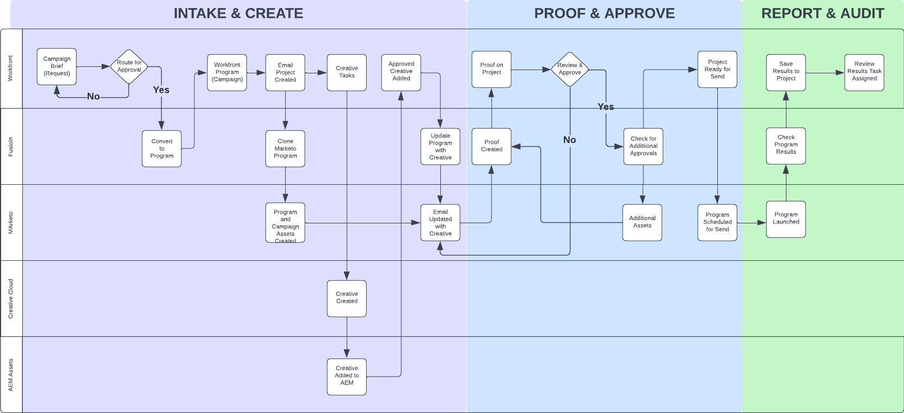
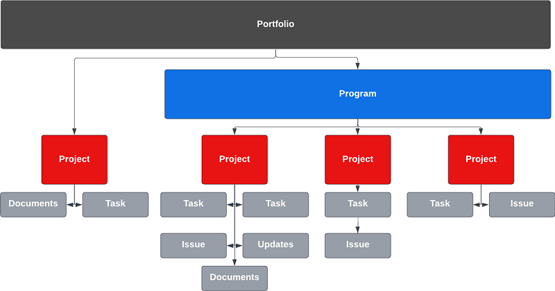
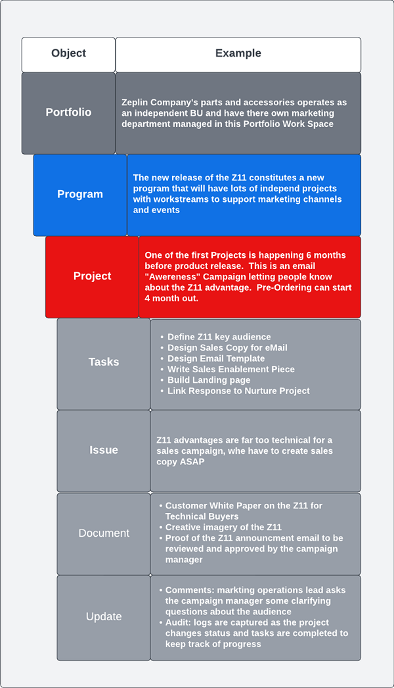
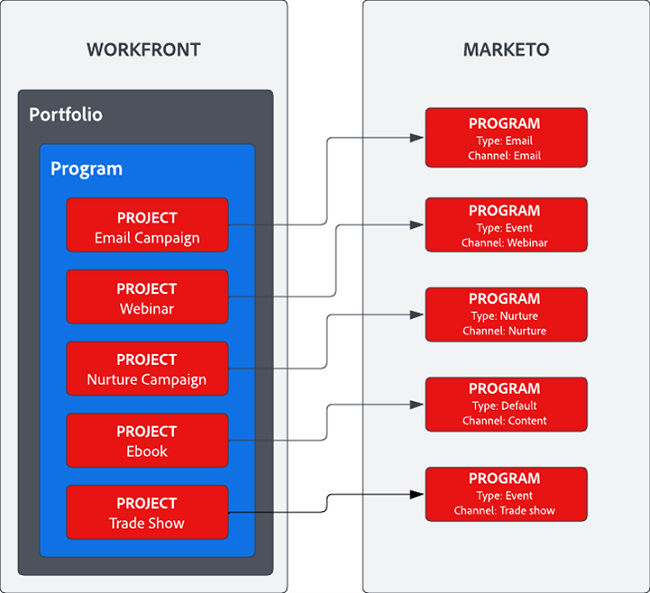

# Overzicht van de Marketo Engage- en Workfront-integratieblauwdruk {#overview}

## Snellere time-to-market met Marketo Engage en Workfront {#achieve-faster-time-to-market-with-marketo-engage-and-workfront}

De baan van marketing blijft met nieuwe kanalen en meer manieren groeien om mededelingen te personaliseren elke dag. Marketing teams hebben manieren nodig om te blijven automatiseren en evolueren om veranderende marketingbehoeften over de hele wereld te ondersteunen.

**&quot;ROI is altijd het echte doel geweest. De inkomsten zijn groot, maar niet tegen elke prijs - vooral vandaag.&quot; - COM, Business Services Industry**

Organisaties die hogere ROI realiseren terwijl hun inkomsten stijgen, doen dit door hun campagneontwikkelingsproces te stroomlijnen, hun snelheid van de uitvoering van de campagne te optimaliseren en het toezicht over de gehele marketingfunctie te verbeteren.

Als uw organisatie vergelijkbare doelstellingen wil bereiken die hieronder worden beschreven, is dit document nuttig voor u:

* Campagne schalen ter ondersteuning van interfunctionele marketingteams
* Snellere marktintroductie dankzij gestroomlijnde aanvraagprocedure voor campagnes
* Een recordsysteem instellen om de zichtbaarheid van de campagne voor alle betrokkenen te vergroten
* Campagne-elementen controleren en goedkeuren (afbeeldingen, e-mailkopie)

Campagnebewerkingsteams hebben systemen nodig waarmee ze op efficiënte en effectieve wijze marketingcampagnes kunnen plannen en uitvoeren. Of het nu gaat om een e-mail-, webinar-, evenement-, betaalmedia-, vervoers- of contentsyndicatie, marketingteams hebben een centrale oplossing nodig voor het organiseren van campagnecontribuanten, -producten en -uitvoering.

Door het multi-channel marketing activeringssysteem (Marketo Engage) te integreren met de marketing planning en het systeem van verslag (Workfront) kunt u de campagnesnelheid verhogen en de belanghebbenden een betere zichtbaarheid geven.

Met Workfront Fusion kunnen marketingteams handmatige en foutgevoelige stappen die het vertalen van een marketingopdracht naar een campagne met zich meebrengen grotendeels elimineren. Workfront Fusion biedt een out of the box integration layer tussen Workfront en Marketo Engage die flexibiliteit en efficiëntie mogelijk maakt bij het ontwikkelen van workflows tussen systemen. U kunt meer over leren hoe te opstelling de integratie en welke acties kunnen worden genomen om werkschema&#39;s [&#x200B; hier &#x200B;](https://experienceleague.adobe.com/docs/workfront/using/adobe-workfront-fusion/fusion-apps-and-modules/marketo-modules.html?lang=nl-NL){target="_blank"} te automatiseren.

## Campagne plannen tot uitvoering - Gebruiksgevallen voor automatisering {#campaign-planning-to-execution-automation-use-cases}

* Sportteams voor marketingactiviteiten ondersteunen door het maken van campagnes in Marketo Engage te automatiseren door innameverzoeken in Workfront
* Deel concepten van e-mails en bestemmingspagina&#39;s die in Marketo Engage zijn gemaakt naar Workfront om de definitieve beoordeling en goedkeuring te krijgen van alle betrokkenen
* Deel campagneresultaten van Marketo Engage naar Workfront om de toegang tot campagnemetriek te democratiseren

Hieronder ziet u een workflowdiagram van het ontwikkelingsproces van de campagne in het geval van een e-mailsnelverzoek. Bovendien kunt u zien hoe Workfront Fusion een rol kan spelen tussen Workfront en Marketo Engage om de workflow te sturen en automatisering te verwerken tijdens de ontwikkelingscyclus van de campagne.

{zoomable="yes"}

Houd rekening met de verschillende fasen van het ontwikkelingsproces van de campagne.

1. Inname en Maken: het verzoek om campagne wordt gedaan en de campagneactiva worden programmatically samengesteld.

1. Reviseren en goedkeuren: zodra de campagne is samengesteld, is het tijd voor belanghebbenden om campagne-elementen zoals e-mails en landingspagina&#39;s te beoordelen en af te tekenen.

1. Rapport en audit: deel de resultaten van de campagne aan Workfront om meer zichtbaarheid te geven aan de interfunctionele belanghebbenden.

>[!NOTE]
>
>In het bovenstaande voorbeeld beheert en plant Workfront de werkzaamheden gedurende de hele levenscyclus van het Marketo Engage-programma. Dit gezegd hebbende, kan de flexibiliteit van Workfront zich tot het beheren van al uw marketing teaminspanningen uitbreiden. Hieronder vallen marketing op basis van account, leveringsketens voor marketinginhoud, agentschapsbeheer, beheer van digitale en sociale campagnes en programma&#39;s voor verkoopmogelijkheden.

## Begrijpen hoe marketinginitiatieven in Workfront worden weergegeven {#understanding-how-marketing-initiatives-are-represented-in-workfront}

Adobe Workfront stelt organisaties in staat hun werk te beheren om een efficiëntere uitvoering te bevorderen. Binnen Workfront is er een hiërarchie van voorwerpen die een kader voor planning, middelbeheer, en samenwerking over diverse teams verstrekken.

Begrijpen hoe u uw bedrijfsproces aan deze voorwerpen in kaart brengt zal belangrijk zijn om de verhouding tussen Workfront en Marketo Engage te begrijpen.

{zoomable="yes"} worden vertegenwoordigd

### Portfolio-hiërarchie gedefinieerd {#portfolio-hierarchy-defined}

<table> 
  <tr> 
   <td><b>Object</b></td>
   <td><b>Definitie</b></td>
  </tr>
  <tr> 
   <td>Portfolio</td>
   <td>U kunt Portfolio's en Programma's in Workfront gebruiken om projecten te organiseren. Door Projecten te organiseren, kunt u gelijkaardige Projecten vergelijken en bepalen waar de middelen het best zullen worden besteed.  
   (Zo wordt een Portfolio opgericht voor een bedrijfseenheid binnen een onderneming die zich richt op de verkoop van diensten en/of producten.)</td>
  </tr>
  <tr>
   <td>Programma</td>
   <td>U kunt Workfront-programma's gebruiken om projecten te organiseren. Door Projecten te organiseren, kunt u gelijkaardige Projecten vergelijken en bepalen waar de middelen het best zullen worden besteed.  
   (Bijvoorbeeld een marketingstrategie met een doelstelling op hoog niveau, zoals bewustmaking en het stimuleren van de vraag naar een nieuwe productintroductie.)</td>
  </tr>
  <tr>
   <td>Project</td>
   <td>De Projecten van Workfront zijn een inzameling van het werkpunten die moeten worden voltooid om een specifiek doel te verwezenlijken, leverbaar, product, enz.  
   (bijvoorbeeld een marketingtactiek, zoals een e-mailexplosie, een verplegingscampagne, een webinar of een persoonlijk evenement. Een enkel project kan ook complexer zijn door meerdere tactieken, zoals een e-mail, een advertentie, een landingspagina en een downloadbare whitepaper, die allemaal bedoeld zijn om hetzelfde resultaat te bereiken, te omvatten.)</td>
  </tr>
  <tr>
   <td>Taak</td>
   <td>Workfront-taken zijn geplande werkitems die deel kunnen uitmaken van een project of initiatief. De taken worden toegewezen aan gebruikers of teams om te voltooien.  
   (Een taak voor het samenstellen van een publiekssegment of het maken van een e-mailconcept kan bijvoorbeeld worden gekoppeld aan een project voor het ontwikkelen van een Marketo Engage-e-mailprogramma.)</td>
  </tr>
  <tr>
   <td>Probleem</td>
   <td>Problemen zijn ongeplande werkitems in Workfront. Zij kunnen problemen zijn die tijdens een Project voorkomen, of zij kunnen verzoeken zijn die door een verzoekrij worden voorgelegd.  
   (Er wordt bijvoorbeeld een uitgave gearchiveerd omdat de afbeelding van de e-mailbanner de verkeerde afmetingen heeft.)</td>
  </tr>
  <tr>
   <td>Document</td>
   <td>Documenten kunnen traditionele documenten zijn, zoals tekstdocumenten of presentaties. Dit kunnen ook afbeeldingsbestanden zijn. Workfront staat voor activa het proefdrukken door commentaren en aantekeningen op documenten en beelden toe, om samenwerking onder teams toe te laten.  
   (Bijvoorbeeld een e-mailkoptekstafbeelding die moet worden gecontroleerd.)</td>
  </tr>
  <tr>
   <td>Bijwerken</td>
   <td>Omvat commentaren en controlelogboeken om het werk te volgen en samenwerking in Workfront te vergemakkelijken.  
   (bijvoorbeeld een controlelogboek van een nieuwe versie van de afbeelding.)</td>
  </tr>
  </tbody>
</table>

## Voorbeeld van werkbeheer voor marketinginitiatieven {#marketing-initiative-work-management-example}

Laten we eens kijken hoe de portefeuillehiërarchie van Workfront eruit ziet in een echt voorbeeld.

Het bedrijf Zeplin geeft een bijgewerkte versie van één van hun compacte hulpprogrammatrekkergehechtheid vrij genoemd Z11, die het vorige model Z10 door grotere duurzaamheid en aanpassing te bieden overtreft. Op die manier moeten zij hun marketingstrategie plannen, ontwikkelen en uitvoeren om de vraag te stimuleren en de aandacht te vestigen op hun nieuwe vrijlating uit de tractordivisie van hun bedrijf. Deze marketingstrategie moet verschillende marketingtactieken bevatten om de nieuwe klant bewust te maken van de situatie en de bestaande Z10-klanten bewust te maken van de situatie.

In de onderstaande hiërarchie ziet u hoe de strategie, de tactiek, de taken en de middelen aan Workfront zijn toegewezen voor deze marketingcampagne.

{zoomable="yes"}

## Workfront toewijzen aan Marketo {#mapping-workfront-to-marketo}

Met Workfront als upstream systeem voor marketingplanning en projectorganisatie is het belangrijk te begrijpen hoe informatie kan worden gedeeld tussen Marketo Engage en Workfront.

Als u wilt dat deze systemen samenwerken terwijl nieuwe marketinginitiatieven worden ontwikkeld, is het belangrijk om te begrijpen hoe de verschillende recordtypen in Workfront worden toegewezen aan recordtypen in Marketo Engage.

### Workfront-projecten toewijzen aan Marketo Engage-programma&#39;s {#mapping-workfront-projects-to-marketo-engage-programs}

Met Workfront Fusion als integratielaag kunt u uw projecten in Workfront toewijzen aan een programma in Marketo Engage. In het bovenstaande geval wil Zeplin bijvoorbeeld de aandacht vestigen op het nieuwe Zeplin-model. Met dit programma creëren zij een nieuw Programma in Workfront dat veelvoudige marketing tactieken opneemt die als Projecten worden vertegenwoordigd. Eén tactiek is een e-mail met bewustzijn die naar bestaande klanten van het Z10-model moet gaan om ze op de hoogte te stellen van het nieuwe Z11-model. In Workfront zou er een project zijn gemaakt om deze e-mailtactiek te vertegenwoordigen met een set taken die eraan gekoppeld zijn om het publiek te maken, creatief te worden voor de e-mailafbeeldingen en de e-mail te verzamelen in Marketo Engage. Het project in Workfront kan worden toegewezen aan een e-mailprogramma in Marketo Engage, zodat informatie kan worden gesynchroniseerd tussen systemen.

Hieronder ziet u een voorbeeld van hoe een Programma veelvoudige projecten kan omvatten en hoe die Projecten van Workfront aan Programma&#39;s in Marketo Engage kunnen in kaart brengen.

{zoomable="yes"}

U kunt een groot marketinginitiatief starten waarvoor meerdere Workfront-projecten in een Workfront-programma moeten worden gehuisvest, of u hebt een eenmalige aanvraag voor een webinar of e-mail waarvoor slechts één Workfront-project nodig is. Wat uw behoeften ook zijn, met Workfront, Workfront Fusion en Marketo Engage, uw team beschikt over de flexibiliteit om uw ontwikkelingsproces van de campagne naadloos te integreren, van planning tot uitvoering.

### Workfront-taken toewijzen aan Marketo Engage-middelen {#mapping-workfront-tasks-to-marketo-engage-assets}

Wanneer u uw ontwikkelingsproces voor uw campagne in Workfront in kaart brengt, kunt u ook nadenken over welke taken u in Marketo Engage wilt uitvoeren en hoe u informatie in Workfront kunt vastleggen, u kunt helpen meer consistentie, efficiëntie en nauwkeurigheid te brengen in de ontwikkeling van de campagne in supply chain.

Workfront Projecten kunnen worden getemplatificeerd zodat uw proces duidelijk kan worden bepaald telkens als u een specifieke marketing tactiek in werking stelt. Als u bijvoorbeeld een e-mailcampagne uitvoert, is er een standaardset taken die voor uw organisatie moet worden uitgevoerd. Deze taken kunnen een eerste vergadering met belanghebbenden omvatten, creatieve middelen krijgen, creatief werk goedkeuren, het doelpubliek opbouwen, de e-mail, e-mailvertaling maken, de e-mail goedkeuren en de resultaten van de e-mailcampagne met belanghebbenden delen.

Sommige van deze taken kunnen rechtstreeks worden toegewezen aan werk dat in Marketo Engage moet worden gedaan. De e-mailtaak voor samenstellen in Workfront kan bijvoorbeeld worden aangepast en velden bevatten die informatie doorgeven aan Marketo Engage om de verzameling van de e-mail te automatiseren. Dit kunnen dingen zoals de onderwerpregel, het exemplaar, en de beelden in e-mail omvatten.

## Volgende stappen {#next-steps}

Nu u een fundamenteel inzicht hebt in hoe Workfront en Marketo Engage nieuwe efficiëntie in uw campagneontwikkeling in supply chain kunnen ontsluiten, bekijkt u de volgende documenten en bronnen over hoe u workflows en processen tussen Marketo Engage en Workfront kunt automatiseren met gebruik van Workfront Fusion.

### Aan de slag met de integratie met Workfront Fusion, Workfront en Marketo Engage {#getting-started-with-workfront-fusion}

* [&#x200B; Inname en creeer &#x200B;](/help/blueprints/b2b/marketo-engage-and-workfront-integration-blueprint/intake-and-create.md){target="_blank"} - de Automatisering van de Ontwikkeling van de Campagne met Marketo Engage en Workfront

* [Reviseren en goedkeuren](/help/blueprints/b2b/marketo-engage-and-workfront-integration-blueprint/review-and-approve-blueprint.md){target="_blank"}

### Marketo Engage-campagnemenamen en de bijbehorende URL&#39;s beheren {#managing-marketo-engage-campaign-names}

Het standaardiseren van uw naamgevingsconventies voor campagnes en URL&#39;s is een belangrijke basis voor een accuraat programmabeheer in Marketo Engage en helpt een consistenter proces in de gehele ontwikkelingscyclus van de campagne te bevorderen. Als u hulpmiddelen zoekt om met dit te helpen, adviseren wij controlerend sommige vrije open bronhulpmiddelen van [&#x200B; de Succesdiensten van Adobe &#x200B;](https://main—marketo-campagne-tools—dr-adobe.hlx.live/){target="_blank"} die u toestaan om een verenigbare benadering tot stand te brengen en te leiden van de campagnes van Marketo Engage en hun bijbehorende URLs.

### Resources {#resources}

* [Workfront Fusion voor Marketo Engage](https://experienceleague.adobe.com/docs/workfront/using/adobe-workfront-fusion/fusion-apps-and-modules/marketo-modules.html?lang=nl-NL){target="_blank"}

* [Workfront Fusion voor Workfront](https://experienceleague.adobe.com/docs/workfront/using/adobe-workfront-fusion/fusion-apps-and-modules/workfront-modules.html?lang=nl-NL){target="_blank"}
