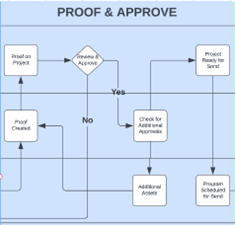
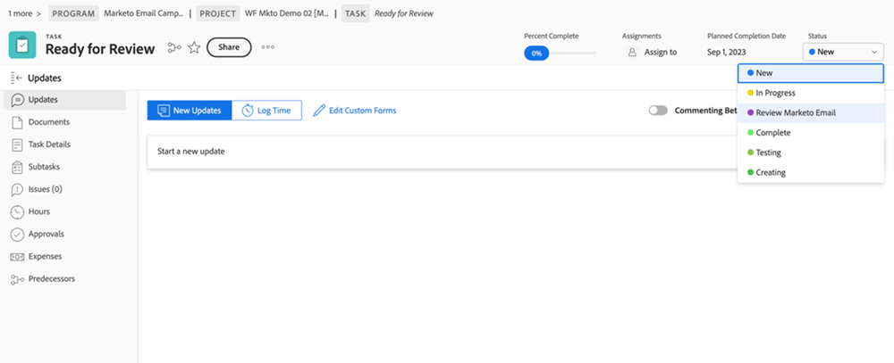
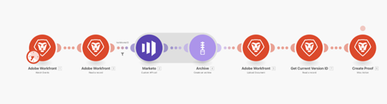

# Blauwdruk controleren en goedkeuren {#review-and-approve-blueprint}

Het verzekeren van marketing activa en campagnes voldoet aan de verwachtingen en de normen van een zaken breidt zich voorbij het leveren van de juiste inhoud en het overseinen aan het juiste publiek uit. Organisaties hebben ook de verantwoordelijkheid om bij het starten van nieuwe marketinginitiatieven het interne beleid, de regelgeving van de industrie en zelfs de juridische voorwaarden te handhaven. Door de evaluatie- en goedkeuringsstappen op te nemen in het ontwikkelingsproces van hun campagne, kunnen marketingteams ervoor zorgen dat inhoud en berichtgeving accuraat zijn en in overeenstemming met hun industrienormen, met name voor bedrijven als financiën, gezondheidszorg en geneesmiddelen.

Met Workfront en Marketo Engage hebben marketingteams de mogelijkheid om een nauw verbonden systeem voor marketing te hebben, met berichten die accuraat en conform zijn.

## Proofing en geavanceerde goedkeuringen voor Marketo Engage met Workfront ontgrendelen {#unlock-proofing-and-advanced-approvals}

Wanneer wij over het bouwen van marketing campagnes denken, moeten wij in overweging nemen dat de verschillende stappen in kwestie, met inbegrip van planning, bouw, herziening, terugkoppel, goedkeuring, en uitvoering steunen. Met Workfront en Marketo Engage beschikken teams over alle instrumenten die nodig zijn om ze door het volledige proces van planning en lancering van een nieuwe marketingcampagne te leiden. Bovendien kunnen teams hun evaluatie- en goedkeuringsproces verder stroomlijnen om de ontwikkelingssnelheid van de campagne te verhogen en ervoor te zorgen dat de nauwkeurigheid en naleving aan de hoogste norm worden gehouden.

### Gebruikszaken bekijken en goedkeuren die zijn ontgrendeld met Marketo Engage en Workfront {#review-and-approve-use-cases-unlocked-with-marketo-engage-and-workfront}

* Elimineer ongelijke feedback en vergroot de samenwerking op een gecentraliseerde locatie door gebruik te maken van Workfront-annotaties en opmerkingsmogelijkheden voor Marketo Engage-middelen.

* Centraliseer uw goedkeuringen door ze in Marketo Engage te activeren vanuit Workfront goedkeuringswerkstromen.

* Ondersteuning en stroomlijning van complexe goedkeuringswerkstromen voor marketingmiddelen door gebruik te maken van de geavanceerde goedkeuringsmogelijkheden van Workfront met Marketo Engage-middelen.

* De toegang tot marketingconcepten vereenvoudigen door Marketo-middelen via programmacode naar Workfront te halen, zodat ze door meerdere belanghebbenden kunnen worden gecontroleerd.

* Wijzigingen bijhouden en een papiertrail maken door alle revisie- en toetsingswerkzaamheden voor Marketo Engage-middelen in Workfront te centraliseren.

## Uw Proef- en goedkeuringswerkstroom plannen {#planning-your-proof-and-approval-workflow}

Overweeg de volgende aspecten voordat u de integratie tussen Marketo Engage en Workfront op het gebied van bewijs en goedkeuring instelt:

* Welke activa zullen moeten worden herzien en goedgekeurd?
* Wie moet de fiatteur zijn?
* Moeten er meerdere fiatteurs zijn voordat een marketingmiddel live kan gaan?
* Op welk moment in het ontwikkelingsproces van de campagne zullen marketingmiddelen worden verzameld en klaar zijn om te worden herzien?

Als u deze vragen beantwoordt, krijgt u een basislijn voor hoe uw goedkeuringsstroom eruit zal zien en hoe u begint te denken over het configureren van uw Workfront-instantie.

## Workflow voor proefdrukken en goedkeuring tussen Marketo Engage en Workfront samenstellen {#building-a-proof-and-approval-workflow}

Om het proef- en goedkeuringsproces tussen Workfront en Marketo Engage te stroomlijnen, kunt u de twee oplossingen integreren gebruikend Workfront Fusion. Workfront Fusion biedt een workflowinterface voor het activeren van handelingen en het doorgeven van informatie tussen uw Workfront- en Marketo Engage-instanties.

Hiervoor moet u de onderstaande stappen overwegen als onderdeel van het proces voor een geïntegreerde evaluatie- en goedkeuringservaring.

1. Configureer uw Workfront-project met de functie Ready for Review.
1. Activeer uw Marketo Engage-e-mail voor synchronisatie met Workfront met een wijziging in de taakstatus.
1. Converteer uw Marketo Engage-e-mailbestand naar controleerbare proefdrukken in Workfront.
1. Workfront-proefdrukken gebruiken om samen te werken via opmerkingen en annotaties.
1. Geef de Workfront Proof toestemming om goedkeuring van bedrijfsmiddelen in Marketo Engage te starten en markeer de taak als voltooid.

### Een Workfront-project configureren met de opdracht Ready for Review {#configure-a-workfront-project-with-a-ready-for-review-task}

Het gebruik [ projectmalplaatjes ](https://experienceleague.adobe.com/docs/workfront/using/manage-work/projects/create-and-manage-project-templates/project-template-overview.html){target="_blank"} om de meeste herhaalbare processen, informatie, en montages te vangen verbonden aan de projecten in uw organisatie. U kunt taken definiëren, onderwerpen in een wachtrij plaatsen, aangepaste formulieren maken en documenten toevoegen aan uw sjabloon.

Neem in uw projectsjabloon in Workfront taken op voor het controleren van elementen die deel uitmaken van uw marketingcampagne. Bovendien kunt u een goedkeuringsproces toevoegen om enkele goedkeuringen of complexere goedkeuringen op meerdere niveaus af te handelen.

Als u een nieuwe e-mailcampagne wilt starten, moet u een projectsjabloon hebben met een taak om de e-mail te controleren en een goedkeuringsproces om ervoor te zorgen dat de e-mail wordt goedgekeurd door de juiste belanghebbende voordat deze kan worden verzonden.

{zoomable="yes"}

### Activeer uw Marketo Engage-e-mail voor synchronisatie met Workfront met statuswijziging {#trigger-your-marketo-engage-email-to-sync-to-workfront}

Als onderdeel van uw controleproces wilt u e-mails synchroniseren met uw Workfront-project zodra deze gereed zijn voor controle door uw marketingteam. Om dit te doen, adviseren wij vestiging Klaar om taak met de status van de a [ taak ](https://experienceleague.adobe.com/docs/workfront/using/manage-work/projects/update-work-on-a-project/update-task-status.html){target="_blank"} te herzien die betekent wanneer e-mail klaar is om te worden herzien. In ons voorbeeld hebben we een e-mailstatus van Marketo controleren toegevoegd aan onze taak die kan worden geselecteerd wanneer het e-mailconcept gereed is om te worden gecontroleerd door belanghebbenden.

Met deze status in uw Workfront-project kunt u uw Workfront Fusion-scenario configureren om te luisteren naar de taak Ready to Review om bij te werken naar &quot;Review Marketo Email&quot;. Na de update kan uw scenario de Marketo Engage-e-mail ophalen als een HTML-bestand, deze zip omhoog en sla een kopie hiervan op in de Workfront-projectdocumenten die u wilt controleren.

{zoomable="yes"}

### Converteer uw Marketo Engage-e-mailadres naar controleerbare proefdrukken in Workfront {#convert-your-marketo-engage-email-to-reviewable-proof-in-workfront}

Zodra uw Ready for Review-taak is verplaatst naar de status &quot;Marketo-e-mail controleren&quot; en de Marketo Engage-e-mail is opgeslagen in Workfront, kunt u het Workfront Fusion-scenario zodanig configureren dat de e-mail wordt omgezet in een Workfront Proof.

### Workfront-proefdrukken gebruiken om samen te werken via opmerkingen en annotaties {#use-workfront-proofing-to-collaborate}

[ het proefdrukken van Workfront ](https://experienceleague.adobe.com/docs/workfront/using/review-and-approve-work/proofing/proofing-overview/proofing-basics.html){target="_blank"} mogelijkheden staan uw marketing team toe om nieuwe activa, zoals een beeld of een e-mail te nemen, en via commentaren en aantekening samen te werken. Zodra een bewijs klaar is om live te gaan, kunnen besluitvormers het middel van het proefdrukinstrument goedkeuren.

{zoomable="yes"} om

### Workfront Proof goedkeuren en goedkeuring van bedrijfsmiddelen in Marketo Engage activeren, taak markeren als voltooid {#approve-workfront-proof-and-trigger-asset-approval-in-marketo-engage}

Workfront Fusion kan detecteren wanneer het e-mailbericht door belanghebbenden is goedgekeurd en een aanvraag naar Marketo Engage verzenden om het bericht in Marketo goed te keuren.

Als het e-mailbericht is gecontroleerd/goedgekeurd door de juiste teamleden, is het e-mailbericht klaar om live te gaan in Marketo Engage!

## Fusion Scenario-sjablonen {#fusion-scenario-templates}

We hebben Fusion Templates ontwikkeld die u helpen aan de slag te gaan met de integratie, zodat u uw ontwikkeling van Revisie kunt stroomlijnen en workflows kunt goedkeuren in uw eigen Workfront- en Marketo Engage-exemplaar. U kunt deze sjablonen gebruiken door naar &quot;Marketo&quot; te zoeken in de sectie Openbare sjablonen van Fusion en deze naar uw exemplaar te downloaden.

### Een e-mailproefexemplaar van uw Marketo Engage-concept in Workfront controleren {#review-an-email-proof-of-your-marketo-engage-email-draft-in-workfront}

Het fusiescenario hieronder zal u door de eerste helft van het overzicht en goedkeurt stroom leiden, waarin het e-mailontwerp uit Marketo Engage kan worden getrokken en aan Workfront als Bewijs kan worden bewaard. Als de Workfront-projectdocumenten eenmaal zijn opgeslagen als een proefexemplaar, kunnen ze worden gecontroleerd door belanghebbenden bij de marketing, hierop commentaar worden gegeven en als onderdeel van het revisieproces worden geannoteerd.

{zoomable="yes"} goed

### Goedkeuren van een e-mail in Workfront die de goedkeuring van het actief in Marketo Engage activeert {#approve-an-email-in-workfront-that-triggers-approval}

Het fusiescenario hieronder kan worden gebruikt om te ontdekken wanneer een Bewijs in Workfront is goedgekeurd, en die goedkeuring te leiden aan Marketo Engage om het e-mailontwerp bij te werken zodat het levend en klaar om in een programma van Marketo Engage is te worden gebruikt.

{zoomable="yes"}

Samen, kunnen deze twee scenario&#39;s worden gebruikt om een bidirectionele weg tot stand te brengen voor het trekken van marketing activa van Marketo Engage in Workfront robuuste overzicht en goedkeurt werkschema&#39;s, en duw goedkeuringen terug naar Marketo Engage van Workfront.
