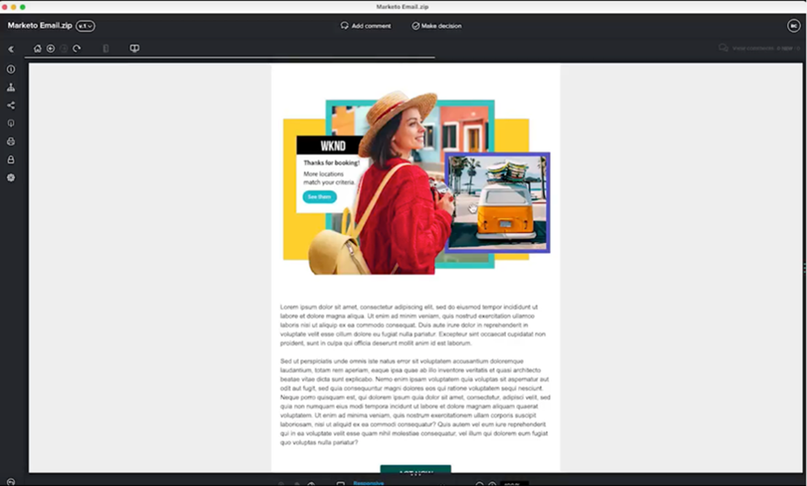
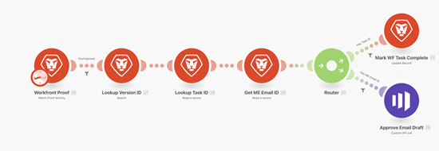

# Blauwdruk controleren en goedkeuren {#review-and-approve-blueprint}

Het verzekeren van marketing activa en campagnes voldoet aan de verwachtingen en de normen van een zaken breidt zich voorbij het leveren van de juiste inhoud en het overseinen aan het juiste publiek uit. Organisaties hebben ook de verantwoordelijkheid om bij het starten van nieuwe marketinginitiatieven het interne beleid, de regelgeving van de industrie en zelfs de juridische voorwaarden te handhaven. Door de evaluatie- en goedkeuringsstappen op te nemen in het ontwikkelingsproces van hun campagne, kunnen marketingteams ervoor zorgen dat inhoud en berichtgeving accuraat zijn en in overeenstemming met hun industrienormen, met name voor bedrijven als financiën, gezondheidszorg en geneesmiddelen.

Met Workfront en Marketo Engage, hebben de marketing teams de kans om een strak verbonden systeem voor marketing, met overseinen te hebben dat nauwkeurig en in naleving is.

## Proofing en geavanceerde goedkeuringen voor Marketo Engage met Workfront ontgrendelen {#unlock-proofing-and-advanced-approvals}

Wanneer wij over het bouwen van marketing campagnes denken, moeten wij in overweging nemen dat de verschillende stappen in kwestie, met inbegrip van planning, bouw, herziening, terugkoppel, goedkeuring, en uitvoering steunen. Met Workfront en Marketo Engage beschikken teams over alle instrumenten die nodig zijn om ze door het volledige planningsproces te leiden en een nieuwe marketingcampagne te starten. Bovendien kunnen teams hun evaluatie- en goedkeuringsproces verder stroomlijnen om de ontwikkelingssnelheid van de campagne te verhogen en ervoor te zorgen dat de nauwkeurigheid en naleving aan de hoogste norm worden gehouden.

### Gebruiksgevallen bekijken en goedkeuren die zijn ontgrendeld met Marketo Engage en Workfront {#review-and-approve-use-cases-unlocked-with-marketo-engage-and-workfront}

* Elimineer ongelijksoortige feedback en vergroot de samenwerking op een gecentraliseerde locatie door gebruik te maken van Workfront-annotaties en mogelijkheden voor opmerkingen bij Marketo&#39;s Engage.

* Centraliseer uw goedkeuringen door hen in Marketo Engage van de goedkeuringswerkschema&#39;s van Workfront teweeg te brengen.

* Ondersteuning en stroomlijning van complexe goedkeuringswerkstromen voor marketingmiddelen door gebruik te maken van de geavanceerde goedkeuringsmogelijkheden van Workfront met Marketo Engage-middelen.

* De toegang tot marketingconcepten vereenvoudigen door Marketo-middelen via programmacode naar Workfront te halen, zodat ze door meerdere belanghebbenden kunnen worden gecontroleerd.

* Wijzigingen bijhouden en een papiertrail maken door alle revisie- en toetsingswerkzaamheden voor Marketo&#39;s Engage in Workfront te centraliseren.

## Uw Proef- en goedkeuringswerkstroom plannen {#planning-your-proof-and-approval-workflow}

Overweeg de volgende aspecten voordat u de integratie tussen Marketo Engage en Workfront op het gebied van bewijs en goedkeuring instelt:

* Welke activa zullen moeten worden herzien en goedgekeurd?
* Wie moet de fiatteur zijn?
* Moeten er meerdere fiatteurs zijn voordat een marketingmiddel live kan gaan?
* Op welk moment in het ontwikkelingsproces van de campagne zullen marketingmiddelen worden verzameld en klaar zijn om te worden herzien?

Als u deze vragen beantwoordt, krijgt u een basislijn voor hoe uw goedkeuringsstroom eruit zal zien en hoe u begint te denken over het configureren van uw Workfront-instantie.

## Een Proefdruk- en goedkeuringsworkflow tussen Marketo Engage en Workfront maken {#building-a-proof-and-approval-workflow}

Om het proef- en goedkeuringsproces tussen Workfront en Marketo Engage te stroomlijnen, kunt u de twee oplossingen integreren gebruikend Workfront Fusion. Workfront Fusion biedt een workflowinterface voor het activeren van handelingen en het doorgeven van informatie tussen uw Workfront- en Marketo Engage-instanties.

Hiervoor moet u de onderstaande stappen overwegen als onderdeel van het proces voor een geïntegreerde evaluatie- en goedkeuringservaring.

1. Configureer uw Workfront-project met de functie Ready for Review.
1. Activeer de e-mail van het Marketo Engage om te synchroniseren met Workfront met een wijziging in de taakstatus.
1. Converteer het e-mailbestand van uw Marketo Engage naar een controleerbare proefdruk in Workfront.
1. Workfront-proefdrukken gebruiken om samen te werken via opmerkingen en annotaties.
1. Goedkeuren van de Workfront-proefafdruk om de goedkeuring van bedrijfsmiddelen in Marketo Engage te starten en markeren vervolgens de taak als voltooid.

### Een Workfront-project configureren met de opdracht Ready for Review {#configure-a-workfront-project-with-a-ready-for-review-task}

Gebruiken [projectsjablonen](https://experienceleague.adobe.com/docs/workfront/using/manage-work/projects/create-and-manage-project-templates/project-template-overview.html){target="_blank"} om de meeste herhaalbare processen, informatie, en montages te vangen verbonden aan de projecten in uw organisatie. U kunt taken definiëren, onderwerpen in een wachtrij plaatsen, aangepaste formulieren maken en documenten toevoegen aan uw sjabloon.

Neem in uw projectsjabloon in Workfront taken op voor het controleren van elementen die deel uitmaken van uw marketingcampagne. Bovendien kunt u een goedkeuringsproces toevoegen om enkele goedkeuringen of complexere goedkeuringen op meerdere niveaus af te handelen.

Als u een nieuwe e-mailcampagne wilt starten, moet u een projectsjabloon hebben met een taak om de e-mail te controleren en een goedkeuringsproces om ervoor te zorgen dat de e-mail wordt goedgekeurd door de juiste belanghebbende voordat deze kan worden verzonden.

{zoomable="yes"}

### De Marketo Engage via e-mail synchroniseren met Workfront met statuswijziging van taak {#trigger-your-marketo-engage-email-to-sync-to-workfront}

Als onderdeel van uw controleproces wilt u e-mails synchroniseren met uw Workfront-project zodra deze gereed zijn voor controle door uw marketingteam. Om dit te doen, adviseren wij vestiging Klaar om taak met een [taakstatus](https://experienceleague.adobe.com/docs/workfront/using/manage-work/projects/update-work-on-a-project/update-task-status.html){target="_blank"} dat aangeeft wanneer de e-mail gereed is om te worden gecontroleerd. In ons voorbeeld hebben we een e-mailstatus van Marketo controleren toegevoegd aan onze taak die kan worden geselecteerd wanneer het e-mailconcept gereed is om te worden gecontroleerd door belanghebbenden.

Met deze status in uw Workfront-project kunt u uw Workfront Fusion-scenario configureren om te luisteren naar de taak Ready to Review om bij te werken naar &quot;Review Marketo Email&quot;. Zodra bijgewerkt, kan uw scenario Marketo Engage e-mail als dossier terugwinnen van de HTML, het zip omhoog, en sparen een exemplaar van het in de projectdocumenten van Workfront die moeten worden herzien.

{zoomable="yes"}

### E-mailadres van uw Marketo Engage converteren naar controleerbare proefdruk in Workfront {#convert-your-marketo-engage-email-to-reviewable-proof-in-workfront}

Zodra uw Ready for Review-taak is verplaatst naar de status &quot;Marketo-e-mail controleren&quot; en het Marketo Engage-mailbericht wordt opgeslagen in Workfront, kunt u uw Workfront Fusion-scenario zodanig configureren dat het e-mailbericht wordt omgezet in een Workfront-proefdruk.

### Workfront-proefdrukken gebruiken om samen te werken via opmerkingen en annotaties {#use-workfront-proofing-to-collaborate}

[Workfront-proefdrukken](https://experienceleague.adobe.com/docs/workfront/using/review-and-approve-work/proofing/proofing-overview/proofing-basics.html){target="_blank"} Met deze functies kan uw marketingteam een nieuw middel gebruiken, zoals een afbeelding of een e-mail, en samenwerken via opmerkingen en annotaties. Zodra een bewijs klaar is om live te gaan, kunnen besluitvormers het middel van het proefdrukinstrument goedkeuren.

{zoomable="yes"}

### Workfront-proefafdruk goedkeuren en goedkeuring van bedrijfsmiddelen in Marketo Engage activeren, taak markeren als voltooid {#approve-workfront-proof-and-trigger-asset-approval-in-marketo-engage}

Workfront Fusion kan detecteren wanneer het e-mailbericht door belanghebbenden is goedgekeurd en een aanvraag naar het Marketo Engage verzenden om het e-mailbericht in Marketo goed te keuren.

Als de e-mail is gecontroleerd/goedgekeurd door de juiste teamleden, is de e-mail klaar om in Marketo Engage te gaan wonen!

## Fusion Scenario-sjablonen {#fusion-scenario-templates}

We hebben Fusion Templates ontwikkeld die u helpen aan de slag te gaan met de integratie, zodat u de ontwikkeling van Revisie kunt stroomlijnen en workflows kunt goedkeuren in uw eigen Workfront- en Marketo Engage-instantie. U kunt deze sjablonen gebruiken door naar &quot;Marketo&quot; te zoeken in de sectie Openbare sjablonen van Fusion en deze naar uw exemplaar te downloaden.

### Een e-mailproefexemplaar van het concept e-mail met uw Marketo Engage controleren in Workfront {#review-an-email-proof-of-your-marketo-engage-email-draft-in-workfront}

Het fusiescenario hieronder zal u door de eerste helft van het overzicht en goedkeurt stroom leiden, waarin het e-mailontwerp van Marketo Engage kan worden getrokken en aan Workfront als Bewijs worden bewaard. Als de Workfront-projectdocumenten eenmaal zijn opgeslagen als een proefexemplaar, kunnen ze worden gecontroleerd door belanghebbenden bij de marketing, hierop commentaar worden gegeven en als onderdeel van het revisieproces worden geannoteerd.

{zoomable="yes"}

### Goedkeuren van een e-mail in Workfront die de goedkeuring van het element in Marketo Engage activeert {#approve-an-email-in-workfront-that-triggers-approval}

Het fusiescenario hieronder kan worden gebruikt om te ontdekken wanneer een Bewijs in Workfront is goedgekeurd, en die goedkeuring te leiden aan Marketo Engage om het e-mailontwerp bij te werken zodat het levend en klaar om in een programma van de Marketo Engage is te worden gebruikt.

{zoomable="yes"}

Samen, kunnen deze twee scenario&#39;s worden gebruikt om een bidirectionele weg tot stand te brengen om marketing activa van Marketo Engage aan Workfront te trekken robuuste overzicht en goedkeurt werkschema&#39;s, en goedkeurt goedkeuringen terug naar Marketo Engage van Workfront.
