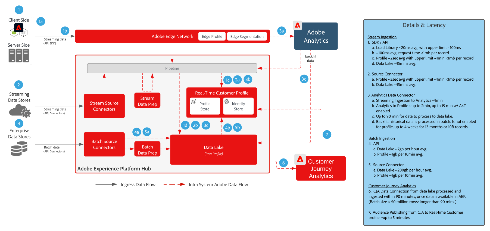

# Customer Journey Analytics met Real-time Customer Data Platform-blauwdruk

Creeer en publiceer publiek dat in Customer Journey Analytics (CJA) aan het Profiel van de Klant in real time in Adobe Experience Platform wordt geïdentificeerd voor klant richt en verpersoonlijking. Ideaal voor het maken van soorten publiek met behulp van historische gegevens of meer verfijnde doelgroepen van korrelfilteren en berekende velden in Customer Journey Analytics.

## Customer Journey Analytics publicatiehandleiding voor publiek

Zie de volgende documentatie voor richtlijnen over implementatie en configuratie bij de publicatie van publiek van Customer Journey Analytics naar Real-time Customer Data Platform. [Documentatie](https://experienceleague.adobe.com/docs/analytics-platform/using/cja-components/audiences/publish.html)

## Architectuur voor Customer Journey Analytics blauwdrukken

{zoomable=&quot;yes&quot;}

## Guardraildiagram voor Customer Journey Analytics-blauwdrukken

* Voor gedetailleerde instructies en eindlatenties raadpleegt u de [document met implementatiehandleidingen](../experience-platform/deployment/guardrails.md)

{zoomable=&quot;yes&quot;}

## Veelgestelde vragen

* Als er geen corresponderend profiel bestaat in een RTCDP-bestand dat door CJA is verzonden, wordt dan een nieuw profiel gemaakt of worden alleen publiek opgenomen van CJA voor profielen die al aanwezig zijn? Ja, er wordt een nieuw profiel gemaakt. Dientengevolge als uw implementatie RTCDP voor bekende klanten slechts is, zouden de CJA publieksregels aan filter voor slechts profielen met bekende identiteiten moeten worden geschreven. Zo voorkomt u dat het aantal RTCDP-profielen desgewenst toeneemt ten opzichte van anonieme profielen.

* Verzendt CJA de publieksgegevens over als pijpleidingsgebeurtenissen of een plat dossier dat ook naar gegevens meer gaat? Het publiek CJA wordt gestroomd over pijpleiding aan de Dienst van het Profiel RTCDP, nochtans worden de gegevens ook opgeslagen in gegevens meer als dataset.

* Welke identiteiten verzendt CJA? CJA verzendt over welke identiteiten als &quot;persoonsidentiteitskaart&quot;tijdens configuratie CJA werden gevormd.

* Wat wordt ingesteld als de primaire identiteit? Welke identiteit de gebruiker ook selecteerde toen hij CJA als primaire &quot;persoon&quot;identiteitskaart opstelde

* Verwerkt de identiteitsdienst ook de CJA- berichten? Kan CJA bijvoorbeeld identiteiten toevoegen aan een profielidentiteitsgrafiek door het delen van het publiek? Nee, de identiteitsservice verwerkt de CJA-berichten niet.

## Gerelateerde blogberichten

* [[!DNL Blueprint for Multi-Channel Orchestration in Adobe Experience Platform]](https://medium.com/adobetech/blueprint-for-multi-channel-orchestration-in-adobe-experience-platform-c68317e94184)
* [[!DNL Leveraging External Data Platforms in Adobe Experience Platform Journey Orchestration]](https://medium.com/adobetech/leveraging-external-data-platforms-in-adobe-experience-platform-journey-orchestration-54fc6134fe17)
* [[!DNL Event-Based Triggering on Adobe Experience Platform Orchestration Service using Apache Airflow]](https://medium.com/adobetech/event-based-triggering-on-adobe-experience-platform-orchestration-service-using-apache-airflow-8607b28251f1)
* [[!DNL Adobe Campaign Classic Integration with Journey Orchestration]](https://medium.com/adobetech/adobe-campaign-classic-integration-with-journey-orchestration-ae577653281)
* [[!DNL Demonstrating the Power of Adobe's New Journey Orchestration Service to Build Personalized Omnichannel Experiences in Real-Time]](https://medium.com/adobetech/demonstrating-the-power-of-adobes-new-journey-orchestration-service-to-build-personalized-aa60d88cd34)
* [[!DNL Journey Orchestration in an Omnichannel World]](https://medium.com/adobetech/journey-orchestration-in-an-omnichannel-world-3a2d32d556d9)
