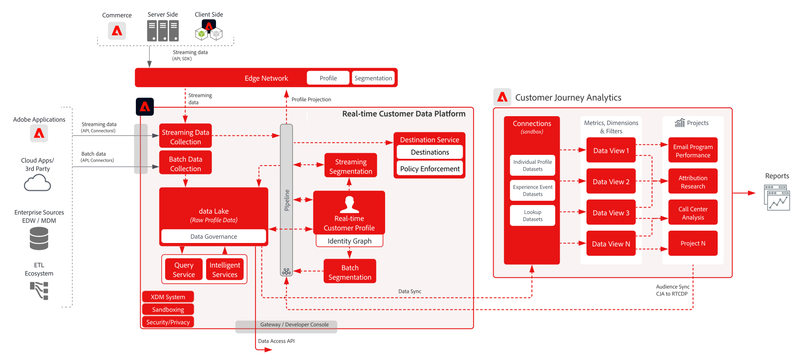

# Customer Journey Analytics met Real-time Customer Data Platform

Creeer en publiceer publiek dat in Customer Journey Analytics (CJA) aan het Profiel van de Klant in real time in Adobe Experience Platform wordt geïdentificeerd voor klant richt en verpersoonlijking. Ideaal voor het maken van soorten publiek met behulp van historische gegevens of meer verfijnde doelgroepen van korrelfilteren en berekende velden in Customer Journey Analytics.

## Architectuur voor Customer Journey Analytics blauwdrukken

## Guardrail-diagram voor Customer Journey Analytics blauwdrukken

## Customer Journey Analytics Handleiding voor publiek publiceren

Zie de volgende documentatie voor richtlijnen over implementatie en configuratie bij de publicatie van publiek van Customer Journey Analytics naar Real-time Customer Data Platform. [Documentatie](https://experienceleague.adobe.com/docs/analytics-platform/using/cja-components/audiences/publish.html)

## Verwante blogberichten

* [[!DNL Blueprint for Multi-Channel Orchestration in Adobe Experience Platform]](https://medium.com/adobetech/blueprint-for-multi-channel-orchestration-in-adobe-experience-platform-c68317e94184)
* [[!DNL Leveraging External Data Platforms in Adobe Experience Platform Journey Orchestration]](https://medium.com/adobetech/leveraging-external-data-platforms-in-adobe-experience-platform-journey-orchestration-54fc6134fe17)
* [[!DNL Event-Based Triggering on Adobe Experience Platform Orchestration Service using Apache Airflow]](https://medium.com/adobetech/event-based-triggering-on-adobe-experience-platform-orchestration-service-using-apache-airflow-8607b28251f1)
* [[!DNL Adobe Campaign Classic Integration with Journey Orchestration]](https://medium.com/adobetech/adobe-campaign-classic-integration-with-journey-orchestration-ae577653281)
* [[!DNL Demonstrating the Power of Adobe’s New Journey Orchestration Service to Build Personalized Omnichannel Experiences in Real-Time]](https://medium.com/adobetech/demonstrating-the-power-of-adobes-new-journey-orchestration-service-to-build-personalized-aa60d88cd34)
* [[!DNL Journey Orchestration in an Omnichannel World]](https://medium.com/adobetech/journey-orchestration-in-an-omnichannel-world-3a2d32d556d9)
