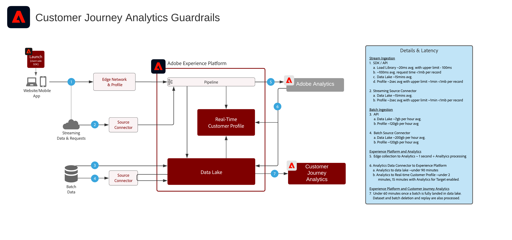

# Customer Journey Analytics

Customer Journey Analytics toont hoe de merken klantengegevens en gedrag van diverse interactiekanalen en bronnen kunnen verenigen om een op reis-gebaseerde mening van alle klanteninteractie tot stand te brengen. De rapportering en de analyse kunnen in de de toepassingsdienst van Customer Journey Analytics worden uitgevoerd om inzicht in klanteninteractie en gedragspatronen te evalueren en te verkrijgen.

Veelvoorkomende analyses zijn:

* Paden boven/onder omzetten
* Kanaalbetrokkenheid en conversie
* Meest bekeken inhoud
* Topcategorieën en producten
* Welke campagnes resulteerden in conversie en grotere betrokkenheid
* Analyse van het gebruik van hulpmiddelen om zelfbedieningservaringen te optimaliseren

| Blauwdruk | Beschrijving | Experience Cloud-toepassingen |
|---|---|---|
| **[Reisanalyse Kanaal](digital-behavioral-data-consolidation.md)** | <ul><li>Eén geconsolideerde weergave van het gedrag van klanten op verschillende kanalen hebben door gegevens van verschillende web-, mobiele en offline eigenschappen te verenigen.</li></ul> | <ul><li>Adobe Experience Platform</li><li>Customer Journey Analytics</li><li>Adobe Analytics (optioneel)</li></ul> |
| **[De Analyse van de Vervorming van de vraag](call-deflect.md)** | <ul><li>Bepaal welk gedrag het meest indicatief in het resulteren in agent begeleide vraag door de gegevens van het Centrum van de Vraag samen met Web, mobiele, en andere interactiegegevens te brengen is.</li><li>Deze inzichten kunnen dan worden gebruikt om de klantenervaring te optimaliseren en de weg aan agent bijgewoonde interactie door geoptimaliseerde zelf-dienst inhoud en hulpmiddelen te verminderen.  </li></ul> | <ul><li>Adobe Experience Platform</li><li>Customer Journey Analytics</li> |

## Guardrails voor Customer Journey Analytics blauwdrukken

### Guardrail Diagram

## Verwante blogberichten

* [[!DNL Blueprint for Multi-Channel Orchestration in Adobe Experience Platform]](https://medium.com/adobetech/blueprint-for-multi-channel-orchestration-in-adobe-experience-platform-c68317e94184)
* [[!DNL Leveraging External Data Platforms in Adobe Experience Platform Journey Orchestration]](https://medium.com/adobetech/leveraging-external-data-platforms-in-adobe-experience-platform-journey-orchestration-54fc6134fe17)
* [[!DNL Event-Based Triggering on Adobe Experience Platform Orchestration Service using Apache Airflow]](https://medium.com/adobetech/event-based-triggering-on-adobe-experience-platform-orchestration-service-using-apache-airflow-8607b28251f1)
* [[!DNL Adobe Campaign Classic Integration with Journey Orchestration]](https://medium.com/adobetech/adobe-campaign-classic-integration-with-journey-orchestration-ae577653281)
* [[!DNL Demonstrating the Power of Adobe’s New Journey Orchestration Service to Build Personalized Omnichannel Experiences in Real-Time]](https://medium.com/adobetech/demonstrating-the-power-of-adobes-new-journey-orchestration-service-to-build-personalized-aa60d88cd34)
* [[!DNL Journey Orchestration in an Omnichannel World]](https://medium.com/adobetech/journey-orchestration-in-an-omnichannel-world-3a2d32d556d9)
