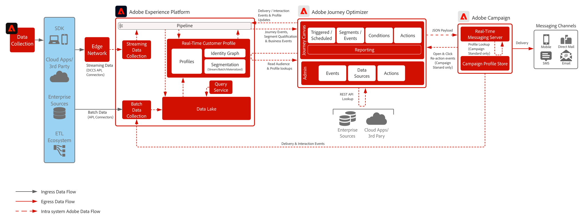

# Journey Optimizer met Adobe Campaign v8-blauwdruk

Toont aan hoe Adobe [!DNL Journey Optimizer] met Adobe [!DNL Campaign] kan worden gebruikt native om berichten te verzenden door de berichtenserver in real time in [!DNL Campaign] te gebruiken.

## Architectuur

>[!IMPORTANT]
>Het gebruik van zowel Journey Optimizer als Campagne om berichten onafhankelijk van elkaar te verzenden is mogelijk, maar bevat enkele technische overwegingen die moeten worden doorgelicht. Als u deze route wilt nastreven, gelieve met uw Architect van de Onderneming Pre-Sales te werken om ervoor te zorgen dat u een inzicht in hebt wat zal worden vereist om de implementatie te steunen

 

## Vereisten

Controleer de volgende voorwaarden voor elke toepassing.

### Adobe Experience Platform

* De schema&#39;s en de datasets moeten in het systeem worden gevormd alvorens u Journey Optimizer gegevensbronnen kunt vormen
* Voor op klasse-gebaseerde schema&#39;s van de Gebeurtenis van de Ervaring, voeg &quot;Orchestration eventID gebiedsgroep toe wanneer u een gebeurtenis wilt teweegbrengen die geen op regel-gebaseerde gebeurtenis is
* Voeg voor op individuele profielklassen gebaseerde schema&#39;s de veldgroep &#39;Proefdetails profiel&#39; toe, zodat testprofielen kunnen worden geladen voor gebruik met Journey Optimizer
* Journey Optimizer en Campagne worden geleverd in dezelfde IMS Org

### Campaign v8

* Adobe Managed Cloud Services moet de instantie Execution van de Real-Time Messaging Service (dus Berichtencentrum) hosten
* Alle bericht authoring wordt uitgevoerd binnen de Campagne-instantie zelf

## Beveiligingsmechanismen

* [&#x200B; Journey Optimizer Guardrails productbeperkingen &#x200B;](https://experienceleague.adobe.com/nl/docs/journey-optimizer/using/get-started/guardrails)

* [&#x200B; Guardrails en de begeleiding van begin tot eind van de latentie &#x200B;](https://experienceleague.adobe.com/docs/blueprints-learn/architecture/architecture-overview/guardrails.html?lang=nl-NL)

## Implementatiestappen

Volg de implementaties voor elke hieronder beschreven toepassing.

### Adobe Experience Platform

#### Schema/datasets

1. [&#x200B; vorm individueel profiel, ervaringsgebeurtenis, en multi-entiteitsschema&#39;s &#x200B;](https://experienceleague.adobe.com/?lang=nl&recommended=ExperiencePlatform-D-1-2021.1.xdm) in Experience Platform, die op klant-geleverde gegevens wordt gebaseerd.
1. (Optioneel) Maak op de klasse gebaseerde schema&#39;s voor Experience Event voor Adobe Campaign wideLog, trackingLog en niet-leverbare adrestabellen.
1. [&#x200B; creeer datasets &#x200B;](https://experienceleague.adobe.com/docs/platform-learn/tutorials/data-ingestion/create-datasets-and-ingest-data.html?lang=nl-NL) in Experience Platform voor gegevens die moeten worden opgenomen.
1. [&#x200B; voegt de etiketten van het gegevensgebruik &#x200B;](https://experienceleague.adobe.com/docs/platform-learn/tutorials/data-governance/classify-data-using-governance-labels.html?lang=nl-NL) in Experience Platform aan de dataset voor bestuur toe.
1. [&#x200B; creeer beleid &#x200B;](https://experienceleague.adobe.com/docs/platform-learn/tutorials/data-governance/create-data-usage-policies.html?lang=nl-NL) dat bestuur op bestemmingen afdwingt.

#### Profiel/identiteit

1. [&#x200B; creeer om het even welke klant-specifieke namespaces &#x200B;](https://experienceleague.adobe.com/docs/platform-learn/tutorials/identities/label-ingest-and-verify-identity-data.html?lang=nl-NL).
1. [&#x200B; voegt identiteiten aan schema&#39;s &#x200B;](https://experienceleague.adobe.com/docs/platform-learn/tutorials/identities/label-ingest-and-verify-identity-data.html?lang=nl-NL) toe.
1. [&#x200B; laat de schema&#39;s en datasets voor Profiel &#x200B;](https://experienceleague.adobe.com/docs/platform-learn/tutorials/profiles/bring-data-into-the-real-time-customer-profile.html?lang=nl-NL) toe.
1. [&#x200B; opstelling voegt beleid &#x200B;](https://experienceleague.adobe.com/docs/platform-learn/tutorials/profiles/create-merge-policies.html?lang=nl-NL) voor verschillende meningen van [!UICONTROL &#x200B; in real time het Profiel van de Klant &#x200B;] (facultatief) samen.
1. Maak segmenten voor gebruik in Reis.

#### Bronnen/bestemmingen

1. [&#x200B; Samenvatting gegevens in  [!DNL Experience Platform] &#x200B;](https://experienceleague.adobe.com/?lang=nl&recommended=ExperiencePlatform-D-1-2020.1.dataingestion) gebruikend het stromen APIs &amp; bronschakelaars.

### Journey Optimizer

1. Vorm uw [!DNL Experience Platform] gegevensbron en bepaal welke gebieden in de cache moeten worden geplaatst
1. Streaming gegevens die worden gebruikt om een reis van een klant te initiëren, moeten eerst binnen Journey Optimizer worden geconfigureerd om een organisatie-id te verkrijgen. Deze orkest-id wordt vervolgens aan de ontwikkelaar geleverd om met inname te gebruiken.
1. Externe gegevensbronnen configureren.
1. Vorm douaneacties voor de instantie van de Campagne.

### Campaign v8

* De malplaatjes van het overseinen moeten met aangewezen verpersoonlijkingscontext worden gevormd.
* Voor [!DNL Campaign] standard: de werkschema&#39;s van de uitvoer moeten worden gevormd om de transactionele overseinenlogboeken terug naar Experience Platform uit te voeren. De aanbeveling is om ten hoogste om de vier uur te lopen.
* Voor [!DNL Campaign] v8.4 is het mogelijk om Adobe [!DNL Campaign] Managed Services Source Connector in Experience Platform te gebruiken voor het synchroniseren van bezorgings- en volggebeurtenissen van Campagne naar Experience Platform. Verwijs naar de [&#x200B; 1&rbrace; documentatie van de Schakelaar van Source &lbrace;voor details.](https://experienceleague.adobe.com/docs/experience-platform/sources/home.html?lang=nl-NL)

### Mobiele pushconfiguratie (optioneel)

1. Implementeer [!DNL Experience Platform] Mobile SDK voor het verzamelen van push-tokens en aanmeldingsgegevens om terug te koppelen naar bekende klantprofielen.
1. Gebruik Adobe-tags en maak een mobiele eigenschap met de volgende extensie:
   * Adobe [!DNL Journey Optimizer] | Adobe [!DNL Campaign Classic] | Adobe [!DNL Campaign Standard]
   * Adobe [!DNL Experience Platform] [!DNL Edge Network]
   * Identiteit voor [!DNL Edge Network]
   * Mobiele kern
1. Zorg ervoor dat u beschikt over een specifieke gegevensstroom voor implementatie van mobiele apps versus webimplementaties.
1. Voor meer informatie volg de [&#x200B; Mobiele Gids van Adobe Journey Optimizer &#x200B;](https://developer.adobe.com/client-sdks/edge/adobe-journey-optimizer/push-notification/).

   >[!IMPORTANT]
   >Mobiele tokens moeten mogelijk zowel in Journey Optimizer als in Campagne worden verzameld als er behoefte is aan realtime communicatie via Journey Optimizer en batchpushberichten via Campagne. Voor Campaign v8 is het exclusieve gebruik van de Campagne SDK vereist voor het vastleggen van push-tokens.

## Gerelateerde documentatie

* [&#x200B; documentatie van Journey Optimizer &#x200B;](https://experienceleague.adobe.com/docs/journey-optimizer/using/ajo-home.html?lang=nl-NL)
* [&#x200B; de Beschrijving van het Product van Journey Optimizer &#x200B;](https://helpx.adobe.com/nl/legal/product-descriptions/adobe-journey-optimizer.html)
* [&#x200B; Campagne v8 documentatie &#x200B;](https://experienceleague.adobe.com/docs/campaign-v8.html?lang=nl-NL)
