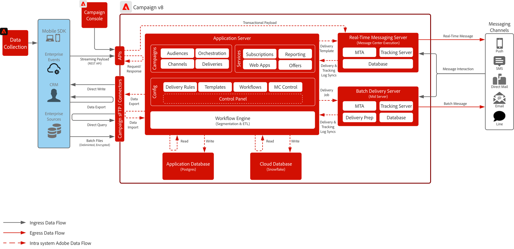

# Campagne v8 Blueprint

Adobe Campaign v8 is een campagnebeheerplatform van de volgende generatie dat is ontworpen voor traditionele marketingkanalen zoals e-mail en direct mail. Het biedt robuuste ETL- en gegevensbeheermogelijkheden om complexe segmentering en doelgerichtheid van het publiek te ondersteunen, samen met een krachtige orchestratie-engine voor het ontwikkelen van multi-touch, batchgeoriënteerde marketingprogramma&#39;s.

Het omvat ook een scalable overseinenserver in real time die transactie mededeling-zulke zoals wachtwoordterugstelt, ordeverichtingen, en e-ontvangstbewijzen-door volledige lading van externe systemen voor directe levering goed te keuren toelaat.

## Gebruiksscenario&#39;s

>[!BEGINTABS]

>[!TAB  de Uitvoering van de Campagne van de Partij ]

- Ontwerp en lever grootschalige, geplande marketingcampagnes via e-mail, SMS en direct mail.
- Ideaal voor reclamespots, nieuwsbrieven en seizoensaanbiedingen met complexe segmentatie en doelgerichtheid.

>[!TAB  Multitouch Orchestration ]

- Multikanaalprogramma&#39;s met meerdere stappen ontwikkelen die klanten door een vooraf gedefinieerde marketingreis begeleiden.
- Ondersteunt het opnieuw betreden van het publiek, voorwaardelijke logica en op tijd gebaseerde overgangen.

>[!TAB  Beheer van Gegevens &amp; ETL ]

- Ontdek, transformeer, en beheer klantengegevens van diverse bronnen om het nauwkeurige richten te steunen.
- Hiermee kunt u aangepaste schema&#39;s, berekende velden en publieksdefinities maken.

>[!TAB  Transactioneel Overseinen ]

- Verzend real-time, vooraf gedefinieerde berichten die worden geactiveerd door externe systemen (bijv. opnieuw instellen van wachtwoorden, bevestiging van orders, e-ontvangstbewijzen).
- Gebruikt een scalable overseinenserver die volledige ladingen van de systemen van IT voor directe levering goedkeurt.

>[!ENDTABS]

 

## Architectuurdiagrammen

Leer meer over [ de plaatsingsmodellen van de Campagne v8 ](https://experienceleague.adobe.com/docs/campaign/campaign-v8/config/architecture/architecture.html?lang=nl-NL#ac-deployment){target="_blank"}.

### Implementatie van Campagne Enterprise (FFDA)

 

### Implementatie van FDA voor campagne v8

 

## Integratiepatronen

| Scenario | Beschrijving | Technische overwegingen |
| :-- | :--- | :--- |
| [[!DNL Real-time Customer Data Platform]  met Adobe  [!DNL Campaign]](rtcdp-and-campaign-v8.md) | Toont hoe de Adobe Experience Platform en zijn Real-Time Klantprofiel en gecentraliseerd segmenteringshulpmiddel met Adobe [!DNL Campaign] kunnen worden gebruikt om gepersonaliseerde gesprekken te leveren | <ul><li>Delen van profielen en soorten publiek van [!DNL Real-Time CDP] naar Adobe [!DNL Campaign] via de workflows voor het uitwisselen van bestanden voor cloudopslag en Adobe [!DNL Campaign] . </li><li>U kunt eenvoudig levering- en interactiegegevens delen van gesprekken van klanten die teruggaan naar de [!DNL Real-Time CDP] vanuit Adobe [!DNL Campaign] om zowel het Real-Time Klantprofiel te verbeteren als om via het kanaal rapporten te verstrekken over berichtcampagnes</li></ul> |
| [[!DNL Journey Optimizer]  met Adobe  [!DNL Campaign]](ajo-and-campaign-v8.md) | Toont hoe u Adobe Journey Optimizer kunt gebruiken om 1 :1 ervaringen te ordenen gebruikend het Real-Time Profiel van de Klant en hefboomwerking het inheemse systeem van het de transactionele overseinen van Adobe [!DNL Campaign] om het bericht te verzenden | <ul><li>Kan tot 1M berichten per uur via de Echte - tijd server van het Bericht verzenden<li>Er wordt geen vertraging uitgevoerd vanuit [!DNL Journey Optimizer], zodat technische controles door een pre-Sales Enterprise Architect worden uitgevoerd</li><li>Beslissingsbeheer wordt niet ondersteund in pakketten naar campagne v8</li></ul> |

 

## Vereisten

De volgende voorwaarden bestaan voor deze blauwdruk.

### Toepassingsserver en Real-Time Messaging-server

- De Adobe [!DNL Campaign] Client Console is vereist voor interactie en gebruik van de [!DNL Campaign] v8-software. Het is een op vensters gebaseerde client en gebruikt standaard internetprotocollen (SOAP, HTTP, enz.). Zorg ervoor dat u de benodigde rechten hebt die op uw org zijn ingeschakeld voor het distribueren, installeren en uitvoeren van software

- Aanbieding met IP-adres toestaan:
   - Identificeer de IP waaiers die alle gebruikers hefboomwerking tijdens toegang tot de cliëntconsole.
   - Identiteit die de ondernemingssystemen worden toegestaan om met de Real-Time overseinenserver te spreken en ervoor te zorgen zij statisch toegewezen IP of waaier hebben die u kunt toestaan-lijst.
   - Dit kan worden ingesteld en gecontroleerd via het Configuratiescherm van de Campagne.
- sFTP-sleutelbeheer:
   - SSH openbare sleutels beschikbaar hebben om met de Campagne te gebruiken verstrekt sFTP. Dit kan worden ingesteld en gecontroleerd via het Configuratiescherm van de Campagne.

### E-mail

- Heb klaar subdomain om voor bericht het verzenden te worden gebruikt.
- Subdomein kan volledig aan Adobe (geadviseerd) worden gedelegeerd of CNAMEs kan worden gebruikt om aan Adobe-specifieke DNS servers (douane) te richten.
- Google TXT-record is nodig voor elk subdomein om goede prestaties te garanderen.

### Mobiele push

- Een mobiele ontwikkelaar beschikbaar hebben om de mobiele app te implementeren, te configureren en samen te stellen.
- Adobe verstrekt slechts een SDK om de noodzakelijke informatie van FCM (Android) en APNS (iOS) te verzamelen om berichtlading naar hun servers te verzenden. Hoe de mobiele app moet worden gecodeerd, geïmplementeerd, beheerd en opgespoord, valt onder de verantwoordelijkheid van de klant.

### Webapps (optioneel)

- Kan een extra subdomein voor Campagne delegeren ontvangen unsubscribe en landende pagina&#39;s.
- SSL-certificaat wordt sterk aangemoedigd.

 

## Beveiligingsmechanismen

### Grootte toepassingsserver

- Opslag kan worden geschaald tot maximaal 200 M profielen met mogelijkheid om tot 1B profielen te schrapen.
- Toegang tot gebruikers instellen en beheren via Adobe [!DNL Admin Console] .
- Gegevens die naar [!DNL Campaign] worden geladen, worden naar verwachting via batchbestanden geladen:
   - Ondersteuning voor het laden van API-gegevens is voornamelijk bedoeld voor het beheer van profielen of eenvoudige objecten in de database (d.w.z. maken en bijwerken). Het is niet bedoeld voor het laden van grote hoeveelheden gegevens of batchbewerkingen.
   - Het gebruik van API&#39;s voor het lezen van gegevens voor aangepaste toepassingsdoeleinden wordt niet ondersteund
   - Gegevens die via de API zijn geladen, worden in de toepassingsdatabase gefaseerd en vervolgens elk uur naar de Cloud-database gerepliceerd
- Beperkingen op API-aanroepen zijn van toepassing. Leer meer in de [ Beschrijving van het Product van Adobe Campaign ](https://helpx.adobe.com/nl/legal/product-descriptions/adobe-campaign-managed-cloud-services.html){target="_blank"}.

### Grootte van batchcommunicatieserver

- Kan worden geschaald voor verwerking tot berichten van 20 MB per uur

### Real-time communicatieservergrootte

- Kan tot 1 M berichten per uur verzenden
- Standaard worden twee realtime communicatieservers ingericht. Mogelijkheid om maximaal acht Real-Time Messaging-servers te schalen.

### SMS-configuratie

- De campagne verstrekt de capaciteit om met een leverancier van SMS te integreren. De leverancier wordt aangekocht door de klant en geïntegreerd met campagne voor het verzenden van SMS-berichten.
- De steun is via het protocol SMPP.
- Er zijn drie (3) verschillende soorten SMS die Adobe kan ondersteunen:
   - SMS MT (Mobile Terminated): een SMS dat door Adobe [!DNL Campaign] naar mobiele telefoons wordt gezonden via de SMPP-provider.
   - SMS MO (Mobile Originated): een SMS-bericht dat door een mobiel naar Adobe wordt verzonden [!DNL Campaign] via de SMPP-provider.
   - SMS SR (Status Report) of DR of DLR (Delivery Receipt): een door de mobiele telefoon via de SMPP-provider naar Adobe verzonden ontvangstbewijs dat het SMS met succes is ontvangen. [!DNL Campaign] Adobe [!DNL Campaign] kan ook SR ontvangen die aangeeft dat het bericht niet kan worden verzonden, vaak met een beschrijving van de fout.

 

## Implementatiestappen

Zie de begonnen gids voor [ Uitvoeren Adobe Campaign v8 ](https://experienceleague.adobe.com/docs/campaign/campaign-v8/implement/implement.html?lang=nl-NL)

## Gerelateerde documentatie

- [ Campagne v8 documentatie ](https://experienceleague.adobe.com/docs/campaign-v8.html?lang=nl-NL)
- [ Campagne v8 Beschrijving van het Product ](https://helpx.adobe.com/nl/legal/product-descriptions/adobe-campaign-managed-cloud-services.html)
- [ de documentatie van de Markeringen van Experience Platform ](https://experienceleague.adobe.com/docs/launch.html?lang=nl-NL)
- [ Experience Platform Mobile SDK documentatie ](https://experienceleague.adobe.com/docs/mobile.html?lang=nl-NL)