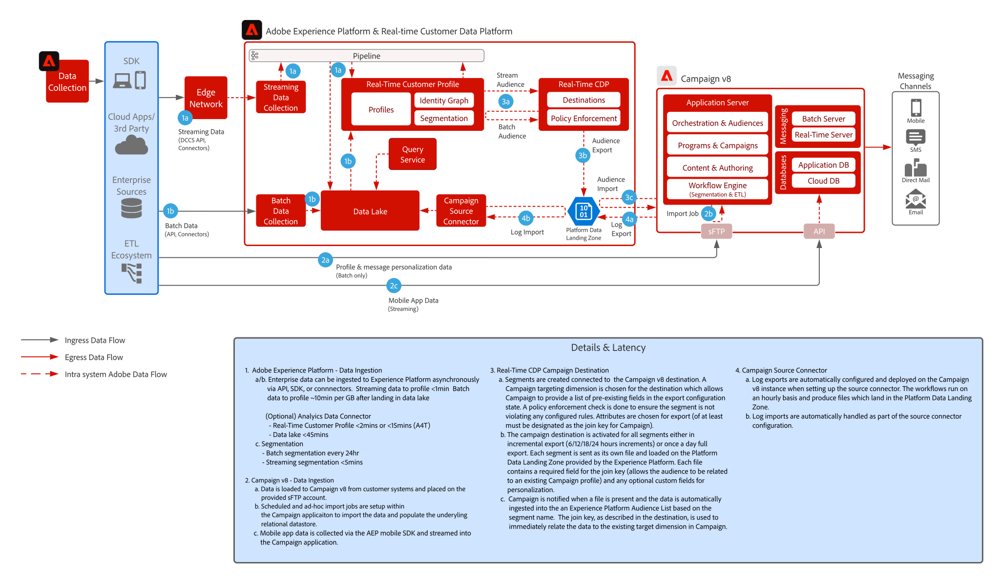

# [!DNL Real-Time CDP] met Adobe [!DNL Campaign] v8-integratiepatroon

Toont hoe de Adobe [!DNL Experience Platform] en zijn Real-Time Klantprofiel en gecentraliseerd segmenteringshulpmiddel met Adobe Campaign kunnen worden gebruikt om gepersonaliseerde gesprekken te leveren.

## Applicaties

* Adobe [!DNL Experience Platform Real-Time CDP]
* Adobe [!DNL Campaign] v8

## Architectuur

 

## Vereisten

* Voor Experience Cloud moet de klant een geldige IMS-organisatie hebben
* Adobe Experience Platform en [!DNL Campaign] worden aangeraden in dezelfde IMS-organisatie te worden ingericht voor één aanmeldings-URL
* De klant moet een V8-exemplaar van [!DNL Campaign] voorzien zijn
* De klant moet in aanmerking komen en toegang hebben voor RTCDP, Bronnen, Doelen.
* Adobe [!DNL Campaign] -productcontext moet bestaan

 

## Implementatiestappen

Raadpleeg de volgende documentatie over het configureren van de v8-bronaansluiting voor Campagne naar Adobe Experience Platform en de doelconnector voor het Real-time Customer Data Platform naar Campaign v8.
[ Campagne en de Connectors van AEP ](https://experienceleague.adobe.com/docs/campaign/campaign-v8/connect/ac-aep.html?lang=nl-NL)

## Beveiligingsmechanismen

### Adobe Campaign

* Verwijs naar de de bronschakelaardocumentatie van de Campagne - [ Verbinding van Source van de Campagne ](https://experienceleague.adobe.com/docs/experience-platform/sources/ui-tutorials/create/adobe-applications/campaign.html?lang=nl-NL)
* Alleen ondersteuning voor implementatie van één organisatie in Adobe Campaign

### Experience Platform Real-time delen van klantgegevens Platform

* Verwijs naar de schakelaar van de Bestemming van de Campagne van RTCDP - [ Verbinding van de Campagne van RTCDP ](https://experienceleague.adobe.com/docs/experience-platform/destinations/catalog/email-marketing/adobe-campaign-managed-services.html?lang=nl-NL)

* Zie profiel en gegevensingestition guardrails voor AEP - [ Verbinding ](https://experienceleague.adobe.com/docs/experience-platform/profile/guardrails.html?lang=nl-NL)
