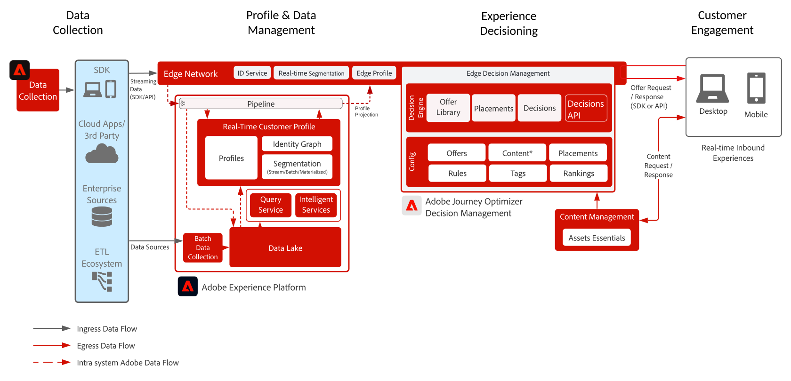

# Journey Optimizer - [!DNL Decision Management] op de Edge-blauwdruk

[!DNL Decision Management] is een service die wordt aangeboden als onderdeel van [!DNL Journey Optimizer] . Deze blauwdruk schetst de gebruiksgevallen en de technische mogelijkheden van de toepassing en verstrekt een diepe duik in de diverse architecturale componenten en overwegingen die omhoog het Beheer van de Beslissing maken.

>[!MORELIKETHIS]
>
>Meer over [!DNL Decision Management] leren, zie het [ blauwdrukoverzicht ](decision-management-overview.md) of bezoek de [ productdocumentatie ](https://experienceleague.adobe.com/docs/journey-optimizer/using/offer-decisioniong/get-started-decision/starting-offer-decisioning.html).

[!DNL Decision Management] kan op twee manieren worden geïmplementeerd. De eerste is via de [!DNL Experience Platform] Hub, die één enkele architectuur van het gegevenscentrum is. In de &quot;hub&quot;benadering worden de aanbiedingen uitgevoerd, gepersonaliseerd, en geleverd in tweede latentie. Aldus is de hubarchitectuur het best geschikt voor klantenervaring die geen sub-tweede latentie vereist, omvatten de voorbeelden aanbiedingsbesluiten die voor kiosken of agent bijgewoonde ervaringen zoals in callcenters of in persoonlijke interactie worden verstrekt.

De tweede aanpak is via de Experience Platform [!DNL Edge Network] , een wereldwijd gedistribueerde, geografisch gesitueerde infrastructuur die snelle sub-seconde- en millisecondenervaringen biedt. De eindgebruikerservaring die wordt uitgevoerd door de Edge-infrastructuur die het dichtst bij de geo-locatie van de consument ligt om de latentie tot een minimum te beperken. [!DNL Decision Management] op de Edge is ontworpen om in real-time de ervaringen van de consument te dienen. Deze omvatten ervaringen zoals Web of mobiele binnenkomende verpersoonlijkingsverzoeken.

Deze blauwdruk zal de specifieke kenmerken van het besluitvormingsbeheer op de Edge bestrijken.

Meer over het Beheer van het Besluit op de hub leren verwijs naar het [ Beheer van het Besluit over de hub ](decision-management-hub.md) blauwdruk.

## Gebruik gevallen voor Beslissingsbeheer aan de rand

* Bij streaming gebruik is de latentie van de profielcontext strikt lager dan 15 minuten latentie en de uitvoering van het beslissingsbeheer subseconden.
* Online personalisatie via internet of mobiele binnenkomende ervaringen.
* Transactieuitvoering via verschillende kanalen - biedt consistentie via internet, mobiele apparaten, e-mail en andere interactiekanalen via Adobe Journey Optimizer.

## Architectuur

## Integratiepatronen

| Integratie | Beschrijving |
| :-- | :--- |
| [ Beheer van het Besluit met Adobe Target ](https://experienceleague.adobe.com/docs/target/using/integrate/ajo/offer-decision.html) | Beslissingsbeheer kan in Adobe Target worden geïntegreerd, zodat aanbiedingen kunnen worden getest en geleverd als ervaringen met het doel. |

## Beveiligingsmechanismen

* Voor de guardrails van Journey Optimizer verwijzen naar de volgende [ Guardrails van Journey Optimizer ](https://experienceleague.adobe.com/docs/journey-optimizer/using/get-started/limitations.html).

* Voor de gidsen van het Beheer van het Besluit verwijzen naar de volgende [ Beschrijving van het Product van het Beheer van het Besluit ](https://helpx.adobe.com/legal/product-descriptions/offer-decisioning-app-service.html).

[Hulplijnen en advies voor end-to-end latentie](https://experienceleague.adobe.com/docs/blueprints-learn/architecture/architecture-overview/guardrails.html)

## Gerelateerde documentatie

* [Adobe Experience Platform](https://experienceleague.adobe.com/docs/experience-platform.html)
* [Adobe Journey Optimizer](https://experienceleague.adobe.com/docs/journey-optimizer.html)
* [ Adobe Journey Optimizer Beslissingsbeheer ](https://experienceleague.adobe.com/docs/journey-optimizer/using/offer-decisioniong/get-started-decision/starting-offer-decisioning.html)
* [Adobe Journey Optimizer-productbeschrijving](https://helpx.adobe.com/legal/product-descriptions/adobe-journey-optimizer.html)
* [Adobe-productbeschrijving voor besluitvormingsbeheer](https://helpx.adobe.com/legal/product-descriptions/offer-decisioning-app-service.html)
