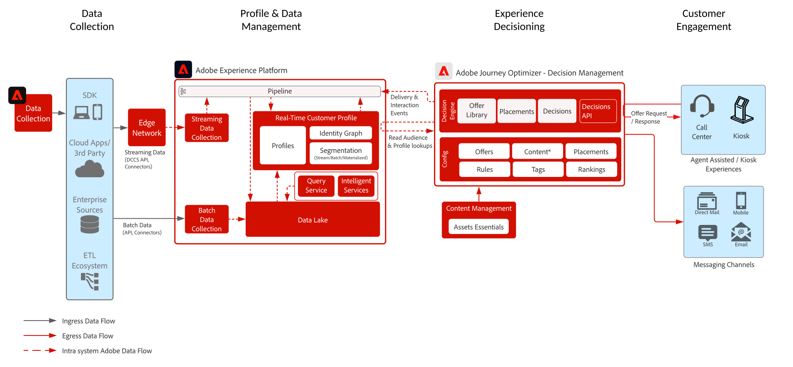

# Beslissingsbeheer op de Hub Blueprint

Om meer over het Beheer van het Besluit te leren verwijs naar de productdocumentatie  HIER en het Overzicht van het Beheer van het Besluit 

Adobe Decision Management is een dienst die wordt verleend als onderdeel van Adobe Journey Optimizer. Deze blauwdruk schetst de gebruiksgevallen en de technische mogelijkheden van de toepassing en verstrekt een diepe duik in de diverse architecturale componenten en overwegingen die omhoog het Beheer van de Beslissing maken.

Journey Optimizer wordt gebruikt om uw klanten de beste aanbieding en ervaring op alle aanraakpunten op het juiste moment te bieden. Beslissingsbeheer maakt personalisatie gemakkelijk met een centrale bibliotheek van marketing aanbiedingen en een besluitvormingsmotor die regels en beperkingen op rijke, real-time profielen toepast die door Adobe Experience Platform worden gecreeerd om u te helpen uw klanten het juiste aanbod op het juiste ogenblik verzenden.

Beslissingsbeheer kan op twee manieren worden ingezet. De eerste is via de Adobe Experience Platform hub, een centrale datacenterarchitectuur. In de &quot;hub&quot;-benadering worden aanbiedingen uitgevoerd, gepersonaliseerd en geleverd met een latentie van > 500 ms. Aldus is de hubarchitectuur het best geschikt voor klantenervaringen die geen sub-tweede latentie vereisen, omvatten de voorbeelden aanbiedingsbesluiten die voor kiosken of agent bijgewoonde ervaringen zoals in callcenters of in persoonlijke interactie worden verstrekt. Aanbiedingen die in e-mail en uitgaande campagnes worden opgenomen worden ook aangedreven door de hubbenadering.

De tweede aanpak is via de Experience [!DNL [!DNL Edge Network]], een wereldwijd gedistribueerde infrastructuur met geografische locatie voor snelle ervaringen van minder dan twee en milliseconden. De eindgebruikerservaring die wordt uitgevoerd door de randinfrastructuur die het dichtst bij de geo-locatie van de consument ligt om de latentie te minimaliseren. Het beheer van beslissingen op de Edge is ontworpen om in real-time ervaringen van consumenten te dienen, zoals online of mobiele binnenkomende verzoeken om personalisatie.

Deze blauwdruk zal betrekking hebben op de specifieke kenmerken van het beheer van besluiten op de hub.

Meer over het Beheer van het Besluit op Edge leren verwijs naar het [ Beheer van het Besluit op de rand ](decision-management-edge.md) blauwdruk.

## Gebruik van gevallen voor beslissingsbeheer op de hub

* Streaming gebruikt gevallen waarbij de latentie van de profielcontext niet strikt is - 15 minuten of hoger dan latentie.
* Speciale aanbiedingen voor kiosken en winkelervaringen.
* Persoonlijke aanbiedingen via de hulp van een agent, zoals callcenters of verkoopinteracties.
* Aanbiedingen die zijn opgenomen in e-mail, SMS, mobiele pushberichten of andere uitgaande interacties.
* Aanbiedingen aan externe ESP- en berichtsystemen aanbieden voor levering.
* Transactieuitvoering via verschillende kanalen - biedt consistentie via internet, mobiele apparaten, e-mail en andere interactiekanalen via Adobe Journey Optimizer.

>[!IMPORTANT]
>
>Voor aanbiedingen en reisgebruiksgevallen die toegang tot het profiel vereisen voor aanvullende informatie en context. Het is belangrijk om de bijbehorende latentie te overwegen van het opnemen van gegevens aan profiel op de hub om het op beslissingstijd beschikbaar te verzekeren. Voor scenario&#39;s waarin context wordt gestreamd of in profiel wordt opgenomen en het aanbod of de reis moet die context binnen seconden of minuten na het besluit over het aanbod beschikbaar hebben, kunnen deze scenario&#39;s het best worden bediend met Beslissingsbeheer op de Edge.

## Architectuur

## Beveiligingsmechanismen

* Voor de guardrails van Journey Optimizer verwijzen naar de volgende [ Guardrails van Journey Optimizer ](https://experienceleague.adobe.com/docs/journey-optimizer/using/get-started/limitations.html).
* Voor de gidsen van het Beheer van het Besluit verwijzen naar de volgende [ Beschrijving van het Product van het Beheer van het Besluit ](https://helpx.adobe.com/legal/product-descriptions/offer-decisioning-app-service.html).

[Hulplijnen en advies voor end-to-end latentie](/help/blueprints/experience-platform/guardrails.md)

## Implementatiepatronen

* Geïmplementeerd in e-mail, SMS, en uitgaande kanalen via directe integratie met [ Adobe Journey Optimizer ](https://experienceleague.adobe.com/docs/journey-optimizer/using/offer-decisioniong/get-started-decision/offers-e2e.html).
* Voor server API gebaseerde implementatie van de hefboomwerking van het Beheer van het Besluit [ Beslissing API ](https://experienceleague.adobe.com/docs/journey-optimizer/using/offer-decisioniong/api-reference/offer-delivery/decisioning-vs-edge-apis.html).
* Voor implementatie van partij gebaseerd besluit om aanbiedingen in bulk aan een toepassing van de berichtlevering te leveren gebruik [ de Beslissing API van de Partij ](https://experienceleague.adobe.com/docs/journey-optimizer/using/offer-decisioniong/api-reference/offer-delivery/batch-decisioning-api.html).
* Voor op Edge gebaseerde real-time ervaringen gebruiken het Web/Mobile SDK of de Edge Decisioning API zoals die in het [ Beheer van het Besluit op de blauwdruk van Edge ](decision-management-edge.md) worden geschetst

## Gerelateerde documentatie

* [ Adobe Experience Platform ](https://experienceleague.adobe.com/docs/experience-platform.html)
* [ Adobe Journey Optimizer ](https://experienceleague.adobe.com/docs/journey-optimizer.html)
* [ Adobe Journey Optimizer Beslissingsbeheer ](https://experienceleague.adobe.com/docs/journey-optimizer/using/offer-decisioniong/get-started-decision/starting-offer-decisioning.html)
* [ de Beschrijving van het Product van Adobe Journey Optimizer ](https://helpx.adobe.com/legal/product-descriptions/adobe-journey-optimizer.html)
* [ de Beschrijving van het Product van het Beheer van het Besluit van Adobe ](https://helpx.adobe.com/legal/product-descriptions/offer-decisioning-app-service.html)
