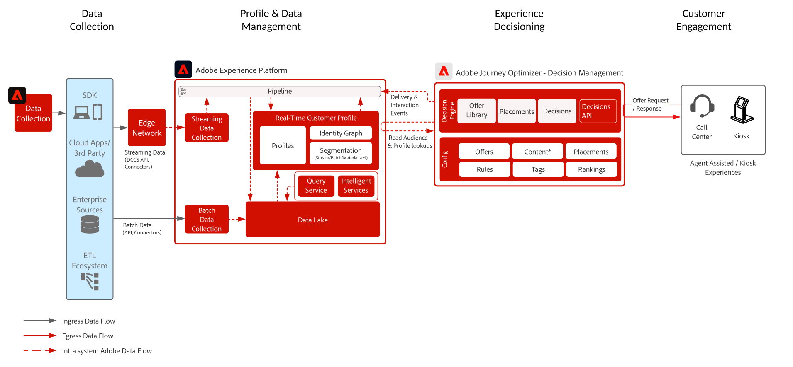

# Journey Optimizer - Beslissingsbeheer op de hub

Raadpleeg de productdocumentatie voor meer informatie over Beslissingsbeheer [HIER](https://experienceleague.adobe.com/docs/journey-optimizer/using/offer-decisioniong/get-started-decision/starting-offer-decisioning.html) en het overzicht van het besluitvormingsbeheer [HIER](https://experienceleague.adobe.com/docs/blueprints-learn/architecture/customer-journeys/journey-optimizer/decision-management/decision-management-overview.html?lang=en)

Adobe Beslissingsbeheer is een dienst die wordt verleend als onderdeel van Adobe Journey Optimizer. Deze blauwdruk schetst de gebruiksgevallen en de technische mogelijkheden van de toepassing en verstrekt een diepe duik in de diverse architecturale componenten en overwegingen die omhoog het Beheer van de Beslissing maken.

Journey Optimizer wordt gebruikt om uw klanten de beste aanbieding en ervaring op alle aanraakpunten op het juiste moment te bieden. Beslissingsbeheer maakt personalisatie gemakkelijk met een centrale bibliotheek van marketing aanbiedingen en een besluitvormingsmotor die regels en beperkingen op rijke, real-time profielen toepast die door Adobe Experience Platform worden gecreeerd om u te helpen uw klanten het juiste aanbod op het juiste ogenblik verzenden.

Beslissingsbeheer kan op twee manieren worden ingezet. De eerste is via de Adobe Experience Platform hub, een centrale datacenterarchitectuur. In de &quot;hub&quot;-benadering worden aanbiedingen uitgevoerd, gepersonaliseerd en geleverd met een latentie van > 500 ms. Aldus is de hubarchitectuur het best geschikt voor klantenervaringen die geen sub-tweede latentie vereisen, omvatten de voorbeelden aanbiedingsbesluiten die voor kiosken of agent bijgewoonde ervaringen zoals in callcenters of in persoonlijke interactie worden verstrekt. Aanbiedingen die in e-mail en uitgaande campagnes worden opgenomen worden ook aangedreven door de hubbenadering.

De tweede benadering is via het Edge Network van de Ervaring, dat een wereldwijd gedistribueerde, geografisch gesitueerde infrastructuur is om snelle sub-seconde en milliseconde ervaringen te dienen. De eindgebruikerservaring die wordt uitgevoerd door de randinfrastructuur die het dichtst bij de geo-locatie van de consument ligt om de latentie te minimaliseren. Beslissingsbeheer op de rand is ontworpen om in real-time ervaringen met de consument te bieden, zoals online of mobiele binnenkomende verzoeken om personalisatie.

Deze blauwdruk zal betrekking hebben op de specifieke kenmerken van het beheer van besluiten op de hub.

Raadpleeg voor meer informatie over Beslissingsbeheer op Edge [Beslissingsbeheer aan de rand](https://experienceleague.adobe.com/docs/blueprints-learn/architecture/customer-journeys/journey-optimizer/decision-management/decision-management-edge.html?lang=en) blauwdruk.

## Gebruik van gevallen voor beslissingsbeheer op de hub

* Speciale aanbiedingen voor kiosken en winkelervaringen.
* Persoonlijke aanbiedingen via de hulp van een agent, zoals callcenters of verkoopinteracties.
* Aanbiedingen die zijn opgenomen in e-mail, SMS, mobiele pushberichten of andere uitgaande interacties.
* Aanbiedingen aan externe ESP- en berichtsystemen aanbieden voor levering.
* Transactieuitvoering via verschillende kanalen - biedt consistentie via internet, mobiele apparaten, e-mail en andere interactiekanalen via Adobe Journey Optimizer.

 

## Architectuur

 

## Vereisten

Adobe Experience Platform

* De schema&#39;s en de datasets moeten in het systeem worden gevormd alvorens u de gegevensbronnen van Journey Optimizer kunt vormen
* Voor op klasse-gebaseerde schema&#39;s van de Gebeurtenis van de Ervaring voegen &quot;Orchestration eventID gebiedsgroep toe wanneer u een gebeurtenis teweeggebracht wilt hebben die geen op regel-gebaseerde gebeurtenis is
* Voeg voor op individuele profielklassen gebaseerde schema&#39;s de veldgroep &#39;Profielgegevens&#39; toe, zodat testprofielen kunnen worden geladen voor gebruik met Journey Optimizer

 

## Guardrails

* Raadpleeg het volgende voor Journey Optimizer-instructies [Journey Optimizer Guardrails](https://experienceleague.adobe.com/docs/journey-optimizer/using/get-started/limitations.html).
* Raadpleeg de volgende bronnen voor instructies voor het beheer van beslissingen: [Productbeschrijving van Beslissingsbeheer](https://helpx.adobe.com/legal/product-descriptions/offer-decisioning-app-service.html).
* Verzoeken per seconde = 2000.
* Latentie van respons &lt; 500 ms.
* Toegang tot volledig real-time klantprofiel met inbegrip van publiekslidmaatschappen, attributen en ervaringsgebeurtenissen.

### Gegevensinname Guardraals

 

### Activeringsinstructies

 

## Implementatiepatronen

* Geïmplementeerd in e-mail, SMS, en uitgaande kanalen via directe integratie met [Adobe Journey Optimizer](https://experienceleague.adobe.com/docs/journey-optimizer/using/offer-decisioniong/get-started-decision/offers-e2e.html).
* Voor server-API-gebaseerde implementatie van Besluit Management gebruikt u de [API voor besluitvorming](https://experienceleague.adobe.com/docs/journey-optimizer/using/offer-decisioniong/api-reference/offer-delivery/decisioning-vs-edge-apis.html).
* Voor implementatie van batchgewijs besluit om aanbiedingen in bulk aan een toepassing van de berichtlevering te leveren gebruik [Batchbeslissing-API](https://experienceleague.adobe.com/docs/journey-optimizer/using/offer-decisioniong/api-reference/offer-delivery/batch-decisioning-api.html).
* Voor op rand gebaseerde real-time ervaringen gebruikt u de Web/Mobile SDK of de Edge Decisioning API zoals beschreven in de [Beslissingsbeheer voor de Edge-blauwdruk](https://experienceleague.adobe.com/docs/blueprints-learn/architecture/customer-journeys/journey-optimizer/decision-management/decision-management-edge.html?lang=en).
 

## Implementatiestappen

### Adobe Experience Platform

#### Schema/gegevensset

1. [Afzonderlijke profiel-, ervarings- en multientiteitsschema&#39;s configureren](https://experienceleague.adobe.com/?recommended=ExperiencePlatform-D-1-2021.1.xdm) in Experience Platform, op basis van door de klant verstrekte gegevens.
1. [Gegevenssets maken](https://experienceleague.adobe.com/docs/platform-learn/tutorials/data-ingestion/create-datasets-and-ingest-data.html) in Experience Platform voor gegevens die moeten worden ingevoerd.
1. [Labels voor gegevensgebruik toevoegen](https://experienceleague.adobe.com/docs/platform-learn/tutorials/data-governance/classify-data-using-governance-labels.html) in Experience Platform met de dataset voor bestuur.
1. [Beleid maken](https://experienceleague.adobe.com/docs/platform-learn/tutorials/data-governance/create-data-usage-policies.html) de handhaving van het bestuur op bestemmingen.

#### Profiel/identiteit

1. [Maak klantspecifieke naamruimten](https://experienceleague.adobe.com/docs/platform-learn/tutorials/identities/label-ingest-and-verify-identity-data.html).
1. [Identiteiten toevoegen aan schema&#39;s](https://experienceleague.adobe.com/docs/platform-learn/tutorials/identities/label-ingest-and-verify-identity-data.html).
1. [De schema&#39;s en datasets voor Profiel inschakelen](https://experienceleague.adobe.com/docs/platform-learn/tutorials/profiles/bring-data-into-the-real-time-customer-profile.html).
1. [Samenvoegbeleid instellen](https://experienceleague.adobe.com/docs/platform-learn/tutorials/profiles/create-merge-policies.html) voor verschillende weergaven van [!UICONTROL Klantprofiel in realtime] (optioneel).
1. Maak segmenten voor gebruik in Reis.

#### Bronnen/bestemmingen

1. [Gegevens in Experience Platform opnemen](https://experienceleague.adobe.com/?recommended=ExperiencePlatform-D-1-2020.1.dataingestion) via streaming API&#39;s en bronconnectors.

## Verwante documentatie

* [Adobe Experience Platform](https://experienceleague.adobe.com/docs/experience-platform.html)
* [Adobe Journey Optimizer](https://experienceleague.adobe.com/docs/journey-optimizer.html)
* [Adobe Journey Optimizer-beslissingsbeheer](https://experienceleague.adobe.com/docs/journey-optimizer/using/offer-decisioniong/get-started-decision/starting-offer-decisioning.html)
* [Adobe Journey Optimizer-productbeschrijving](https://helpx.adobe.com/legal/product-descriptions/adobe-journey-optimizer.html)
* [Adobe Beslissingsbeheer Productbeschrijving](https://helpx.adobe.com/legal/product-descriptions/offer-decisioning-app-service.html)
