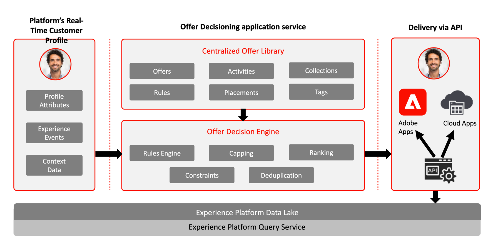

# Journey Optimizer - blauwdrukken voor besluitvormingsbeheer

Meer over het Beheer van het Besluit verwijs naar de [ productdocumentatie ](https://experienceleague.adobe.com/docs/journey-optimizer/using/offer-decisioniong/get-started-decision/starting-offer-decisioning.html)

Raadpleeg de volgende documentatie voor handleidingen met betrekking tot Beslissingsbeheer. [ Gidsen van het Beheer van het Besluit ](https://experienceleague.adobe.com/en/docs/journey-optimizer/using/get-started/guardrails#decision-management)

Beslissingsbeheer van de Adobe is een dienst die wordt verleend als onderdeel van Adobe Journey Optimizer. Deze blauwdruk schetst de gebruiksgevallen en de technische mogelijkheden van de toepassing en verstrekt een diepe duik in de diverse architecturale componenten en overwegingen die omhoog het Beheer van de Beslissing maken.

Journey Optimizer wordt gebruikt om uw klanten de beste aanbieding en ervaring op alle aanraakpunten op het juiste moment te bieden. Beslissingsbeheer maakt personalisatie gemakkelijk met een centrale bibliotheek van marketing aanbiedingen en een besluitvormingsmotor die regels en beperkingen op rijke, real-time profielen toepast die door Adobe Experience Platform worden gecreeerd om u te helpen uw klanten het juiste aanbod op het juiste ogenblik verzenden.

De beslissingsmanagementcapaciteit bestaat uit twee hoofdcomponenten:

* De gecentraliseerde Bibliotheek van de Aanbieding die de interface is waar u creeert en de verschillende elementen beheert die uw aanbiedingen samenstellen, en hun regels en beperkingen bepalen.
* De Offertebeslissingsengine die gebruikmaakt van Adobe Experience Platform-gegevens en realtime klantprofielen, samen met de Offertebibliotheek, om de juiste tijd, klanten en kanalen te selecteren waaraan aanbiedingen worden geleverd.

Beslissingsbeheer kan op twee manieren worden ingezet, op de rand of via de hub. Elk van deze methodes heeft een specifieke reeks interfaces en protocollen voor het werken van de dienst zoals geschetst in de respectieve hieronder vermelde blauwdrukken. De extra details kunnen ook in de [ documentatie van het Beheer van het Besluit ](https://experienceleague.adobe.com/docs/journey-optimizer/using/offer-decisioniong/api-reference/offer-delivery-api/decisioning-vs-edge-apis.html) worden verkregen.

## Beslissingsbeheer op de hub

De eerste is via de Adobe Experience Platform hub, een centrale datacenterarchitectuur. In de &quot;hub&quot;-benadering worden aanbiedingen uitgevoerd, gepersonaliseerd en geleverd met een latentie van > 500 ms. Aldus is de hubarchitectuur het best geschikt voor klantenervaringen die geen sub-tweede latentie vereisen, omvatten de voorbeelden aanbiedingsbesluiten die voor kiosken of agent bijgewoonde ervaringen zoals in callcenters of in persoonlijke interactie worden verstrekt. Aanbiedingen die in e-mail, de berichten van SMS, of dupberichten en andere uitgaande campagnes worden opgenomen worden ook aangedreven door de hubbenadering. Meer over het Beheer van het Besluit op de hub leren verwijs naar het [ Beheer van het Besluit over de hub ](https://experienceleague.adobe.com/docs/blueprints-learn/architecture/customer-journeys/journey-optimizer/decision-management/decision-management-hub.html?lang=en) blauwdruk.

* Aanbiedingsgeschiktheid kan werken volgens het volledige real-time klantprofiel, inclusief alle kenmerken en ervaringsgebeurtenissen

### Gebruik van gevallen voor beslissingsbeheer op de hub

* Speciale aanbiedingen voor kiosken en winkelervaringen.
* Persoonlijke aanbiedingen via de hulp van een agent, zoals callcenters of verkoopinteracties.
* Aanbiedingen inbegrepen in e-mail, SMS, of andere uitgaande interactie.
* Transactieuitvoering via verschillende kanalen - biedt consistentie via internet, mobiele apparaten, e-mail en andere interactiekanalen via Adobe Journey Optimizer.

### Beslissingsbeheer met betrekking tot de technische aspecten van de hub

* Toegang tot volledig real-time klantprofiel met inbegrip van publiekslidmaatschappen, attributen en ervaringsgebeurtenissen.

## Beslissingsbeheer aan de rand

De tweede aanpak is via de Experience [!DNL Edge Network] , een wereldwijd gedistribueerde, geografisch gesitueerde infrastructuur die snelle sub-seconde- en millisecondeervaringen kan bieden. De eindgebruikerservaring die wordt uitgevoerd door de randinfrastructuur die het dichtst bij de geo-locatie van de consument ligt om de latentie te minimaliseren. Het beheer van beslissingen op de Edge is ontworpen om in real-time ervaringen van consumenten te dienen, zoals online of mobiele binnenkomende verzoeken om personalisatie. Meer over het Beheer van het Besluit op Edge leren verwijs naar het [ Beheer van het Besluit op de rand ](https://experienceleague.adobe.com/docs/blueprints-learn/architecture/customer-journeys/journey-optimizer/decision-management/decision-management-edge.html?lang=en) blauwdruk.

### Gebruik gevallen voor Beslissingsbeheer aan de rand

* Online personalisatie via internet of mobiele binnenkomende ervaringen.
* Transactieuitvoering via verschillende kanalen - biedt consistentie via internet, mobiele apparaten, e-mail en andere interactiekanalen via Adobe Journey Optimizer.

### Beslissingsbeheer op basis van geavanceerde technische overwegingen

* Toegang tot real-time randprofiel. In het profiel zijn alleen geprojecteerde soorten publiek en profielkenmerken beschikbaar.

## Gerelateerde documentatie

* [ Adobe Experience Platform ](https://experienceleague.adobe.com/docs/experience-platform.html)
* [ Adobe Journey Optimizer ](https://experienceleague.adobe.com/docs/journey-optimizer.html)
* [ Adobe Journey Optimizer Beslissingsbeheer ](https://experienceleague.adobe.com/docs/journey-optimizer/using/offer-decisioniong/get-started-decision/starting-offer-decisioning.html)
* [ de Beschrijving van het Product van Adobe Journey Optimizer ](https://helpx.adobe.com/legal/product-descriptions/adobe-journey-optimizer.html)
* [ Beschrijving van het Product van het Beheer van het Besluit van de Adobe ](https://helpx.adobe.com/legal/product-descriptions/offer-decisioning-app-service.html)
