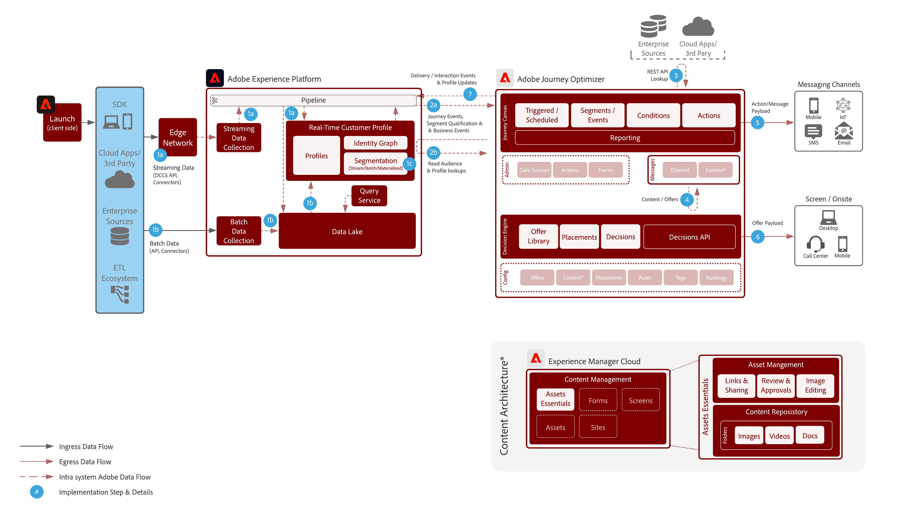

# Journey Optimizer

Adobe Journey Optimizer is een speciaal gebouwd systeem voor marketingteams om in real-time te reageren op gedragingen van klanten en hen te ontmoeten waar ze zich bevinden. De mogelijkheden voor gegevensbeheer zijn verplaatst naar de Adobe Experience Platform, zodat marketingteams zich kunnen richten op wat ze het beste doen: die klanten van wereldklasse en gepersonaliseerde gesprekken creeert.  Deze blauwdruk beschrijft de technische mogelijkheden van de toepassing en verstrekt een diepe duik in de diverse architecturale componenten die omhoog Adobe Journey Optimizer maken.

## Gevallen gebruiken

* Gekoppelde berichten
* Registratie-bevestigingen
* Verlaten winkelwagentjes en aanvraagformulieren
* Locatie getriggerde berichten

## Architectuur

## Integratiepatronen

* Adobe Experience Platform -> Journey Optimizer

## Vereisten

1. De klant moet voor Experience Cloud een geldige IMS-organisatie opgeven
1. Mobiele push

* De klant moet over een mobiele ontwikkelaar beschikken om de app te maken
* Adobe Experience Platform Mobile SDK
* Adobe starten
   * Mobiele eigenschap
      * Extensies:
         * Adobe Journey Optimizer-extensie
         * Adobe Experience Platform Edge Network
         * Identiteit
         * Mobiele kern
         * Profiel
   * App Configurations
   * DataStreams
      * Ingeschakeld voor Experience Platform
      * Gegevensset gebeurtenis - wordt gebruikt voor het verzamelen van algemeen mobiel gedrag
      * Gegevensset profiel - Dataset AJO-pushprofiel (kan niet anders zijn)

## Guardrails

* Zie de koppeling voor meer informatie over beperkingen
* Batchsegmenten - zorg dat u het dagelijkse volume van gekwalificeerde gebruikers begrijpt en ervoor zorgt dat het doelsysteem de burst-doorvoer per reis en over alle reizen kan verwerken
* Streamingsegmenten - moeten ervoor zorgen dat de eerste uitbarsting van profielkwalificaties kan worden afgehandeld samen met het dagelijks streaming kwalificatievolume per reis en over alle reizen
* De updateactiviteit van het profiel - het Real-Time Profiel van de Klant kan van binnen een reis worden bijgewerkt.  De verwerking van de update naar de profielopslag duurt maximaal 1 minuten
* Bedrijfs gebeurtenissen - een read segment gebaseerde reis kan worden teweeggebracht om te beginnen gebaseerd op een externe vraag in het JO systeem
* Native ondersteunt alleen Offer decisioning in berichten. Toekomstige ondersteuning via native actie
* Ondersteunde kanalen:
   * E-mail
   * Push (FCM/APNS)
   * API-eindpunten rust
* Verwerkt 5.000 gebeurtenissen per seconde met horizontale schaling (de achtergrond is beperkt)
* A/B-tests worden uitgevoerd met behulp van twee leveringen en de resultaten worden bepaald met behulp van QS of CJA
* Litmus-integratie: moet een account bij Litmus hebben om integratie te kunnen stimuleren

## Implementatiestappen

### Adobe Experience Platform

#### Schema/gegevensset

1. [Vorm individueel profiel, ervaringsgebeurtenis, en multi-entiteitsschema&#39;](https://experienceleague.adobe.com/docs/platform-learn/tutorials/schemas/create-a-schema.html) s in Experience Platform, die op klant-geleverde gegevens wordt gebaseerd.
1. Maak Adobe Campaign-schema&#39;s voor wideLog, trackingLog, niet-te leveren adressen en profielvoorkeuren (optioneel).
1. [Creeer ](https://experienceleague.adobe.com/docs/platform-learn/tutorials/data-ingestion/create-datasets-and-ingest-data.html) datasetsin Experience Platform voor gegevens die moeten worden opgenomen.
1. [Voeg ](https://experienceleague.adobe.com/docs/platform-learn/tutorials/data-governance/classify-data-using-governance-labels.html) labels voor gegevensgebruik in Experience Platform toe aan de dataset voor bestuur.
1. [Creeer ](https://experienceleague.adobe.com/docs/platform-learn/tutorials/data-governance/create-data-usage-policies.html) beleid dat bestuur op bestemmingen afdwingt.

#### Profiel/identiteit

1. [Maak klantspecifieke naamruimten](https://experienceleague.adobe.com/docs/platform-learn/tutorials/identities/label-ingest-and-verify-identity-data.html).
1. [Identiteiten toevoegen aan schema&#39;s](https://experienceleague.adobe.com/docs/platform-learn/tutorials/identities/label-ingest-and-verify-identity-data.html).
1. [Laat de schema&#39;s en datasets voor Profiel](https://experienceleague.adobe.com/docs/platform-learn/tutorials/profiles/bring-data-into-the-real-time-customer-profile.html) toe.
1. [Stel samenvoegbeleid ](https://experienceleague.adobe.com/docs/platform-learn/tutorials/profiles/create-merge-policies.html) in voor verschillende weergaven van  [!UICONTROL realtime klantprofiel]  (optioneel).
1. Maak segmenten voor campagnegebruik.

#### Bronnen/bestemmingen

1. [Gegevens opnemen in Experience ](https://experienceleague.adobe.com/?recommended=ExperiencePlatform-D-1-2020.1.dataingestion) Platform met streaming API&#39;s en bronconnectors.1. Vorm  [!DNL Azure] blob opslagbestemming voor gebruik met Adobe Campaign.

#### Implementatie van mobiele apps

1. Adobe Campaign SDK voor Adobe Campaign Classic of Experience Platform SDK voor Adobe Campaign Standard implementeren. Als er Experience Platform Launch aanwezig is, wordt aanbevolen Adobe Campaign Classic of Adobe Campaign Standard uit te breiden met Experience Platform SDK.

### Journey Orchestration

1. Streaming gegevens die worden gebruikt om een reis van een klant te initiëren, moeten eerst binnen Journey Optimizer worden geconfigureerd om een organisatie-id te verkrijgen. Deze orkest-id wordt vervolgens aan de ontwikkelaar geleverd om met inname te gebruiken.
1. Externe gegevensbronnen configureren.
1. Aangepaste handelingen configureren.

## Verwante documentatie

* [Adobe Experience Platform-documentatie](https://experienceleague.adobe.com/docs/experience-platform.html?lang=en)
* [Journey Optimizer-documentatie](https://experienceleague.adobe.com/docs/journey-orchestration.html?lang=en)
* [Documentatie Experience Platform Launch](https://experienceleague.adobe.com/docs/launch.html?lang=en)
* [Experience Platform Mobile SDK-documentatie](https://experienceleague.adobe.com/docs/mobile.html?lang=en)
