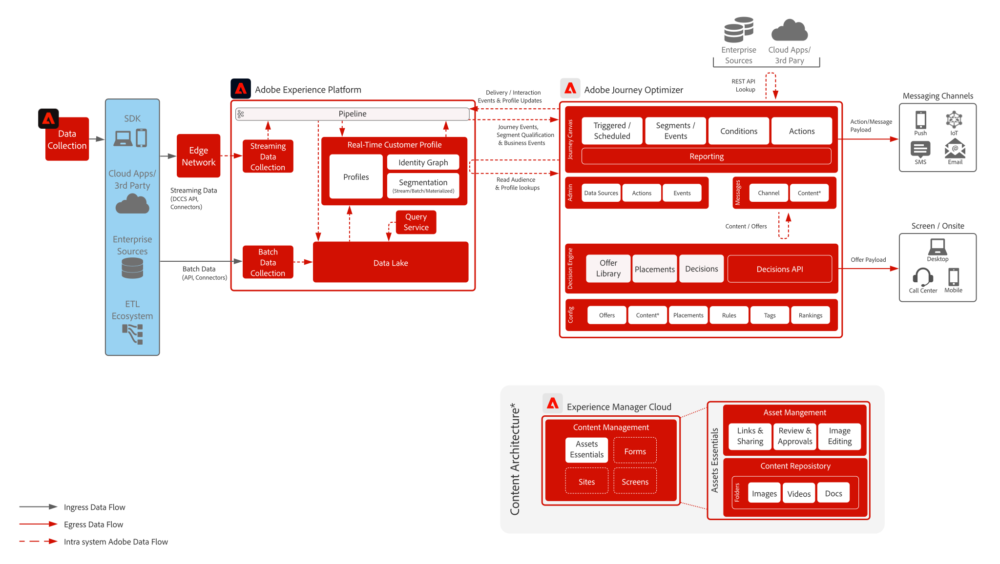

# Journey Optimizer-blauwdrukken

Adobe Journey Optimizer is een speciaal gebouwd systeem voor marketingteams om in real-time te reageren op gedragingen van klanten en hen te ontmoeten waar ze zich bevinden. De mogelijkheden voor gegevensbeheer zijn verplaatst naar de Adobe Experience Platform, zodat marketingteams zich kunnen richten op wat ze het beste doen: die klanten van wereldklasse en gepersonaliseerde gesprekken creeert.  Deze blauwdruk beschrijft de technische mogelijkheden van de toepassing en verstrekt een diepe duik in de diverse architecturale componenten die omhoog Adobe Journey Optimizer maken.

 

## Gebruik hoofdletters

* Gekoppelde berichten
* Bevestigingen van welkom en registratie
* Verlaten winkelwagentjes en aanvraagformulieren
* Locatie getriggerde berichten
* In-stadionervaringen
* Reis- en gastvrijheid vóór aankomst en verblijf

 

## Architectuur

 

## Vervagingsscenario&#39;s

| Scenario | Beschrijving | Mogelijkheden |
| :-- | :--- | :--- |
| [Berichten van derden](3rd-party-messaging.md) | Toont aan hoe Adobe Journey Optimizer met de systemen van het derdeoverseinen kan worden gebruikt om gepersonaliseerde mededelingen te organiseren en te verzenden | Lever 1:1 op het moment gepersonaliseerde mededelingen aan klanten aangezien zij met uw merk of bedrijf in wisselwerking staan  Overwegingen: <ul><li>Het systeem van de derde partij moet dragertokens voor authentificatie steunen</li><li>Geen steun voor statische IPs toe te schrijven aan multi-huurdersarchitectuur</li><li>Houd rekening met architecturale beperkingen op systemen van derden voor API-aanroepen per seconde.  Mogelijk moet de klant extra volume van de externe leverancier kopen om het volume van Journey Optimizer te ondersteunen</li><li>Biedt geen ondersteuning voor Beslissingsbeheer in berichten of ladingen</li></ul> |

 

## Integratiepatronen

| Integratie | Beschrijving | Mogelijkheden |
| :-- | :--- | :--- |
| [Journey Optimizer met Adobe Campaign](ajo-and-campaign.md) | Toont hoe u Adobe Journey Optimizer kunt gebruiken om 1:1 ervaringen te ordenen gebruikend het Real-Time Profiel van de Klant en hefboomwerking het inheemse systeem van het de transactionele overseinen van Adobe Campaign om het bericht te verzenden | Gebruik het Real-Time Klantprofiel en de macht van Journey Optimizer om in de huidige ervaringen te ordenen terwijl het gebruiken van de inheemse mogelijkheden van het Overseinen in real time van Adobe Campaign om de laatste mijl mededeling te doen  Overwegingen: <ul><li>Campagne-toepassing moet zijn ingeschakeld in versie 7 build >21.1 of v8</li><li>De productie van berichten</li><ul><li>Campagne v7 - tot 50 k per uur</li><li>Campagne v8 - maximaal 1 miljoen per uur</li><li>Campaign Standard - maximaal 50 k per uur</li></ul><li>Er wordt geen vertraging uitgevoerd, dus in geval van gebruik is een technische controle door een Enterprise Architect vereist</li><li>Geen steun voor het gebruiken van Beslissingsbeheer in bericht dat door Campagne wordt verzonden</li></ul> |

 

## Vereisten

Adobe Experience Platform

* De schema&#39;s en de datasets moeten in het systeem worden gevormd alvorens u de gegevensbronnen van Journey Optimizer kunt vormen
* Voor op klasse-gebaseerde schema&#39;s van de Gebeurtenis van de Ervaring voegen &quot;Orchestration eventID gebiedsgroep toe wanneer u een gebeurtenis teweeggebracht wilt hebben die geen op regel-gebaseerde gebeurtenis is
* Voeg voor op individuele profielklassen gebaseerde schema&#39;s de veldgroep &#39;Profielgegevens&#39; toe, zodat testprofielen kunnen worden geladen voor gebruik met Journey Optimizer

E-mail

* Moet subdomain klaar hebben om voor bericht het verzenden te worden gebruikt
* Subdomain kan volledig aan Adobe worden gedelegeerd (geadviseerd) of CNAMEs kan worden gebruikt om aan Adobe-specifieke DNS servers (douane) te richten
* Google TXT-record is nodig voor elk subdomein om goede prestaties te garanderen

Mobiele push

* De klant moet over een mobiele ontwikkelaar beschikken om de app te maken
* Adobe Experience Platform Mobile SDK

 

## Guardrails

[Journey Optimizer Guardrails Product Link](https://experienceleague.adobe.com/docs/journeys/using/starting-with-journeys/limitations.html?lang=en)

Houd rekening met de volgende punten die niet in de bovenstaande koppeling worden vermeld:

* Batchsegmenten - zorg dat u het dagelijkse volume van gekwalificeerde gebruikers begrijpt en ervoor zorgt dat het doelsysteem de burst-doorvoer per reis en over alle reizen kan verwerken
* Streamingsegmenten - moeten ervoor zorgen dat de eerste uitbarsting van profielkwalificaties kan worden afgehandeld samen met het dagelijks streaming kwalificatievolume per reis en over alle reizen
* Native ondersteunt alleen Beslissingsbeheer in berichten (geen aangepaste acties)
* Ondersteunde berichttypen:
   * E-mail
   * Push (FCM/APNS)
   * Aangepaste handelingen (via de rest-API)
* Uitgaande integratie in systemen van derden
   * Geen steun voor één enkele Statische IPs aangezien onze infrastructuur multi-huurder is (moet alle datacenter IPs lijsten van gewenste personen)
   * Alleen methoden voor POSTEN en PUTTEN worden ondersteund voor aangepaste handelingen
   * Verificatie via gebruikers-/goedkeurings-token
* Kan afzonderlijke componenten van Adobe Experience Platform of Journey Optimizer niet verpakken en verplaatsen tussen verschillende sandboxen. Moet opnieuw worden geïmplementeerd in nieuwe omgevingen

### Gegevensinvoerinstructies

 

### Activeringsinstructies

 

## Uitvoeringsstappen

### Adobe Experience Platform

#### Schema/datasets

1. [Afzonderlijke profiel-, ervarings- en multientiteitsschema&#39;s configureren](https://experienceleague.adobe.com/?recommended=ExperiencePlatform-D-1-2021.1.xdm) in Experience Platform, op basis van door de klant verstrekte gegevens.
1. [Gegevenssets maken](https://experienceleague.adobe.com/docs/platform-learn/tutorials/data-ingestion/create-datasets-and-ingest-data.html) in Experience Platform voor gegevens die moeten worden ingevoerd.
1. [Labels voor gegevensgebruik toevoegen](https://experienceleague.adobe.com/docs/platform-learn/tutorials/data-governance/classify-data-using-governance-labels.html) in Experience Platform met de dataset voor bestuur.
1. [Beleid maken](https://experienceleague.adobe.com/docs/platform-learn/tutorials/data-governance/create-data-usage-policies.html) de handhaving van het bestuur op bestemmingen.

#### Profiel/identiteit

1. [Maak klantspecifieke naamruimten](https://experienceleague.adobe.com/docs/platform-learn/tutorials/identities/label-ingest-and-verify-identity-data.html).
1. [Identiteiten toevoegen aan schema&#39;s](https://experienceleague.adobe.com/docs/platform-learn/tutorials/identities/label-ingest-and-verify-identity-data.html).
1. [De schema&#39;s en datasets voor Profiel inschakelen](https://experienceleague.adobe.com/docs/platform-learn/tutorials/profiles/bring-data-into-the-real-time-customer-profile.html).
1. [Samenvoegbeleid instellen](https://experienceleague.adobe.com/docs/platform-learn/tutorials/profiles/create-merge-policies.html) voor verschillende weergaven van [!UICONTROL Klantprofiel in realtime] (optioneel).
1. Maak segmenten voor gebruik in Reis.

#### Bronnen/bestemmingen

1. [Gegevens in Experience Platform opnemen](https://experienceleague.adobe.com/?recommended=ExperiencePlatform-D-1-2020.1.dataingestion) via streaming API&#39;s en bronconnectors.

### Journey Optimizer

1. Configureer de gegevensbron van uw Experience Platform en bepaal welke velden in de cache moeten worden geplaatst als onderdeel van de profileStreaming-gegevens die worden gebruikt om een klantentraject te starten, moeten eerst in Journey Optimizer worden geconfigureerd om een indeling-id te verkrijgen. Deze orchestratie-id wordt vervolgens aan de ontwikkelaar geleverd om met inname te gebruiken
1. Externe gegevensbronnen configureren.
1. Aangepaste handelingen configureren.

### Mobiele pushconfiguratie

1. Implementeer Experience Platform Mobile SDK om pushtokens en aanmeldingsgegevens te verzamelen en terug te koppelen naar bekende klantprofielen
1. Gebruik Adobe-tags en maak een mobiele eigenschap met de volgende extensie:
1. Adobe Journey Optimizer
1. Adobe Experience Platform Edge Network
1. Identiteit voor Edge Network
1. Mobiele kern
1. Zorg ervoor dat u beschikt over een specifieke gegevensstroom voor implementatie van mobiele apps versus webimplementaties
1. Voor meer informatie volgt u de [Adobe Journey Optimizer Mobile-gids](https://aep-sdks.gitbook.io/docs/using-mobile-extensions/adobe-journey-optimizer)

## Gerelateerde documentatie

* [Documentatie Experience Platform](https://experienceleague.adobe.com/docs/experience-platform.html?lang=en)
* [Documentatie over Experience Platform-tags](https://experienceleague.adobe.com/docs/experience-platform/tags/home.html?lang=en)
* [Experience Platform Mobile SDK-documentatie](https://experienceleague.adobe.com/docs/mobile.html?lang=en)
* [Journey Optimizer-documentatie](https://experienceleague.adobe.com/docs/journey-optimizer/using/ajo-home.html?lang=en)
* [Journey Optimizer-productbeschrijving](https://helpx.adobe.com/legal/product-descriptions/adobe-journey-optimizer.html)
