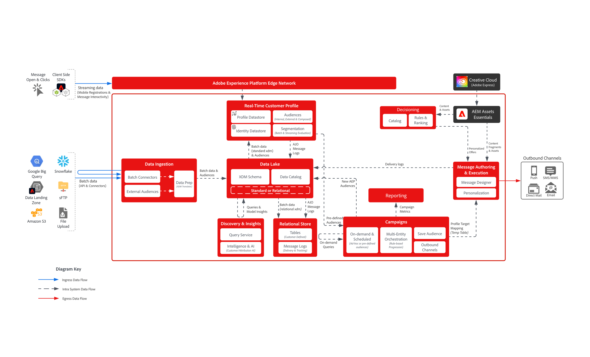

# [!DNL Journey Optimizer] - Bewegingsafbeelding voor campagneorkest

Met AJO Campaign Orchestration kunnen marketers geplande, op het publiek gebaseerde, multi-step communicatie ontwerpen en uitvoeren via uitgaande kanalen, zoals e-mail, SMS, push en direct mail. In tegenstelling tot de Reizen van AJO, die op individueel klantengedrag gebruikend gegevens in real time van het Profiel van de Klant in real time reageren, zijn de campagnes gecoördineerde marketing inspanningen die op geplande intervallen richten. Samen bieden campagnes en reizen complementaire benaderingen: campagnes stimuleren de strategieën voor merkbetrokkenheid, terwijl reizen persoonlijke, responsieve ervaringen opleveren.

 

## Architectuur

 

### Berichtuitvoerarchitectuur

 

### Relationele opslag - latentie voor gegevensinname

 

## Architectuuroverwegingen voor reizen

- **Architectuur van Gegevens**: De Orchestratie van de Campagne van AJO gebruikt een relationele gegevensbestand onder voor publieksopbouw en orchestratie
- **Poortintegratie van het publiek**: Innodig geïntegreerd met het Portaal van het Publiek binnen het Real-Time Profiel van de Klant om van bestaand publiek te lezen en nieuw publiek te bewaren aan wanneer het bouwen van campagnes
- **Aanmaak van het publiek op bestelling**: bouw, evalueer en voer onmiddellijk een publiek voor urgente marketing gebruiksgevallen uit
- **Real-Time de Integratie van het Profiel van de Klant:** bron van waarheid voor instemming en communicatie geschiedenis; steunt het ontwerp van het &quot;het profiel van de kinniek&quot;voor verpersoonlijking
- **Van meerdere entiteitenBericht die:** capaciteit verzenden om veelvoudige berichten per profiel in één enkele levering (b.v. verzendt één bericht per reserve naar het klanten e-mailadres) te verzenden
- **Meerentiteitssegmentatie**: begin bouwend een publiek van om het even welke entiteit binnen de relationele opslag (d.w.z. product, inventaris, plan, enz.)

 

## Beveiligingsmechanismen

[&#x200B; Orchestrated Campaigns Product Link &#x200B;](https://experienceleague.adobe.com/nl/docs/journey-optimizer/using/campaigns/orchestrated-campaigns/guardrails)

[&#x200B; Guardrails en de Begeleiding van de Latentie van Eind tot Eind &#x200B;](https://experienceleague.adobe.com/docs/blueprints-learn/architecture/architecture-overview/deployment/guardrails)

 

## Gerelateerde documentatie

- [[!DNL Journey Optimizer]  Geordende Campagnes &#x200B;](https://experienceleague.adobe.com/en/docs/journey-optimizer/using/campaigns/orchestrated-campaigns/orchestrated-campaigns-landing-page.html)
- [[!DNL Experience Platform]  documentatie &#x200B;](https://experienceleague.adobe.com/docs/experience-platform.html?lang=nl-NL)
- [[!DNL Experience Platform]  documentatie van Markeringen &#x200B;](https://experienceleague.adobe.com/docs/experience-platform/tags/home.html?lang=nl)
- [[!DNL Experience Platform Mobile SDK]  documentatie &#x200B;](https://experienceleague.adobe.com/docs/mobile.html?lang=nl-NL)
- [[!DNL Journey Optimizer]  documentatie &#x200B;](https://experienceleague.adobe.com/docs/journey-optimizer/using/ajo-home.html?lang=nl-NL)
- [[!DNL Journey Optimizer]  productbeschrijving &#x200B;](https://helpx.adobe.com/nl/legal/product-descriptions/adobe-journey-optimizer.html)