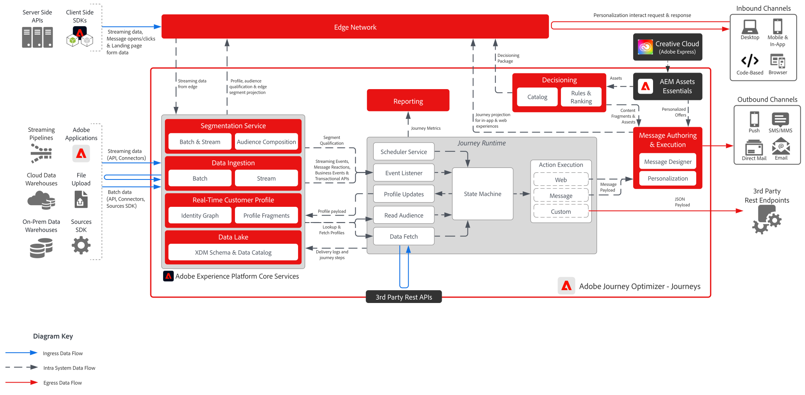

# [!DNL Journey Optimizer] - Transparantie vervagen

Adobe Journey Optimizer-reizen zijn real-time, gebeurtenisgestuurde workflows die persoonlijke, multi-step ervaringen bieden op basis van individueel klantgedrag. Zij steunen een brede waaier van kanalen-met inbegrip van e-mail, SMS, dupberichten, in-app overseinen, code-gebaseerde ervaringen en douane op API-Gebaseerde integraties die merken toestaan om klanten contextafhankelijk over hun aangewezen aanraakpunten in dienst te nemen.

 

## Architectuur

 

## Architectuuroverwegingen voor reizen

- **het Weg zijn van het Profiel**: De Reizen van AJO vertrouwen op updates in real time aan het klantenprofiel. Zorg ervoor dat gegevensbronnen die in Adobe Experience Platform (AEP) worden ingevoerd, zijn geconfigureerd voor opname met lage latentie om de nauwkeurigheid van het profiel te behouden.
- **Scalable de Verwerking van de Gebeurtenis:** zorg ervoor dat de infrastructuur hoge volumes van reistrekkers en berichtlevering kan behandelen.
- **Modulaire Integratie:** Ontwerp APIs en douaneacties om AJO met externe systemen voor dynamische verpersoonlijking te verbinden.
- **Resolutie van de Identiteit**: Het nauwkeurige stitching van klantenidentiteiten over apparaten en kanalen is kritiek. Verkeerde identiteiten kunnen leiden tot gebroken of verkeerd geleide reizen.
- **de Tijdopnemer van de Kwalificatie van het Segment**: Op publiek-gebaseerde reizen hangen van segmentlidmaatschap af. Begrijp hoe vaak de segmenten worden geëvalueerd en hoe die timing het reisingang en verpersoonlijking beïnvloedt.
- **Voorwaarden van de Ingang van de Reis**: De profielen moeten aan specifieke voorwaarden voldoen om een reis in te gaan. Deze voorwaarden moeten zorgvuldig worden ontworpen om onbedoelde uitsluitingen of overlappingen te voorkomen.
- **de Evaluatie &amp; Latentie van het publiek**: Lees de stappen van het Publiek hangen van segmentevaluaties binnen Adobe Experience Platform af, die niet in real time kunnen voorkomen. Architect reizen met bewustzijn van evaluatiefrequentie en latentie om vertragingen in de kwalificatie van het publiek te voorkomen en te zorgen voor tijdige personalisatie.

 

## Beveiligingsmechanismen

[[!DNL Journey Optimizer] Product Link Guardrails](https://experienceleague.adobe.com/en/docs/journey-optimizer/using/get-started/guardrails.html)

[Hulplijnen en advies voor end-to-end latentie](https://experienceleague.adobe.com/docs/blueprints-learn/architecture/architecture-overview/deployment/guardrails.html?lang=nl-NL)

 

## Gerelateerde documentatie

- [[!DNL Experience Platform] documentatie](https://experienceleague.adobe.com/docs/experience-platform.html?lang=nl-NL)
- [[!DNL Experience Platform] Documentatie over tags](https://experienceleague.adobe.com/docs/experience-platform/tags/home.html?lang=nl-NL)
- [[!DNL Experience Platform Mobile SDK] documentatie](https://experienceleague.adobe.com/docs/mobile.html?lang=nl-NL)
- [[!DNL Journey Optimizer] documentatie](https://experienceleague.adobe.com/docs/journey-optimizer/using/ajo-home.html?lang=nl-NL)
- [[!DNL Journey Optimizer] productbeschrijving](https://helpx.adobe.com/nl/legal/product-descriptions/adobe-journey-optimizer.html)
