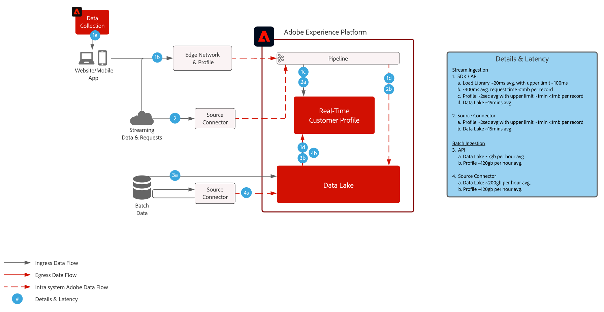

# Journey Optimizer - Offer decisioning aan de rand

Raadpleeg de productdocumentatie voor meer informatie over Beslissingsbeheer [HIER](https://experienceleague.adobe.com/docs/journey-optimizer/using/offer-decisioniong/get-started-decision/starting-offer-decisioning.html) en het overzicht van de Offer decisioning [HIER](https://experienceleague.adobe.com/docs/blueprints-learn/architecture/customer-journeys/journey-optimizer/offer-decisioning/offers-overview.html)

Adobe Beslissingsbeheer is een dienst die wordt verleend als onderdeel van Adobe Journey Optimizer. Deze blauwdruk schetst de gebruiksgevallen en de technische mogelijkheden van de toepassing en verstrekt een diepe duik in de diverse architecturale componenten en overwegingen die omhoog Offer decisioning maken.

Beslissingsbeheer kan op twee manieren worden ingezet. De eerste is via de Hub van Adobe Experience Platform, die één enkele architectuur van het gegevenscentrum is. In de &quot;hub&quot;benadering worden de aanbiedingen uitgevoerd, gepersonaliseerd, en geleverd in tweede latentie. Aldus is de hubarchitectuur het best geschikt voor klantenervaring die geen sub-tweede latentie vereist, omvatten de voorbeelden aanbiedingsbesluiten die voor kiosken of agent bijgewoonde ervaringen zoals in callcenters of in persoonlijke interactie worden verstrekt.

De tweede benadering is via het Edge Network van de Ervaring, dat een wereldwijd gedistribueerde, geografisch gesitueerde infrastructuur is om snelle sub-seconde en milliseconde ervaringen te dienen. De eindgebruikerservaring die wordt uitgevoerd door de randinfrastructuur die het dichtst bij de geo-locatie van de consument ligt om de latentie te minimaliseren. Beslissingsbeheer op de rand is ontworpen om in real-time de ervaringen van de consument te dienen. Deze omvatten ervaringen zoals Web of mobiele binnenkomende verpersoonlijkingsverzoeken.

Deze blauwdruk zal de specifieke details van Beslissingsbeheer op de Rand omvatten.

Meer informatie over het Beheer van het Besluit op de hub verwijst naar [Beslissingsbeheer op de hub](https://experienceleague.adobe.com/docs/blueprints-learn/architecture/customer-journeys/journey-optimizer/offer-decisioning/offers-hub.html) blauwdruk.

## Gevallen gebruiken voor Beslissingsbeheer aan de rand

* Online personalisatie via internet of mobiele binnenkomende ervaringen.
* Transactieuitvoering via verschillende kanalen - biedt consistentie via internet, mobiele apparaten, e-mail en andere interactiekanalen via Adobe Journey Optimizer.

 

## Architectuur

 

## Integratiepatronen

| Integratie | Beschrijving |
| :-- | :--- |
| [offer decisioning met Adobe Target](https://experienceleague.adobe.com/docs/target/using/integrate/ajo/offer-decision.html) | offer decisioning kan worden geïntegreerd met Adobe Target zodat de aanbiedingen kunnen worden getest en geleverd als ervaringen met het doel. |

## Vereisten

Adobe Experience Platform

* De schema&#39;s en de datasets moeten in het systeem worden gevormd alvorens u de gegevensbronnen van Journey Optimizer kunt vormen
* Voor op klasse-gebaseerde schema&#39;s van de Gebeurtenis van de Ervaring voegen &quot;Orchestration eventID gebiedsgroep toe wanneer u een gebeurtenis teweeggebracht wilt hebben die geen op regel-gebaseerde gebeurtenis is
* Voeg voor op individuele profielklassen gebaseerde schema&#39;s de veldgroep &#39;Profielgegevens&#39; toe, zodat testprofielen kunnen worden geladen voor gebruik met Journey Optimizer

 

## Guardrails

* Raadpleeg het volgende voor Journey Optimizer-instructies [Journey Optimizer Guardrails](https://experienceleague.adobe.com/docs/journey-optimizer/using/get-started/limitations.html).
* Raadpleeg de volgende bronnen voor Offer decisioning [Productbeschrijving offer decisioning](https://helpx.adobe.com/legal/product-descriptions/offer-decisioning-app-service.html).

### Gegevensinname Guardraals

 

### Activeringsinstructies

 

## Implementatiepatronen

* Gebruik het Web of Mobiele SDK voor plaatsing op websites en mobiele toepassingen om Offer decisioning uit te voeren waar SDK opstelde.
   * [Web/Mobile SDK-blauwdruk](https://experienceleague.adobe.com/docs/blueprints-learn/architecture/data-ingestion/websdk.html)
   * [WebSDK](https://experienceleague.adobe.com/docs/experience-platform/edge/personalization/offer-decisioning/offer-decisioning-overview.html)
   * [MobileSDK](https://aep-sdks.gitbook.io/docs/)

of

* Voor een API-server naar een servergebaseerde implementatie gebruikt u de Edge Network Service API voor directe server-naar-server-implementatie van Offer decisioning.
   * [Edge Network Server-API](https://experienceleague.adobe.com/docs/journey-optimizer/using/offer-decisioniong/api-reference/offer-delivery/deliver-offers.html)

 

## Implementatiestappen

### Adobe Experience Platform

#### Schema/gegevensset

1. [Afzonderlijke profiel-, ervarings- en multientiteitsschema&#39;s configureren](https://experienceleague.adobe.com/?recommended=ExperiencePlatform-D-1-2021.1.xdm) in Experience Platform, op basis van door de klant verstrekte gegevens.
1. [Gegevenssets maken](https://experienceleague.adobe.com/docs/platform-learn/tutorials/data-ingestion/create-datasets-and-ingest-data.html) in Experience Platform voor gegevens die moeten worden ingevoerd.
1. [Labels voor gegevensgebruik toevoegen](https://experienceleague.adobe.com/docs/platform-learn/tutorials/data-governance/classify-data-using-governance-labels.html) in Experience Platform met de dataset voor bestuur.
1. [Beleid maken](https://experienceleague.adobe.com/docs/platform-learn/tutorials/data-governance/create-data-usage-policies.html) de handhaving van het bestuur op bestemmingen.

#### Profiel/identiteit

1. [Maak klantspecifieke naamruimten](https://experienceleague.adobe.com/docs/platform-learn/tutorials/identities/label-ingest-and-verify-identity-data.html).
1. [Identiteiten toevoegen aan schema&#39;s](https://experienceleague.adobe.com/docs/platform-learn/tutorials/identities/label-ingest-and-verify-identity-data.html).
1. [De schema&#39;s en datasets voor Profiel inschakelen](https://experienceleague.adobe.com/docs/platform-learn/tutorials/profiles/bring-data-into-the-real-time-customer-profile.html).
1. [Samenvoegbeleid instellen](https://experienceleague.adobe.com/docs/platform-learn/tutorials/profiles/create-merge-policies.html) voor verschillende weergaven van [!UICONTROL Klantprofiel in realtime] (optioneel).
1. Maak segmenten voor gebruik in Reis.

#### Bronnen/bestemmingen

1. [Gegevens in Experience Platform opnemen](https://experienceleague.adobe.com/?recommended=ExperiencePlatform-D-1-2020.1.dataingestion) via streaming API&#39;s en bronconnectors.

## Verwante documentatie

* [Adobe Experience Platform](https://experienceleague.adobe.com/docs/experience-platform.html)
* [Adobe Journey Optimizer](https://experienceleague.adobe.com/docs/journey-optimizer.html)
* [Adobe Journey Optimizer-beslissingsbeheer](https://experienceleague.adobe.com/docs/journey-optimizer/using/offer-decisioniong/get-started-decision/starting-offer-decisioning.html)
* [Adobe Journey Optimizer-productbeschrijving](https://helpx.adobe.com/legal/product-descriptions/adobe-journey-optimizer.html)
* [Productbeschrijving Adobe Offer decisioning](https://helpx.adobe.com/legal/product-descriptions/offer-decisioning-app-service.html)
