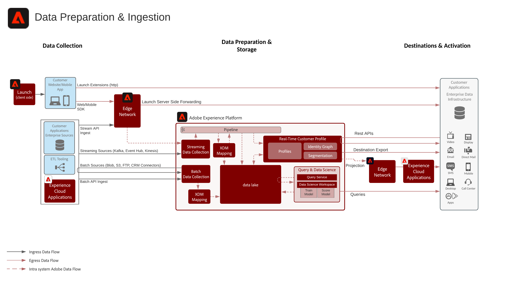

# Voorbereiding van gegevens en vervagingsblauwdruk

Gegevensvoorbereiding en congestieblauwdruk omvatten alle methoden waarmee gegevens in Adobe Experience Platform kunnen worden voorbereid en opgenomen.

De voorbereiding van gegevens omvat de afbeelding van brongegevens aan het schema van het Model van de Gegevens van de Ervaring (XDM). Het omvat ook het uitvoeren van transformaties op gegevens, waaronder datumopmaak, veldsplitsen/samenvoegen/conversies en het samenvoegen/samenvoegen/opnieuw koppelen van records. De voorbereiding van gegevens helpt klantengegevens verenigen om bijeengevoegde/gefilterde analyse te verstrekken, met inbegrip van het melden van of het voorbereiden van gegevens voor de assemblage van het klantenprofiel/gegevenswetenschap/activering.

## Architectuur

## Methoden voor gegevensinname

| Methoden van inname | Beschrijving |
|------------------------------|-----------------------------------------------------------------------------------------------------------------------------------------------------------------------------------------------------------------------------------------------------------------------------------------------------------------------------------------------------------------------------------------------------------------------------------------|
| Web/Mobile SDK | Latentie:<ul><li>In real time - de zelfde paginainzameling aan het Netwerk van de Rand</li><li>Streaming opname naar profiel ~1 minuut</li><li>Streaming opname naar data Lake (microbatch ~15 minuten)</ul>Documentatie: <ul><li>[Web SDK](https://experienceleague.adobe.com/docs/web-sdk.html)</li><li>[Mobile SDK](https://experienceleague.adobe.com/docs/mobile.html?lang=en)</li></ul> |
| Streaming bronnen | Latentie:<ul><li>In real time - de zelfde paginainzameling aan het Netwerk van de Rand</li><li>Streaming opname naar profiel ~1 minuut</li><li>Streaming opname naar data Lake (microbatch ~15 minuten)</li></ul>[Documentatie](https://experienceleague.adobe.com/docs/experience-platform/sources/home.html?lang=en#connectors) |
| Streaming-API | Latentie:<ul><li>In real time - de zelfde paginainzameling aan het Netwerk van de Rand</li><li>Streaming opname naar profiel ~1 minuut</li><li>Streaming opname naar data Lake (microbatch ~15 minuten)</li><li>7 GB/uur</li></ul>[Documentatie](https://experienceleague.adobe.com/docs/experience-platform/ingestion/streaming/overview.html?lang=en#what-can-you-do-with-streaming-ingestion%3F) |
| ETL Tooling | Gebruik de hulpmiddelen van ETL om ondernemingsgegevens te wijzigen en om te zetten alvorens in Experience Platform in te gaan.  Latentie:<ul><li>De timing is afhankelijk van de externe planning van ETL-gereedschappen, en de standaardinstructies voor inname zijn van toepassing op basis van de gebruikte methode voor inname.</li></ul> |
| Batchbronnen | Gepland ophalen van bronnen Latentie: ~ 200 GB/uur  [Documentatie](https://experienceleague.adobe.com/docs/experience-platform/sources/home.html?lang=en#connectors) [Video-Tutorials](https://experienceleague.adobe.com/docs/platform-learn/tutorials/sources/overview.html) |
| Batch-API | Latentie:<ul><li>Batchopname in profiel afhankelijk van grootte en verkeersbelasting ~45 minuten</li><li>Batchopname in het datumpigment afhankelijk van grootte en verkeersbelasting</li></ul>[Documentatie](https://experienceleague.adobe.com/docs/experience-platform/ingestion/batch/overview.html?lang=en#batch) |
| Adobe Application Connectors | Automatisch gegevens opnemen die afkomstig zijn van Adobe Experience Cloud-toepassingen<ul><li>Adobe Analytics: [Documentatie](https://experienceleague.adobe.com/docs/experience-platform/sources/connectors/adobe-applications/analytics.html?lang=en#connectors) en [Videozelfstudie](https://experienceleague.adobe.com/docs/platform-learn/tutorials/sources/ingest-data-from-adobe-analytics.html)</li><li>Audience Manager: [Documentatie](https://experienceleague.adobe.com/docs/experience-platform/sources/connectors/adobe-applications/audience-manager.html?lang=en#connectors) en [Videozelfstudie](https://experienceleague.adobe.com/docs/platform-learn/tutorials/sources/ingest-data-from-aam.html)</li></ul> |

## Methoden voor het voorbereiden van gegevens

| Methoden voor het voorbereiden van gegevens | Beschrijving |
|------------------------------------------------------------|------------------------------------------------------------------------------------------------------------------------------------------------------------------------------------------------------------------------------------------------------------------------------------------------|
| [!UICONTROL Data Science Workspace]  - Data Prep | Transformatie met behulp van model, transformatie met scripts. [Documentatie](https://experienceleague.adobe.com/docs/experience-platform/data-science-workspace/home.html?lang=en) |
| Extern ETL-gereedschap ([!DNL Snaplogic], [!DNL Mulesoft], [!DNL Informatica] enzovoort) | Complexe transformaties uitvoeren in ETL-gereedschappen en standaard Experience Platform [!UICONTROL Flow Service] API&#39;s of bronconnectors gebruiken om de resulterende gegevens in te voeren. |
| [!UICONTROL Query-service]  - Data Prep | Verbindt, Splits, de gegevens van de Fusie, van de Transformatie, van de Vraag, en van de Filter in een nieuwe dataset. Tabel maken als selectie gebruiken (CTAS)  [Documentatie](https://experienceleague.adobe.com/docs/experience-platform/query/home.html?lang=en#sql) |
| XDM Mapper- en Data Prep-functies (streaming en batch) | Wijs bronkenmerken in CSV- of JSON-indeling toe aan XDM-kenmerken tijdens het opnemen van Experience Platforms. rekenfuncties op gegevens terwijl deze worden ingevoerd; dat wil zeggen, gegevens opmaken, splitsen, samenvoegen, enzovoort. [Documentatie](https://experienceleague.adobe.com/docs/experience-platform/data-prep/home.html?lang=en) |

## Verwante blogberichten

* [[!DNL Leveraging External Data Platforms in Adobe Experience Platform Journey Orchestration]](https://medium.com/adobetech/leveraging-external-data-platforms-in-adobe-experience-platform-journey-orchestration-54fc6134fe17?source=your_stories_page-------------------------------------)
* [[!DNL High Throughput Ingestion with Iceberg]](https://medium.com/adobetech/high-throughput-ingestion-with-iceberg-ccf7877a413f?source=your_stories_page-------------------------------------)
* [[!DNL Query Service Tricks in Adobe Experience Platform (Writing Queries and Storing Derived Datasets)]](https://medium.com/adobetech/query-service-tricks-in-adobe-experience-platform-writing-queries-and-storing-derived-datasets-eaee0d6d683e?source=your_stories_page-------------------------------------)
* [[!DNL Digging into Adobe Experience Platform’s Experience Data Model to More Fully Understand the Power of Real-time Customer Profile]](https://medium.com/adobetech/digging-into-adobe-experience-platforms-experience-data-model-to-more-fully-understand-the-power-3e109271e04f?source=your_stories_page-------------------------------------)
* [[!DNL An Introductory Look at Exploratory Data Analysis on Adobe Experience Platform]](https://medium.com/adobetech/an-introductory-look-at-exploratory-data-analysis-on-adobe-experience-platform-1bfce7501d9a?source=your_stories_page-------------------------------------)
* [[!DNL Modeling XDM Data for Data Science at Scale on Adobe Experience Platform]](https://medium.com/adobetech/modeling-xdm-data-for-data-science-at-scale-on-adobe-experience-platform-222bb2a6dbf7?source=your_stories_page-------------------------------------)
