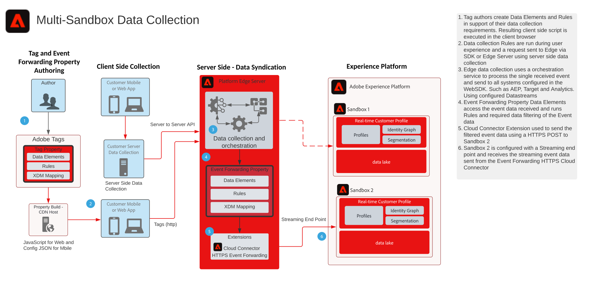

# Blauwdruk van gegevensverzameling via multi-sandbox-gebeurtenisverzendingen

De blauwdruk van de inzameling van Gegevens toont de gebeurtenis-door:sturen van meerdere sandbox hoe gegevens die met Adobe worden verzameld [!DNL Experience Platform] Web en Mobiele SDKs kan worden gevormd om één enkele gebeurtenis te verzamelen en aan veelvoudige door:sturen [!DNL Experience Platform] (AEP) sandboxen. Deze blauwdruk is een specifiek gebruiksgeval dat de eigenschap Door:sturen van de Gebeurtenis van de Markeringen van de Adobe gebruikt.

Naast het repliceren van de gebeurtenis, gebruikend de Gebeurtenis het Door:sturen eigenschappen, kunt u de originele verzamelde gegevens toevoegen aan, filtreren of manipuleren die aan vereisten voor andere zandbakken voldoen. Sandbox A moet bijvoorbeeld alle gebeurtenisgegevenselementen ontvangen en Sandbox B mag alleen niet-PII-gegevens ontvangen.

Gebeurtenis doorsturen gebruikt een afzonderlijke eigenschap Tag die de gegevenselementen, -regels en -extensies bevat die nodig zijn voor uw gegevensvereisten. Met een inkomende Gebeurtenis, kan uw Gebeurtenis Door:sturen Bezit de gegevens verzamelen en beheren zoals nodig alvorens door:sturen.

Voor uw doelsandbox is een HTTP-streamingeindpunt vereist dat wordt gebruikt door de extensie HTTPS voor verzenden van gebeurtenissen.

## Gebruik hoofdletters

* Globale gegevensrapportage - Bij het gebruik van meerdere sandboxen om besturingsomgevingen te isoleren en de noodzaak om gegevensverzameling te consolideren naar één sandbox voor rapportage tussen sandboxen. Gebeurtenis doorsturen naar een rapportsandbox stelt elke sandbox-besturingssysteem in staat gegevens te verzenden zoals deze in real-time worden verzameld naar een rapportsandbox
* De gegevensverzameling in verschillende sandboxen beheren op basis van verschillende gegevensregels voor elke sandbox-besturingsomgeving. Dergelijke werkende milieu&#39;s die het filtreren van gevoelige gegevens zoals Gezondheidszorg en Financiële Diensten vereisen

## Toepassingen

* Adobe [!DNL Experience Platform] Gegevensverzameling

## Architectuur

1. Auteurs van tags definiëren zowel een eigenschap tag als een eigenschap voor het doorsturen van gebeurtenissen. Hier, bepalen de auteurs de gegevenselementen, de regels en de acties die gegevensinzameling beheren. Houd in mening, loopt de code van het markeringsbezit op de cliënt en door een Gastheer CDN wordt verdeeld. De [!UICONTROL Gebeurtenis doorsturen, eigenschap] code wordt uitgevoerd op de Adobe [!DNL Edge Server].

1. Gegevens die op de client zijn verzameld, worden naar de [!DNL Edge Network]. De klanten hebben ook de optie om gegevens naar hun eigen server eerst als methode van de inzameling van de serverzijde te verzenden. SDK van het Web kan een server-aan-server inzamelingsvermogen verstrekken. Hiervoor is echter wel een ander programmeringsmodel nodig. Raadpleeg de documentatie **[!DNL Edge Network]API-overzicht van server** onder

1. Platform [!DNL Edge Network] ontvangt gegevensverzamelingsladingen en ordent de stroom van gegevens aan de vereiste systemen zoals Doel en Analytics.

1. Gebeurtenis die bezitsgegevenselementen door:sturen wordt gebruikt om tot gebeurtenisgegevens toegang te hebben die in de lading aankomen. De regels kunnen ook worden gebruikt om de gegevens van de Gebeurtenis te manipuleren zoals nodig voorafgaand aan het door:sturen. Bijvoorbeeld het formatteren van de gegevens in vereiste XDM voor het stromen gegevensopname

1. Het door:sturen van gebeurtenissen verstrekt de uitbreiding HTTPS die de capaciteit verstrekt om uw gebeurtenisgegevens aan een eindpunt door te sturen HTTPS.

1. Sandbox 2 wordt gevormd met een het stromen eindpunt dat de door:sturen gebeurtenis ontvangt.

## Gerelateerde documentatie

* [Documentatie voor doorsturen van gebeurtenissen](https://experienceleague.adobe.com/docs/experience-platform/tags/event-forwarding/overview.html)
* [Video&#39;s over het doorsturen van gebeurtenissen](https://experienceleague.adobe.com/docs/launch-learn/tutorials/server-side/overview.html)
* [Gebeurtenis doorsturen, les](https://experienceleague.adobe.com/docs/platform-learn/implement-web-sdk/event-forwarding/setup-event-forwarding.html) van de webSDK-zelfstudie
* [[!DNL Experience Platform] Overzicht SDK web](https://experienceleague.adobe.com/docs/experience-platform/edge/home.html)
* [[!DNL Edge Network] API-overzicht van server](https://experienceleague.adobe.com/docs/experience-platform/edge-network-server-api/overview.html)

## Gerelateerde blogberichten

* [Websiteprestaties verhogen met Adobe [!DNL Experience Platform] Web SDK en [!DNL Edge Network]](https://medium.com/adobetech/boosting-website-performance-with-adobe-experience-platform-web-sdk-and-edge-network-329fcf70fdf9)
* [Implementatiepunten oplossen met Adobe [!DNL Experience Platform] Web SDK en [!DNL Edge Network]](https://medium.com/adobetech/solving-implementation-pain-points-with-adobe-experience-platform-web-sdk-and-edge-network-880b635e6819)
* [Adobe [!DNL Experience Platform] Web SDK voor Audience Management](https://medium.com/adobetech/adobe-experience-platform-web-sdk-for-audience-management-751fa6d063bc)
* [Adobe [!DNL Experience Platform] Web SDK - Adobe Target](https://medium.com/adobetech/adobe-experience-platform-web-sdk-adobe-target-9b9f621d271)
* [Adobe [!DNL Experience Platform] Web SDK-migratiescenario&#39;s voor Adobe Analytics](https://medium.com/adobetech/adobe-experience-platform-web-sdk-migration-scenarios-for-adobe-analytics-91c255ec82b0)
* [Uw Adobe verenigen [!DNL Experience Platform] Diensten met Adobe [!DNL Experience Platform] Web SDK](https://medium.com/adobetech/unify-your-adobe-experience-platform-services-with-adobe-experience-platform-web-sdk-75cf6851a9fc)
* [De ontwikkeling van mobiele toepassingen versnellen met Adobe [!DNL Experience Platform] Mobile SDK en Launch](https://medium.com/adobetech/accelerate-your-mobile-application-development-with-adobe-experience-platform-mobile-sdk-and-launch-ed023536d611)
* [Workflows van klanten vereenvoudigen met Adobe Experience Platform Web SDK](https://medium.com/adobetech/simplifying-customer-workflows-with-adobe-experience-platform-web-sdk-4e54fe134f4a)
