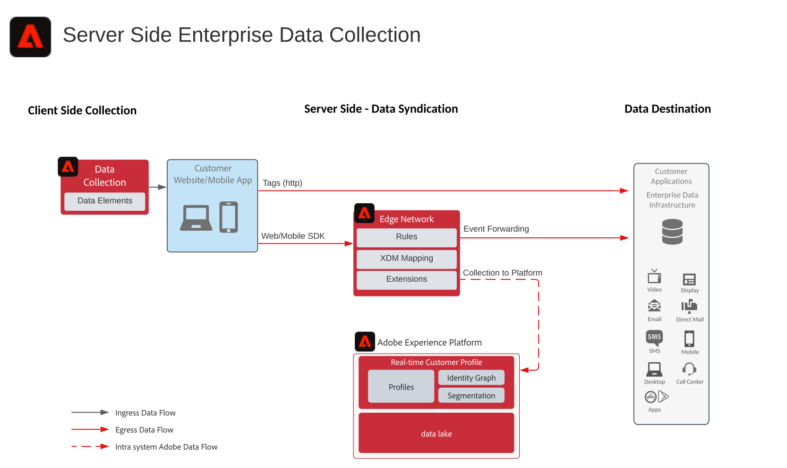

# Blauwdruk voor doorzending van gebeurtenissen

De gebeurtenis die blauwdruk door:sturen toont hoe de gegevens met Adobe worden verzameld [!DNL Experience Platform] Web en Mobiele SDKs kan van door:sturen [!DNL Experience Platform] [!DNL Edge Network] naar een gewenst doel. U kunt alle onbewerkte gegevens die zijn verzameld van de SDK&#39;s doorsturen, of specifieke gegevens die zijn gebaseerd op gebeurtenissen en regels die zijn geconfigureerd in de eigenschappen van tags (voorheen Starten).

## Gebruik hoofdletters

* Verzamel gegevens van het web of mobiele apparaten met behulp van één verzamelingstag, zodat de code lichter wordt in clientbrowsers en apps. Verspreid de verzamelde gegevens aan diverse eindpunten voor één enkele bron van gegevensinzameling.
* Door:sturen verzamelde gegevens aan partnertoepassingen of de opslagplaatsen van gegevens voor de bouw van inzichten en toepassingen tegen de verzamelde gegevens.

## Toepassingen

* Adobe [!DNL Experience Platform] Gegevensverzameling

## Architectuur

## Gerelateerde documentatie

* [Documentatie voor doorsturen van gebeurtenissen](https://experienceleague.adobe.com/docs/experience-platform/tags/event-forwarding/overview.html)
* [Video&#39;s over het doorsturen van gebeurtenissen](https://experienceleague.adobe.com/docs/launch-learn/tutorials/server-side/overview.html)
* [Gebeurtenis doorsturen, les](https://experienceleague.adobe.com/docs/platform-learn/implement-web-sdk/event-forwarding/setup-event-forwarding.html) van de webSDK-zelfstudie

## Gerelateerde blogberichten

* [Websiteprestaties verhogen met Adobe [!DNL Experience Platform] Web SDK en [!DNL Edge Network]](https://medium.com/adobetech/boosting-website-performance-with-adobe-experience-platform-web-sdk-and-edge-network-329fcf70fdf9)
* [Implementatiepunten oplossen met Adobe [!DNL Experience Platform] Web SDK en [!DNL Edge Network]](https://medium.com/adobetech/solving-implementation-pain-points-with-adobe-experience-platform-web-sdk-and-edge-network-880b635e6819)
* [Adobe [!DNL Experience Platform] Web SDK voor Audience Management](https://medium.com/adobetech/adobe-experience-platform-web-sdk-for-audience-management-751fa6d063bc)
* [Adobe [!DNL Experience Platform] Web SDK - Adobe Target](https://medium.com/adobetech/adobe-experience-platform-web-sdk-adobe-target-9b9f621d271)
* [Adobe [!DNL Experience Platform] Web SDK-migratiescenario&#39;s voor Adobe Analytics](https://medium.com/adobetech/adobe-experience-platform-web-sdk-migration-scenarios-for-adobe-analytics-91c255ec82b0)
* [Uw Adobe verenigen [!DNL Experience Platform] Diensten met Adobe [!DNL Experience Platform] Web SDK](https://medium.com/adobetech/unify-your-adobe-experience-platform-services-with-adobe-experience-platform-web-sdk-75cf6851a9fc)
* [De ontwikkeling van mobiele toepassingen versnellen met Adobe [!DNL Experience Platform] Mobile SDK en Launch](https://medium.com/adobetech/accelerate-your-mobile-application-development-with-adobe-experience-platform-mobile-sdk-and-launch-ed023536d611)
* [Workflows van klanten vereenvoudigen met Adobe [!DNL Experience Platform] Web SDK](https://medium.com/adobetech/simplifying-customer-workflows-with-adobe-experience-platform-web-sdk-4e54fe134f4a)
