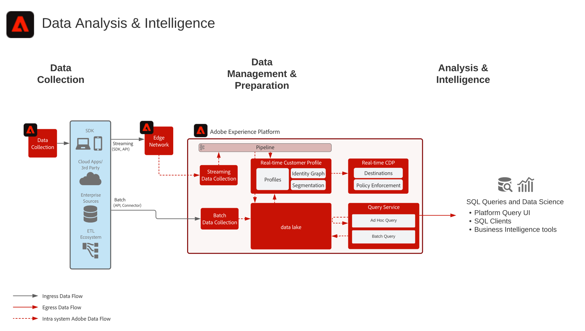

# Gegevensanalyse en inlichtingenblauwdruk

Gegevensanalyse en -intelligentie bestaat uit de mogelijkheid binnen [!DNL Experience Platform] om verkennende query&#39;s en analyses uit te voeren van de gegevens die in het datumpeer aanwezig zijn.

[!DNL Experience Platform] de Dienst van de Vraag van 0&rbrace; [!UICONTROL &#x200B; staat SQL vragen toe om op de gegevens worden uitgevoerd.]

Met [!DNL Experience Platform] kunt u via het [!DNL Experience Platform] -protocol verbindingen tot stand brengen met SQL-clients, -interfaces en Business Intelligence-programma&#39;s (BI). U kunt hiermee rechtstreeks verbinding maken met en toegang krijgen tot de gegevens en er query&#39;s op uitvoeren binnen [!DNL PostgreSQL] .

## Gebruiksscenario&#39;s

* Interactieve query en aggregatie van gegevens
* De rij en kolomtoegang tot ingebedde gegevens voor exploratie en bevestiging
* Dashboarding en visualisatie van gegevens via Business Intelligence-tools

De extra gemeenschappelijke gebruiksgevallen voor de vraagdienst worden geschetst hier [ Gevallen van het Gebruik van de Dienst van de Vraag ](https://experienceleague.adobe.com/docs/experience-platform/query/use-cases/abandoned-browse.html)

## Applicaties

* Adobe [!DNL Experience Platform]

## Architectuur

## Beveiligingsmechanismen

Raadpleeg de documentatie bij het product Query Service voor meer informatie over beste praktijken en instructies.
[ Begeleiding van de Dienst van de Vraag ](https://experienceleague.adobe.com/docs/experience-platform/query/guardrails.html)

## Gerelateerde documentatie

* [ Adobe  [!DNL Experience Platform]  het productbeschrijving van de Intelligentie ](https://helpx.adobe.com/legal/product-descriptions/adobe-experience-platform-intelligence---product-description.html)
* [[!UICONTROL &#x200B; documentatie &#x200B;] van de Dienst van de 1&rbrace; Vraag](https://experienceleague.adobe.com/docs/experience-platform/query/home.html?lang=en)
