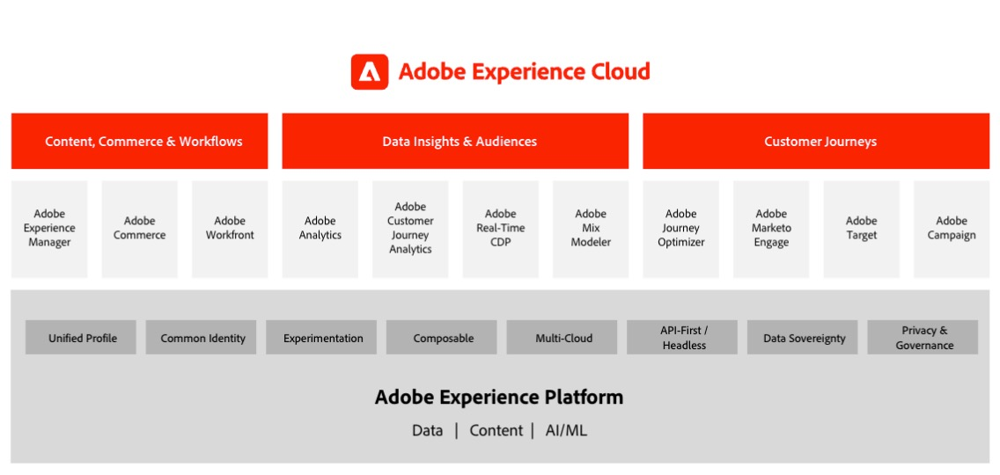
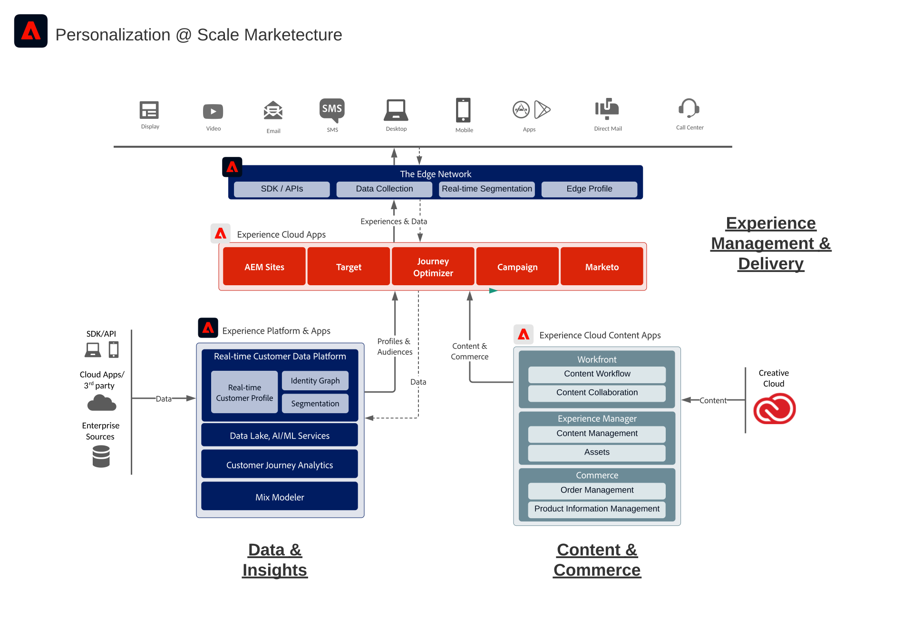

# Adobe Experience Cloud-architectuurdiagrammen

## Adobe Experience Cloud Marketecture

In het volgende diagram worden de verschillende componenten van Adobe Experience Cloud geïllustreerd voor wat betreft gegevensinzicht en publiek, content en handel, reizen van klanten, marketingworkflow, gebouwd en geïntegreerd op de basis van de Adobe Experience Platform.

 

## Integratiearchitectuur van gegevens en inzichten, content en handel, en Experience Delivery

In het onderstaande architectuurdiagram ziet u hoe de verschillende componenten van de Adobe Experience Cloud op elkaar aansluiten en integreren om personalisatie op schaal mogelijk te maken voor gegevens, inhoud en beleving.

 

## Adobe Experience Cloud in het landschap van de onderneming

In het onderstaande architectuurdiagram wordt geïllustreerd hoe Adobe Experience Cloud-toepassingen en Adobe Experience Platform passen in de architectuur van een zakelijke klant voor de vier categorieën gegevens, inzichten, Orchestratie en Betrokkenheid.

