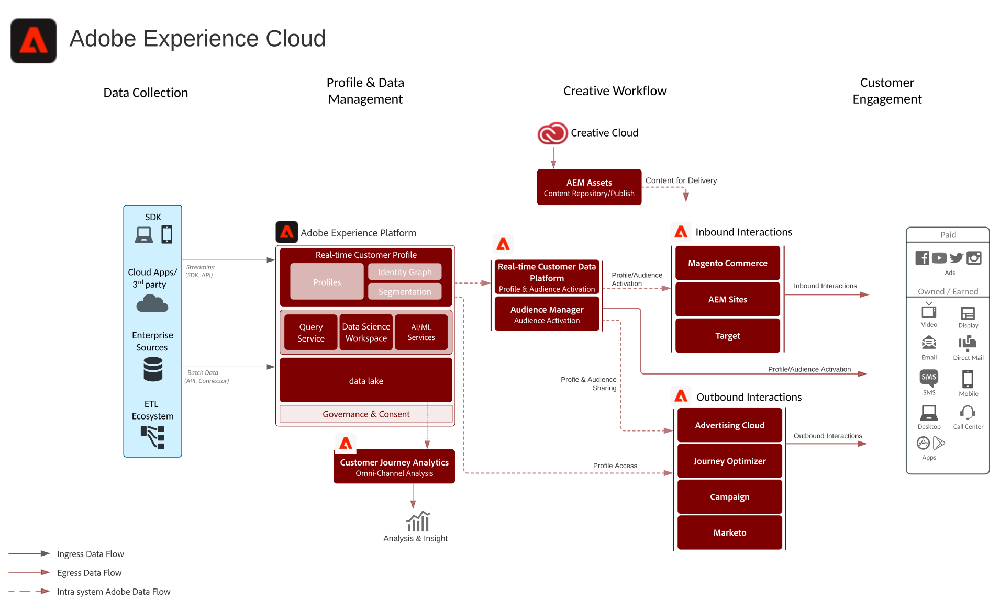

# Adobe Experience Cloud-architectuurdiagram

Dit architectuurdiagram toont hoe de toepassingen van Adobe Experience Cloud, de toepassingsdiensten, en Adobe Experience Platform in een onderneming marketing architectuur passen.

