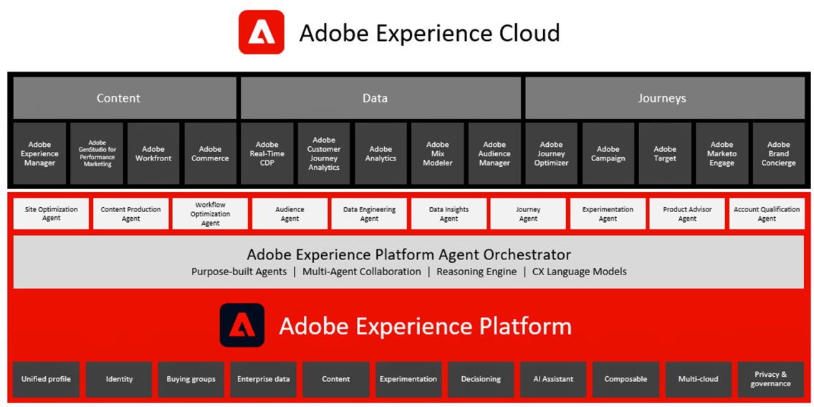

# Adobe Experience Cloud-architectuurdiagrammen

Deze diagrammen tonen hoe de toepassingen, de toepassingsdiensten van Experience Cloud, en Experience Platform in een onderneming marketing architectuur passen.

## Adobe Experience Cloud Marketecture

In het volgende diagram worden de verschillende componenten van Adobe Experience Cloud geïllustreerd voor Data Insights &amp; Audiences, Content &amp; Commerce, Customer Jourards, Marketing Workflow, gebouwd en geïntegreerd op de basis van de Adobe Experience Platform.

## Integratiearchitectuur van gegevens en inzichten, inhoud en handel en levering van ervaring

In het onderstaande architectuurdiagram ziet u hoe de verschillende componenten van de Adobe Experience Cloud op elkaar aansluiten en integreren om personalisatie op schaal mogelijk te maken voor gegevens, inhoud en beleving.

## Adobe Experience Cloud in het landschap van de onderneming

In het onderstaande architectuurdiagram wordt geïllustreerd hoe Adobe Experience Cloud-toepassingen en Adobe Experience Platform passen in de architectuur van een zakelijke klant voor de vier categorieën gegevens, inzichten, Orchestratie en Betrokkenheid.

