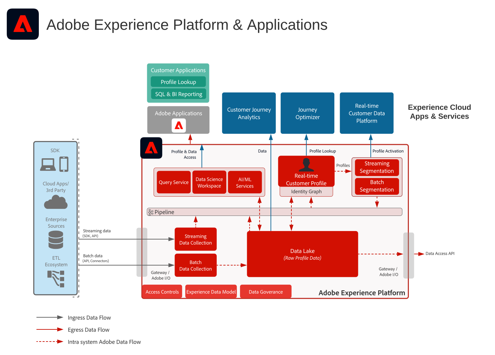

# Adobe Experience Platform en toepassingen

## Adobe Experience Platform- &amp; Applications-architectuurdiagram

Dit architectuurdiagram toont hoe Adobe Experience Platform op de toepassingen en de toepassingsdiensten van Adobe Experience Cloud betrekking heeft.

>[!VIDEO](https://video.tv.adobe.com/v/32456/?quality=12&learn=on)

## Gedetailleerd architectuurdiagram voor Adobe Experience Platform en toepassingen

