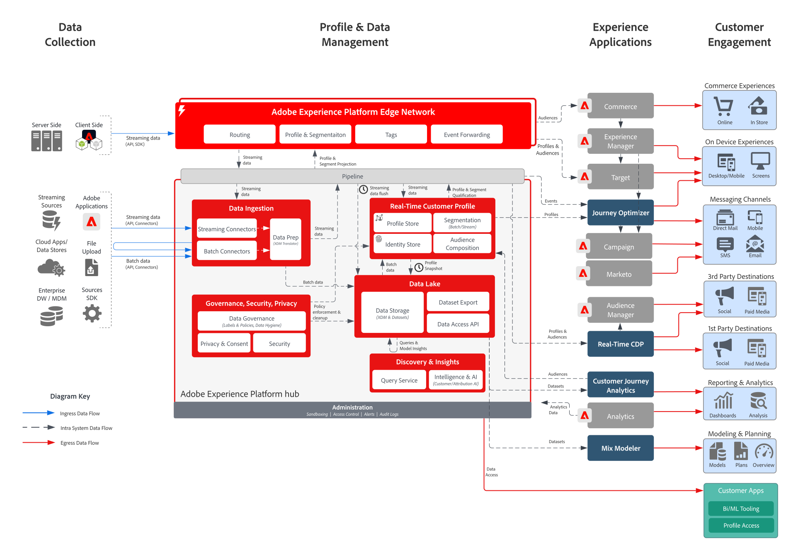

# Adobe Experience Platform- en toepassingsarchitectuurdiagrammen

Deze architectuurdiagrammen tonen hoe Experience Platform (AEP) zich verhoudt tot andere Experience Cloud-toepassingen en -toepassingsservices.

>[!MORELIKETHIS]
>
>[&#x200B; de Configuraties van de Integratie voor de Integraties van de Toepassingen van Experience Cloud &#x200B;](https://experienceleague.adobe.com/docs/integrations-learn/experience-cloud/overview.html?lang=nl-NL).

## Architectuurdiagram

Dit architectuurdiagram toont hoe Adobe Experience Platform op de toepassingen en de toepassingsdiensten van Adobe Experience Cloud betrekking heeft.

## Gedetailleerd architectuurdiagram

