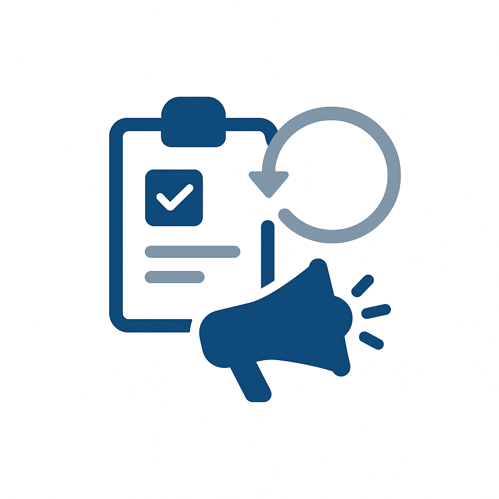
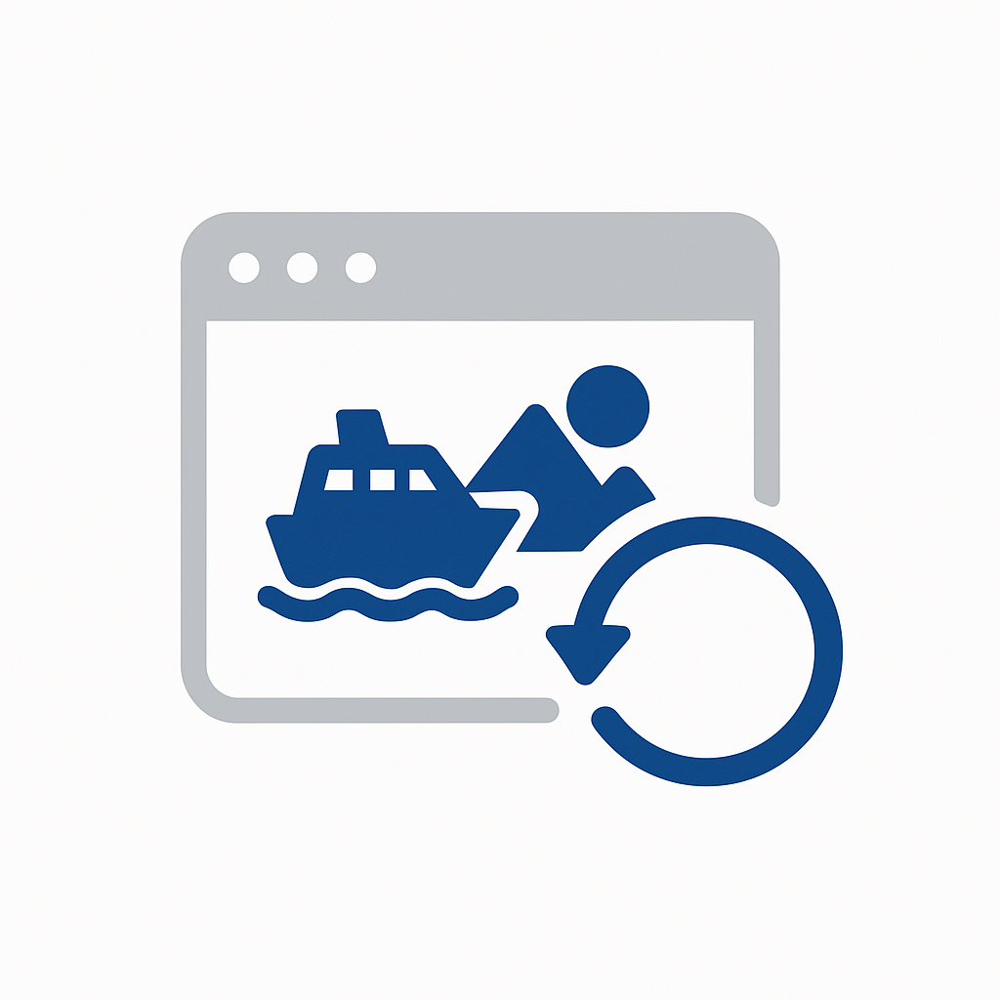

# Hoofdlettercatalogus gebruiken

Ontdek bewezen gebruiksgevallen in verschillende bedrijfstakken om uw [!DNL Adobe Experience Platform] -implementatie te versnellen. Blader op de verticale basis van de branche om gebruiksgevallen te vinden die relevant zijn voor uw bedrijf, op het niveau van de rijpheid om de bereidheid van uw organisatie aan te passen, of op implementatiepatroon om de technische benadering te begrijpen.

## Bladeren door industrie

>[!BEGINTABS]

>[!TAB  Detailhandel ]

| | Gebruiksscenario | Beschrijving | Looptijd | Patroon |
| --- | --- | --- | --- | --- |
|  | [&#x200B; Verlaten E-mailterugwinning van de Kar &#x200B;](retail/retail-overview.md#abandoned-cart-email-recovery) | Aangepaste herinneringen verzenden voor verlaten winkelwagentjes | [!BADGE &#x200B; Foundational &#x200B;]{type=Neutral} | [&#x200B; gebeurtenis-teweeggebracht Overseinen &#x200B;](/help/blueprints/use-case-patterns/campaign-management-orchestration/event-triggered-messaging.md) |
|  | [&#x200B; op inventaris-Gebaseerde Urgentiecampagnes &#x200B;](retail/retail-overview.md#inventory-based-urgency-campaigns) | Waarschuwing in real time activeren wanneer de productvoorraad laag is | [!BADGE &#x200B; Foundational &#x200B;]{type=Neutral} | [&#x200B; gebeurtenis-teweeggebracht Overseinen &#x200B;](/help/blueprints/use-case-patterns/campaign-management-orchestration/event-triggered-messaging.md) |
|  | [&#x200B; de Daling van de Prijs Alarm &#x200B;](retail/retail-overview.md#price-drop-alerts) | Klanten op de hoogte stellen wanneer verlanglijst of bekeken objecten in prijs dalen | [!BADGE &#x200B; Foundational &#x200B;]{type=Neutral} | [&#x200B; gebeurtenis-teweeggebracht Overseinen &#x200B;](/help/blueprints/use-case-patterns/campaign-management-orchestration/event-triggered-messaging.md) |
| | [&#x200B; uit-van-voorraad Meldingen &#x200B;](retail/retail-overview.md#out-of-stock-notifications) | Klanten op de hoogte stellen wanneer producten uit de voorraad beschikbaar komen | [!BADGE &#x200B; Foundational &#x200B;]{type=Neutral} | [&#x200B; gebeurtenis-teweeggebracht Overseinen &#x200B;](/help/blueprints/use-case-patterns/campaign-management-orchestration/event-triggered-messaging.md) |
|  | [&#x200B; Persoonlijke Aanbevelingen van het Product &#x200B;](retail/retail-overview.md#personalized-product-recommendations) | Persoonlijke producten weergeven op basis van bladeren en aankoopgeschiedenis | [!BADGE &#x200B; Opkomende &#x200B;]{type=Informative} | [&#x200B; Aanbeveling van het Gedrag &#x200B;](/help/blueprints/use-case-patterns/personalization/behavioral-recommendation.md) |
|  | [&#x200B; Gepersonaliseerde Pagina&#39;s van de Categorie &#x200B;](retail/retail-overview.md#personalized-category-pages) | Categoriepagina&#39;s dynamisch opnieuw ordenen op basis van voorkeuren van klanten | [!BADGE &#x200B; Opkomende &#x200B;]{type=Informative} | [&#x200B; Aanbeveling van het Gedrag &#x200B;](/help/blueprints/use-case-patterns/personalization/behavioral-recommendation.md) |
|  | [&#x200B; Nieuwe het Welkome Reeks van de Klant &#x200B;](retail/retail-overview.md#new-customer-welcome-series) | Meerdere e-mailwelkomstreeksen automatiseren met persoonlijke aanbevelingen | [!BADGE &#x200B; Opkomende &#x200B;]{type=Informative} | [&#x200B; Multi-Step Orchestrated Reis &#x200B;](/help/blueprints/use-case-patterns/campaign-management-orchestration/multi-step-orchestrated-journey.md) |
|  | [&#x200B; HervormingsHerinneringen &#x200B;](retail/retail-overview.md#replenishment-reminders) | Verzend geautomatiseerde herinneringen voor regelmatig gekochte verbruiksproducten | [!BADGE &#x200B; Opkomende &#x200B;]{type=Informative} | [&#x200B; Multi-Step Orchestrated Reis &#x200B;](/help/blueprints/use-case-patterns/campaign-management-orchestration/multi-step-orchestrated-journey.md) |
|  | [&#x200B; follow-up campagnes post-Purchase &#x200B;](retail/retail-overview.md#post-purchase-follow-up-campaigns) | Zorgtips, revisieverzoeken en verwante productsuggesties verzenden | [!BADGE &#x200B; Opkomende &#x200B;]{type=Informative} | [&#x200B; Multi-Step Orchestrated Reis &#x200B;](/help/blueprints/use-case-patterns/campaign-management-orchestration/multi-step-orchestrated-journey.md) |
| | [&#x200B; Sociale Bewijs Personalization &#x200B;](retail/retail-overview.md#social-proof-personalization) | Persoonlijke revisies en beoordelingen weergeven op basis van het klantprofiel | [!BADGE &#x200B; Opkomende &#x200B;]{type=Informative} | [&#x200B; gekend-Bezoeker Web/App Personalization &#x200B;](/help/blueprints/use-case-patterns/personalization/known-visitor-web-app-personalization.md) |
|  | [&#x200B; Verkoop en upload Aanbevelingen &#x200B;](retail/retail-overview.md#cross-sell-and-upsell-recommendations) | Toon relevante cross-sell en upsell producten bij kassa en in e-mail | [!BADGE &#x200B; Geavanceerd &#x200B;]{type=Caution} | [&#x200B; Offer Decisioning &#x200B;](/help/blueprints/use-case-patterns/personalization/offer-decisioning.md) |
| | [&#x200B; Exclusieve Aanbiedingen van de Klant van VIP &#x200B;](retail/retail-overview.md#vip-customer-exclusive-offers) | Exclusieve aanbiedingen en vroege toegang tot klanten met een hoge waarde | [!BADGE &#x200B; Geavanceerd &#x200B;]{type=Caution} | [&#x200B; Reis van het Kanaal met Beslissing &#x200B;](/help/blueprints/use-case-patterns/campaign-management-orchestration/cross-channel-journey-with-decisioning.md) |

>[!TAB  Automobielindustrie ]

| | Gebruiksscenario | Beschrijving | Looptijd | Patroon |
| --- | --- | --- | --- | --- |
|  | [&#x200B; Herinneringen van de Aanwijzing van de Dienst &#x200B;](automotive/automotive-overview.md#service-appointment-reminders) | Aangepaste serviceherinneringen verzenden op basis van afgelegde kilometers en servicegeschiedenis van het voertuig | [!BADGE &#x200B; Foundational &#x200B;]{type=Neutral} | [&#x200B; gebeurtenis-teweeggebracht Overseinen &#x200B;](/help/blueprints/use-case-patterns/campaign-management-orchestration/event-triggered-messaging.md) |
|  | [&#x200B; Notificaties van het Voertuig het Herhalen &#x200B;](automotive/automotive-overview.md#vehicle-recall-notifications) | Verzend gepersonaliseerde herinneringsberichten met de dienst plannende opties | [!BADGE &#x200B; Foundational &#x200B;]{type=Neutral} | [&#x200B; gebeurtenis-teweeggebracht Overseinen &#x200B;](/help/blueprints/use-case-patterns/campaign-management-orchestration/event-triggered-messaging.md) |
|  | [&#x200B; de Rand die van de Test plant &#x200B;](automotive/automotive-overview.md#test-drive-scheduling) | Persoonlijke teststationplanning met aanbevelingen van de dealer inschakelen | [!BADGE &#x200B; Foundational &#x200B;]{type=Neutral} | [&#x200B; gebeurtenis-teweeggebracht Overseinen &#x200B;](/help/blueprints/use-case-patterns/campaign-management-orchestration/event-triggered-messaging.md) |
|  | [&#x200B; Nieuwe Campagnes van de Modellancering &#x200B;](automotive/automotive-overview.md#new-model-launch-campaigns) | Doelklanten die geïnteresseerd zijn in nieuwe modellen op basis van het huidige voertuig en de huidige voorkeuren | [!BADGE &#x200B; Foundational &#x200B;]{type=Neutral} | [&#x200B; Uitgaande Activering van het Bericht van de Partij &#x200B;](/help/blueprints/use-case-patterns/campaign-management-orchestration/batch-outbound-message-activation.md) |
|  | [&#x200B; handel-binnen de campagnes van de Waarde &#x200B;](automotive/automotive-overview.md#trade-in-value-campaigns) | Proactief aan te bieden handel-binnen waardebeoordelingen aan klanten klaar om te bevorderen | [!BADGE &#x200B; Opkomende &#x200B;]{type=Informative} | [&#x200B; Multi-Step Orchestrated Reis &#x200B;](/help/blueprints/use-case-patterns/campaign-management-orchestration/multi-step-orchestrated-journey.md) |
|  | [&#x200B; de Aanbevelingen van de Delen en van de Toebehoren &#x200B;](automotive/automotive-overview.md#parts-and-accessories-recommendations) | Onderdelen en accessoires aanbevelen op basis van voertuigmodel en eigendomsduur | [!BADGE &#x200B; Opkomende &#x200B;]{type=Informative} | [&#x200B; Aanbeveling van het Gedrag &#x200B;](/help/blueprints/use-case-patterns/personalization/behavioral-recommendation.md) |
|  | [&#x200B; Garantie en Uitgebreide Plan van de Dienst &#x200B;](automotive/automotive-overview.md#warranty-and-extended-service-plans) | Aanbevolen garantie- en serviceplannen op optimale tijden op basis van de leeftijd van het voertuig | [!BADGE &#x200B; Opkomende &#x200B;]{type=Informative} | [&#x200B; Multi-Step Orchestrated Reis &#x200B;](/help/blueprints/use-case-patterns/campaign-management-orchestration/multi-step-orchestrated-journey.md) |
|  | [&#x200B; Verbonden Activering van de Eigenschap van de Auto &#x200B;](automotive/automotive-overview.md#connected-car-feature-activation) | Aanbevelingen voor de functie voor verbonden auto&#39;s aanpassen op basis van voertuigmogelijkheden | [!BADGE &#x200B; Opkomende &#x200B;]{type=Informative} | [&#x200B; Multi-Step Orchestrated Reis &#x200B;](/help/blueprints/use-case-patterns/campaign-management-orchestration/multi-step-orchestrated-journey.md) |
|  | [&#x200B; Coördinatie van het Netwerk van de Dealer &#x200B;](automotive/automotive-overview.md#dealer-network-coordination) | Aanbevelingen voor gepersonaliseerde dealers inschakelen op basis van locatie en voorkeuren | [!BADGE &#x200B; Opkomende &#x200B;]{type=Informative} | [&#x200B; gekend-Bezoeker Web/App Personalization &#x200B;](/help/blueprints/use-case-patterns/personalization/known-visitor-web-app-personalization.md) |
|  | [&#x200B; Reis van de Aankoop van het voertuig Personalization &#x200B;](automotive/automotive-overview.md#vehicle-purchase-journey-personalization) | De autokoopreis van onderzoek naar aankoop personaliseren | [!BADGE &#x200B; Geavanceerd &#x200B;]{type=Caution} | [&#x200B; Reis van het Kanaal met Beslissing &#x200B;](/help/blueprints/use-case-patterns/campaign-management-orchestration/cross-channel-journey-with-decisioning.md) |
|  | [&#x200B; Aanbiedingen van de Financiering en van de Verzekering &#x200B;](automotive/automotive-overview.md#financing-and-insurance-offers) | Aanbiedingen voor gepersonaliseerde financiering en verzekeringen presenteren op basis van het kredietprofiel | [!BADGE &#x200B; Geavanceerd &#x200B;]{type=Caution} | [&#x200B; Offer Decisioning &#x200B;](/help/blueprints/use-case-patterns/personalization/offer-decisioning.md) |
|  | [&#x200B; Programma&#39;s van de Loyalty van de Eigenaar &#x200B;](automotive/automotive-overview.md#owner-loyalty-programs) | Pas loyaliteitsmededelingen, beloningen, en exclusieve aanbiedingen door eigendomsgeschiedenis aan | [!BADGE &#x200B; Geavanceerd &#x200B;]{type=Caution} | [&#x200B; Reis van het Kanaal met Beslissing &#x200B;](/help/blueprints/use-case-patterns/campaign-management-orchestration/cross-channel-journey-with-decisioning.md) |

>[!TAB  Financiële Diensten ]

| | Gebruiksscenario | Beschrijving | Looptijd | Patroon |
| --- | --- | --- | --- | --- |
| | [&#x200B; op transactie-Gebaseerde Alarm en Aanbevelingen &#x200B;](financial-services/financial-services-overview.md#transaction-based-alerts-and-recommendations) | Realtime waarschuwingen verzenden voor transacties en gepersonaliseerde aanbevelingen | [!BADGE &#x200B; Foundational &#x200B;]{type=Neutral} | [&#x200B; gebeurtenis-teweeggebracht Overseinen &#x200B;](/help/blueprints/use-case-patterns/campaign-management-orchestration/event-triggered-messaging.md) |
| | [&#x200B; Terugwinning van de Terugwinning van de Toepassing van de Kaart van de Kaart &lbrace;](financial-services/financial-services-overview.md#credit-card-application-abandonment-recovery) | Neem klanten opnieuw aan die begonnen maar geen creditcardtoepassingen voltooiden | [!BADGE &#x200B; Foundational &#x200B;]{type=Neutral} | [&#x200B; gebeurtenis-teweeggebracht Overseinen &#x200B;](/help/blueprints/use-case-patterns/campaign-management-orchestration/event-triggered-messaging.md) |
| | [&#x200B; Fraud Alert Personalization &#x200B;](financial-services/financial-services-overview.md#fraud-alert-personalization) | Persoonlijk fraudealarm en veiligheidsmededelingen door klantenvoorkeur | [!BADGE &#x200B; Foundational &#x200B;]{type=Neutral} | [&#x200B; gebeurtenis-teweeggebracht Overseinen &#x200B;](/help/blueprints/use-case-patterns/campaign-management-orchestration/event-triggered-messaging.md) |
|  | [&#x200B; high-Value lood Nurturing &#x200B;](financial-services/financial-services-overview.md#high-value-lead-nurturing) | Vormt hoogwaardige vooruitzichten en verzorgt persoonlijke inhoud en aanbiedingen | [!BADGE &#x200B; Opkomende &#x200B;]{type=Informative} | [&#x200B; Multi-Step Orchestrated Reis &#x200B;](/help/blueprints/use-case-patterns/campaign-management-orchestration/multi-step-orchestrated-journey.md) |
|  | [&#x200B; Gepersonaliseerd dashboard van de Rekening &#x200B;](financial-services/financial-services-overview.md#personalized-account-dashboard) | Het dashboard voor online bankieren aanpassen op basis van accountactiviteiten en financiële doelstellingen | [!BADGE &#x200B; Opkomende &#x200B;]{type=Informative} | [&#x200B; gekend-Bezoeker Web/App Personalization &#x200B;](/help/blueprints/use-case-patterns/personalization/known-visitor-web-app-personalization.md) |
| | [&#x200B; de Aanbevelingen van Portfolio van de Investering &#x200B;](financial-services/financial-services-overview.md#investment-portfolio-recommendations) | Geef gepersonaliseerde beleggingsaanbevelingen op basis van risicoprofiel en doelstellingen | [!BADGE &#x200B; Opkomende &#x200B;]{type=Informative} | [&#x200B; Aanbeveling van het Gedrag &#x200B;](/help/blueprints/use-case-patterns/personalization/behavioral-recommendation.md) |
| | [&#x200B; de pre-Goedkeuringscampagnes van de Hypotheek &#x200B;](financial-services/financial-services-overview.md#mortgage-pre-approval-campaigns) | Te verwachten klanten op de markt voor een hypotheek op basis van profiel en levensfase | [!BADGE &#x200B; Opkomende &#x200B;]{type=Informative} | [&#x200B; Multi-Step Orchestrated Reis &#x200B;](/help/blueprints/use-case-patterns/campaign-management-orchestration/multi-step-orchestrated-journey.md) |
|  | [&#x200B; Aanbeveling van het Product voor Bestaande Klanten &#x200B;](financial-services/financial-services-overview.md#product-recommendation-for-existing-customers) | Aanbevolen relevante financiële producten op basis van profiel, transacties en levensfase | [!BADGE &#x200B; Geavanceerd &#x200B;]{type=Caution} | [&#x200B; Offer Decisioning &#x200B;](/help/blueprints/use-case-patterns/personalization/offer-decisioning.md) |
|  | [&#x200B; Campagnes van de Preventie van de Kant &#x200B;](financial-services/financial-services-overview.md#churn-prevention-campaigns) | Klanten met risico&#39;s identificeren met voorspelling op basis van AI en gebruikmaken van retentieaanbiedingen | [!BADGE &#x200B; Geavanceerd &#x200B;]{type=Caution} | [&#x200B; Reis van het Kanaal met Beslissing &#x200B;](/help/blueprints/use-case-patterns/campaign-management-orchestration/cross-channel-journey-with-decisioning.md) |
|  | [&#x200B; Het leven werkgebiedgebaseerde Aanbiedingen van het Product &#x200B;](financial-services/financial-services-overview.md#life-stage-based-product-offers) | Klanten identificeren die nieuwe levensstadia betreden en relevante financiële producten aanbieden | [!BADGE &#x200B; Geavanceerd &#x200B;]{type=Caution} | [&#x200B; Reis van het Kanaal met Beslissing &#x200B;](/help/blueprints/use-case-patterns/campaign-management-orchestration/cross-channel-journey-with-decisioning.md) |
| | [&#x200B; Betrokkenheid van het Programma van de Loyalty &#x200B;](financial-services/financial-services-overview.md#loyalty-program-engagement) | Pas loyaliteitsmededelingen, beloningen, en aanbiedingen door rij en geschiedenis aan | [!BADGE &#x200B; Geavanceerd &#x200B;]{type=Caution} | [&#x200B; Reis van het Kanaal met Beslissing &#x200B;](/help/blueprints/use-case-patterns/campaign-management-orchestration/cross-channel-journey-with-decisioning.md) |
| | [&#x200B; Gepersonaliseerde Inhoud van het Financiële Onderwijs &#x200B;](financial-services/financial-services-overview.md#personalized-financial-education-content) | Lever persoonlijke financiële educatie op basis van klantprofiel en belangen | [!BADGE &#x200B; Geavanceerd &#x200B;]{type=Caution} | [&#x200B; Reis van het Kanaal met Beslissing &#x200B;](/help/blueprints/use-case-patterns/campaign-management-orchestration/cross-channel-journey-with-decisioning.md) |

>[!TAB  Gezondheidszorg ]

| | Gebruiksscenario | Beschrijving | Looptijd | Patroon |
| --- | --- | --- | --- | --- |
|  | [&#x200B; Automatisering van de Herinnering van de Benoeming &#x200B;](healthcare/healthcare-overview.md#appointment-reminder-automation) | Aangepaste herinneringen voor benoemingen verzenden via voorkeurscommunicatiekanalen | [!BADGE &#x200B; Foundational &#x200B;]{type=Neutral} | [&#x200B; gebeurtenis-teweeggebracht Overseinen &#x200B;](/help/blueprints/use-case-patterns/campaign-management-orchestration/event-triggered-messaging.md) |
|  | [&#x200B; follow-up campagnes van het post-Bezoek &#x200B;](healthcare/healthcare-overview.md#post-visit-follow-up-campaigns) | Na het bezoek enquêtes, zorginstructies en herinneringen voor follow-up-benoemingen verzenden | [!BADGE &#x200B; Foundational &#x200B;]{type=Neutral} | [&#x200B; gebeurtenis-teweeggebracht Overseinen &#x200B;](/help/blueprints/use-case-patterns/campaign-management-orchestration/event-triggered-messaging.md) |
| | [&#x200B; Bericht van de Resultaten van het Laboratorium &#x200B;](healthcare/healthcare-overview.md#lab-results-notification) | Patiënten op de hoogte stellen wanneer laboratoriumresultaten beschikbaar zijn via hun voorkeurkanaal | [!BADGE &#x200B; Foundational &#x200B;]{type=Neutral} | [&#x200B; gebeurtenis-teweeggebracht Overseinen &#x200B;](/help/blueprints/use-case-patterns/campaign-management-orchestration/event-triggered-messaging.md) |
| | [&#x200B; Verificatie van de Dekking van de Verzekering &#x200B;](healthcare/healthcare-overview.md#insurance-coverage-verification) | Proactief verzekeringsdekking verifiëren en meedelen vóór afspraken | [!BADGE &#x200B; Foundational &#x200B;]{type=Neutral} | [&#x200B; gebeurtenis-teweeggebracht Overseinen &#x200B;](/help/blueprints/use-case-patterns/campaign-management-orchestration/event-triggered-messaging.md) |
| | [&#x200B; Herinneringen van de Aanwijzing van de Telehealth &#x200B;](healthcare/healthcare-overview.md#telehealth-appointment-reminders) | Verstuur gepersonaliseerde herinneringen voor telehealth benoemingen met verbindingsinstructies | [!BADGE &#x200B; Foundational &#x200B;]{type=Neutral} | [&#x200B; gebeurtenis-teweeggebracht Overseinen &#x200B;](/help/blueprints/use-case-patterns/campaign-management-orchestration/event-triggered-messaging.md) |
|  | [&#x200B; Preventieve herinneringen van de Zorg &#x200B;](healthcare/healthcare-overview.md#preventive-care-reminders) | Patiënten herinneren aan de aanbevolen preventieve zorg op basis van leeftijd en medische voorgeschiedenis | [!BADGE &#x200B; Foundational &#x200B;]{type=Neutral} | [&#x200B; Uitgaande Activering van het Bericht van de Partij &#x200B;](/help/blueprints/use-case-patterns/campaign-management-orchestration/batch-outbound-message-activation.md) |
|  | [&#x200B; de Campagnes van het Overerving van de Geneesmiddelen &#x200B;](healthcare/healthcare-overview.md#medication-adherence-campaigns) | Aangepaste herinneringen verzenden om patiënten te helpen op schema te blijven met medicatie | [!BADGE &#x200B; Opkomende &#x200B;]{type=Informative} | [&#x200B; Multi-Step Orchestrated Reis &#x200B;](/help/blueprints/use-case-patterns/campaign-management-orchestration/multi-step-orchestrated-journey.md) |
| | [&#x200B; Chronic Disease Management Programma&#39;s &#x200B;](healthcare/healthcare-overview.md#chronic-disease-management-programs) | Communicaties en herinneringen voor het beheer van chronische ziekten personaliseren | [!BADGE &#x200B; Opkomende &#x200B;]{type=Informative} | [&#x200B; Multi-Step Orchestrated Reis &#x200B;](/help/blueprints/use-case-patterns/campaign-management-orchestration/multi-step-orchestrated-journey.md) |
| | [&#x200B; Nieuwe Patiënt aan boord Reis &#x200B;](healthcare/healthcare-overview.md#new-patient-onboarding-journey) | Meerdere stappen automatiseren bij het instappen met welkomstinformatie, portaaltoegang en planning | [!BADGE &#x200B; Opkomende &#x200B;]{type=Informative} | [&#x200B; Multi-Step Orchestrated Reis &#x200B;](/help/blueprints/use-case-patterns/campaign-management-orchestration/multi-step-orchestrated-journey.md) |
| | [&#x200B; Betrokkenheid van het Programma van Wellness &#x200B;](healthcare/healthcare-overview.md#wellness-program-engagement) | Communicatie, uitdagingen en beloningen in het kader van het programma voor welzijn personaliseren | [!BADGE &#x200B; Opkomende &#x200B;]{type=Informative} | [&#x200B; Multi-Step Orchestrated Reis &#x200B;](/help/blueprints/use-case-patterns/campaign-management-orchestration/multi-step-orchestrated-journey.md) |
| | [&#x200B; Coördinatie van het Team van de Zorg &#x200B;](healthcare/healthcare-overview.md#care-team-coordination) | Persoonlijke communicatie tussen patiënten en hun zorgteam mogelijk maken | [!BADGE &#x200B; Opkomende &#x200B;]{type=Informative} | [&#x200B; Multi-Step Orchestrated Reis &#x200B;](/help/blueprints/use-case-patterns/campaign-management-orchestration/multi-step-orchestrated-journey.md) |
| | [&#x200B; Gepersonaliseerde Levering van de Inhoud van de Gezondheid &#x200B;](healthcare/healthcare-overview.md#personalized-health-content-delivery) | Inhoud voor persoonlijke gezondheidseducatie leveren die is afgestemd op de omstandigheden van de patiënt | [!BADGE &#x200B; Geavanceerd &#x200B;]{type=Caution} | [&#x200B; Reis van het Kanaal met Beslissing &#x200B;](/help/blueprints/use-case-patterns/campaign-management-orchestration/cross-channel-journey-with-decisioning.md) |

>[!TAB  Verzekering ]

| | Gebruiksscenario | Beschrijving | Looptijd | Patroon |
| --- | --- | --- | --- | --- |
|  | [&#x200B; Campagnes van de Vernieuwing van het Beleid &#x200B;](insurance/insurance-overview.md#policy-renewal-campaigns) | Herinneringen en aanbiedingen voor persoonlijke beleidsvernieuwing verzenden | [!BADGE &#x200B; Foundational &#x200B;]{type=Neutral} | [&#x200B; gebeurtenis-teweeggebracht Overseinen &#x200B;](/help/blueprints/use-case-patterns/campaign-management-orchestration/event-triggered-messaging.md) |
| | [&#x200B; Meldingen van de Verandering van het Beleid &#x200B;](insurance/insurance-overview.md#policy-change-notifications) | Persoonlijke meldingen verzenden over beleidswijzigingen en updates van de dekking | [!BADGE &#x200B; Foundational &#x200B;]{type=Neutral} | [&#x200B; gebeurtenis-teweeggebracht Overseinen &#x200B;](/help/blueprints/use-case-patterns/campaign-management-orchestration/event-triggered-messaging.md) |
| | [&#x200B; Terugwinning van de Afschrijving van het citaat &#x200B;](insurance/insurance-overview.md#quote-abandonment-recovery) | Neem klanten opnieuw aan die begonnen maar geen verzekeringscitaat voltooiden | [!BADGE &#x200B; Foundational &#x200B;]{type=Neutral} | [&#x200B; gebeurtenis-teweeggebracht Overseinen &#x200B;](/help/blueprints/use-case-patterns/campaign-management-orchestration/event-triggered-messaging.md) |
| | [&#x200B; Vorderingen Fraudepreventie &#x200B;](insurance/insurance-overview.md#claims-fraud-prevention) | Intelligente fraudedetectie gebruiken om verdachte claimpatronen te identificeren | [!BADGE &#x200B; Foundational &#x200B;]{type=Neutral} | [&#x200B; gebeurtenis-teweeggebracht Overseinen &#x200B;](/help/blueprints/use-case-patterns/campaign-management-orchestration/event-triggered-messaging.md) |
| | [&#x200B; de catastrofe Reactie van de Gebeurtenis &#x200B;](insurance/insurance-overview.md#catastrophic-event-response) | Proactief communiceren met klanten in getroffen gebieden tijdens natuurrampen | [!BADGE &#x200B; Foundational &#x200B;]{type=Neutral} | [&#x200B; gebeurtenis-teweeggebracht Overseinen &#x200B;](/help/blueprints/use-case-patterns/campaign-management-orchestration/event-triggered-messaging.md) |
| | [&#x200B; Agent en de Coördinatie van de Makelaar &#x200B;](insurance/insurance-overview.md#agent-and-broker-coordination) | Laat gepersonaliseerde communicatie tussen klanten en toegewezen agenten toe | [!BADGE &#x200B; Foundational &#x200B;]{type=Neutral} | [&#x200B; Uitgaande Activering van het Bericht van de Partij &#x200B;](/help/blueprints/use-case-patterns/campaign-management-orchestration/batch-outbound-message-activation.md) |
|  | [&#x200B; het Proces Personalization van Vorderingen &#x200B;](insurance/insurance-overview.md#claims-process-personalization) | Personaliseer de mededelingen van het claimproces, statusupdates en steunmiddelen | [!BADGE &#x200B; Opkomende &#x200B;]{type=Informative} | [&#x200B; Multi-Step Orchestrated Reis &#x200B;](/help/blueprints/use-case-patterns/campaign-management-orchestration/multi-step-orchestrated-journey.md) |
| | [&#x200B; Beoordeling en Preventie van het Risico &#x200B;](insurance/insurance-overview.md#risk-assessment-and-prevention) | Persoonlijke informatie over risicobeoordeling en preventiepunten verstrekken | [!BADGE &#x200B; Opkomende &#x200B;]{type=Informative} | [&#x200B; Multi-Step Orchestrated Reis &#x200B;](/help/blueprints/use-case-patterns/campaign-management-orchestration/multi-step-orchestrated-journey.md) |
| | [&#x200B; Wellness en Preventie Programma&#39;s &#x200B;](insurance/insurance-overview.md#wellness-and-prevention-programs) | Communicatie en beloningen van programma&#39;s voor de persoonlijke levenssfeer van verzekeringsklanten aanpassen | [!BADGE &#x200B; Opkomende &#x200B;]{type=Informative} | [&#x200B; Multi-Step Orchestrated Reis &#x200B;](/help/blueprints/use-case-patterns/campaign-management-orchestration/multi-step-orchestrated-journey.md) |
|  | [&#x200B; de Aanbevelingen van het Product van de Verkoop &#x200B;](insurance/insurance-overview.md#cross-sell-product-recommendations) | Aanbevolen aanvullende verzekeringsproducten op basis van bestaande polissen en levensfase | [!BADGE &#x200B; Geavanceerd &#x200B;]{type=Caution} | [&#x200B; Offer Decisioning &#x200B;](/help/blueprints/use-case-patterns/personalization/offer-decisioning.md) |
| | [&#x200B; Het leven werkgebiedgebaseerde Aanbiedingen van het Product &#x200B;](insurance/insurance-overview.md#life-stage-based-product-offers) | Klanten identificeren die nieuwe levensstadia betreden en relevante verzekeringsproducten aanbieden | [!BADGE &#x200B; Geavanceerd &#x200B;]{type=Caution} | [&#x200B; Reis van het Kanaal met Beslissing &#x200B;](/help/blueprints/use-case-patterns/campaign-management-orchestration/cross-channel-journey-with-decisioning.md) |
| | [&#x200B; Kans van de Korting en van Besparing &#x200B;](insurance/insurance-overview.md#discount-and-savings-opportunities) | Aangepaste kortingsmogelijkheden identificeren en communiceren | [!BADGE &#x200B; Geavanceerd &#x200B;]{type=Caution} | [&#x200B; Offer Decisioning &#x200B;](/help/blueprints/use-case-patterns/personalization/offer-decisioning.md) |

>[!TAB  Media &amp; Entertainment ]

| | Gebruiksscenario | Beschrijving | Looptijd | Patroon |
| --- | --- | --- | --- | --- |
|  | [&#x200B; Nieuwe Meldingen van de Versie van de Inhoud &#x200B;](media-entertainment/media-entertainment-overview.md#new-content-release-notifications) | Abonnees op de hoogte stellen van nieuwe inhoud die overeenkomt met hun voorkeuren | [!BADGE &#x200B; Foundational &#x200B;]{type=Neutral} | [&#x200B; gebeurtenis-teweeggebracht Overseinen &#x200B;](/help/blueprints/use-case-patterns/campaign-management-orchestration/event-triggered-messaging.md) |
| | [&#x200B; Controlelijst en Favorieten herinnert eraan &#x200B;](media-entertainment/media-entertainment-overview.md#watchlist-and-favorites-reminders) | Herinneringen verzenden over niet-gecontroleerde inhoud in controlelijsten | [!BADGE &#x200B; Foundational &#x200B;]{type=Neutral} | [&#x200B; gebeurtenis-teweeggebracht Overseinen &#x200B;](/help/blueprints/use-case-patterns/campaign-management-orchestration/event-triggered-messaging.md) |
| | [&#x200B; Levende Herinneringen van de Gebeurtenis bekijken &#x200B;](media-entertainment/media-entertainment-overview.md#live-event-viewing-reminders) | Gebruikers op de hoogte stellen van aanstaande live gebeurtenissen die overeenkomen met hun belangen | [!BADGE &#x200B; Foundational &#x200B;]{type=Neutral} | [&#x200B; gebeurtenis-teweeggebracht Overseinen &#x200B;](/help/blueprints/use-case-patterns/campaign-management-orchestration/event-triggered-messaging.md) |
| | [&#x200B; Campagnes van de Voltooiing van inhoud &#x200B;](media-entertainment/media-entertainment-overview.md#content-completion-campaigns) | Gebruikers eraan herinneren om inhoud te voltooien die ze hebben gestart maar niet hebben voltooid | [!BADGE &#x200B; Foundational &#x200B;]{type=Neutral} | [&#x200B; gebeurtenis-teweeggebracht Overseinen &#x200B;](/help/blueprints/use-case-patterns/campaign-management-orchestration/event-triggered-messaging.md) |
|  | [&#x200B; Motor van de Aanbeveling van de Inhoud &#x200B;](media-entertainment/media-entertainment-overview.md#content-recommendation-engine) | Aanbevelingen voor persoonlijke inhoud opgeven op basis van de weergavegeschiedenis | [!BADGE &#x200B; Opkomende &#x200B;]{type=Informative} | [&#x200B; Aanbeveling van het Gedrag &#x200B;](/help/blueprints/use-case-patterns/personalization/behavioral-recommendation.md) |
| | [&#x200B; Persoonlijke Ervaring van de Homepage &#x200B;](media-entertainment/media-entertainment-overview.md#personalized-homepage-experience) | Homepage dynamisch aanpassen om de meest relevante inhoud eerst weer te geven | [!BADGE &#x200B; Opkomende &#x200B;]{type=Informative} | [&#x200B; Aanbeveling van het Gedrag &#x200B;](/help/blueprints/use-case-patterns/personalization/behavioral-recommendation.md) |
| | [&#x200B; Gepersonaliseerde Generatie van de Playlist &#x200B;](media-entertainment/media-entertainment-overview.md#personalized-playlist-generation) | Afspeellijsten automatisch genereren op basis van de luistergeschiedenis en voorkeuren | [!BADGE &#x200B; Opkomende &#x200B;]{type=Informative} | [&#x200B; Aanbeveling van het Gedrag &#x200B;](/help/blueprints/use-case-patterns/personalization/behavioral-recommendation.md) |
| | [&#x200B; de Gratis Campagnes van de Omzetting van de Proefversie &#x200B;](media-entertainment/media-entertainment-overview.md#free-trial-conversion-campaigns) | Gratis proefgebruikers inschakelen met persoonlijke inhoud om conversie aan te moedigen | [!BADGE &#x200B; Opkomende &#x200B;]{type=Informative} | [&#x200B; Multi-Step Orchestrated Reis &#x200B;](/help/blueprints/use-case-patterns/campaign-management-orchestration/multi-step-orchestrated-journey.md) |
| | [&#x200B; dwars-Platform de Synchronisatie van de Inhoud &#x200B;](media-entertainment/media-entertainment-overview.md#cross-platform-content-sync) | Zorgen voor naadloze inhoud op verschillende apparaten met gesynchroniseerde voorkeuren | [!BADGE &#x200B; Opkomende &#x200B;]{type=Informative} | [&#x200B; gekend-Bezoeker Web/App Personalization &#x200B;](/help/blueprints/use-case-patterns/personalization/known-visitor-web-app-personalization.md) |
| | [&#x200B; Sociale het Delen Personalization &#x200B;](media-entertainment/media-entertainment-overview.md#social-sharing-personalization) | Vragen voor sociaal delen aanpassen op basis van voorkeuren voor inhoud | [!BADGE &#x200B; Opkomende &#x200B;]{type=Informative} | [&#x200B; gekend-Bezoeker Web/App Personalization &#x200B;](/help/blueprints/use-case-patterns/personalization/known-visitor-web-app-personalization.md) |
|  | [&#x200B; Preventie van het Koor van het Abonnement &#x200B;](media-entertainment/media-entertainment-overview.md#subscription-churn-prevention) | Abonnees op risicogebied identificeren en zich bezighouden met aanbiedingen tot behoud | [!BADGE &#x200B; Geavanceerd &#x200B;]{type=Caution} | [&#x200B; Reis van het Kanaal met Beslissing &#x200B;](/help/blueprints/use-case-patterns/campaign-management-orchestration/cross-channel-journey-with-decisioning.md) |
| | [&#x200B; upsell van de Eigenschap van de Premie &#x200B;](media-entertainment/media-entertainment-overview.md#premium-feature-upsell) | Identificeer gebruikers die van premieeigenschappen met gepersonaliseerde aanbiedingen zouden profiteren | [!BADGE &#x200B; Geavanceerd &#x200B;]{type=Caution} | [&#x200B; Offer Decisioning &#x200B;](/help/blueprints/use-case-patterns/personalization/offer-decisioning.md) |

>[!TAB  Telecommunicatie ]

| | Gebruiksscenario | Beschrijving | Looptijd | Patroon |
| --- | --- | --- | --- | --- |
| | [&#x200B; de Waarschuwingen en de Aanbevelingen van het Gebruik van Gegevens van Gegevens &#x200B;](telecommunications/telecommunications-overview.md#data-usage-alerts-and-recommendations) | Verstuur gepersonaliseerde alarm wanneer de klanten gegevensgrenzen benaderen | [!BADGE &#x200B; Foundational &#x200B;]{type=Neutral} | [&#x200B; gebeurtenis-teweeggebracht Overseinen &#x200B;](/help/blueprints/use-case-patterns/campaign-management-orchestration/event-triggered-messaging.md) |
| | [&#x200B; de Meldingen van het Afval van de Dienst &#x200B;](telecommunications/telecommunications-overview.md#service-outage-notifications) | Proactief klanten op de hoogte brengen van dienststroomonderbrekingen in hun gebied | [!BADGE &#x200B; Foundational &#x200B;]{type=Neutral} | [&#x200B; gebeurtenis-teweeggebracht Overseinen &#x200B;](/help/blueprints/use-case-patterns/campaign-management-orchestration/event-triggered-messaging.md) |
| | [&#x200B; Herinneringen van de Betaling van de Rekening &#x200B;](telecommunications/telecommunications-overview.md#bill-payment-reminders) | Herinneringen voor gepersonaliseerde facturering verzenden met betalingsopties | [!BADGE &#x200B; Foundational &#x200B;]{type=Neutral} | [&#x200B; gebeurtenis-teweeggebracht Overseinen &#x200B;](/help/blueprints/use-case-patterns/campaign-management-orchestration/event-triggered-messaging.md) |
| | [&#x200B; 5G de Campagnes van de Verbetering &#x200B;](telecommunications/telecommunications-overview.md#5g-upgrade-campaigns) | Doelklanten die in aanmerking komen voor 5G-upgrades met persoonlijke aanbiedingen | [!BADGE &#x200B; Foundational &#x200B;]{type=Neutral} | [&#x200B; Uitgaande Activering van het Bericht van de Partij &#x200B;](/help/blueprints/use-case-patterns/campaign-management-orchestration/batch-outbound-message-activation.md) |
|  | [&#x200B; Campagnes van de Optimalisering van het Plan &#x200B;](telecommunications/telecommunications-overview.md#plan-optimization-campaigns) | Gebruikspatronen analyseren en optimale planwijzigingen aanbevelen | [!BADGE &#x200B; Opkomende &#x200B;]{type=Informative} | [&#x200B; Multi-Step Orchestrated Reis &#x200B;](/help/blueprints/use-case-patterns/campaign-management-orchestration/multi-step-orchestrated-journey.md) |
| | [&#x200B; Nieuwe Klant op instapkaartreis &#x200B;](telecommunications/telecommunications-overview.md#new-customer-onboarding-journey) | Automatiseer gepersonaliseerd instappen met welkomstinformatie en zelfstudies met functies | [!BADGE &#x200B; Opkomende &#x200B;]{type=Informative} | [&#x200B; Multi-Step Orchestrated Reis &#x200B;](/help/blueprints/use-case-patterns/campaign-management-orchestration/multi-step-orchestrated-journey.md) |
| | [&#x200B; Prestaties Personalization van het Netwerk &#x200B;](telecommunications/telecommunications-overview.md#network-performance-personalization) | Personaliseer de informatie van netwerkprestaties die op plaats en apparaat wordt gebaseerd | [!BADGE &#x200B; Opkomende &#x200B;]{type=Informative} | [&#x200B; gekend-Bezoeker Web/App Personalization &#x200B;](/help/blueprints/use-case-patterns/personalization/known-visitor-web-app-personalization.md) |
|  | [&#x200B; Aanbevelingen van de Verbetering van het Apparaat &#x200B;](telecommunications/telecommunications-overview.md#device-upgrade-recommendations) | Identificeer in aanmerking komende klanten en presenteer gepersonaliseerde apparatenaanbevelingen | [!BADGE &#x200B; Geavanceerd &#x200B;]{type=Caution} | [&#x200B; Reis van het Kanaal met Beslissing &#x200B;](/help/blueprints/use-case-patterns/campaign-management-orchestration/cross-channel-journey-with-decisioning.md) |
|  | [&#x200B; Preventie van de Kneep voor Hoge-Waarde Klanten &#x200B;](telecommunications/telecommunications-overview.md#churn-prevention-for-high-value-customers) | Klanten met een hoog risico identificeren en gebruikmaken van aanbiedingen voor retentie | [!BADGE &#x200B; Geavanceerd &#x200B;]{type=Caution} | [&#x200B; Reis van het Kanaal met Beslissing &#x200B;](/help/blueprints/use-case-patterns/campaign-management-orchestration/cross-channel-journey-with-decisioning.md) |
| | [&#x200B; Beheer van het Plan van de Familie &#x200B;](telecommunications/telecommunications-overview.md#family-plan-management) | Persoonlijke mededelingen voor de beheerders van het gezinspatroon door familiegebruik | [!BADGE &#x200B; Geavanceerd &#x200B;]{type=Caution} | [&#x200B; Reis van het Kanaal met Beslissing &#x200B;](/help/blueprints/use-case-patterns/campaign-management-orchestration/cross-channel-journey-with-decisioning.md) |
| | [&#x200B; toe:voegen-op de Aanbevelingen van de Dienst &#x200B;](telecommunications/telecommunications-overview.md#add-on-service-recommendations) | Aanbevolen relevante add-onservices op basis van abonnement, gebruik en voorkeuren | [!BADGE &#x200B; Geavanceerd &#x200B;]{type=Caution} | [&#x200B; Offer Decisioning &#x200B;](/help/blueprints/use-case-patterns/personalization/offer-decisioning.md) |
| | [&#x200B; Betrokkenheid van het Programma van de Loyalty &#x200B;](telecommunications/telecommunications-overview.md#loyalty-program-engagement) | Pas loyaliteitsmededelingen, beloningen, en aanbiedingen door rij en geschiedenis aan | [!BADGE &#x200B; Geavanceerd &#x200B;]{type=Caution} | [&#x200B; Reis van het Kanaal met Beslissing &#x200B;](/help/blueprints/use-case-patterns/campaign-management-orchestration/cross-channel-journey-with-decisioning.md) |

>[!TAB  Reizen &amp; Ziekenplaats ]

| | Gebruiksscenario | Beschrijving | Looptijd | Patroon |
| --- | --- | --- | --- | --- |
|  | [&#x200B; Reis van de Terugwinning van de Behuizing van de Kar &#x200B;](travel-hospitality/travel-hospitality-overview.md#cart-abandonment-recovery-journey) | Ontdek verlaten boekenkaarten en zet persoonlijke e-mailreis teweeg | [!BADGE &#x200B; Foundational &#x200B;]{type=Neutral} | [&#x200B; gebeurtenis-teweeggebracht Overseinen &#x200B;](/help/blueprints/use-case-patterns/campaign-management-orchestration/event-triggered-messaging.md) |
|  | [&#x200B; Meerkanaals het Boken Herinneringen &#x200B;](travel-hospitality/travel-hospitality-overview.md#multi-channel-booking-reminders) | Aangepaste herinneringen voor boekingen verzenden via e-mail, tekst en push | [!BADGE &#x200B; Foundational &#x200B;]{type=Neutral} | [&#x200B; gebeurtenis-teweeggebracht Overseinen &#x200B;](/help/blueprints/use-case-patterns/campaign-management-orchestration/event-triggered-messaging.md) |
|  | [&#x200B; Seasonal Campaign Personalization &#x200B;](travel-hospitality/travel-hospitality-overview.md#seasonal-campaign-personalization) | Prijswaardencampagnes aanpassen op basis van seizoensvoorkeuren en eerdere boekingen | [!BADGE &#x200B; Foundational &#x200B;]{type=Neutral} | [&#x200B; Uitgaande Activering van het Bericht van de Partij &#x200B;](/help/blueprints/use-case-patterns/campaign-management-orchestration/batch-outbound-message-activation.md) |
|  | [&#x200B; Gepersonaliseerde Homepage voor Nieuwe Bezoekers &#x200B;](travel-hospitality/travel-hospitality-overview.md#personalized-homepage-for-new-visitors) | Persoonlijke aanbevelingen weergeven op basis van locatie en browsergedrag | [!BADGE &#x200B; Opkomende &#x200B;]{type=Informative} | [&#x200B; Anonieme Personalization van het Web van de Bezoeker &#x200B;](/help/blueprints/use-case-patterns/personalization/anonymous-visitor-web-personalization.md) |
|  | [&#x200B; Hoog-Intentie Bezoeker richtend &#x200B;](travel-hospitality/travel-hospitality-overview.md#high-intent-visitor-targeting) | Geniet met hoge intenties identificeren met AI-scoring en doelgroep met persoonlijke aanbiedingen | [!BADGE &#x200B; Opkomende &#x200B;]{type=Informative} | [&#x200B; gekend-Bezoeker Web/App Personalization &#x200B;](/help/blueprints/use-case-patterns/personalization/known-visitor-web-app-personalization.md) |
|  | [&#x200B; post-Boek upselt campagnes &#x200B;](travel-hospitality/travel-hospitality-overview.md#post-booking-upsell-campaigns) | Upselcampagnes activeren voor upgrades, excursies en pakketten na het boeken | [!BADGE &#x200B; Opkomende &#x200B;]{type=Informative} | [&#x200B; Multi-Step Orchestrated Reis &#x200B;](/help/blueprints/use-case-patterns/campaign-management-orchestration/multi-step-orchestrated-journey.md) |
|  | [&#x200B; Win-Terug Campagnes voor Verlaten Klanten &#x200B;](travel-hospitality/travel-hospitality-overview.md#win-back-campaigns-for-lapsed-customers) | Verouderde klanten aantrekken met persoonlijke win-back-aanbiedingen | [!BADGE &#x200B; Opkomende &#x200B;]{type=Informative} | [&#x200B; Multi-Step Orchestrated Reis &#x200B;](/help/blueprints/use-case-patterns/campaign-management-orchestration/multi-step-orchestrated-journey.md) |
|  | [&#x200B; de Dynamische Aanbevelingen van de inertie &#x200B;](travel-hospitality/travel-hospitality-overview.md#dynamic-itinerary-recommendations) | Persoonlijke reisschema&#39;s weergeven op basis van eerdere boekingen en voorkeuren | [!BADGE &#x200B; Opkomende &#x200B;]{type=Informative} | [&#x200B; gekend-Bezoeker Web/App Personalization &#x200B;](/help/blueprints/use-case-patterns/personalization/known-visitor-web-app-personalization.md) |
|  | [&#x200B; onlangs doorbladerde Producten op Homepage &#x200B;](travel-hospitality/travel-hospitality-overview.md#recently-browsed-products-on-homepage) | Onlangs bekeken doelen weergeven om terugkeerbezoeken aan te moedigen | [!BADGE &#x200B; Opkomende &#x200B;]{type=Informative} | [&#x200B; gekend-Bezoeker Web/App Personalization &#x200B;](/help/blueprints/use-case-patterns/personalization/known-visitor-web-app-personalization.md) |
|  | [&#x200B; Groep die Aanbevelingen &#x200B;](travel-hospitality/travel-hospitality-overview.md#group-booking-recommendations) boeken | Groepspakketten en gezinsvriendelijke opties aanbevelen voor het frequent uitvoeren van groepsbookers | [!BADGE &#x200B; Opkomende &#x200B;]{type=Informative} | [&#x200B; Aanbeveling van het Gedrag &#x200B;](/help/blueprints/use-case-patterns/personalization/behavioral-recommendation.md) |
|  | [&#x200B; Modal van de Intentie van de Uitgang met gerichte Aanbiedingen &#x200B;](travel-hospitality/travel-hospitality-overview.md#exit-intent-modal-with-targeted-offers) | Geppersonaliseerde modale weergave weergeven met relevante aanbiedingen wanneer bezoekers de exitintentie zien | [!BADGE &#x200B; Geavanceerd &#x200B;]{type=Caution} | [&#x200B; Offer Decisioning &#x200B;](/help/blueprints/use-case-patterns/personalization/offer-decisioning.md) |
|  | [&#x200B; Loyalty Program Personalization &#x200B;](travel-hospitality/travel-hospitality-overview.md#loyalty-program-personalization) | Websites, aanbiedingen en communicatie personaliseren op basis van loyaliteitsniveau en puntbalans | [!BADGE &#x200B; Geavanceerd &#x200B;]{type=Caution} | [&#x200B; Reis van het Kanaal met Beslissing &#x200B;](/help/blueprints/use-case-patterns/campaign-management-orchestration/cross-channel-journey-with-decisioning.md) |

>[!TAB  B2B ]

| | Gebruiksscenario | Beschrijving | Looptijd | Patroon |
| --- | --- | --- | --- | --- |
|  | [&#x200B; Webinar en Demo die &#x200B;](b2b/b2b-overview.md#webinar-and-demo-scheduling) plannen | Webuitnodigingen en demo-planning aanpassen op basis van perspectiefbelangen | [!BADGE &#x200B; Foundational &#x200B;]{type=Neutral} | [&#x200B; gebeurtenis-teweeggebracht Overseinen &#x200B;](/help/blueprints/use-case-patterns/campaign-management-orchestration/event-triggered-messaging.md) |
|  | [&#x200B; Account-Based Marketing Personalization &#x200B;](b2b/b2b-overview.md#account-based-marketing-personalization) | Persoonlijk marketing mededelingen voor doelrekeningen die op het kopen van signalen worden gebaseerd | [!BADGE &#x200B; Opkomende &#x200B;]{type=Informative} | [&#x200B; B2B Audience Activation &#x200B;](/help/blueprints/use-case-patterns/audience-building-activation/b2b-audience-activation.md) |
|  | [&#x200B; het Scoren en het Verzadigen van de Lood &#x200B;](b2b/b2b-overview.md#lead-scoring-and-nurturing) | Volgen automatisch scoren en hoogscoringbedrijven leiden naar verkoop met verplegend programma&#39;s | [!BADGE &#x200B; Opkomende &#x200B;]{type=Informative} | [&#x200B; Multi-Step Orchestrated Reis &#x200B;](/help/blueprints/use-case-patterns/campaign-management-orchestration/multi-step-orchestrated-journey.md) |
|  | [&#x200B; Inhoud Personalization voor Vooruitzichten &#x200B;](b2b/b2b-overview.md#content-personalization-for-prospects) | Inhoud en bronnen van websites aanpassen op basis van de toekomstindustrie, rol en betrokkenheid | [!BADGE &#x200B; Opkomende &#x200B;]{type=Informative} | [&#x200B; gekend-Bezoeker Web/App Personalization &#x200B;](/help/blueprints/use-case-patterns/personalization/known-visitor-web-app-personalization.md) |
|  | [&#x200B; Registratie en follow-up van de Gebeurtenis &#x200B;](b2b/b2b-overview.md#event-registration-and-follow-up) | Bevestigingen, herinneringen en follow-up van gepersonaliseerde gebeurtenisregistratie automatiseren | [!BADGE &#x200B; Opkomende &#x200B;]{type=Informative} | [&#x200B; Multi-Step Orchestrated Reis &#x200B;](/help/blueprints/use-case-patterns/campaign-management-orchestration/multi-step-orchestrated-journey.md) |
|  | [&#x200B; de Versiecampagnes van de Proefversie van het Product &#x200B;](b2b/b2b-overview.md#product-trial-conversion-campaigns) | Proefgebruikers inschakelen met persoonlijke aanbevelingen om betaalde conversie aan te moedigen | [!BADGE &#x200B; Opkomende &#x200B;]{type=Informative} | [&#x200B; Multi-Step Orchestrated Reis &#x200B;](/help/blueprints/use-case-patterns/campaign-management-orchestration/multi-step-orchestrated-journey.md) |
|  | [&#x200B; Succes van de Klant en Onboarding &#x200B;](b2b/b2b-overview.md#customer-success-and-onboarding) | Personaliseren van instapreizen met relevante training en middelen | [!BADGE &#x200B; Opkomende &#x200B;]{type=Informative} | [&#x200B; Multi-Step Orchestrated Reis &#x200B;](/help/blueprints/use-case-patterns/campaign-management-orchestration/multi-step-orchestrated-journey.md) |
|  | [&#x200B; Concurrerende Vervangende Campagnes &#x200B;](b2b/b2b-overview.md#competitive-replacement-campaigns) | Streefvooruitzichten met concurrerende producten met gepersonaliseerde migratieaanbiedingen | [!BADGE &#x200B; Opkomende &#x200B;]{type=Informative} | [&#x200B; Multi-Step Orchestrated Reis &#x200B;](/help/blueprints/use-case-patterns/campaign-management-orchestration/multi-step-orchestrated-journey.md) |
|  | [&#x200B; Gevallenanalyse en ROI Personalization &#x200B;](b2b/b2b-overview.md#case-study-and-roi-personalization) | Lever persoonlijke casestudy&#39;s en ROI calculators die op de industrie van het vooruitzicht worden gebaseerd | [!BADGE &#x200B; Opkomende &#x200B;]{type=Informative} | [&#x200B; gekend-Bezoeker Web/App Personalization &#x200B;](/help/blueprints/use-case-patterns/personalization/known-visitor-web-app-personalization.md) |
| | [&#x200B; Programma&#39;s van de Aanmoediging van de Klant &#x200B;](b2b/b2b-overview.md#customer-advocacy-programs) | Vertrouwde klanten identificeren en inschakelen voor referenties en getuigenissen | [!BADGE &#x200B; Opkomende &#x200B;]{type=Informative} | [&#x200B; Multi-Step Orchestrated Reis &#x200B;](/help/blueprints/use-case-patterns/campaign-management-orchestration/multi-step-orchestrated-journey.md) |
|  | [&#x200B; Verlengingscampagnes van het Slinken &#x200B;](b2b/b2b-overview.md#contract-renewal-campaigns) | Proactief klanten betrekken die vernieuwing met gepersonaliseerde aanbiedingen naderen | [!BADGE &#x200B; Geavanceerd &#x200B;]{type=Caution} | [&#x200B; Reis van het Kanaal met Beslissing &#x200B;](/help/blueprints/use-case-patterns/campaign-management-orchestration/cross-channel-journey-with-decisioning.md) |
|  | [&#x200B; Upsell en de Kansen van de Uitbreiding &#x200B;](b2b/b2b-overview.md#upsell-and-expansion-opportunities) | Klant identificeren klaar voor upgrades op basis van gebruikspatronen en groei-indicatoren | [!BADGE &#x200B; Geavanceerd &#x200B;]{type=Caution} | [&#x200B; Reis van het Kanaal met Beslissing &#x200B;](/help/blueprints/use-case-patterns/campaign-management-orchestration/cross-channel-journey-with-decisioning.md) |

>[!ENDTABS]

## Bladeren op ontwikkelingsniveau

>[!BEGINTABS]

>[!TAB  Foundational ]

| | Gebruiksscenario | Industrie | Zakelijke impact | Patroon |
| --- | --- | --- | --- | --- |
|  | [&#x200B; Verlaten E-mailterugwinning van de Kar &#x200B;](retail/retail-overview.md#abandoned-cart-email-recovery) | Retail | 25-35% herstelpercentage voor kar | [&#x200B; gebeurtenis-teweeggebracht Overseinen &#x200B;](/help/blueprints/use-case-patterns/campaign-management-orchestration/event-triggered-messaging.md) |
|  | [&#x200B; op inventaris-Gebaseerde Urgentiecampagnes &#x200B;](retail/retail-overview.md#inventory-based-urgency-campaigns) | Retail | Conversie met 30-40% verhoogd | [&#x200B; gebeurtenis-teweeggebracht Overseinen &#x200B;](/help/blueprints/use-case-patterns/campaign-management-orchestration/event-triggered-messaging.md) |
|  | [&#x200B; de Daling van de Prijs Alarm &#x200B;](retail/retail-overview.md#price-drop-alerts) | Retail | 20-30% conversiesnelheid | [&#x200B; gebeurtenis-teweeggebracht Overseinen &#x200B;](/help/blueprints/use-case-patterns/campaign-management-orchestration/event-triggered-messaging.md) |
| | [&#x200B; uit-van-voorraad Meldingen &#x200B;](retail/retail-overview.md#out-of-stock-notifications) | Retail | Conversie van 40-50% | [&#x200B; gebeurtenis-teweeggebracht Overseinen &#x200B;](/help/blueprints/use-case-patterns/campaign-management-orchestration/event-triggered-messaging.md) |
|  | [&#x200B; Herinneringen van de Aanwijzing van de Dienst &#x200B;](automotive/automotive-overview.md#service-appointment-reminders) | Automobielen | 40-50% stijging van de show | [&#x200B; gebeurtenis-teweeggebracht Overseinen &#x200B;](/help/blueprints/use-case-patterns/campaign-management-orchestration/event-triggered-messaging.md) |
|  | [&#x200B; Notificaties van het Voertuig het Herhalen &#x200B;](automotive/automotive-overview.md#vehicle-recall-notifications) | Automobielen | 60-70% toename in reactiepercentages uit het terugroepen | [&#x200B; gebeurtenis-teweeggebracht Overseinen &#x200B;](/help/blueprints/use-case-patterns/campaign-management-orchestration/event-triggered-messaging.md) |
|  | [&#x200B; de Rand die van de Test plant &#x200B;](automotive/automotive-overview.md#test-drive-scheduling) | Automobielen | 50-60% toename in voltooiing van de testschijf | [&#x200B; gebeurtenis-teweeggebracht Overseinen &#x200B;](/help/blueprints/use-case-patterns/campaign-management-orchestration/event-triggered-messaging.md) |
|  | [&#x200B; Nieuwe Campagnes van de Modellancering &#x200B;](automotive/automotive-overview.md#new-model-launch-campaigns) | Automobielen | 35-45% toename in betrokkenheid bij startcampagne | [&#x200B; Uitgaande Activering van het Bericht van de Partij &#x200B;](/help/blueprints/use-case-patterns/campaign-management-orchestration/batch-outbound-message-activation.md) |
| | [&#x200B; op transactie-Gebaseerde Alarm en Aanbevelingen &#x200B;](financial-services/financial-services-overview.md#transaction-based-alerts-and-recommendations) | Financiële diensten | 50-60% betrokkenheidsgraad | [&#x200B; gebeurtenis-teweeggebracht Overseinen &#x200B;](/help/blueprints/use-case-patterns/campaign-management-orchestration/event-triggered-messaging.md) |
| | [&#x200B; Terugwinning van de Terugwinning van de Toepassing van de Kaart van de Kaart &lbrace;](financial-services/financial-services-overview.md#credit-card-application-abandonment-recovery) | Financiële diensten | 20-30% verbetering in voltooiing van de toepassing | [&#x200B; gebeurtenis-teweeggebracht Overseinen &#x200B;](/help/blueprints/use-case-patterns/campaign-management-orchestration/event-triggered-messaging.md) |
| | [&#x200B; Fraud Alert Personalization &#x200B;](financial-services/financial-services-overview.md#fraud-alert-personalization) | Financiële diensten | 40-50% verbetering van de responspercentages voor alarmmeldingen | [&#x200B; gebeurtenis-teweeggebracht Overseinen &#x200B;](/help/blueprints/use-case-patterns/campaign-management-orchestration/event-triggered-messaging.md) |
|  | [&#x200B; Automatisering van de Herinnering van de Benoeming &#x200B;](healthcare/healthcare-overview.md#appointment-reminder-automation) | Gezondheidszorg | 30-40% verbetering van de show | [&#x200B; gebeurtenis-teweeggebracht Overseinen &#x200B;](/help/blueprints/use-case-patterns/campaign-management-orchestration/event-triggered-messaging.md) |
|  | [&#x200B; follow-up campagnes van het post-Bezoek &#x200B;](healthcare/healthcare-overview.md#post-visit-follow-up-campaigns) | Gezondheidszorg | 40-50% verbetering in enquêterespons | [&#x200B; gebeurtenis-teweeggebracht Overseinen &#x200B;](/help/blueprints/use-case-patterns/campaign-management-orchestration/event-triggered-messaging.md) |
| | [&#x200B; Bericht van de Resultaten van het Laboratorium &#x200B;](healthcare/healthcare-overview.md#lab-results-notification) | Gezondheidszorg | Toename van 60-70% van resultaat kijkcijfers | [&#x200B; gebeurtenis-teweeggebracht Overseinen &#x200B;](/help/blueprints/use-case-patterns/campaign-management-orchestration/event-triggered-messaging.md) |
| | [&#x200B; Verificatie van de Dekking van de Verzekering &#x200B;](healthcare/healthcare-overview.md#insurance-coverage-verification) | Gezondheidszorg | 25-35% verbetering van de bevestiging van de dekking voorafgaand aan het bezoek | [&#x200B; gebeurtenis-teweeggebracht Overseinen &#x200B;](/help/blueprints/use-case-patterns/campaign-management-orchestration/event-triggered-messaging.md) |
| | [&#x200B; Herinneringen van de Aanwijzing van de Telehealth &#x200B;](healthcare/healthcare-overview.md#telehealth-appointment-reminders) | Gezondheidszorg | De verbetering van 40-50% van virtueel bezoek toont tarieven | [&#x200B; gebeurtenis-teweeggebracht Overseinen &#x200B;](/help/blueprints/use-case-patterns/campaign-management-orchestration/event-triggered-messaging.md) |
|  | [&#x200B; Preventieve herinneringen van de Zorg &#x200B;](healthcare/healthcare-overview.md#preventive-care-reminders) | Gezondheidszorg | 25-35% toename van de voltooiing van de preventieve zorg | [&#x200B; Uitgaande Activering van het Bericht van de Partij &#x200B;](/help/blueprints/use-case-patterns/campaign-management-orchestration/batch-outbound-message-activation.md) |
|  | [&#x200B; Campagnes van de Vernieuwing van het Beleid &#x200B;](insurance/insurance-overview.md#policy-renewal-campaigns) | Verzekering | 25-35% verbetering vernieuwingspercentages | [&#x200B; gebeurtenis-teweeggebracht Overseinen &#x200B;](/help/blueprints/use-case-patterns/campaign-management-orchestration/event-triggered-messaging.md) |
| | [&#x200B; Meldingen van de Verandering van het Beleid &#x200B;](insurance/insurance-overview.md#policy-change-notifications) | Verzekering | 50-60% verbetering in berichterkenning | [&#x200B; gebeurtenis-teweeggebracht Overseinen &#x200B;](/help/blueprints/use-case-patterns/campaign-management-orchestration/event-triggered-messaging.md) |
| | [&#x200B; Terugwinning van de Afschrijving van het citaat &#x200B;](insurance/insurance-overview.md#quote-abandonment-recovery) | Verzekering | 20-30% verbetering in aanhalingstekenvoltooiing | [&#x200B; gebeurtenis-teweeggebracht Overseinen &#x200B;](/help/blueprints/use-case-patterns/campaign-management-orchestration/event-triggered-messaging.md) |
| | [&#x200B; Vorderingen Fraudepreventie &#x200B;](insurance/insurance-overview.md#claims-fraud-prevention) | Verzekering | 15-25% verbetering fraudedetectie | [&#x200B; gebeurtenis-teweeggebracht Overseinen &#x200B;](/help/blueprints/use-case-patterns/campaign-management-orchestration/event-triggered-messaging.md) |
| | [&#x200B; de catastrofe Reactie van de Gebeurtenis &#x200B;](insurance/insurance-overview.md#catastrophic-event-response) | Verzekering | 60-70% verbetering van communicatiecijfers | [&#x200B; gebeurtenis-teweeggebracht Overseinen &#x200B;](/help/blueprints/use-case-patterns/campaign-management-orchestration/event-triggered-messaging.md) |
| | [&#x200B; Agent en de Coördinatie van de Makelaar &#x200B;](insurance/insurance-overview.md#agent-and-broker-coordination) | Verzekering | 35-45% verbetering in de betrokkenheid van de agent | [&#x200B; Uitgaande Activering van het Bericht van de Partij &#x200B;](/help/blueprints/use-case-patterns/campaign-management-orchestration/batch-outbound-message-activation.md) |
|  | [&#x200B; Nieuwe Meldingen van de Versie van de Inhoud &#x200B;](media-entertainment/media-entertainment-overview.md#new-content-release-notifications) | Media en entertainment | 40-50% toename in nieuwe betrokkenheid bij inhoud binnen de eerste week | [&#x200B; gebeurtenis-teweeggebracht Overseinen &#x200B;](/help/blueprints/use-case-patterns/campaign-management-orchestration/event-triggered-messaging.md) |
| | [&#x200B; Controlelijst en Favorieten herinnert eraan &#x200B;](media-entertainment/media-entertainment-overview.md#watchlist-and-favorites-reminders) | Media en entertainment | 30-40% toename van watchlist voltooiing | [&#x200B; gebeurtenis-teweeggebracht Overseinen &#x200B;](/help/blueprints/use-case-patterns/campaign-management-orchestration/event-triggered-messaging.md) |
| | [&#x200B; Levende Herinneringen van de Gebeurtenis bekijken &#x200B;](media-entertainment/media-entertainment-overview.md#live-event-viewing-reminders) | Media en entertainment | 50-60% toename in live-gebeurtenisviewer | [&#x200B; gebeurtenis-teweeggebracht Overseinen &#x200B;](/help/blueprints/use-case-patterns/campaign-management-orchestration/event-triggered-messaging.md) |
| | [&#x200B; Campagnes van de Voltooiing van inhoud &#x200B;](media-entertainment/media-entertainment-overview.md#content-completion-campaigns) | Media en entertainment | 35-45% verbetering in voltooiing van inhoud | [&#x200B; gebeurtenis-teweeggebracht Overseinen &#x200B;](/help/blueprints/use-case-patterns/campaign-management-orchestration/event-triggered-messaging.md) |
| | [&#x200B; de Waarschuwingen en de Aanbevelingen van het Gebruik van Gegevens van Gegevens &#x200B;](telecommunications/telecommunications-overview.md#data-usage-alerts-and-recommendations) | Telecommunicatie | 40-50% toename van aankopen van gegevensopslagruimte | [&#x200B; gebeurtenis-teweeggebracht Overseinen &#x200B;](/help/blueprints/use-case-patterns/campaign-management-orchestration/event-triggered-messaging.md) |
| | [&#x200B; de Meldingen van het Afval van de Dienst &#x200B;](telecommunications/telecommunications-overview.md#service-outage-notifications) | Telecommunicatie | 60-70% tarief van de berichterkenning | [&#x200B; gebeurtenis-teweeggebracht Overseinen &#x200B;](/help/blueprints/use-case-patterns/campaign-management-orchestration/event-triggered-messaging.md) |
| | [&#x200B; Herinneringen van de Betaling van de Rekening &#x200B;](telecommunications/telecommunications-overview.md#bill-payment-reminders) | Telecommunicatie | 20-30% verbetering van de betalingen tijdens de uitvoering | [&#x200B; gebeurtenis-teweeggebracht Overseinen &#x200B;](/help/blueprints/use-case-patterns/campaign-management-orchestration/event-triggered-messaging.md) |
| | [&#x200B; 5G de Campagnes van de Verbetering &#x200B;](telecommunications/telecommunications-overview.md#5g-upgrade-campaigns) | Telecommunicatie | 25-35% toename van 5G-adoptie | [&#x200B; Uitgaande Activering van het Bericht van de Partij &#x200B;](/help/blueprints/use-case-patterns/campaign-management-orchestration/batch-outbound-message-activation.md) |
|  | [&#x200B; Reis van de Terugwinning van de Behuizing van de Kar &#x200B;](travel-hospitality/travel-hospitality-overview.md#cart-abandonment-recovery-journey) | Reizen en verblijf | 25-35% herstelpercentage voor kar | [&#x200B; gebeurtenis-teweeggebracht Overseinen &#x200B;](/help/blueprints/use-case-patterns/campaign-management-orchestration/event-triggered-messaging.md) |
|  | [&#x200B; Meerkanaals het Boken Herinneringen &#x200B;](travel-hospitality/travel-hospitality-overview.md#multi-channel-booking-reminders) | Reizen en verblijf | 20-30% verbetering van reserveringvoltooiing | [&#x200B; gebeurtenis-teweeggebracht Overseinen &#x200B;](/help/blueprints/use-case-patterns/campaign-management-orchestration/event-triggered-messaging.md) |
|  | [&#x200B; Seasonal Campaign Personalization &#x200B;](travel-hospitality/travel-hospitality-overview.md#seasonal-campaign-personalization) | Reizen en verblijf | 15-25% verhoging in seizoensgebonden boekconversie | [&#x200B; Uitgaande Activering van het Bericht van de Partij &#x200B;](/help/blueprints/use-case-patterns/campaign-management-orchestration/batch-outbound-message-activation.md) |
|  | [&#x200B; Webinar en Demo die &#x200B;](b2b/b2b-overview.md#webinar-and-demo-scheduling) plannen | B2B | 35-45% toename van de aanwezigheid in webinar | [&#x200B; gebeurtenis-teweeggebracht Overseinen &#x200B;](/help/blueprints/use-case-patterns/campaign-management-orchestration/event-triggered-messaging.md) |

>[!TAB  Opkomende ]

| | Gebruiksscenario | Industrie | Zakelijke impact | Patroon |
| --- | --- | --- | --- | --- |
|  | [&#x200B; Persoonlijke Aanbevelingen van het Product &#x200B;](retail/retail-overview.md#personalized-product-recommendations) | Retail | 20-30% toename van CTR, 15-25% conversielift | [&#x200B; Aanbeveling van het Gedrag &#x200B;](/help/blueprints/use-case-patterns/personalization/behavioral-recommendation.md) |
|  | [&#x200B; Gepersonaliseerde Pagina&#39;s van de Categorie &#x200B;](retail/retail-overview.md#personalized-category-pages) | Retail | 25-35% toename in betrokkenheid | [&#x200B; Aanbeveling van het Gedrag &#x200B;](/help/blueprints/use-case-patterns/personalization/behavioral-recommendation.md) |
|  | [&#x200B; Nieuwe het Welkome Reeks van de Klant &#x200B;](retail/retail-overview.md#new-customer-welcome-series) | Retail | 40-50% betrokkenheidsgraad | [&#x200B; Multi-Step Orchestrated Reis &#x200B;](/help/blueprints/use-case-patterns/campaign-management-orchestration/multi-step-orchestrated-journey.md) |
|  | [&#x200B; HervormingsHerinneringen &#x200B;](retail/retail-overview.md#replenishment-reminders) | Retail | Aankoopsnelheid 30-40% herhalen | [&#x200B; Multi-Step Orchestrated Reis &#x200B;](/help/blueprints/use-case-patterns/campaign-management-orchestration/multi-step-orchestrated-journey.md) |
|  | [&#x200B; follow-up campagnes post-Purchase &#x200B;](retail/retail-overview.md#post-purchase-follow-up-campaigns) | Retail | Herzieningspercentage van 15-20%, 10-15% herhaal aankoop | [&#x200B; Multi-Step Orchestrated Reis &#x200B;](/help/blueprints/use-case-patterns/campaign-management-orchestration/multi-step-orchestrated-journey.md) |
| | [&#x200B; Sociale Bewijs Personalization &#x200B;](retail/retail-overview.md#social-proof-personalization) | Retail | 10-15% stijging van de conversiesnelheid | [&#x200B; gekend-Bezoeker Web/App Personalization &#x200B;](/help/blueprints/use-case-patterns/personalization/known-visitor-web-app-personalization.md) |
|  | [&#x200B; handel-binnen de campagnes van de Waarde &#x200B;](automotive/automotive-overview.md#trade-in-value-campaigns) | Automobielen | 25-35% toename van handelsbetrekkingen | [&#x200B; Multi-Step Orchestrated Reis &#x200B;](/help/blueprints/use-case-patterns/campaign-management-orchestration/multi-step-orchestrated-journey.md) |
|  | [&#x200B; de Aanbevelingen van de Delen en van de Toebehoren &#x200B;](automotive/automotive-overview.md#parts-and-accessories-recommendations) | Automobielen | 30-40% toename van aankopen van onderdelen/accessoires | [&#x200B; Aanbeveling van het Gedrag &#x200B;](/help/blueprints/use-case-patterns/personalization/behavioral-recommendation.md) |
|  | [&#x200B; Garantie en Uitgebreide Plan van de Dienst &#x200B;](automotive/automotive-overview.md#warranty-and-extended-service-plans) | Automobielen | 20-30% toename van het gebruik van de uitgebreide garantie | [&#x200B; Multi-Step Orchestrated Reis &#x200B;](/help/blueprints/use-case-patterns/campaign-management-orchestration/multi-step-orchestrated-journey.md) |
|  | [&#x200B; Verbonden Activering van de Eigenschap van de Auto &#x200B;](automotive/automotive-overview.md#connected-car-feature-activation) | Automobielen | 35-45% verhoging van eigenschapactivering | [&#x200B; Multi-Step Orchestrated Reis &#x200B;](/help/blueprints/use-case-patterns/campaign-management-orchestration/multi-step-orchestrated-journey.md) |
|  | [&#x200B; Coördinatie van het Netwerk van de Dealer &#x200B;](automotive/automotive-overview.md#dealer-network-coordination) | Automobielen | 30-40% toename van de betrokkenheid van dealers | [&#x200B; gekend-Bezoeker Web/App Personalization &#x200B;](/help/blueprints/use-case-patterns/personalization/known-visitor-web-app-personalization.md) |
|  | [&#x200B; high-Value lood Nurturing &#x200B;](financial-services/financial-services-overview.md#high-value-lead-nurturing) | Financiële diensten | 25-35% toename van lood-aan-klant omzetting | [&#x200B; Multi-Step Orchestrated Reis &#x200B;](/help/blueprints/use-case-patterns/campaign-management-orchestration/multi-step-orchestrated-journey.md) |
|  | [&#x200B; Gepersonaliseerd dashboard van de Rekening &#x200B;](financial-services/financial-services-overview.md#personalized-account-dashboard) | Financiële diensten | 30-40% toename in betrokkenheid | [&#x200B; gekend-Bezoeker Web/App Personalization &#x200B;](/help/blueprints/use-case-patterns/personalization/known-visitor-web-app-personalization.md) |
| | [&#x200B; de Aanbevelingen van Portfolio van de Investering &#x200B;](financial-services/financial-services-overview.md#investment-portfolio-recommendations) | Financiële diensten | 25-35% toename van het gebruik van beleggingsproducten | [&#x200B; Aanbeveling van het Gedrag &#x200B;](/help/blueprints/use-case-patterns/personalization/behavioral-recommendation.md) |
| | [&#x200B; de pre-Goedkeuringscampagnes van de Hypotheek &#x200B;](financial-services/financial-services-overview.md#mortgage-pre-approval-campaigns) | Financiële diensten | 20-30% verhoging van de toepassingspercentages | [&#x200B; Multi-Step Orchestrated Reis &#x200B;](/help/blueprints/use-case-patterns/campaign-management-orchestration/multi-step-orchestrated-journey.md) |
|  | [&#x200B; de Campagnes van het Overerving van de Geneesmiddelen &#x200B;](healthcare/healthcare-overview.md#medication-adherence-campaigns) | Gezondheidszorg | 20-30% verbetering van de therapietrouw | [&#x200B; Multi-Step Orchestrated Reis &#x200B;](/help/blueprints/use-case-patterns/campaign-management-orchestration/multi-step-orchestrated-journey.md) |
| | [&#x200B; Chronic Disease Management Programma&#39;s &#x200B;](healthcare/healthcare-overview.md#chronic-disease-management-programs) | Gezondheidszorg | 30-40% toename in programmabetrokkenheid | [&#x200B; Multi-Step Orchestrated Reis &#x200B;](/help/blueprints/use-case-patterns/campaign-management-orchestration/multi-step-orchestrated-journey.md) |
| | [&#x200B; Nieuwe Patiënt aan boord Reis &#x200B;](healthcare/healthcare-overview.md#new-patient-onboarding-journey) | Gezondheidszorg | Verbetering van 50-60% bij poortactivering | [&#x200B; Multi-Step Orchestrated Reis &#x200B;](/help/blueprints/use-case-patterns/campaign-management-orchestration/multi-step-orchestrated-journey.md) |
| | [&#x200B; Betrokkenheid van het Programma van Wellness &#x200B;](healthcare/healthcare-overview.md#wellness-program-engagement) | Gezondheidszorg | 30-40% verhoging van de deelname aan het programma | [&#x200B; Multi-Step Orchestrated Reis &#x200B;](/help/blueprints/use-case-patterns/campaign-management-orchestration/multi-step-orchestrated-journey.md) |
| | [&#x200B; Coördinatie van het Team van de Zorg &#x200B;](healthcare/healthcare-overview.md#care-team-coordination) | Gezondheidszorg | 35-45% verbetering in de betrokkenheid van het zorgteam | [&#x200B; Multi-Step Orchestrated Reis &#x200B;](/help/blueprints/use-case-patterns/campaign-management-orchestration/multi-step-orchestrated-journey.md) |
|  | [&#x200B; het Proces Personalization van Vorderingen &#x200B;](insurance/insurance-overview.md#claims-process-personalization) | Verzekering | 40-50% verbetering van vorderingen | [&#x200B; Multi-Step Orchestrated Reis &#x200B;](/help/blueprints/use-case-patterns/campaign-management-orchestration/multi-step-orchestrated-journey.md) |
| | [&#x200B; Beoordeling en Preventie van het Risico &#x200B;](insurance/insurance-overview.md#risk-assessment-and-prevention) | Verzekering | 30-40% verbetering in preventieengagement | [&#x200B; Multi-Step Orchestrated Reis &#x200B;](/help/blueprints/use-case-patterns/campaign-management-orchestration/multi-step-orchestrated-journey.md) |
| | [&#x200B; Wellness en Preventie Programma&#39;s &#x200B;](insurance/insurance-overview.md#wellness-and-prevention-programs) | Verzekering | 30-40% verbetering van de deelname aan het programma | [&#x200B; Multi-Step Orchestrated Reis &#x200B;](/help/blueprints/use-case-patterns/campaign-management-orchestration/multi-step-orchestrated-journey.md) |
|  | [&#x200B; Motor van de Aanbeveling van de Inhoud &#x200B;](media-entertainment/media-entertainment-overview.md#content-recommendation-engine) | Media en entertainment | 30-40% toename in betrokkenheid bij inhoud | [&#x200B; Aanbeveling van het Gedrag &#x200B;](/help/blueprints/use-case-patterns/personalization/behavioral-recommendation.md) |
| | [&#x200B; Persoonlijke Ervaring van de Homepage &#x200B;](media-entertainment/media-entertainment-overview.md#personalized-homepage-experience) | Media en entertainment | 25-35% toename van de betrokkenheid bij homepage | [&#x200B; Aanbeveling van het Gedrag &#x200B;](/help/blueprints/use-case-patterns/personalization/behavioral-recommendation.md) |
| | [&#x200B; Gepersonaliseerde Generatie van de Playlist &#x200B;](media-entertainment/media-entertainment-overview.md#personalized-playlist-generation) | Media en entertainment | 40-50% toename in betrokkenheid bij afspeellijst | [&#x200B; Aanbeveling van het Gedrag &#x200B;](/help/blueprints/use-case-patterns/personalization/behavioral-recommendation.md) |
| | [&#x200B; de Gratis Campagnes van de Omzetting van de Proefversie &#x200B;](media-entertainment/media-entertainment-overview.md#free-trial-conversion-campaigns) | Media en entertainment | 25-35% verbetering in conversie van proces naar betaling | [&#x200B; Multi-Step Orchestrated Reis &#x200B;](/help/blueprints/use-case-patterns/campaign-management-orchestration/multi-step-orchestrated-journey.md) |
| | [&#x200B; dwars-Platform de Synchronisatie van de Inhoud &#x200B;](media-entertainment/media-entertainment-overview.md#cross-platform-content-sync) | Media en entertainment | 30-40% toename van betrokkenheid tussen verschillende apparaten | [&#x200B; gekend-Bezoeker Web/App Personalization &#x200B;](/help/blueprints/use-case-patterns/personalization/known-visitor-web-app-personalization.md) |
| | [&#x200B; Sociale het Delen Personalization &#x200B;](media-entertainment/media-entertainment-overview.md#social-sharing-personalization) | Media en entertainment | 20-30% verhoging van het percentage sociale uitkeringen | [&#x200B; gekend-Bezoeker Web/App Personalization &#x200B;](/help/blueprints/use-case-patterns/personalization/known-visitor-web-app-personalization.md) |
|  | [&#x200B; Campagnes van de Optimalisering van het Plan &#x200B;](telecommunications/telecommunications-overview.md#plan-optimization-campaigns) | Telecommunicatie | 25-35% stijging van de koers van de verandering van het plan | [&#x200B; Multi-Step Orchestrated Reis &#x200B;](/help/blueprints/use-case-patterns/campaign-management-orchestration/multi-step-orchestrated-journey.md) |
| | [&#x200B; Nieuwe Klant op instapkaartreis &#x200B;](telecommunications/telecommunications-overview.md#new-customer-onboarding-journey) | Telecommunicatie | 50-60% toename in activering van functies | [&#x200B; Multi-Step Orchestrated Reis &#x200B;](/help/blueprints/use-case-patterns/campaign-management-orchestration/multi-step-orchestrated-journey.md) |
| | [&#x200B; Prestaties Personalization van het Netwerk &#x200B;](telecommunications/telecommunications-overview.md#network-performance-personalization) | Telecommunicatie | 35-45% toename in app-betrokkenheid | [&#x200B; gekend-Bezoeker Web/App Personalization &#x200B;](/help/blueprints/use-case-patterns/personalization/known-visitor-web-app-personalization.md) |
|  | [&#x200B; Gepersonaliseerde Homepage voor Nieuwe Bezoekers &#x200B;](travel-hospitality/travel-hospitality-overview.md#personalized-homepage-for-new-visitors) | Reizen en verblijf | 15-20% stijging van de omrekeningskoers | [&#x200B; Anonieme Personalization van het Web van de Bezoeker &#x200B;](/help/blueprints/use-case-patterns/personalization/anonymous-visitor-web-personalization.md) |
|  | [&#x200B; Hoog-Intentie Bezoeker richtend &#x200B;](travel-hospitality/travel-hospitality-overview.md#high-intent-visitor-targeting) | Reizen en verblijf | Conversie met 30-40% verhoogd | [&#x200B; gekend-Bezoeker Web/App Personalization &#x200B;](/help/blueprints/use-case-patterns/personalization/known-visitor-web-app-personalization.md) |
|  | [&#x200B; post-Boek upselt campagnes &#x200B;](travel-hospitality/travel-hospitality-overview.md#post-booking-upsell-campaigns) | Reizen en verblijf | 15-25% verhoging van de aanvullende inkomsten | [&#x200B; Multi-Step Orchestrated Reis &#x200B;](/help/blueprints/use-case-patterns/campaign-management-orchestration/multi-step-orchestrated-journey.md) |
|  | [&#x200B; Win-Terug Campagnes voor Verlaten Klanten &#x200B;](travel-hospitality/travel-hospitality-overview.md#win-back-campaigns-for-lapsed-customers) | Reizen en verblijf | 10-15% reactiveringssnelheid | [&#x200B; Multi-Step Orchestrated Reis &#x200B;](/help/blueprints/use-case-patterns/campaign-management-orchestration/multi-step-orchestrated-journey.md) |
|  | [&#x200B; de Dynamische Aanbevelingen van de inertie &#x200B;](travel-hospitality/travel-hospitality-overview.md#dynamic-itinerary-recommendations) | Reizen en verblijf | 20-30% toename van de betrokkenheid van de pagina&#39;s met reisroutes | [&#x200B; gekend-Bezoeker Web/App Personalization &#x200B;](/help/blueprints/use-case-patterns/personalization/known-visitor-web-app-personalization.md) |
|  | [&#x200B; onlangs doorbladerde Producten op Homepage &#x200B;](travel-hospitality/travel-hospitality-overview.md#recently-browsed-products-on-homepage) | Reizen en verblijf | 15-20% toename in terugzetbezoek service | [&#x200B; gekend-Bezoeker Web/App Personalization &#x200B;](/help/blueprints/use-case-patterns/personalization/known-visitor-web-app-personalization.md) |
|  | [&#x200B; Groep die Aanbevelingen &#x200B;](travel-hospitality/travel-hospitality-overview.md#group-booking-recommendations) boeken | Reizen en verblijf | stijging van $1.000-$3.000 AOV | [&#x200B; Aanbeveling van het Gedrag &#x200B;](/help/blueprints/use-case-patterns/personalization/behavioral-recommendation.md) |
|  | [&#x200B; Account-Based Marketing Personalization &#x200B;](b2b/b2b-overview.md#account-based-marketing-personalization) | B2B | 30-40% toename in accountbetrokkenheid | [&#x200B; B2B Audience Activation &#x200B;](/help/blueprints/use-case-patterns/audience-building-activation/b2b-audience-activation.md) |
|  | [&#x200B; het Scoren en het Verzadigen van de Lood &#x200B;](b2b/b2b-overview.md#lead-scoring-and-nurturing) | B2B | 25-35% toename van lood-naar-opportuniteitsconversie | [&#x200B; Multi-Step Orchestrated Reis &#x200B;](/help/blueprints/use-case-patterns/campaign-management-orchestration/multi-step-orchestrated-journey.md) |
|  | [&#x200B; Inhoud Personalization voor Vooruitzichten &#x200B;](b2b/b2b-overview.md#content-personalization-for-prospects) | B2B | 20-30% toename in betrokkenheid bij inhoud | [&#x200B; gekend-Bezoeker Web/App Personalization &#x200B;](/help/blueprints/use-case-patterns/personalization/known-visitor-web-app-personalization.md) |
|  | [&#x200B; Registratie en follow-up van de Gebeurtenis &#x200B;](b2b/b2b-overview.md#event-registration-and-follow-up) | B2B | 40-50% toename in aantal gebeurtenissen | [&#x200B; Multi-Step Orchestrated Reis &#x200B;](/help/blueprints/use-case-patterns/campaign-management-orchestration/multi-step-orchestrated-journey.md) |
|  | [&#x200B; de Versiecampagnes van de Proefversie van het Product &#x200B;](b2b/b2b-overview.md#product-trial-conversion-campaigns) | B2B | 25-35% toename van conversie van proces naar betaling | [&#x200B; Multi-Step Orchestrated Reis &#x200B;](/help/blueprints/use-case-patterns/campaign-management-orchestration/multi-step-orchestrated-journey.md) |
|  | [&#x200B; Succes van de Klant en Onboarding &#x200B;](b2b/b2b-overview.md#customer-success-and-onboarding) | B2B | Verhoging met 50-60% van de acceptatie van functies binnen 90 dagen | [&#x200B; Multi-Step Orchestrated Reis &#x200B;](/help/blueprints/use-case-patterns/campaign-management-orchestration/multi-step-orchestrated-journey.md) |
|  | [&#x200B; Concurrerende Vervangende Campagnes &#x200B;](b2b/b2b-overview.md#competitive-replacement-campaigns) | B2B | 15-25% verhoging van de concurrentiegerichte win-rente | [&#x200B; Multi-Step Orchestrated Reis &#x200B;](/help/blueprints/use-case-patterns/campaign-management-orchestration/multi-step-orchestrated-journey.md) |
|  | [&#x200B; Gevallenanalyse en ROI Personalization &#x200B;](b2b/b2b-overview.md#case-study-and-roi-personalization) | B2B | 25-35% toename in de betrokkenheid van het geval in de studie | [&#x200B; gekend-Bezoeker Web/App Personalization &#x200B;](/help/blueprints/use-case-patterns/personalization/known-visitor-web-app-personalization.md) |
| | [&#x200B; Programma&#39;s van de Aanmoediging van de Klant &#x200B;](b2b/b2b-overview.md#customer-advocacy-programs) | B2B | 20-30% toename van de participatie van voorstanders | [&#x200B; Multi-Step Orchestrated Reis &#x200B;](/help/blueprints/use-case-patterns/campaign-management-orchestration/multi-step-orchestrated-journey.md) |

>[!TAB  Geavanceerd ]

| | Gebruiksscenario | Industrie | Zakelijke impact | Patroon |
| --- | --- | --- | --- | --- |
|  | [&#x200B; Verkoop en upload Aanbevelingen &#x200B;](retail/retail-overview.md#cross-sell-and-upsell-recommendations) | Retail | $25-$75 verhoging van AOV, 10-15% opbrengstverhoging | [&#x200B; Offer Decisioning &#x200B;](/help/blueprints/use-case-patterns/personalization/offer-decisioning.md) |
| | [&#x200B; Exclusieve Aanbiedingen van de Klant van VIP &#x200B;](retail/retail-overview.md#vip-customer-exclusive-offers) | Retail | 50-70% betrokkenheidsgraad van VIP&#39;s | [&#x200B; Reis van het Kanaal met Beslissing &#x200B;](/help/blueprints/use-case-patterns/campaign-management-orchestration/cross-channel-journey-with-decisioning.md) |
|  | [&#x200B; Reis van de Aankoop van het voertuig Personalization &#x200B;](automotive/automotive-overview.md#vehicle-purchase-journey-personalization) | Automobielen | 20-30% toename van conversie van lood naar aankoop | [&#x200B; Reis van het Kanaal met Beslissing &#x200B;](/help/blueprints/use-case-patterns/campaign-management-orchestration/cross-channel-journey-with-decisioning.md) |
|  | [&#x200B; Aanbiedingen van de Financiering en van de Verzekering &#x200B;](automotive/automotive-overview.md#financing-and-insurance-offers) | Automobielen | 25-35% verhoging van de acceptatiecijfers van de financiering | [&#x200B; Offer Decisioning &#x200B;](/help/blueprints/use-case-patterns/personalization/offer-decisioning.md) |
|  | [&#x200B; Programma&#39;s van de Loyalty van de Eigenaar &#x200B;](automotive/automotive-overview.md#owner-loyalty-programs) | Automobielen | 40-50% verhoging van de betrokkenheid van het loyaliteitsprogramma | [&#x200B; Reis van het Kanaal met Beslissing &#x200B;](/help/blueprints/use-case-patterns/campaign-management-orchestration/cross-channel-journey-with-decisioning.md) |
|  | [&#x200B; Aanbeveling van het Product voor Bestaande Klanten &#x200B;](financial-services/financial-services-overview.md#product-recommendation-for-existing-customers) | Financiële diensten | 20-30% toename van productacceptatie | [&#x200B; Offer Decisioning &#x200B;](/help/blueprints/use-case-patterns/personalization/offer-decisioning.md) |
|  | [&#x200B; Campagnes van de Preventie van de Kant &#x200B;](financial-services/financial-services-overview.md#churn-prevention-campaigns) | Financiële diensten | 15-25% vermindering van klantentemeting | [&#x200B; Reis van het Kanaal met Beslissing &#x200B;](/help/blueprints/use-case-patterns/campaign-management-orchestration/cross-channel-journey-with-decisioning.md) |
|  | [&#x200B; Het leven werkgebiedgebaseerde Aanbiedingen van het Product &#x200B;](financial-services/financial-services-overview.md#life-stage-based-product-offers) | Financiële diensten | 35-45% productacceptatie | [&#x200B; Reis van het Kanaal met Beslissing &#x200B;](/help/blueprints/use-case-patterns/campaign-management-orchestration/cross-channel-journey-with-decisioning.md) |
| | [&#x200B; Betrokkenheid van het Programma van de Loyalty &#x200B;](financial-services/financial-services-overview.md#loyalty-program-engagement) | Financiële diensten | 30-40% verhoging van de deelname aan het programma | [&#x200B; Reis van het Kanaal met Beslissing &#x200B;](/help/blueprints/use-case-patterns/campaign-management-orchestration/cross-channel-journey-with-decisioning.md) |
| | [&#x200B; Gepersonaliseerde Inhoud van het Financiële Onderwijs &#x200B;](financial-services/financial-services-overview.md#personalized-financial-education-content) | Financiële diensten | 25-35% toename in betrokkenheid bij inhoud | [&#x200B; Reis van het Kanaal met Beslissing &#x200B;](/help/blueprints/use-case-patterns/campaign-management-orchestration/cross-channel-journey-with-decisioning.md) |
| | [&#x200B; Gepersonaliseerde Levering van de Inhoud van de Gezondheid &#x200B;](healthcare/healthcare-overview.md#personalized-health-content-delivery) | Gezondheidszorg | 35-45% toename in betrokkenheid bij inhoud | [&#x200B; Reis van het Kanaal met Beslissing &#x200B;](/help/blueprints/use-case-patterns/campaign-management-orchestration/cross-channel-journey-with-decisioning.md) |
|  | [&#x200B; de Aanbevelingen van het Product van de Verkoop &#x200B;](insurance/insurance-overview.md#cross-sell-product-recommendations) | Verzekering | 20-30% verbetering van cross-sell conversie | [&#x200B; Offer Decisioning &#x200B;](/help/blueprints/use-case-patterns/personalization/offer-decisioning.md) |
| | [&#x200B; Het leven werkgebiedgebaseerde Aanbiedingen van het Product &#x200B;](insurance/insurance-overview.md#life-stage-based-product-offers) | Verzekering | 35-45% verbetering in de levensfase van productacceptatie | [&#x200B; Reis van het Kanaal met Beslissing &#x200B;](/help/blueprints/use-case-patterns/campaign-management-orchestration/cross-channel-journey-with-decisioning.md) |
| | [&#x200B; Kans van de Korting en van Besparing &#x200B;](insurance/insurance-overview.md#discount-and-savings-opportunities) | Verzekering | 25-35% verbetering in discontogebruik | [&#x200B; Offer Decisioning &#x200B;](/help/blueprints/use-case-patterns/personalization/offer-decisioning.md) |
|  | [&#x200B; Preventie van het Koor van het Abonnement &#x200B;](media-entertainment/media-entertainment-overview.md#subscription-churn-prevention) | Media en entertainment | 20-30% vermindering van abonneekruid | [&#x200B; Reis van het Kanaal met Beslissing &#x200B;](/help/blueprints/use-case-patterns/campaign-management-orchestration/cross-channel-journey-with-decisioning.md) |
| | [&#x200B; upsell van de Eigenschap van de Premie &#x200B;](media-entertainment/media-entertainment-overview.md#premium-feature-upsell) | Media en entertainment | 15-25% toename van acceptatie van premiumfuncties | [&#x200B; Offer Decisioning &#x200B;](/help/blueprints/use-case-patterns/personalization/offer-decisioning.md) |
|  | [&#x200B; Aanbevelingen van de Verbetering van het Apparaat &#x200B;](telecommunications/telecommunications-overview.md#device-upgrade-recommendations) | Telecommunicatie | 30-40% verhoging van verbeteringsomzetting | [&#x200B; Reis van het Kanaal met Beslissing &#x200B;](/help/blueprints/use-case-patterns/campaign-management-orchestration/cross-channel-journey-with-decisioning.md) |
|  | [&#x200B; Preventie van de Kneep voor Hoge-Waarde Klanten &#x200B;](telecommunications/telecommunications-overview.md#churn-prevention-for-high-value-customers) | Telecommunicatie | 20-30% reductie in kurn | [&#x200B; Reis van het Kanaal met Beslissing &#x200B;](/help/blueprints/use-case-patterns/campaign-management-orchestration/cross-channel-journey-with-decisioning.md) |
| | [&#x200B; Beheer van het Plan van de Familie &#x200B;](telecommunications/telecommunications-overview.md#family-plan-management) | Telecommunicatie | 30-40% toename van de betrokkenheid bij gezinsplanning | [&#x200B; Reis van het Kanaal met Beslissing &#x200B;](/help/blueprints/use-case-patterns/campaign-management-orchestration/cross-channel-journey-with-decisioning.md) |
| | [&#x200B; toe:voegen-op de Aanbevelingen van de Dienst &#x200B;](telecommunications/telecommunications-overview.md#add-on-service-recommendations) | Telecommunicatie | 15-25% toename van de toename van de adoptie | [&#x200B; Offer Decisioning &#x200B;](/help/blueprints/use-case-patterns/personalization/offer-decisioning.md) |
| | [&#x200B; Betrokkenheid van het Programma van de Loyalty &#x200B;](telecommunications/telecommunications-overview.md#loyalty-program-engagement) | Telecommunicatie | 30-40% verhoging van de deelname aan het programma | [&#x200B; Reis van het Kanaal met Beslissing &#x200B;](/help/blueprints/use-case-patterns/campaign-management-orchestration/cross-channel-journey-with-decisioning.md) |
|  | [&#x200B; Modal van de Intentie van de Uitgang met gerichte Aanbiedingen &#x200B;](travel-hospitality/travel-hospitality-overview.md#exit-intent-modal-with-targeted-offers) | Reizen en verblijf | 5-10% conversiesnelheid voor bezoekers die vertrekken | [&#x200B; Offer Decisioning &#x200B;](/help/blueprints/use-case-patterns/personalization/offer-decisioning.md) |
|  | [&#x200B; Loyalty Program Personalization &#x200B;](travel-hospitality/travel-hospitality-overview.md#loyalty-program-personalization) | Reizen en verblijf | 25-35% toename van de betrokkenheid van loyaliteitsleden | [&#x200B; Reis van het Kanaal met Beslissing &#x200B;](/help/blueprints/use-case-patterns/campaign-management-orchestration/cross-channel-journey-with-decisioning.md) |
|  | [&#x200B; Verlengingscampagnes van het Slinken &#x200B;](b2b/b2b-overview.md#contract-renewal-campaigns) | B2B | Verhoging van het vernieuwingspercentage met 30-40% | [&#x200B; Reis van het Kanaal met Beslissing &#x200B;](/help/blueprints/use-case-patterns/campaign-management-orchestration/cross-channel-journey-with-decisioning.md) |
|  | [&#x200B; Upsell en de Kansen van de Uitbreiding &#x200B;](b2b/b2b-overview.md#upsell-and-expansion-opportunities) | B2B | 20-30% toename van de uitbreidingsinkomsten | [&#x200B; Reis van het Kanaal met Beslissing &#x200B;](/help/blueprints/use-case-patterns/campaign-management-orchestration/cross-channel-journey-with-decisioning.md) |

>[!ENDTABS]

## Bladeren op implementatiepatroon

>[!BEGINTABS]

>[!TAB  Beheer &amp; Orchestratie van de Campagne ]

### Gebeurtenisgestuurde berichten

| | Gebruiksscenario | Industrie | Looptijd | Zakelijke impact |
| --- | --- | --- | --- | --- |
|  | [&#x200B; Verlaten E-mailterugwinning van de Kar &#x200B;](retail/retail-overview.md#abandoned-cart-email-recovery) | Retail | [!BADGE &#x200B; Foundational &#x200B;]{type=Neutral} | 25-35% herstelpercentage voor kar |
|  | [&#x200B; op inventaris-Gebaseerde Urgentiecampagnes &#x200B;](retail/retail-overview.md#inventory-based-urgency-campaigns) | Retail | [!BADGE &#x200B; Foundational &#x200B;]{type=Neutral} | Conversie met 30-40% verhoogd |
|  | [&#x200B; de Daling van de Prijs Alarm &#x200B;](retail/retail-overview.md#price-drop-alerts) | Retail | [!BADGE &#x200B; Foundational &#x200B;]{type=Neutral} | 20-30% conversiesnelheid |
| | [&#x200B; uit-van-voorraad Meldingen &#x200B;](retail/retail-overview.md#out-of-stock-notifications) | Retail | [!BADGE &#x200B; Foundational &#x200B;]{type=Neutral} | Conversie van 40-50% |
|  | [&#x200B; Herinneringen van de Aanwijzing van de Dienst &#x200B;](automotive/automotive-overview.md#service-appointment-reminders) | Automobielen | [!BADGE &#x200B; Foundational &#x200B;]{type=Neutral} | 40-50% stijging van de show |
|  | [&#x200B; Notificaties van het Voertuig het Herhalen &#x200B;](automotive/automotive-overview.md#vehicle-recall-notifications) | Automobielen | [!BADGE &#x200B; Foundational &#x200B;]{type=Neutral} | 60-70% toename in reactiepercentages uit het terugroepen |
|  | [&#x200B; de Rand die van de Test plant &#x200B;](automotive/automotive-overview.md#test-drive-scheduling) | Automobielen | [!BADGE &#x200B; Foundational &#x200B;]{type=Neutral} | 50-60% toename in voltooiing van de testschijf |
| | [&#x200B; op transactie-Gebaseerde Alarm en Aanbevelingen &#x200B;](financial-services/financial-services-overview.md#transaction-based-alerts-and-recommendations) | Financiële diensten | [!BADGE &#x200B; Foundational &#x200B;]{type=Neutral} | 50-60% betrokkenheidsgraad |
| | [&#x200B; Terugwinning van de Terugwinning van de Toepassing van de Kaart van de Kaart &lbrace;](financial-services/financial-services-overview.md#credit-card-application-abandonment-recovery) | Financiële diensten | [!BADGE &#x200B; Foundational &#x200B;]{type=Neutral} | 20-30% verbetering in voltooiing van de toepassing |
| | [&#x200B; Fraud Alert Personalization &#x200B;](financial-services/financial-services-overview.md#fraud-alert-personalization) | Financiële diensten | [!BADGE &#x200B; Foundational &#x200B;]{type=Neutral} | 40-50% verbetering van de responspercentages voor alarmmeldingen |
|  | [&#x200B; Automatisering van de Herinnering van de Benoeming &#x200B;](healthcare/healthcare-overview.md#appointment-reminder-automation) | Gezondheidszorg | [!BADGE &#x200B; Foundational &#x200B;]{type=Neutral} | 30-40% verbetering van de show |
|  | [&#x200B; follow-up campagnes van het post-Bezoek &#x200B;](healthcare/healthcare-overview.md#post-visit-follow-up-campaigns) | Gezondheidszorg | [!BADGE &#x200B; Foundational &#x200B;]{type=Neutral} | 40-50% verbetering in enquêterespons |
| | [&#x200B; Bericht van de Resultaten van het Laboratorium &#x200B;](healthcare/healthcare-overview.md#lab-results-notification) | Gezondheidszorg | [!BADGE &#x200B; Foundational &#x200B;]{type=Neutral} | Toename van 60-70% van resultaat kijkcijfers |
| | [&#x200B; Verificatie van de Dekking van de Verzekering &#x200B;](healthcare/healthcare-overview.md#insurance-coverage-verification) | Gezondheidszorg | [!BADGE &#x200B; Foundational &#x200B;]{type=Neutral} | 25-35% verbetering van de bevestiging van de dekking voorafgaand aan het bezoek |
| | [&#x200B; Herinneringen van de Aanwijzing van de Telehealth &#x200B;](healthcare/healthcare-overview.md#telehealth-appointment-reminders) | Gezondheidszorg | [!BADGE &#x200B; Foundational &#x200B;]{type=Neutral} | De verbetering van 40-50% van virtueel bezoek toont tarieven |
|  | [&#x200B; Campagnes van de Vernieuwing van het Beleid &#x200B;](insurance/insurance-overview.md#policy-renewal-campaigns) | Verzekering | [!BADGE &#x200B; Foundational &#x200B;]{type=Neutral} | 25-35% verbetering vernieuwingspercentages |
| | [&#x200B; Meldingen van de Verandering van het Beleid &#x200B;](insurance/insurance-overview.md#policy-change-notifications) | Verzekering | [!BADGE &#x200B; Foundational &#x200B;]{type=Neutral} | 50-60% verbetering in berichterkenning |
| | [&#x200B; Terugwinning van de Afschrijving van het citaat &#x200B;](insurance/insurance-overview.md#quote-abandonment-recovery) | Verzekering | [!BADGE &#x200B; Foundational &#x200B;]{type=Neutral} | 20-30% verbetering in aanhalingstekenvoltooiing |
| | [&#x200B; Vorderingen Fraudepreventie &#x200B;](insurance/insurance-overview.md#claims-fraud-prevention) | Verzekering | [!BADGE &#x200B; Foundational &#x200B;]{type=Neutral} | 15-25% verbetering fraudedetectie |
| | [&#x200B; de catastrofe Reactie van de Gebeurtenis &#x200B;](insurance/insurance-overview.md#catastrophic-event-response) | Verzekering | [!BADGE &#x200B; Foundational &#x200B;]{type=Neutral} | 60-70% verbetering van communicatiecijfers |
|  | [&#x200B; Nieuwe Meldingen van de Versie van de Inhoud &#x200B;](media-entertainment/media-entertainment-overview.md#new-content-release-notifications) | Media en entertainment | [!BADGE &#x200B; Foundational &#x200B;]{type=Neutral} | 40-50% toename in nieuwe betrokkenheid bij inhoud binnen de eerste week |
| | [&#x200B; Controlelijst en Favorieten herinnert eraan &#x200B;](media-entertainment/media-entertainment-overview.md#watchlist-and-favorites-reminders) | Media en entertainment | [!BADGE &#x200B; Foundational &#x200B;]{type=Neutral} | 30-40% toename van watchlist voltooiing |
| | [&#x200B; Levende Herinneringen van de Gebeurtenis bekijken &#x200B;](media-entertainment/media-entertainment-overview.md#live-event-viewing-reminders) | Media en entertainment | [!BADGE &#x200B; Foundational &#x200B;]{type=Neutral} | 50-60% toename in live-gebeurtenisviewer |
| | [&#x200B; Campagnes van de Voltooiing van inhoud &#x200B;](media-entertainment/media-entertainment-overview.md#content-completion-campaigns) | Media en entertainment | [!BADGE &#x200B; Foundational &#x200B;]{type=Neutral} | 35-45% verbetering in voltooiing van inhoud |
| | [&#x200B; de Waarschuwingen en de Aanbevelingen van het Gebruik van Gegevens van Gegevens &#x200B;](telecommunications/telecommunications-overview.md#data-usage-alerts-and-recommendations) | Telecommunicatie | [!BADGE &#x200B; Foundational &#x200B;]{type=Neutral} | 40-50% toename van aankopen van gegevensopslagruimte |
| | [&#x200B; de Meldingen van het Afval van de Dienst &#x200B;](telecommunications/telecommunications-overview.md#service-outage-notifications) | Telecommunicatie | [!BADGE &#x200B; Foundational &#x200B;]{type=Neutral} | 60-70% tarief van de berichterkenning |
| | [&#x200B; Herinneringen van de Betaling van de Rekening &#x200B;](telecommunications/telecommunications-overview.md#bill-payment-reminders) | Telecommunicatie | [!BADGE &#x200B; Foundational &#x200B;]{type=Neutral} | 20-30% verbetering van de betalingen tijdens de uitvoering |
|  | [&#x200B; Reis van de Terugwinning van de Behuizing van de Kar &#x200B;](travel-hospitality/travel-hospitality-overview.md#cart-abandonment-recovery-journey) | Reizen en verblijf | [!BADGE &#x200B; Foundational &#x200B;]{type=Neutral} | 25-35% herstelpercentage voor kar |
|  | [&#x200B; Meerkanaals het Boken Herinneringen &#x200B;](travel-hospitality/travel-hospitality-overview.md#multi-channel-booking-reminders) | Reizen en verblijf | [!BADGE &#x200B; Foundational &#x200B;]{type=Neutral} | 20-30% verbetering van reserveringvoltooiing |
|  | [&#x200B; Webinar en Demo die &#x200B;](b2b/b2b-overview.md#webinar-and-demo-scheduling) plannen | B2B | [!BADGE &#x200B; Foundational &#x200B;]{type=Neutral} | 35-45% toename van de aanwezigheid in webinar |

### Batch Outbound Message Activation

| | Gebruiksscenario | Industrie | Looptijd | Zakelijke impact |
| --- | --- | --- | --- | --- |
|  | [&#x200B; Nieuwe Campagnes van de Modellancering &#x200B;](automotive/automotive-overview.md#new-model-launch-campaigns) | Automobielen | [!BADGE &#x200B; Foundational &#x200B;]{type=Neutral} | 35-45% toename in betrokkenheid bij startcampagne |
|  | [&#x200B; Preventieve herinneringen van de Zorg &#x200B;](healthcare/healthcare-overview.md#preventive-care-reminders) | Gezondheidszorg | [!BADGE &#x200B; Foundational &#x200B;]{type=Neutral} | 25-35% toename van de voltooiing van de preventieve zorg |
| | [&#x200B; Agent en de Coördinatie van de Makelaar &#x200B;](insurance/insurance-overview.md#agent-and-broker-coordination) | Verzekering | [!BADGE &#x200B; Foundational &#x200B;]{type=Neutral} | 35-45% verbetering in de betrokkenheid van de agent |
| | [&#x200B; 5G de Campagnes van de Verbetering &#x200B;](telecommunications/telecommunications-overview.md#5g-upgrade-campaigns) | Telecommunicatie | [!BADGE &#x200B; Foundational &#x200B;]{type=Neutral} | 25-35% toename van 5G-adoptie |
|  | [&#x200B; Seasonal Campaign Personalization &#x200B;](travel-hospitality/travel-hospitality-overview.md#seasonal-campaign-personalization) | Reizen en verblijf | [!BADGE &#x200B; Foundational &#x200B;]{type=Neutral} | 15-25% verhoging in seizoensgebonden boekconversie |

### Meerdere stappen geordende reis

| | Gebruiksscenario | Industrie | Looptijd | Zakelijke impact |
| --- | --- | --- | --- | --- |
|  | [&#x200B; Nieuwe het Welkome Reeks van de Klant &#x200B;](retail/retail-overview.md#new-customer-welcome-series) | Retail | [!BADGE &#x200B; Opkomende &#x200B;]{type=Informative} | 40-50% betrokkenheidsgraad |
|  | [&#x200B; HervormingsHerinneringen &#x200B;](retail/retail-overview.md#replenishment-reminders) | Retail | [!BADGE &#x200B; Opkomende &#x200B;]{type=Informative} | Aankoopsnelheid 30-40% herhalen |
|  | [&#x200B; follow-up campagnes post-Purchase &#x200B;](retail/retail-overview.md#post-purchase-follow-up-campaigns) | Retail | [!BADGE &#x200B; Opkomende &#x200B;]{type=Informative} | Herzieningspercentage van 15-20%, 10-15% herhaal aankoop |
|  | [&#x200B; handel-binnen de campagnes van de Waarde &#x200B;](automotive/automotive-overview.md#trade-in-value-campaigns) | Automobielen | [!BADGE &#x200B; Opkomende &#x200B;]{type=Informative} | 25-35% toename van handelsbetrekkingen |
|  | [&#x200B; Garantie en Uitgebreide Plan van de Dienst &#x200B;](automotive/automotive-overview.md#warranty-and-extended-service-plans) | Automobielen | [!BADGE &#x200B; Opkomende &#x200B;]{type=Informative} | 20-30% toename van het gebruik van de uitgebreide garantie |
|  | [&#x200B; Verbonden Activering van de Eigenschap van de Auto &#x200B;](automotive/automotive-overview.md#connected-car-feature-activation) | Automobielen | [!BADGE &#x200B; Opkomende &#x200B;]{type=Informative} | 35-45% verhoging van eigenschapactivering |
|  | [&#x200B; high-Value lood Nurturing &#x200B;](financial-services/financial-services-overview.md#high-value-lead-nurturing) | Financiële diensten | [!BADGE &#x200B; Opkomende &#x200B;]{type=Informative} | 25-35% toename van lood-aan-klant omzetting |
| | [&#x200B; de pre-Goedkeuringscampagnes van de Hypotheek &#x200B;](financial-services/financial-services-overview.md#mortgage-pre-approval-campaigns) | Financiële diensten | [!BADGE &#x200B; Opkomende &#x200B;]{type=Informative} | 20-30% verhoging van de toepassingspercentages |
|  | [&#x200B; de Campagnes van het Overerving van de Geneesmiddelen &#x200B;](healthcare/healthcare-overview.md#medication-adherence-campaigns) | Gezondheidszorg | [!BADGE &#x200B; Opkomende &#x200B;]{type=Informative} | 20-30% verbetering van de therapietrouw |
| | [&#x200B; Chronic Disease Management Programma&#39;s &#x200B;](healthcare/healthcare-overview.md#chronic-disease-management-programs) | Gezondheidszorg | [!BADGE &#x200B; Opkomende &#x200B;]{type=Informative} | 30-40% toename in programmabetrokkenheid |
| | [&#x200B; Nieuwe Patiënt aan boord Reis &#x200B;](healthcare/healthcare-overview.md#new-patient-onboarding-journey) | Gezondheidszorg | [!BADGE &#x200B; Opkomende &#x200B;]{type=Informative} | Verbetering van 50-60% bij poortactivering |
| | [&#x200B; Betrokkenheid van het Programma van Wellness &#x200B;](healthcare/healthcare-overview.md#wellness-program-engagement) | Gezondheidszorg | [!BADGE &#x200B; Opkomende &#x200B;]{type=Informative} | 30-40% verhoging van de deelname aan het programma |
| | [&#x200B; Coördinatie van het Team van de Zorg &#x200B;](healthcare/healthcare-overview.md#care-team-coordination) | Gezondheidszorg | [!BADGE &#x200B; Opkomende &#x200B;]{type=Informative} | 35-45% verbetering in de betrokkenheid van het zorgteam |
|  | [&#x200B; het Proces Personalization van Vorderingen &#x200B;](insurance/insurance-overview.md#claims-process-personalization) | Verzekering | [!BADGE &#x200B; Opkomende &#x200B;]{type=Informative} | 40-50% verbetering van vorderingen |
| | [&#x200B; Beoordeling en Preventie van het Risico &#x200B;](insurance/insurance-overview.md#risk-assessment-and-prevention) | Verzekering | [!BADGE &#x200B; Opkomende &#x200B;]{type=Informative} | 30-40% verbetering in preventieengagement |
| | [&#x200B; Wellness en Preventie Programma&#39;s &#x200B;](insurance/insurance-overview.md#wellness-and-prevention-programs) | Verzekering | [!BADGE &#x200B; Opkomende &#x200B;]{type=Informative} | 30-40% verbetering van de deelname aan het programma |
| | [&#x200B; de Gratis Campagnes van de Omzetting van de Proefversie &#x200B;](media-entertainment/media-entertainment-overview.md#free-trial-conversion-campaigns) | Media en entertainment | [!BADGE &#x200B; Opkomende &#x200B;]{type=Informative} | 25-35% verbetering in conversie van proces naar betaling |
|  | [&#x200B; Campagnes van de Optimalisering van het Plan &#x200B;](telecommunications/telecommunications-overview.md#plan-optimization-campaigns) | Telecommunicatie | [!BADGE &#x200B; Opkomende &#x200B;]{type=Informative} | 25-35% stijging van de koers van de verandering van het plan |
| | [&#x200B; Nieuwe Klant op instapkaartreis &#x200B;](telecommunications/telecommunications-overview.md#new-customer-onboarding-journey) | Telecommunicatie | [!BADGE &#x200B; Opkomende &#x200B;]{type=Informative} | 50-60% toename in activering van functies |
|  | [&#x200B; post-Boek upselt campagnes &#x200B;](travel-hospitality/travel-hospitality-overview.md#post-booking-upsell-campaigns) | Reizen en verblijf | [!BADGE &#x200B; Opkomende &#x200B;]{type=Informative} | 15-25% verhoging van de aanvullende inkomsten |
|  | [&#x200B; Win-Terug Campagnes voor Verlaten Klanten &#x200B;](travel-hospitality/travel-hospitality-overview.md#win-back-campaigns-for-lapsed-customers) | Reizen en verblijf | [!BADGE &#x200B; Opkomende &#x200B;]{type=Informative} | 10-15% reactiveringssnelheid |
|  | [&#x200B; het Scoren en het Verzadigen van de Lood &#x200B;](b2b/b2b-overview.md#lead-scoring-and-nurturing) | B2B | [!BADGE &#x200B; Opkomende &#x200B;]{type=Informative} | 25-35% toename van lood-naar-opportuniteitsconversie |
|  | [&#x200B; Registratie en follow-up van de Gebeurtenis &#x200B;](b2b/b2b-overview.md#event-registration-and-follow-up) | B2B | [!BADGE &#x200B; Opkomende &#x200B;]{type=Informative} | 40-50% toename in aantal gebeurtenissen |
|  | [&#x200B; de Versiecampagnes van de Proefversie van het Product &#x200B;](b2b/b2b-overview.md#product-trial-conversion-campaigns) | B2B | [!BADGE &#x200B; Opkomende &#x200B;]{type=Informative} | 25-35% toename van conversie van proces naar betaling |
|  | [&#x200B; Succes van de Klant en Onboarding &#x200B;](b2b/b2b-overview.md#customer-success-and-onboarding) | B2B | [!BADGE &#x200B; Opkomende &#x200B;]{type=Informative} | Verhoging met 50-60% van de acceptatie van functies binnen 90 dagen |
|  | [&#x200B; Concurrerende Vervangende Campagnes &#x200B;](b2b/b2b-overview.md#competitive-replacement-campaigns) | B2B | [!BADGE &#x200B; Opkomende &#x200B;]{type=Informative} | 15-25% verhoging van de concurrentiegerichte win-rente |
| | [&#x200B; Programma&#39;s van de Aanmoediging van de Klant &#x200B;](b2b/b2b-overview.md#customer-advocacy-programs) | B2B | [!BADGE &#x200B; Opkomende &#x200B;]{type=Informative} | 20-30% toename van de participatie van voorstanders |

### Kanaalreis met beslissing

| | Gebruiksscenario | Industrie | Looptijd | Zakelijke impact |
| --- | --- | --- | --- | --- |
| | [&#x200B; Exclusieve Aanbiedingen van de Klant van VIP &#x200B;](retail/retail-overview.md#vip-customer-exclusive-offers) | Retail | [!BADGE &#x200B; Geavanceerd &#x200B;]{type=Caution} | 50-70% betrokkenheidsgraad van VIP&#39;s |
|  | [&#x200B; Reis van de Aankoop van het voertuig Personalization &#x200B;](automotive/automotive-overview.md#vehicle-purchase-journey-personalization) | Automobielen | [!BADGE &#x200B; Geavanceerd &#x200B;]{type=Caution} | 20-30% toename van conversie van lood naar aankoop |
|  | [&#x200B; Programma&#39;s van de Loyalty van de Eigenaar &#x200B;](automotive/automotive-overview.md#owner-loyalty-programs) | Automobielen | [!BADGE &#x200B; Geavanceerd &#x200B;]{type=Caution} | 40-50% verhoging van de betrokkenheid van het loyaliteitsprogramma |
|  | [&#x200B; Campagnes van de Preventie van de Kant &#x200B;](financial-services/financial-services-overview.md#churn-prevention-campaigns) | Financiële diensten | [!BADGE &#x200B; Geavanceerd &#x200B;]{type=Caution} | 15-25% vermindering van klantentemeting |
|  | [&#x200B; Het leven werkgebiedgebaseerde Aanbiedingen van het Product &#x200B;](financial-services/financial-services-overview.md#life-stage-based-product-offers) | Financiële diensten | [!BADGE &#x200B; Geavanceerd &#x200B;]{type=Caution} | 35-45% productacceptatie |
| | [&#x200B; Betrokkenheid van het Programma van de Loyalty &#x200B;](financial-services/financial-services-overview.md#loyalty-program-engagement) | Financiële diensten | [!BADGE &#x200B; Geavanceerd &#x200B;]{type=Caution} | 30-40% verhoging van de deelname aan het programma |
| | [&#x200B; Gepersonaliseerde Inhoud van het Financiële Onderwijs &#x200B;](financial-services/financial-services-overview.md#personalized-financial-education-content) | Financiële diensten | [!BADGE &#x200B; Geavanceerd &#x200B;]{type=Caution} | 25-35% toename in betrokkenheid bij inhoud |
| | [&#x200B; Gepersonaliseerde Levering van de Inhoud van de Gezondheid &#x200B;](healthcare/healthcare-overview.md#personalized-health-content-delivery) | Gezondheidszorg | [!BADGE &#x200B; Geavanceerd &#x200B;]{type=Caution} | 35-45% toename in betrokkenheid bij inhoud |
| | [&#x200B; Het leven werkgebiedgebaseerde Aanbiedingen van het Product &#x200B;](insurance/insurance-overview.md#life-stage-based-product-offers) | Verzekering | [!BADGE &#x200B; Geavanceerd &#x200B;]{type=Caution} | 35-45% verbetering in de levensfase van productacceptatie |
|  | [&#x200B; Preventie van het Koor van het Abonnement &#x200B;](media-entertainment/media-entertainment-overview.md#subscription-churn-prevention) | Media en entertainment | [!BADGE &#x200B; Geavanceerd &#x200B;]{type=Caution} | 20-30% vermindering van abonneekruid |
|  | [&#x200B; Aanbevelingen van de Verbetering van het Apparaat &#x200B;](telecommunications/telecommunications-overview.md#device-upgrade-recommendations) | Telecommunicatie | [!BADGE &#x200B; Geavanceerd &#x200B;]{type=Caution} | 30-40% verhoging van verbeteringsomzetting |
|  | [&#x200B; Preventie van de Kneep voor Hoge-Waarde Klanten &#x200B;](telecommunications/telecommunications-overview.md#churn-prevention-for-high-value-customers) | Telecommunicatie | [!BADGE &#x200B; Geavanceerd &#x200B;]{type=Caution} | 20-30% reductie in kurn |
| | [&#x200B; Beheer van het Plan van de Familie &#x200B;](telecommunications/telecommunications-overview.md#family-plan-management) | Telecommunicatie | [!BADGE &#x200B; Geavanceerd &#x200B;]{type=Caution} | 30-40% toename van de betrokkenheid bij gezinsplanning |
| | [&#x200B; Betrokkenheid van het Programma van de Loyalty &#x200B;](telecommunications/telecommunications-overview.md#loyalty-program-engagement) | Telecommunicatie | [!BADGE &#x200B; Geavanceerd &#x200B;]{type=Caution} | 30-40% verhoging van de deelname aan het programma |
|  | [&#x200B; Loyalty Program Personalization &#x200B;](travel-hospitality/travel-hospitality-overview.md#loyalty-program-personalization) | Reizen en verblijf | [!BADGE &#x200B; Geavanceerd &#x200B;]{type=Caution} | 25-35% toename van de betrokkenheid van loyaliteitsleden |
|  | [&#x200B; Verlengingscampagnes van het Slinken &#x200B;](b2b/b2b-overview.md#contract-renewal-campaigns) | B2B | [!BADGE &#x200B; Geavanceerd &#x200B;]{type=Caution} | Verhoging van het vernieuwingspercentage met 30-40% |
|  | [&#x200B; Upsell en de Kansen van de Uitbreiding &#x200B;](b2b/b2b-overview.md#upsell-and-expansion-opportunities) | B2B | [!BADGE &#x200B; Geavanceerd &#x200B;]{type=Caution} | 20-30% toename van de uitbreidingsinkomsten |

>[!TAB  Personalization ]

### Gedragsaanbeveling

| | Gebruiksscenario | Industrie | Looptijd | Zakelijke impact |
| --- | --- | --- | --- | --- |
|  | [&#x200B; Persoonlijke Aanbevelingen van het Product &#x200B;](retail/retail-overview.md#personalized-product-recommendations) | Retail | [!BADGE &#x200B; Opkomende &#x200B;]{type=Informative} | 20-30% toename van CTR, 15-25% conversielift |
|  | [&#x200B; Gepersonaliseerde Pagina&#39;s van de Categorie &#x200B;](retail/retail-overview.md#personalized-category-pages) | Retail | [!BADGE &#x200B; Opkomende &#x200B;]{type=Informative} | 25-35% toename in betrokkenheid |
|  | [&#x200B; de Aanbevelingen van de Delen en van de Toebehoren &#x200B;](automotive/automotive-overview.md#parts-and-accessories-recommendations) | Automobielen | [!BADGE &#x200B; Opkomende &#x200B;]{type=Informative} | 30-40% toename van aankopen van onderdelen/accessoires |
| | [&#x200B; de Aanbevelingen van Portfolio van de Investering &#x200B;](financial-services/financial-services-overview.md#investment-portfolio-recommendations) | Financiële diensten | [!BADGE &#x200B; Opkomende &#x200B;]{type=Informative} | 25-35% toename van het gebruik van beleggingsproducten |
|  | [&#x200B; Motor van de Aanbeveling van de Inhoud &#x200B;](media-entertainment/media-entertainment-overview.md#content-recommendation-engine) | Media en entertainment | [!BADGE &#x200B; Opkomende &#x200B;]{type=Informative} | 30-40% toename in betrokkenheid bij inhoud |
| | [&#x200B; Persoonlijke Ervaring van de Homepage &#x200B;](media-entertainment/media-entertainment-overview.md#personalized-homepage-experience) | Media en entertainment | [!BADGE &#x200B; Opkomende &#x200B;]{type=Informative} | 25-35% toename van de betrokkenheid bij homepage |
| | [&#x200B; Gepersonaliseerde Generatie van de Playlist &#x200B;](media-entertainment/media-entertainment-overview.md#personalized-playlist-generation) | Media en entertainment | [!BADGE &#x200B; Opkomende &#x200B;]{type=Informative} | 40-50% toename in betrokkenheid bij afspeellijst |
|  | [&#x200B; Groep die Aanbevelingen &#x200B;](travel-hospitality/travel-hospitality-overview.md#group-booking-recommendations) boeken | Reizen en verblijf | [!BADGE &#x200B; Opkomende &#x200B;]{type=Informative} | stijging van $1.000-$3.000 AOV |

### Besluitvorming over aanbiedingen

| | Gebruiksscenario | Industrie | Looptijd | Zakelijke impact |
| --- | --- | --- | --- | --- |
|  | [&#x200B; Verkoop en upload Aanbevelingen &#x200B;](retail/retail-overview.md#cross-sell-and-upsell-recommendations) | Retail | [!BADGE &#x200B; Geavanceerd &#x200B;]{type=Caution} | $25-$75 verhoging van AOV, 10-15% opbrengstverhoging |
|  | [&#x200B; Aanbiedingen van de Financiering en van de Verzekering &#x200B;](automotive/automotive-overview.md#financing-and-insurance-offers) | Automobielen | [!BADGE &#x200B; Geavanceerd &#x200B;]{type=Caution} | 25-35% verhoging van de acceptatiecijfers van de financiering |
|  | [&#x200B; Aanbeveling van het Product voor Bestaande Klanten &#x200B;](financial-services/financial-services-overview.md#product-recommendation-for-existing-customers) | Financiële diensten | [!BADGE &#x200B; Geavanceerd &#x200B;]{type=Caution} | 20-30% toename van productacceptatie |
|  | [&#x200B; de Aanbevelingen van het Product van de Verkoop &#x200B;](insurance/insurance-overview.md#cross-sell-product-recommendations) | Verzekering | [!BADGE &#x200B; Geavanceerd &#x200B;]{type=Caution} | 20-30% verbetering van cross-sell conversie |
| | [&#x200B; Kans van de Korting en van Besparing &#x200B;](insurance/insurance-overview.md#discount-and-savings-opportunities) | Verzekering | [!BADGE &#x200B; Geavanceerd &#x200B;]{type=Caution} | 25-35% verbetering in discontogebruik |
| | [&#x200B; upsell van de Eigenschap van de Premie &#x200B;](media-entertainment/media-entertainment-overview.md#premium-feature-upsell) | Media en entertainment | [!BADGE &#x200B; Geavanceerd &#x200B;]{type=Caution} | 15-25% toename van acceptatie van premiumfuncties |
| | [&#x200B; toe:voegen-op de Aanbevelingen van de Dienst &#x200B;](telecommunications/telecommunications-overview.md#add-on-service-recommendations) | Telecommunicatie | [!BADGE &#x200B; Geavanceerd &#x200B;]{type=Caution} | 15-25% toename van de toename van de adoptie |
|  | [&#x200B; Modal van de Intentie van de Uitgang met gerichte Aanbiedingen &#x200B;](travel-hospitality/travel-hospitality-overview.md#exit-intent-modal-with-targeted-offers) | Reizen en verblijf | [!BADGE &#x200B; Geavanceerd &#x200B;]{type=Caution} | 5-10% conversiesnelheid voor bezoekers die vertrekken |

### Bekende bezoeker Web/App Personalization

| | Gebruiksscenario | Industrie | Looptijd | Zakelijke impact |
| --- | --- | --- | --- | --- |
| | [&#x200B; Sociale Bewijs Personalization &#x200B;](retail/retail-overview.md#social-proof-personalization) | Retail | [!BADGE &#x200B; Opkomende &#x200B;]{type=Informative} | 10-15% stijging van de conversiesnelheid |
|  | [&#x200B; Coördinatie van het Netwerk van de Dealer &#x200B;](automotive/automotive-overview.md#dealer-network-coordination) | Automobielen | [!BADGE &#x200B; Opkomende &#x200B;]{type=Informative} | 30-40% toename van de betrokkenheid van dealers |
|  | [&#x200B; Gepersonaliseerd dashboard van de Rekening &#x200B;](financial-services/financial-services-overview.md#personalized-account-dashboard) | Financiële diensten | [!BADGE &#x200B; Opkomende &#x200B;]{type=Informative} | 30-40% toename in betrokkenheid |
| | [&#x200B; dwars-Platform de Synchronisatie van de Inhoud &#x200B;](media-entertainment/media-entertainment-overview.md#cross-platform-content-sync) | Media en entertainment | [!BADGE &#x200B; Opkomende &#x200B;]{type=Informative} | 30-40% toename van betrokkenheid tussen verschillende apparaten |
| | [&#x200B; Sociale het Delen Personalization &#x200B;](media-entertainment/media-entertainment-overview.md#social-sharing-personalization) | Media en entertainment | [!BADGE &#x200B; Opkomende &#x200B;]{type=Informative} | 20-30% verhoging van het percentage sociale uitkeringen |
| | [&#x200B; Prestaties Personalization van het Netwerk &#x200B;](telecommunications/telecommunications-overview.md#network-performance-personalization) | Telecommunicatie | [!BADGE &#x200B; Opkomende &#x200B;]{type=Informative} | 35-45% toename in app-betrokkenheid |
|  | [&#x200B; Hoog-Intentie Bezoeker richtend &#x200B;](travel-hospitality/travel-hospitality-overview.md#high-intent-visitor-targeting) | Reizen en verblijf | [!BADGE &#x200B; Opkomende &#x200B;]{type=Informative} | Conversie met 30-40% verhoogd |
|  | [&#x200B; de Dynamische Aanbevelingen van de inertie &#x200B;](travel-hospitality/travel-hospitality-overview.md#dynamic-itinerary-recommendations) | Reizen en verblijf | [!BADGE &#x200B; Opkomende &#x200B;]{type=Informative} | 20-30% toename van de betrokkenheid van de pagina&#39;s met reisroutes |
|  | [&#x200B; onlangs doorbladerde Producten op Homepage &#x200B;](travel-hospitality/travel-hospitality-overview.md#recently-browsed-products-on-homepage) | Reizen en verblijf | [!BADGE &#x200B; Opkomende &#x200B;]{type=Informative} | 15-20% toename in terugzetbezoek service |
|  | [&#x200B; Inhoud Personalization voor Vooruitzichten &#x200B;](b2b/b2b-overview.md#content-personalization-for-prospects) | B2B | [!BADGE &#x200B; Opkomende &#x200B;]{type=Informative} | 20-30% toename in betrokkenheid bij inhoud |
|  | [&#x200B; Gevallenanalyse en ROI Personalization &#x200B;](b2b/b2b-overview.md#case-study-and-roi-personalization) | B2B | [!BADGE &#x200B; Opkomende &#x200B;]{type=Informative} | 25-35% toename in de betrokkenheid van het geval in de studie |

### Anonieme bezoeker van Web Personalization

| | Gebruiksscenario | Industrie | Looptijd | Zakelijke impact |
| --- | --- | --- | --- | --- |
|  | [&#x200B; Gepersonaliseerde Homepage voor Nieuwe Bezoekers &#x200B;](travel-hospitality/travel-hospitality-overview.md#personalized-homepage-for-new-visitors) | Reizen en verblijf | [!BADGE &#x200B; Opkomende &#x200B;]{type=Informative} | 15-20% stijging van de omrekeningskoers |

>[!TAB  de Bouw van het publiek &amp; Activering ]

### B2B Audience Activation

| | Gebruiksscenario | Industrie | Looptijd | Zakelijke impact |
| --- | --- | --- | --- | --- |
|  | [&#x200B; Account-Based Marketing Personalization &#x200B;](b2b/b2b-overview.md#account-based-marketing-personalization) | B2B | [!BADGE &#x200B; Opkomende &#x200B;]{type=Informative} | 30-40% toename in accountbetrokkenheid |

>[!ENDTABS]
