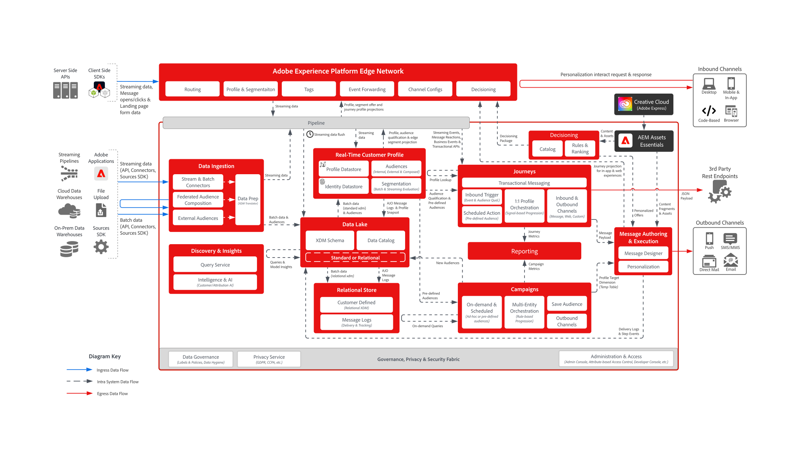

# Klantenervaring met orkesttekeningen

De ervaringen van de klant orchestratie (vroeger, _digitale ervaring_) blauwdrukken verstrekken systeem en de diagrammen van de gegevensstroom architectuur helpen beter begrijpen hoe Adobe Experience Platform en Toepassingen worden geïntegreerd en uitgevoerd. De blauwdrukken bieden een visuele weergave van gegevens- en inhoudsstromen tussen systemen en componenten, de volgorde van bewerkingen en afhankelijkheden om te helpen bij het ontwerpen van gebruiksgevallen en de architectuur van Adobe Experience Platform en toepassingen.

## Populaire blauwdrukken

<table>
<tr>
  <td>
    
    

      <a href="experience-platform/guardrails.md">
    <strong> de Architectuur van de Hub van Experience Platform en van Edge en het Diagram van Guardrails </strong>
    </a>
    

  </td>
   <td>
    
    

      <a href="experience-platform/deployment/websdk.md">
    <strong> SDK van het Web en het Diagram van de Opeenvolging van Edge Network </strong>
    </a>
    

  </td>
  <td>
    
    

      <a href="customer-journeys/journey-optimizer/journey-optimizer-overview.md">
    <strong> het Overzicht van Adobe Journey Optimizer Diagram </strong>
    </a>
    

  </td>
</tr>
</table>

## Verkennen door de industrie

Zoek gebruiksgevallen die zijn afgestemd op uw branche en die elk zijn toegewezen aan implementatiepatronen en bedrijfsdoelstellingen.

<table>
<tr>
  <td><a href="industry-use-cases/retail/retail-overview.md"><strong>Retail</strong></a></td>
  <td><a href="industry-use-cases/financial-services/financial-services-overview.md"><strong>Financiële diensten</strong></a></td>
  <td><a href="industry-use-cases/healthcare/healthcare-overview.md"><strong>Gezondheidszorg</strong></a></td>
</tr>
<tr>
  <td><a href="industry-use-cases/automotive/automotive-overview.md"><strong>Automobielen</strong></a></td>
  <td><a href="industry-use-cases/travel-hospitality/travel-hospitality-overview.md"><strong>Reizen en verblijf</strong></a></td>
  <td><a href="industry-use-cases/telecommunications/telecommunications-overview.md"><strong>Telecommunicatie</strong></a></td>
</tr>
<tr>
  <td><a href="industry-use-cases/media-entertainment/media-entertainment-overview.md"><strong>Media en entertainment</strong></a></td>
  <td><a href="industry-use-cases/insurance/insurance-overview.md"><strong>Verzekering</strong></a></td>
  <td><a href="industry-use-cases/b2b/b2b-overview.md"><strong>B2B</strong></a></td>
</tr>
</table>

[Alle gebruiksgevallen in de branche weergeven](industry-use-cases/overview.md)