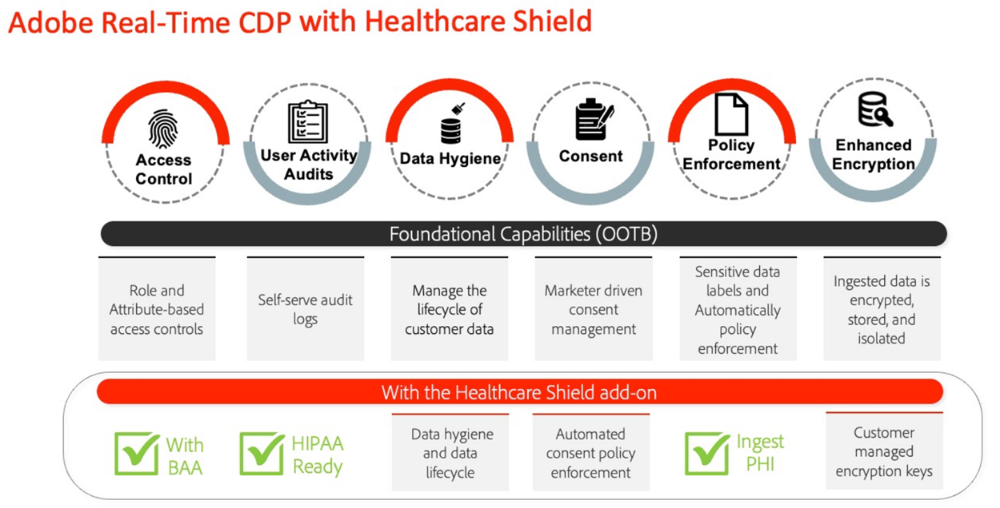
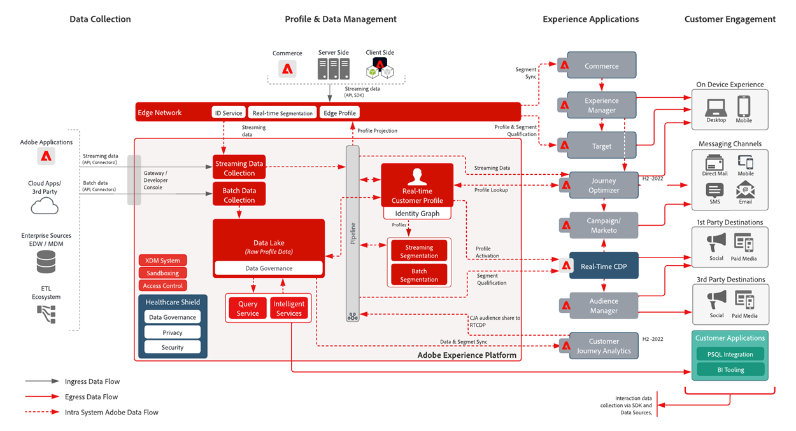
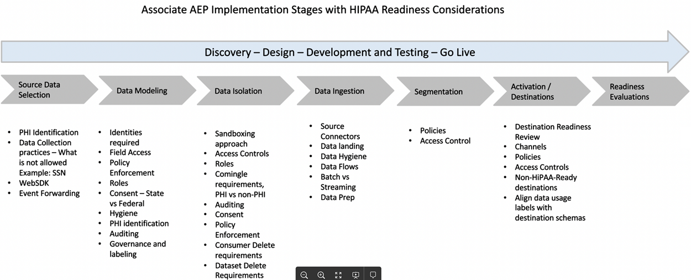

# Gezondheidsschild

Healthcare Shield is een Adobe Experience Platform-invoegtoepassing voor Adobe Experience Platform-toepassingen zoals Real-Time CDP, Customer Journey Analytics en Adobe Journey Optimizer. Het is ontworpen om deze toepassingen HIPAA-klaar te maken en te voldoen aan de vereisten inzake de verwerking en het gebruik van Protected Health Information (PHI).

## Veelgestelde vragen over het gezondheidsschild

De volgende veelgestelde vragen geven antwoorden op veelgestelde vragen over het gezondheidsschild.

### Wat is HIPAA?

HIPAA is de Health Insurance Portability and Accountability Act. Het is een Amerikaanse regeling die belangrijke bescherming voor het bedrijfsleven vastlegt. Deze bescherming beperkt het gebruik en de bekendmaking van beschermde gezondheidsinformatie (PHI) wanneer gecreeerd, ontvangen, gehandhaafd, of overgebracht door een met HIPAA behandelde entiteit of bedrijfsvennoten (zoals de klanten van Adobe) aan een bedrijfsvennoot (technologiepartners zoals Adobe).

Adobe is HIPAA-klaar als bedrijfsvennoot betreffende de specifieke HIPAA-Klaar oplossingen van de Adobe en de naleving van de Veiligheid, de Privacy, en de regels van het Bericht van het Schuim van HIPAA.

### Wat is een Business Associate Agreement (BAA) en waarom is dit belangrijk?

Wanneer een gedekte entiteit of een Business Associate (een klant van de Adobe) de diensten van een Business Associate (zoals Adobe) gebruikt om bepaalde soorten consumentengegevens te creëren, te ontvangen, te onderhouden of door te geven die zijn beschermd gezondheidszorggegevens (PHI) of ePHI (elektronische versie van PHI), moet de gedekte entiteit en de Business Associate een Business Associate Agreement (BAA) aangaan.

BAA vereist contractueel Adobe, als de Business Associate om PHI naar behoren te beschermen door te voldoen aan de vereisten van de HIPAA-regels inzake privacy, beveiliging en kennisgeving van inbreuken.

Met de add-on Healthcare Shield voor Real-Time CDP kan Adobe nu een BAA uitvoeren met klanten die deze mogelijkheid in licentie geven, samen met Adobe Real-Time CDP B2C en de consumentenstromen van Adobe Real-Time CDP B2P Edition.

### Waarom is het Gezondheidsschild voor Real-Time CDP (en toekomstige op Platform gebaseerde toepassingen) alleen beschikbaar in de VS?

Aangezien HIPAA een Amerikaanse wet is, beperken we de beschikbaarheid van het Healthcare Shield voor de VS en voor bedrijven die onderworpen zijn aan HIPAA. Adobe is van plan de dekking uit te breiden naar andere rechtsgebieden, aangezien we lokale vereisten in acht nemen en we er zeker van zijn dat we hieraan kunnen voldoen.

### Wat is het Gezondheidsschild voor Real-Time CDP?

Gezondheidszorgschild voor Real-Time CDP is bestemd voor klanten die een onder de overeenkomst vallende entiteit of een Business Associate zijn en voornemens zijn PHI in Real-Time CDP te gebruiken voor gegevensopname, het creëren van het publiek en de activering van het kanaaloverschrijdende kanaal, en van Adobe verlangen dat zij een BAA uitvoeren. Gezondheidsschild is vereist voor overdekte entiteiten met HIPAA vereiste gebruikscase voor CDP in real time.

### Waarom zouden de gezondheidsvooruitzichten van Real-Time CDP het Healthcare Shield kopen?

Als add-on bij Real-Time CDP upgradet het Healthcare Shield de toepassing naar de status &quot;HIPAA-ready&quot;. Dit betekent dat de aanvraag over de nodige waarborgen beschikt om PHI in overeenstemming met de HIPAA-voorschriften te gebruiken. Bovendien is Adobe met het Zorgschild bereid en in staat de klant te machtigen bepaalde soorten Gevoelige Persoonlijke Gegevens toe te laten aan de HIPAA-klaar toepassing. Adobe ondertekent Business Associate-overeenkomsten (BAA&#39;s) met klanten die een vergunning hebben voor het Healthcare Shield voor een compatibele toepassing op basis van Platforms.

### Welke gegevenstypen zijn toegestaan voor Real-Time CDP met het Healthcare Shield (en welke niet)?

Met het Gezondheidsschild, kunnen de merken de volgende PHI in op Platform gebaseerde toepassingen zoals Real-Time CDP (Toegelaten Gevoelige Persoonlijke Gegevens) brengen:

* Financiële informatie van een individu
* Medisch
* Gezondheidsinformatie

Maar we sluiten specifiek gegevens uit die misbruik van stoffen, geestelijke gezondheid, genetische gezondheidsgegevens of gezondheidsgegevens van een klein, volledig rekeningnummer, volledige creditcardnummers, staatsidentificatoren (zoals SSN) en persoonlijke informatie van kinderen identificeren. Kinderen zijn beschermd krachtens de wetten inzake kinderbescherming (zoals de persoonlijke informatie die is gedefinieerd in de U.S. Children&#39;s Online Privacy Act (COPPA)).

### Kunnen Real-Time CDP-klanten met het Healthcare Shield elk type PHI gebruiken om een publiek te maken en te activeren?

Zelfs wanneer een klant toegelaten Gevoelige Persoonlijke Gegevens in Platform-inheemse toepassingen kan brengen, moeten de klanten begrijpen dat zij uitsluitend verantwoordelijk zijn voor het blijven in overeenstemming met alle toepasselijke verordeningen en het verkrijgen van aangewezen toestemmingen, toestemmingen, toestemmingen, toestemmingen, en toestemmingen van consumenten om gegevens op de voorgenomen manieren te gebruiken.

### Wat zijn de nuances van het opnemen van en het activeren van klantengegevens met niet-HIPAA-klaar Adobe toepassingen?

Een aan een licentie onderworpen gezondheidszorgschild mag geen gebruik maken van, opnemen in, verzamelen, delen of integreren van toegestane vertrouwelijke persoonlijke gegevens met niet-HIPAA-Ready Adobe-toepassingen en -services.

Een klant moet bijvoorbeeld geen segmenten activeren die PHI bevatten in toepassingen zoals Audience Manager, Adobe Target en Adobe Analytics. Klanten die een vergunning verlenen voor het Gezondheidsschild kunnen toegestane Gevoelige Persoonlijke Gegevens of toegelaten PHI in HIPAA-klaar Adobe toepassingen opnemen, ongeacht of de gegevensbron als HIPAA klaar of niet wordt beschouwd.

### Wat zijn de nuances van het opnemen van en het activeren van klantengegevens met niet-HIPAA-klaar toepassingen niet-Adobe?

Een klant die een vergunning geeft aan het Gezondheidsschild zou goed oordeel moeten gebruiken om te bepalen waar zij segmenten activeren die PHI buiten toepassingen van de Adobe bevatten. Adobe heeft geen betrekking op (en is niet verantwoordelijk voor) externe providers en gegevens die door een klant worden verzonden naar een externe provider die de verwerking van gegevens mogelijk niet ondersteunt in overeenstemming met de labels voor gegevensgebruik van Adobe in het klantenschema. Bovendien kan Adobe onze klanten geen juridisch advies geven.

## Belangrijke gevallen van gebruik van het gezondheidsschild

| RTCDP B2C Edition Standard Use-gevallen | Beschrijving |
|-----|-----|
| Streaming gegevensverzameling | <ul><li>Genormaliseerde, flexibele gegevensmodellen, bruikbaar voor Adobe- en niet-Adobe-verbindingen<li>Gegevensschema&#39;s voor personen en account die zijn ontworpen voor B2C-marketing<li>Met tagbeheer en het doorsturen van gebeurtenissen worden gegevens op gebeurtenisniveau in real-time verzameld en verspreid.<li> Geoptimaliseerde profielen die de levertijd van de ervaring versnellen</li></ul> |
| Beheer van vertrouwde profielen | <ul><li>Verenigde profielen die consumentenattributen, gedrag, en voorkeursgegevens bevatten<li> Het kader voor gegevensbeheer is flexibel, transparant en wordt toegepast op uniforme profielen met beleidsvorming en automatische handhaving om misbruik van gegevens te voorkomen. </li></ul> |
| Real-Time activering | <ul><li>Segmentatie voor slepen en neerzetten ontworpen voor B2C-marketers<li>Identiteitsresolutie op persoon- en accountniveau en profielverrijking voor activering via meerdere kanalen<li> Consistente klantervaringen via publieksorchestratie en realtime activering via kanalen en omgevingen (Adobe en niet-Adobe) </li></ul> |
| Klantenovername | <ul><li>Inzichten in het omzetten van niet-geverifieerde naar herkende/geverifieerde gebruikers<li>Niet-geregistreerde gebruikers aanmoedigen zich te registreren voor lidmaatschap.<li> Abonnementen verhogen en/of terugwinnen<li> Klantprofielen analyseren om eigenheid te begrijpen (bijvoorbeeld . vergelijk hoogwaardige segmenten met ondermaatse segmenten en optimaliseer deze voor acquisitie)</li></ul> |
| Betrokkenheid van klanten | <ul><li>Doelaanbiedingen op basis van het consumentengedrag, recensie en frequentiemaatregelen voor aanbiedingen (online en offline)<li>Digitale eigenschappen verenigen voor een verbonden ervaring (bijvoorbeeld het downloaden van mobiele apps aanmoedigen en segmentactivering via kanalen gebruiken om ervaringen met elkaar te verbinden)</li></ul> |
| Personalisatie op schaal | <ul><li> Segmenten aan de rand evalueren voor realtime aanpassing van dezelfde pagina en volgende pagina<li>Verhoog de betrokkenheid door unieke en doelgerichte ervaringen te bieden aan bezoekers die een sessie over reizen verlaten (bijvoorbeeld een wagen verlaten, bezoekers die zich niet omzetten).<li> Offline en online gedrag verenigen en verbinden om gebruikers te optimaliseren en te betrekken</li></ul> |
| Crossverkoop/Upsell | <ul><li>Klanten behouden tijdens het uitbreiden en onderhouden van bestaande relaties met gebruikers<li>Nieuwe inkomstenstromen aansturen met de waarde van bedrijfseenheid/merk/aanbieding voor de levensduur van de klant<li>Versterking van AOV-inzichten in producten en SKU&#39;s (bv. frequente bundels, prijsgevoeligheid)</li></ul> |
| Behoud/Loyalty van klanten | <ul><li> Heractiveer consumenten om loyaliteit te stimuleren en klantenkring te vermijden<li>Maak gepersonaliseerde productaanbevelingen voor klanten met een hoge waarde op basis van voorkeuren en neiging<li>Een standaardcadence voor betrokkenheid en speciale aanbiedingen voor loyale consumenten maken<li> Online- en offline-voorkeuren koppelen om aanbiedingen te optimaliseren voor verschillende kanalen</li></ul> |
| Samenwerking van gegevens | <ul><li> Maak handgrepen in een gebruikersinterface om workflows voor gegevenssamenwerking op te bouwen.<li>(Gebruik eersteklas gegevens die door verschillende bedrijfstakken worden overlapt om strategische bedrijfsbeslissingen en -campagnes goed te keuren.<li>De gegevenssilo&#39;s van de onderbreking en begrijpen holistische klantenreis<li> Voorkeuren respecteren en toestemming per geval</li></ul> |
| Efficiëntie en optimalisatie van media/marketing | <ul><li> Verbeter organisatorische efficiency door klantengegevens en activeringskanalen in één systeem van verslag te centraliseren en te handhaven<li>Ondersteuningscampagnes voor effectieve media-uitgaven/efficiëntie<li> Aanpassing aan IT-beleid via bestuur en beleidshandhaving<li>Zonodig toegang tot gegevens bieden in realtime om tijdige campagnes te ondersteunen</li></ul> |

## Relevante technische mogelijkheden

### Verschillen

| Type | Buiten het vak | Gezondheidsschild |
|-----|-----|-----|
| Versleuteling | [Gegevensversleuteling in AEP](https://experienceleague.adobe.com/docs/experience-platform/landing/governance-privacy-security/encryption.html?lang=en) | [Gegevensversleuteling in AEP](https://experienceleague.adobe.com/docs/experience-platform/landing/governance-privacy-security/encryption.html?lang=en) + Door de klant beheerde toetsen |
| Gegevenshygiëne | **Foundationeel:** Self-service tool waarmee klanten de levenscyclus van gegevens kunnen beheren. Dit omvat de schrapping van klantgegevens, gebied-vlakke updates en het plaatsen van gegevensvervalsing op datasets om gegevens te verwijderen zodra verlopen.<ul><li>Limiet van **10.000 verwijderingsverzoeken** per maand<li>Limiet van 2 TTL&#39;s van de Dataset</li></ul> | **Premium**: Breid de dagelijkse capaciteit/de drempel van de functionaliteit van de Hygiëne van Gegevens uit om grotere datasets in minder tijd te leiden.<ul><li>Limiet van **2.000.000 verwijderingsverzoeken** per maand als onderdeel van het HealthCare Shield<li>Limiet van 20 TTL&#39;s voor gegevenssets</li></ul> |
| Toestemming | **Foundary**: Kortere toestemming en voorkeuren door handmatig aan publiekssegmentatie gerelateerde toestemmings- en voorkeurskenmerken toe te voegen. | **Premium**: Beleid maken en automatisch afdwingen voor het gebruik van klantgegevens op basis van de toestemming en voorkeuren. |

### Bestuur

**Gegevenshygiëne**

* [Overzicht van gegevenshygiëne](https://experienceleague.adobe.com/docs/platform-learn/tutorials/data-hygiene/overview.html?lang=en)
* [Gegevenshygiëne in Adobe Experience Platform](https://experienceleague.adobe.com/docs/experience-platform/hygiene/home.html?lang=en)

**Beleidshandhaving**

* [Overzicht van gegevensbeheer](https://experienceleague.adobe.com/docs/experience-platform/data-governance/home.html?lang=en)
* [Overzicht van beleidsregels voor gegevensgebruik](https://experienceleague.adobe.com/docs/experience-platform/data-governance/policies/overview.html?lang=en)
* [Bestuur, privacy en beveiliging in Adobe Experience Platform](https://experienceleague.adobe.com/docs/experience-platform/landing/governance-privacy-security/overview.html?lang=en#consent)

### Privacy

**Toestemming**

* [Automatische beleidshandhaving](https://experienceleague.adobe.com/docs/experience-platform/data-governance/enforcement/auto-enforcement.html?lang=en#consent-policy-evaluation)

### Beveiliging

**Verbeterde codering**

Nuttige koppelingen:

* [AEP-beveiligingswitboek](https://www.adobe.com/content/dam/cc/en/security/pdfs/AEP_SecurityOverview.pdf)

* [Gegevensversleuteling in Adobe Experience Platform](https://experienceleague.adobe.com/docs/experience-platform/landing/governance-privacy-security/encryption.html)

* [Hashingfuncties in Data Prep](https://experienceleague.adobe.com/docs/experience-platform/data-prep/functions.html?lang=en#hashing)

* [Gegevenscodering van tags](https://experienceleague.adobe.com/docs/experience-platform/tags/api/guides/encrypting-values.html?lang=en)

**Toegangsbesturingselementen**

* [Overzicht van toegangsbeheer op basis van kenmerken](https://experienceleague.adobe.com/docs/experience-platform/access-control/abac/overview.html)

**Gebruikersactiviteitenaudits**

* [Controlelogboeken](https://experienceleague.adobe.com/docs/experience-platform/landing/governance-privacy-security/audit-logs/overview.html)

**Verbeterde codering**

* [Adobe Experience Platform Security - Overzicht](https://www.adobe.com/content/dam/cc/en/security/pdfs/AEP_SecurityOverview.pdf)
* [Waarden versleutelen](https://experienceleague.adobe.com/docs/experience-platform/tags/api/guides/encrypting-values.html?lang=en)
* [Gegevenscodering in Adobe Experience Platform](https://experienceleague.adobe.com/docs/experience-platform/catalog/data-protection.html)
* [Toewijzingsfuncties voor gegevensuitwisseling vooraf - Hashing](https://experienceleague.adobe.com/docs/experience-platform/data-prep/functions.html?lang=en#hashing)

**Experience Cloud**

* [Adobe Real-time Customer Data Platform en Healthcare Shield](https://experienceleague.adobe.com/docs/customer-data-management-voices-events/events/governance/healthcare-shield.html?lang=en)

   De beloften nakomen, met toegang tot minder gegevens. In deze video leert u meer over Adobe Real-Time CDP en Healthcare Shield, een Adobe Experience Platform-invoegtoepassing voor op Adobe Experience Platform gebaseerde toepassingen die is ontworpen om deze toepassingen HIPAA gereed te maken en te voldoen aan HIPAA-vereisten met betrekking tot de verwerking en het gebruik van beschermde gezondheidsgegevens (PHI).

**Experience Platform**

* [Overzicht controlelogboeken](https://experienceleague.adobe.com/docs/experience-platform/landing/governance-privacy-security/audit-logs/overview.html)

   Leer hoe u met controlelogboeken kunt zien wie welke acties in Adobe Experience Platform heeft uitgevoerd.

* [Overzicht van gegevenshygiëne](https://experienceleague.adobe.com/docs/experience-platform/hygiene/home.html?lang=en)

   Met Adobe Experience Platform Data Hygiene kunt u de levenscyclus van uw gegevens beheren door verouderde of onjuiste gegevens bij te werken of te wissen.

* [Automatische beleidscontrole](https://experienceleague.adobe.com/docs/experience-platform/data-governance/enforcement/auto-enforcement.html?lang=en)

   Dit document behandelt hoe het beleid van het gegevensgebruik automatisch wordt afgedwongen wanneer het activeren van segmenten aan bestemmingen in Experience Platform.

* [Kenmerk-Gebaseerd Overzicht van het Toegangsbeheer](https://experienceleague.adobe.com/docs/experience-platform/access-control/abac/overview.html)

   Meer informatie over op kenmerken gebaseerd toegangsbeheer in Adobe Experience Platform.

## HIPAA en Adobe producten en diensten

Adobe blijft innoveren en zich aanpassen om te voldoen aan de behoeften van onze klanten in de gezondheidszorgindustrie om hun specifieke privacy- en veiligheidsbehoeften te voorzien.

Zie [HIPAA en de Producten van de Adobe en de Diensten](https://www.adobe.com/trust/compliance/hipaa-ready.html).

## Marketingdiagram op hoog niveau

Producten die klaar zijn voor HIPAA (en niet):

**Marketectiediagram**

[Lucidchart-bron](https://lucid.app/lucidchart/8a795213-3bfa-43f3-a542-f0de56123afd/edit?invitationId=inv_d3183739-8c07-4ca2-bfd1-16d819b911a6&amp;page=0_0)

## Benadering

In dit gedeelte worden de implementatiestappen en de interviewfase beschreven.

### Uitvoeringsfasen

Aspecten die bij elke stap in overweging moeten worden genomen:

In dit gedeelte worden enkele aanbevolen procedures beschreven die in drie fasen moeten worden uitgevoerd:

### Interview

Het interviewproces met belanghebbenden is van essentieel belang om de volgende aspecten te begrijpen:

* Doel: Gebruiksscenario&#39;s - Omzetting, Verwachting, Betrokkenheid, enz.
* Prestaties: Om het even welke verwachtingen van het Doel van het Niveau van de Dienst
* Gegevensbronnen: Web/Analytics, Offline/Online, CRM, Loyalty enz.
* Gegevensvolume
* SLT-/SLA-vereisten
* Identiteiten - Aantal identiteiten, geverifieerd versus anonieme gegevensverwerking
* Formaat van de gegevens: JSON, CSV enz.
* Kwaliteit van gegevens, noodzaak van gegevenstransformaties
* Om het even welke plannen voor de Overeenkomst van het Segment (het Delen) met Partners
* Eventuele externe doelgroepen die moeten worden geïmporteerd
* Versleuteling: Standaard versus door de klant beheerde sleutel
* Samenvoegen van gegevens: wordt beschouwd als e-PHI
* Gegevensverzameling met toestemming - OneTrust, Consent SDK
* Doelbehoeften: Vereisten inzake frequentie en latentie en toegangscontrole
* Toegangsbeheer
* Vereisten voor het opschonen van gegevens
* Vereisten voor bijwerken van gegevens
* Waarschuwing
* API-toegang

### Ontwerpfase

Op basis van het interviewproces zal de ontwerpfase het volgende behandelen. Uiteraard moet de ontwerpdocumentatie worden herzien en afgemeld. Het ontwerpdocument kan de volgende aspecten omvatten:

* Waarde van gegevens:
   * Volume - Hoeveelheid gegevens
   * Tijdsduur - tijdsduur dat de opgenomen gegevens zich moeten bevinden
   * Getrouwheid - Profielrijkheid
* AEP-geleidingssystemen in combinatie met SLT/SLA-vereisten in overweging nemen
* Licentiegebruik
* Eisen voor gegevensisolatie - meerdere sandboxen in één of meerdere organen
* Gegevensfilteren
* Vereisten inzake gegevenshygiëne (hoeveelheid gegevens en frequentie)
* Verwerking en methodologie om te voldoen aan de vereisten voor gegevensverwijdering/-update
* De behoeften van de Transformatie van gegevens - stroomopwaarts, Gegevens prep, de Dienst van de Vraag
* Primaire en andere identiteiten begrijpen en bepalen
* [XDM-schemaontwerp](https://experienceleague.adobe.com/docs/experience-platform/xdm/schema/composition.html?lang=en)
* Aantal gegevenssets, profiel versus niet-geprofileerd
* Beleidsontwerp samenvoegen
* Gegevenbeheer voor toestemming
* Bestuur: Rollen, labels, beleid, marketingacties en toegangsbeheer
* [Profielverrijking](https://experienceleague.adobe.com/docs/experience-platform/profile/guardrails.html?lang=en)
* Vereisten voor segmenteringsontwerp voor Edge/Streaming/Batch
* Verwachte doelen en activeringsplannen. Overweeg HIPAA klaar slechts bestemmingsbehoeften
* Abonnementen voor Analytics
* Waarschuwingen
* API-toegangsvereisten toevoegen

### Implementatiefase

Nadat het ontwerpdocument is gereviseerd en ondertekend, kan de implementatiefase op de volgende gebieden ingaan:

* Aantal vereiste sandboxen: Dev/Test/Prod
* Toegangsbeheer tot sandboxen
* Implementatiemethode
* TTL-behoeften en -frequentie (gegevenshygiëne)
* XDM-schema en toegangsbeheer
* Goedkeuring
* Bestuur: Rollen, labels, beleid en marketingacties
* Segmentering
* Datasets en toegangsbeheer
* Gegevenshygiëne instellen
* Instellen van doelen en toegangsbeheer
* Waarschuwingen instellen
* API-toegangsvereisten implementeren
* Eindpunt testen met modelgegevens
