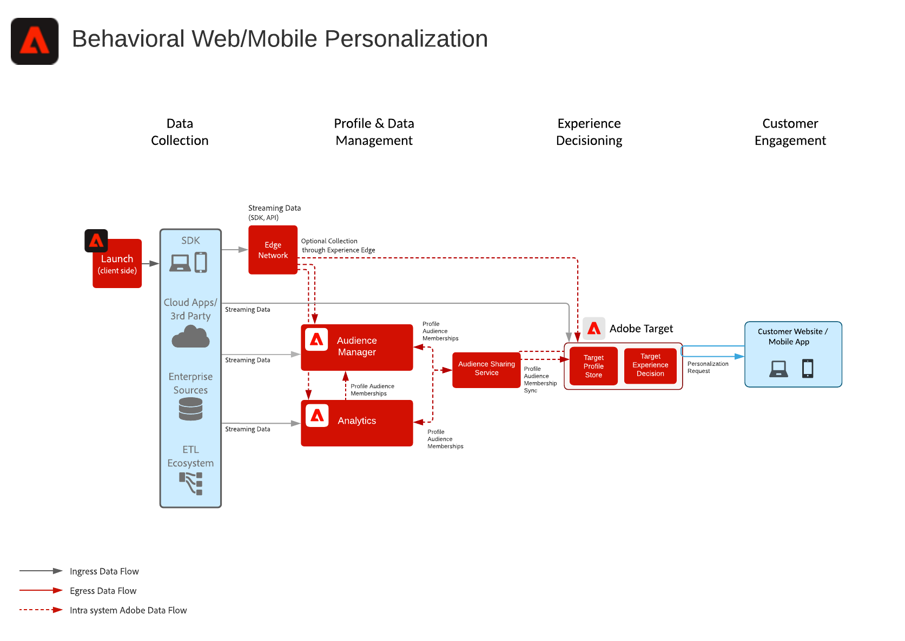

# Gedragingen Web/Mobiele Verlichting

Persoonlijk maken op basis van online gedrag en publieksgegevens.

## Gevallen gebruiken

* Optimalisatie landingspagina
* Gedragsgerichte acties
* Personalisatie op basis van eerdere productweergaven/content-weergaven, de affiniteit tussen product en inhoud, milieukenmerken, publieksgegevens van derden en demografie

## Toepassingen

* Adobe Target
* Adobe Analytics (optioneel)
* Adobe Audience Manager (optioneel)

## Architectuur

## Guardrails

Door gebrek, laat de segment delende dienst een maximum van 75 publiek toe om voor elke het rapportreeks van Adobe Analytics worden gedeeld. Als de Audience Manager voor publiek het delen wordt gebruikt, is er geen grens op het aantal publiek dat kan worden gedeeld. 

## Implementatiepatronen

De Web/Mobiele verpersoonlijkingsblauwdruk kan door de volgende benaderingen worden uitgevoerd zoals hieronder geschetst.

1. Met de [!UICONTROL Platform Web SDK] of [!UICONTROL Platform Mobile SDK] en [!UICONTROL Edge Network].
1. Traditionele toepassingsspecifieke SDK&#39;s gebruiken (bijvoorbeeld AppMeasurement.js)

### 1. Platform Web/Mobile SDK en Edge Approach

[Verwijs naar het Web van het Experience Platform en Mobiele SDK Blauwdruk](../data-ingestion/websdk.md)

### 2. Toepassingsspecifieke SDK-benadering

## Implementatievereisten

| Toepassing/service | Vereiste bibliotheek | Notities |
|---|---|---|
| Adobe Target | [!UICONTROL Platform Web SDK]*, at.js 0.9.1+, of mbox.js 61+ | at.js heeft de voorkeur omdat mbox.js niet meer wordt ontwikkeld. |
| Adobe Audience Manager (optioneel) | [!UICONTROL Platform Web SDK]* of dil.js 5.0+ |  |
| Adobe Analytics (optioneel) | [!UICONTROL Platform Web SDK]* of AppMeasurement.js 1.6.4+ |  |
| Experience Cloud Identity Service | [!UICONTROL Platform Web SDK]* of VisitorAPI.js 2.0+ |  |
| Experience Platform Mobile SDK (optioneel) | 4.11 of hoger voor iOS en Android™ |  |
| Experience Platform Web SDK | 1.0, heeft de huidige versie van Experience Platform SDK [verschillende gebruiksgevallen die nog niet worden ondersteund voor de Experience Cloud-toepassingen](https://github.com/adobe/alloy/projects/5) |  |

## Implementatiestappen

1. [Adobe Target implementeren](https://experienceleague.adobe.com/docs/target/using/implement-target/implementing-target.html) voor uw web- of mobiele toepassingen.

   Bij gebruik van Audience Manager of Adobe Analytics:

1. [Adobe Audience Manager implementeren](https://experienceleague.adobe.com/docs/audience-manager/user-guide/implementation-integration-guides/implement-audience-manager.html)
1. [Adobe Analytics implementeren](https://experienceleague.adobe.com/docs/analytics/implementation/home.html)
1. [Experience Cloud Identity Service implementeren](https://experienceleague.adobe.com/docs/id-service/using/implementation/implementation-guides.html)

   >[!NOTE]
   >
   >Elke toepassing moet de Experience Cloud-id gebruiken en deel uitmaken van dezelfde Experience Cloud-organisatie om het delen van het publiek tussen toepassingen mogelijk te maken.

1. [De levering van het verzoek voor de Mensen en de Diensten van het Delen van het Publiek (Gedeelde Publiek)](https://www.adobe.com/go/audiences)
1. Segmenten samenstellen in [Adobe Analytics](https://experienceleague.adobe.com/docs/analytics/components/segmentation/segmentation-workflow/seg-build.html) of [Adobe Audience Manager](https://experienceleague.adobe.com/docs/audience-manager/user-guide/features/segments/segment-builder.html) en [deze soorten publiek configureren voor het delen naar de Experience Cloud](https://experienceleague.adobe.com/docs/analytics/components/segmentation/segmentation-workflow/seg-publish.html)  (bij gebruik van Audience Manager of Adobe Analytics)
1. Zodra het publiek in Adobe Target beschikbaar is, kan het worden gebruikt voor [het richten van ervaringen met Adobe Target](https://experienceleague.adobe.com/docs/target/using/audiences/target.html)

## Verwante documentatie

* [Experience Cloud publiek](https://experienceleague.adobe.com/docs/core-services/interface/audiences/audience-library.html)
* [Audience Manager integreren met Adobe Target](https://experienceleague.adobe.com/docs/audience-manager/user-guide/implementation-integration-guides/integration-other-solutions/aam-target-integration.html)
* [Adobe Analytics Segment Sharing via Adobe Audience Manager](https://experienceleague.adobe.com/docs/analytics/components/segmentation/segmentation-workflow/seg-publish.html)

## Verwante blogberichten

* [[!DNL Blueprint for Web Personalization using Adobe Experience Platform Real-Time Customer Profile]](https://medium.com/adobetech/blueprint-for-web-personalization-using-adobe-experience-platform-real-time-customer-profile-fef2ce7a4b2f)
* [[!DNL Integrating Adobe Experience Platform Decisioning Engine with AEM Websites]](https://jaeness.medium.com/integrating-adobe-experience-platform-decisioning-engine-with-aem-websites-9c222acd12e2)
* [[!DNL How Adobe Experience Platform Predictive Audiences improves Personalized Experiences]](https://medium.com/adobetech/how-adobe-experience-platform-predictive-audiences-improves-personalized-experiences-1f75a60cb7a3)
* [[!DNL Adobe Experience Platform Web SDK for Audience Management]](https://medium.com/adobetech/adobe-experience-platform-web-sdk-for-audience-management-751fa6d063bc)
* [[!DNL Implementing Adobe Experience Platform Real-Time Customer Profile through our “Customer Zero” Program]](https://medium.com/adobetech/implementing-adobe-experience-platform-real-time-customer-profile-through-our-customer-zero-32e7cd952896)
* [[!DNL How Adobe Experience Platform Can Help Customers Personalize Their Mobile Messaging in Real-Time with Journey Orchestration Service and a Mobile Messaging Vendor]](https://medium.com/adobetech/how-adobe-experience-platform-helped-a-client-personalize-their-mobile-messaging-in-real-time-with-7d634aefa098)
* [[!DNL Segmentation in Seconds: How Adobe Experience Platform Made Real-time Customer Profiles a Reality]](https://medium.com/adobetech/segmentation-in-seconds-how-adobe-experience-platform-made-real-time-customer-profiles-a-reality-a7a8552b0847)
