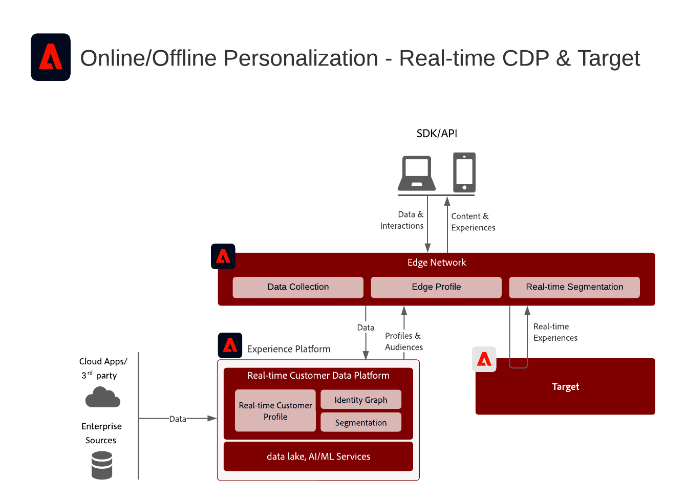
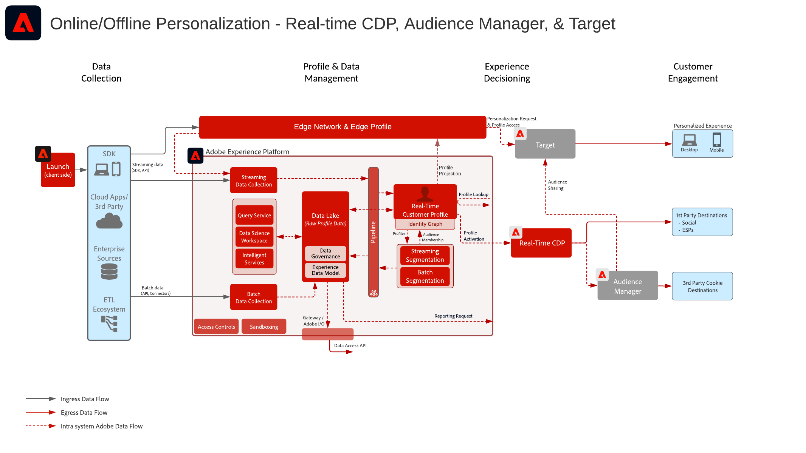
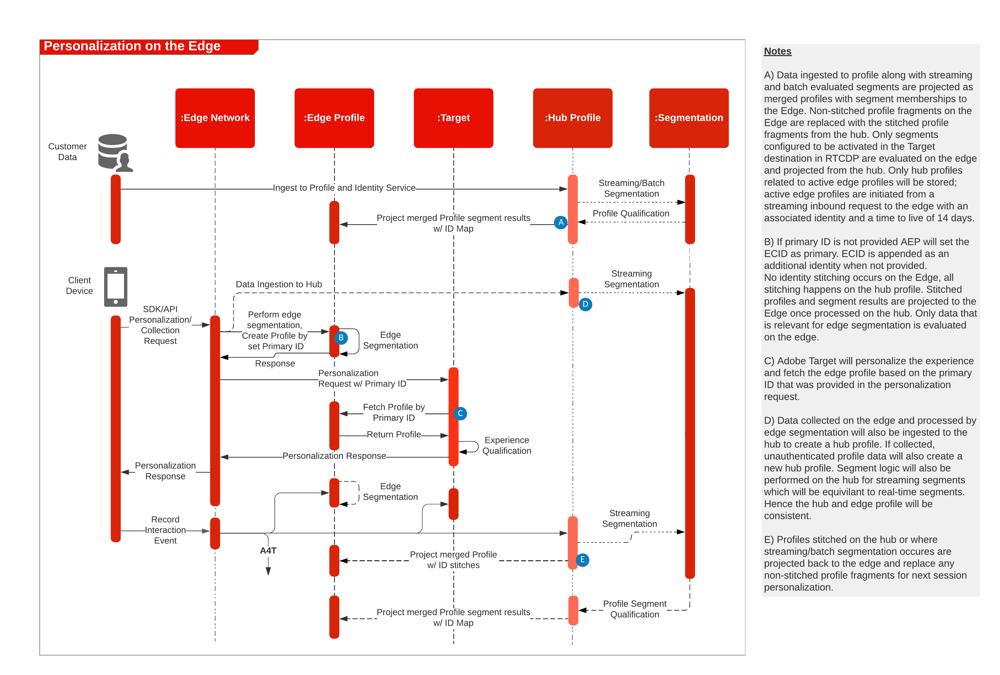

# Web/mobiel personaliseren met online en offline gegevens

Synchroniseer webpersonalisatie met e-mail en andere bekende en anonieme kanaalpersonalisatie.

## Gevallen gebruiken

* Optimalisatie landingspagina
* Gedrag en offlineprofiel activeren
* Personalisatie op basis van eerdere product/inhoud-weergaven, product/inhoud-affiniteit, milieukenmerken, publieksgegevens van derden en demografie, naast offlineinzichten zoals transacties, loyaliteit- en CRM-gegevens, en gemodelleerde inzichten
* Deel en doelpubliek dat in Real-time Customer Data Platform is gedefinieerd op websites en mobiele apps met Adobe Target.

## Toepassingen

* [!UICONTROL Real-time Customer Data Platform]
* Adobe Target
* Adobe Audience Manager (optioneel): Hiermee voegt u publieksgegevens van derden, apparaatgrafieken op basis van een computer, de mogelijkheid om Real-time Customer Data Platform-publiek in Adobe Analytics te laten opstijgen en de mogelijkheid om Adobe Analytics-publiek in Real-time Customer Data Platform te laten opstijgen toe
* Adobe Analytics (optioneel): Hiermee kunt u segmenten samenstellen op basis van historische gedragsgegevens en fijnkorrelige segmentatie van Adobe Analytics-gegevens

## Hoofdletterscenario&#39;s gebruiken

<table class="tg" style="undefined;table-layout: fixed; width: 790px">
<colgroup>
<col style="width: 20px">
<col style="width: 276px">
<col style="width: 229px">
<col style="width: 265px">
</colgroup>
<thead>
  <tr>
    <th class="tg-y6fn">Aantal</th>
    <th class="tg-f7v4">Hoofdletterscenario's gebruiken</th>
    <th class="tg-y6fn">Capaciteit</th>
    <th class="tg-f7v4">Voorwaarden</th>
  </tr>
</thead>
<tbody>
  <tr>
    <td class="tg-0lax">1</td>
<td class="tg-73oq">Realtime segmentevaluatie op de Rand die van Real-time Customer Data Platform aan Doel wordt gedeeld</td>
    <td class="tg-0lax">- Evalueer publiek in real time voor zelfde of volgende paginagrootte op de Rand. - Daarnaast worden alle segmenten die op streaming- of batchwijze worden geëvalueerd, geprojecteerd op het Edge Network, zodat deze worden opgenomen in de evaluatie en personalisatie van het Edge-segment.</td>
    <td class="tg-73oq">- Implementatiepatroon 1 zoals hieronder beschreven. - Web/Mobile SDK moet worden geïmplementeerd. - Let op: de Mobile SDK en API-gebaseerde ondersteuning voor realtime segmentatie is momenteel niet beschikbaar - DataStream moet in de Rand van de Ervaring met toegelaten de uitbreiding van het Doel en van het Experience Platform worden gevormd, zal identiteitskaart DataStream in de bestemmingsconfiguratie van het Doel worden verstrekt. - Het doel van het doel moet in de Doelen van Real-time Customer Data Platform worden gevormd. - Voor integratie met Doel is dezelfde IMS-instelling vereist als voor Experience Platform-instantie.</td> 
  </tr>
  <tr>
    <td class="tg-0lax">2</td>
    <td class="tg-73oq">Streaming en batchverdeling van publiek van Real-time Customer Data Platform naar Target via Edge-aanpak</td>
    <td class="tg-0lax">- Deel streaming en batchpubliek van Real-time Customer Data Platform naar Target via het Edge Network. Het publiek dat in real time wordt geëvalueerd vereist WebSDK en de publieksevaluatie in real time die in integratiepatroon 1 wordt geschetst. - Deze integratie wordt doorgaans gebruikt om streaming- en batchpubliek te delen met behulp van traditionele SDK's in plaats van te migreren naar de Edge Collection en WebSDK, die zowel realtime als streaming- en batchdoelgroepen mogelijk maakt, zoals beschreven in integratiepatroon 1.</td>
    <td class="tg-73oq">- Implementatiepatroon 1 of 2 zoals hieronder beschreven. - Web/Mobile SDK wordt niet vereist voor het delen van het stromen en partijpubliek aan Doel hoewel het wordt vereist om de evaluatie van het randsegment in real time zoals die in integratiepatroon 1 wordt geschetst toe te laten.  - Als u AT.js gebruikt, wordt alleen profielintegratie met de naamruimte ECID ondersteund.  - Voor de raadplegingen van douanetechaamsnamespace op de Rand, wordt de plaatsing WebSDK vereist en elke identiteit moet als identiteit in de identiteitskaart worden geplaatst. - DataStream moet in de Rand van de Ervaring worden gevormd, zal identiteitskaart DataStream in de bestemmingsconfiguratie van het Doel worden verstrekt. - Het doel van het doel moet in de Doelen van Real-time Customer Data Platform worden gevormd. - Voor integratie met Doel is dezelfde IMS-instelling vereist als voor Experience Platform-instantie.</td>
  </tr>
  <tr>
    <td class="tg-0lax">3</td>
    <td class="tg-73oq">Streaming en batchverdeling van publiek van Real-time Customer Data Platform naar Target en Audience Manager via de benadering voor het delen van services bij het publiek</td>
    <td class="tg-0lax">- Deel streaming en batchpubliek van Real-time Customer Data Platform naar Target en Audience Manager via de service Publiek delen.  - Dit integratiepatroon kan worden benut wanneer extra verrijking van gegevens van derden en publiek in de Audience Manager gewenst is. Anders hebben integratiepatroon 1 en 2 de voorkeur. Het publiek dat in real time wordt geëvalueerd vereist WebSDK en de publieksevaluatie in real time die in integratiepatroon 1 wordt geschetst.</td>
    <td class="tg-73oq">- Implementatiepatroon 1 of 2 zoals hieronder beschreven. - Web/Mobile SDK-implementatie is niet vereist voor deze integratie. - Projectie van het publiek via de service voor het delen van het publiek moet worden uitgevoerd. - Voor integratie met Doel is dezelfde IMS-instelling vereist als voor Experience Platform-instantie. - Identiteit moet worden omgezet in ECID om aan de rand te delen voordat Doel actie kan ondernemen.</td>
  </tr>
</tbody>
</table>

## Scenario 1 en 2 - Real-time, Streaming en Delen via batch voor publiek naar Adobe Target

Architectuur

Sequentiedetail

Overzicht Architectuur voor Hoofdlettergebruik Scenario 1 en 2

### De Stappen van de implementatie voor het Geval van het Gebruik Scenario 1, steunt ook Scenario 2 van het Geval van het Gebruik

1. [Adobe Target implementeren](https://experienceleague.adobe.com/docs/target/using/implement-target/implementing-target.html) voor uw web- of mobiele toepassingen
1. [Experience Platform uitvoeren en [!UICONTROL Klantprofiel in realtime]](https://experienceleague.adobe.com/docs/platform-learn/getting-started-for-data-architects-and-data-engineers/overview.html)
1. Implementeren [Experience Platform Web SDK](https://experienceleague.adobe.com/docs/experience-platform/edge/home.html). SDK van het Web van het Experience Platform wordt vereist voor segmentatie in real time van de Rand, maar niet vereist voor het delen van het stromen en partijpubliek van Real-time Customer Data Platform aan Doel. Ondersteuning voor realtime segmentatie via de mobiele SDK en API is momenteel niet beschikbaar.
1. [Het Edge-netwerk configureren met een Edge DataStream](https://experienceleague.adobe.com/docs/experience-platform/edge/fundamentals/datastreams.html)
1. [Adobe Target inschakelen als bestemming in Real-time Customer Data Platform](https://experienceleague.adobe.com/docs/experience-platform/destinations/catalog/personalization/adobe-target-connection.html?lang=en)

## Scenario 3 - Streaming and Batch Audience Sharing via de Publiek delende Dienst aan Adobe Target en Audience Manager

Architectuur

### De Stappen van de implementatie voor Scenario 3, steunen ook scenario 2

1. [Adobe Target implementeren](https://experienceleague.adobe.com/docs/target/using/implement-target/implementing-target.html) voor uw web- of mobiele toepassingen
1. [Adobe Audience Manager implementeren](https://experienceleague.adobe.com/docs/audience-manager/user-guide/implementation-integration-guides/implement-audience-manager.html) (optioneel)
1. [Adobe Analytics implementeren](https://experienceleague.adobe.com/docs/analytics/implementation/home.html)  (optioneel)
1. [Experience Platform uitvoeren en [!UICONTROL Klantprofiel in realtime]](https://experienceleague.adobe.com/docs/platform-learn/getting-started-for-data-architects-and-data-engineers/overview.html)
1. Implementeren [Experience Cloud Identity Service](https://experienceleague.adobe.com/docs/id-service/using/implementation/implementation-guides.html)
1. [Verzoek om provisioning voor het delen van publiek tussen Experience Platform en Adobe Target (gedeeld publiek)](https://www.adobe.com/go/audiences) om publiek van Experience Platform aan Doel te delen.
1. (Optioneel) [Het Edge-netwerk configureren met een Edge DataStream](https://experienceleague.adobe.com/docs/experience-platform/edge/fundamentals/datastreams.html) (Dit is alleen vereist voor integratiepatroon 2, waarbij het publiek niet hoeft te worden gedeeld met Audience Manager of verrijkt door het publiek of de gegevens van de Audience Manager).
1. (Optioneel) [Adobe Target inschakelen als bestemming in Real-time Customer Data Platform](https://experienceleague.adobe.com/docs/experience-platform/destinations/catalog/personalization/adobe-target-connection.html?lang=en) om streaming en batchpubliek van Real-time Customer Data Platform rechtstreeks naar Edge te delen, versus via de service en Audience Manager voor het delen van publiek.

## Implementatiepatronen

Online en Offline personalisatie wordt ondersteund via verschillende implementatiemethoden.

### Implementatiepatroon 1 - Ondersteunt scenario 1 en 2 voor gebruik van hoofdletters en kleine letters. Edge Network met Web/Mobile SDK (aanbevolen aanpak)

Het gebruiken van het Netwerk van de Rand met Web/Mobile SDK

Reeksdiagram

### Implementatiepatroon 2 - Ondersteunt scenario 2 en 3 voor het gebruik van hoofdletters en kleine letters. Toepassingsspecifieke SDK&#39;s

Traditionele toepassingsspecifieke SDK&#39;s gebruiken (bijvoorbeeld AT.js en AppMeasurement.js)

## Guardrails

[Raadpleeg de handleidingen op de pagina Overzicht van de blauwdrukken voor persoonlijk gebruik op internet en mobiele apparatuur.](overview.md)

## Overwegingen bij de implementatie

Identiteitsvoorwaarden

* Elke primaire identiteit kan worden benut wanneer implementatiepatroon 1 wordt gebruikt die hierboven is beschreven met het Edge-netwerk en WebSDK. Voor de eerste persoonlijke aanmelding is de primaire identiteit van de set met verpersoonlijkingsverzoeken gelijk aan de primaire identiteit van het profiel van Real-time Customer Data Platform. Identiteitsvervlechting tussen anonieme apparaten en bekende klanten wordt verwerkt op de hub en later geprojecteerd aan de rand.
* Voor het delen van het publiek van Adobe Experience Platform naar Adobe Target moet ECID als identiteit worden gebruikt bij het gebruik van de service voor het delen van het publiek, zoals beschreven in scenario 3 hierboven.
* Alternatieve identiteiten kunnen ook worden gebruikt om het publiek van het Experience Platform via Audience Manager naar Adobe Target te delen. Experience Platform activeert publiek naar Audience Manager via de volgende ondersteunde naamruimten: IDFA, GAID, AdCloud, Google, ECID, EMAIL_LC_SHA256. Merk op dat Audience Manager en Doel publiekslidmaatschappen via de identiteit van ECID oplossen, zodat ECID nog voor het definitieve publiek die aan Adobe Target deelt wordt vereist.

## Verwante documentatie

### Documentatie

* [Adobe Target Connection voor Real-time Customer Data Platform](https://experienceleague.adobe.com/docs/experience-platform/destinations/catalog/personalization/adobe-target-connection.html?lang=en)
* [Experience Platform segmentdelen met Audience Manager en andere Experience Cloud-oplossingen](https://experienceleague.adobe.com/docs/audience-manager/user-guide/implementation-integration-guides/integration-experience-platform/aam-aep-audience-sharing.html)
* [Experience Platform Web SDK-documentatie](https://experienceleague.adobe.com/docs/experience-platform/edge/home.html)
* [Documentatie Experience Cloud ID-service](https://experienceleague.adobe.com/docs/id-service/using/home.html)
* [Overzicht van segmentatie Experience Platform](https://experienceleague.adobe.com/docs/experience-platform/segmentation/home.html)
* [Segmentatie in realtime](https://experienceleague.adobe.com/docs/experience-platform/segmentation/ui/edge-segmentation.html)
* [Streaming segmentering](https://experienceleague.adobe.com/docs/experience-platform/segmentation/api/streaming-segmentation.html)
* [Overzicht van Experience Platform Segment Builder](https://experienceleague.adobe.com/docs/experience-platform/segmentation/ui/overview.html)
* [Audience Manager Source Connector](https://experienceleague.adobe.com/docs/experience-platform/sources/connectors/adobe-applications/audience-manager.html)
* [Adobe Analytics Segment Sharing via Adobe Audience Manager](https://experienceleague.adobe.com/docs/analytics/components/segmentation/segmentation-workflow/seg-publish.html)
* [Documentatie over Experience Platform-tags](https://experienceleague.adobe.com/docs/experience-platform/tags/home.html)

### Tutorials

* [Volgend-klare verpersoonlijking met Real-Time CDP en Adobe Target](https://experienceleague.adobe.com/docs/platform-learn/tutorials/experience-cloud/next-hit-personalization.html?lang=en)

## Verwante blogberichten

* [[!DNL Blueprint for Web Personalization using Adobe Experience Platform Real-Time Customer Profile]](https://medium.com/adobetech/blueprint-for-web-personalization-using-adobe-experience-platform-real-time-customer-profile-fef2ce7a4b2f)
* [[!DNL Build an Optimal Online Experience: Enrich Unified Profile with Query Service]](https://medium.com/adobetech/build-an-optimal-online-experience-enrich-unified-profile-with-query-service-8027c196ab33)
* [[!DNL Integrating Adobe Experience Platform Decisioning Engine with AEM Websites]](https://jaeness.medium.com/integrating-adobe-experience-platform-decisioning-engine-with-aem-websites-9c222acd12e2)
* [[!DNL Adobe Experience Platform’s Identity Service — How to Solve the Customer Identity Conundrum]](https://medium.com/adobetech/adobe-experience-platforms-identity-service-how-to-solve-the-customer-identity-conundrum-f95e22d16ea9)
* [[!DNL How Adobe Experience Platform Predictive Audiences improves Personalized Experiences]](https://medium.com/adobetech/how-adobe-experience-platform-predictive-audiences-improves-personalized-experiences-1f75a60cb7a3)
* [[!DNL Adobe Experience Platform Web SDK for Audience Management]](https://medium.com/adobetech/adobe-experience-platform-web-sdk-for-audience-management-751fa6d063bc)
* [[!DNL Implementing Adobe Experience Platform Real-Time Customer Profile through our “Customer Zero” Program]](https://medium.com/adobetech/implementing-adobe-experience-platform-real-time-customer-profile-through-our-customer-zero-32e7cd952896)
* [[!DNL How Adobe Experience Platform Can Help Customers Personalize Their Mobile Messaging in Real-Time with Journey Orchestration Service and a Mobile Messaging Vendor]](https://medium.com/adobetech/how-adobe-experience-platform-helped-a-client-personalize-their-mobile-messaging-in-real-time-with-7d634aefa098)
* [[!DNL Segmentation in Seconds: How Adobe Experience Platform Made Real-time Customer Profiles a Reality]](https://medium.com/adobetech/segmentation-in-seconds-how-adobe-experience-platform-made-real-time-customer-profiles-a-reality-a7a8552b0847)
* [[!DNL Build an Optimal Online Experience: Enrich Unified Profile with Query Service]](https://medium.com/adobetech/build-an-optimal-online-experience-enrich-unified-profile-with-query-service-8027c196ab33)
