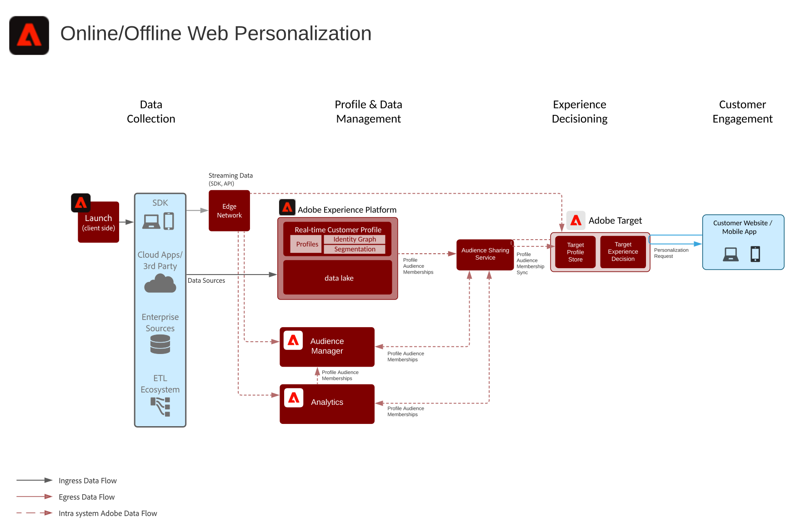

# Blauwdruk online/offline web/mobiele personalisatie

Synchroniseer webpersonalisatie met e-mail en andere bekende en anonieme kanaalpersonalisatie.

## Gevallen gebruiken

* Optimalisatie landingspagina
* Gedrag en offlineprofiel activeren
* Personalisatie op basis van eerdere product/inhoud-weergaven, product/inhoud-affiniteit, milieukenmerken, publieksgegevens van derden en demografie, naast offlineinzichten zoals transacties, loyaliteit- en CRM-gegevens, en gemodelleerde inzichten

## Toepassingen

* [!UICONTROL Real-time Platform voor klantgegevens]
* Adobe Target
* Adobe Audience Manager (optioneel): Hiermee voegt u publieksgegevens van derden, apparaatgrafieken die op meerdere pagina&#39;s zijn gebaseerd, de mogelijkheid om segmenten van Platforms in Adobe Analytics te laten doorlopen en de mogelijkheid om Adobe Analytics-segmenten in het Platform te laten doorlopen toe
* Adobe Analytics (optioneel): Hiermee kunt u segmenten samenstellen op basis van historische gedragsgegevens en fijnkorrelige segmentatie van Adobe Analytics-gegevens

## Architectuur

## Guardrails

* De segmenten die van Experience Platform aan Audience Manager worden gedeeld worden gedeeld binnen notulen van segmentverwezenlijking - of via het stromen of partijevaluatie methode. Er is een aanvankelijke synchronisatie van de segmentconfiguratie tussen Experience Platform en Audience Manager van ongeveer 4 uren voor het segmentlidmaatschap van het Experience Platform beginnen om in de profielen van de Audience Manager te worden gerealiseerd. Eenmaal in de profielen van de Audience Manager, zijn de het segmentlidmaatschap van het Experience Platform beschikbaar voor de zelfde paginagrootte door Adobe Target.
* Merk op dat voor segmentrealisaties die binnen de synchronisatie van de 4 uurssegmentconfiguratie tussen Experience Platform en Audience Manager voorkomen, deze segmentrealisaties in Audience Manager op de verdere baan van het partijsegment als &quot;bestaande&quot;segmenten zullen worden gerealiseerd.
* Delen van batchsegmenten vanaf Experience Platform - eenmaal per dag of handmatig gestart via API. Zodra deze segmentlidmaatschappen worden gerealiseerd worden zij gedeeld aan Audience Manager binnen notulen en beschikbaar voor zelfde/volgende paginagrootte in Doel.
* Streaming segmentatie wordt binnen ongeveer 5 minuten gerealiseerd. Zodra deze segmentrealisaties voorkomen, worden zij gedeeld aan Audience Manager binnen notulen en beschikbaar voor zelfde/volgende paginagrootte in Doel.
* Door gebrek laat de segment delende dienst een maximum van 75 publiek toe om voor elke het rapportreeks van Adobe Analytics worden gedeeld. Als de klant een licentie voor Audience Managers heeft, geldt er geen limiet voor het aantal soorten publiek dat kan worden gedeeld tussen Adobe Analytics en Adobe Target of Audience Manager en Adobe Target.

## Implementatiepatronen

De Web/Mobiele verpersoonlijkingsblauwdruk kan door de volgende benaderingen worden uitgevoerd zoals hieronder geschetst.

1. Het gebruiken van het Web SDK van het Platform/Mobiele SDK en het Netwerk van de Rand.
1. Traditionele toepassingsspecifieke SDK&#39;s gebruiken (bijvoorbeeld AppMeasurement.js)

### 1. Platform Web/Mobile SDK en Edge Approach

### 2. Toepassingsspecifieke SDK-benadering

## Implementatievereisten

| Toepassing/service | Vereiste bibliotheek | Notities |
|---|---|---|
| Adobe Target | Platform Web SDK*, at.js 0.9.1+, of mbox.js 61+ | at.js heeft de voorkeur omdat mbox.js niet meer wordt ontwikkeld. |
| Adobe Audience Manager (optioneel) | Platform Web SDK* of dil.js 5.0+ |  |
| Adobe Analytics (optioneel) | Platform Web SDK* of AppMeasurement.js 1.6.4+ | Bij het bijhouden van Adobe Analytics moet gebruik worden gemaakt van regionale gegevensverzameling (Regional Data Collection, RDC). |
| Experience Cloud ID-service | Platform Web SDK* of VisitorAPI.js 2.0+ | (Aanbevolen) Gebruik Experience Platform Launch om de dienst van identiteitskaart op te stellen om ervoor te zorgen dat identiteitskaart vóór om het even welke toepassingsvraag wordt geplaatst |
| Experience Platform Mobile SDK (optioneel) | 4.11 of hoger voor iOS en Android™ |  |
| Experience Platform Web SDK | 1.0, heeft de huidige versie van Experience Platform SDK [verschillende gebruiksgevallen nog niet ondersteund voor de Experience Cloud toepassingen](https://github.com/adobe/alloy/projects/5) |  |

## Implementatiestappen

1. [Adobe-](https://experienceleague.adobe.com/docs/target/using/implement-target/implementing-target.html) doel implementeren voor uw web- of mobiele toepassingen
1. [Adobe Audience Manager](https://experienceleague.adobe.com/docs/audience-manager/user-guide/implementation-integration-guides/implement-audience-manager.html)  implementeren (optioneel)
1. [Adobe Analytics](https://experienceleague.adobe.com/docs/analytics/implementation/home.html)   implementeren (optioneel)
1. [Experience Platform en  [!UICONTROL Real-time klantprofiel implementeren]](https://experienceleague.adobe.com/docs/platform-learn/getting-started-for-data-architects-and-data-engineers/overview.html)
1. [Experience Cloud Identity Service](https://experienceleague.adobe.com/docs/id-service/using/implementation/implementation-guides.html) of [Experience Platform Web SDK](https://experienceleague.adobe.com/docs/experience-platform/edge/home.html) implementeren
   >[!NOTE]
   >
   >Elke toepassing moet de Experience Cloud-id gebruiken en deel uitmaken van dezelfde Experience Cloud-organisatie om het delen van het publiek tussen toepassingen mogelijk te maken.
1. [Verzoek om provisioning voor het delen van publiek tussen Experience Platform en Adobe Target (gedeeld publiek)](https://www.adobe.com/go/audiences)

## Verwante documentatie

* [Experience Platform segmentdelen met Audience Manager en andere Experience Cloud-oplossingen](https://experienceleague.adobe.com/docs/audience-manager/user-guide/implementation-integration-guides/integration-experience-platform/aam-aep-audience-sharing.html)
* [Overzicht van segmentatie Experience Platform](https://experienceleague.adobe.com/docs/experience-platform/segmentation/home.html)
* [Streaming segmentering](https://experienceleague.adobe.com/docs/experience-platform/segmentation/api/streaming-segmentation.html)
* [Overzicht van Experience Platform Segment Builder](https://experienceleague.adobe.com/docs/experience-platform/segmentation/ui/overview.html)
* [Audience Manager Source Connector](https://experienceleague.adobe.com/docs/experience-platform/sources/connectors/adobe-applications/audience-manager.html)
* [Adobe Analytics Segment Sharing via Adobe Audience Manager](https://experienceleague.adobe.com/docs/analytics/components/segmentation/segmentation-workflow/seg-publish.html)
* [Experience Platform Web SDK-documentatie](https://experienceleague.adobe.com/docs/experience-platform/edge/home.html)
* [Documentatie Experience Cloud ID-service](https://experienceleague.adobe.com/docs/id-service/using/home.html)
* [Documentatie Experience Platform Launch](https://experienceleague.adobe.com/docs/launch/using/home.html)

## Verwante blogberichten

* [[!DNL Blueprint for Web Personalization using Adobe Experience Platform Real-Time Customer Profile]](https://medium.com/adobetech/blueprint-for-web-personalization-using-adobe-experience-platform-real-time-customer-profile-fef2ce7a4b2f)
* [[!DNL Build an Optimal Online Experience: Enrich Unified Profile with Query Service]](https://medium.com/adobetech/build-an-optimal-online-experience-enrich-unified-profile-with-query-service-8027c196ab33)
* [[!DNL Integrating Adobe Experience Platform Decisioning Engine with AEM Websites]](https://jaeness.medium.com/integrating-adobe-experience-platform-decisioning-engine-with-aem-websites-9c222acd12e2)
* [[!DNL Adobe Experience Platform’s Identity Service — How to Solve the Customer Identity Conundrum]](https://medium.com/adobetech/adobe-experience-platforms-identity-service-how-to-solve-the-customer-identity-conundrum-f95e22d16ea9)
* [[!DNL How Adobe Experience Platform Predictive Audiences improves Personalized Experiences]](https://medium.com/adobetech/how-adobe-experience-platform-predictive-audiences-improves-personalized-experiences-1f75a60cb7a3)
* [[!DNL Adobe Experience Platform Web SDK for Audience Management]](https://medium.com/adobetech/adobe-experience-platform-web-sdk-for-audience-management-751fa6d063bc)
* [[!DNL Implementing Adobe Experience Platform Real-Time Customer Profile through our “Customer Zero” Program]](https://medium.com/adobetech/implementing-adobe-experience-platform-real-time-customer-profile-through-our-customer-zero-32e7cd952896)
* [[!DNL How Adobe Experience Platform Can Help Customers Personalize Their Mobile Messaging in Real-Time with Journey Orchestration Service and a Mobile Messaging Vendor]](https://medium.com/adobetech/how-adobe-experience-platform-helped-a-client-personalize-their-mobile-messaging-in-real-time-with-7d634aefa098)
* [[!DNL Segmentation in Seconds: How Adobe Experience Platform Made Real-time Customer Profiles a Reality]](https://medium.com/adobetech/segmentation-in-seconds-how-adobe-experience-platform-made-real-time-customer-profiles-a-reality-a7a8552b0847)
* [[!DNL Build an Optimal Online Experience: Enrich Unified Profile with Query Service]](https://medium.com/adobetech/build-an-optimal-online-experience-enrich-unified-profile-with-query-service-8027c196ab33)
