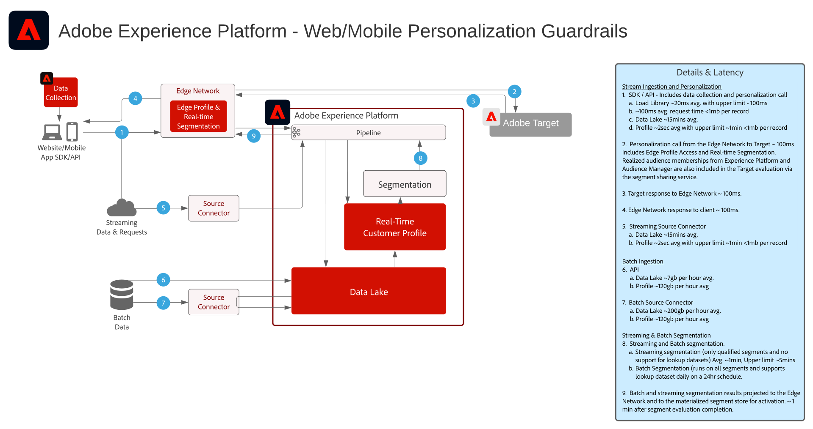

# Web en Mobiele Vernieuwingsblauwdrukken

Het Web en de Mobiele Personalisering richt de capaciteit om profiel en publiekssegmentatie over veelvoudige toepassingen te gebruiken om klantenervaringen te personaliseren en te optimaliseren. Het gedrag van de klant, demografie, loyaliteitsniveau, en vroegere transacties kunnen worden gebruikt om lay-outs, vraag-aan-actie, en inhoud te personaliseren.

 

| Blauwdruk | Beschrijving | Experience Cloud-toepassingen |
|---|---|---|
| **[Gedrag web/mobiele personalisatie](behavioral.md)** | <ul><li>Persoonlijk maken op basis van online gedrag en publieksgegevens</li></ul> | <ul><li>Adobe Target</li><li>Adobe Real-time Customer Data Platform *(optioneel)*</li><li>Adobe Analytics *(optioneel)*</li><li>Adobe Audience Manager *(optioneel)*</li></ul> |
| **[Web/Mobiele Personalisatie met bekende klantengegevens](known-personalization.md)** | <ul><li>Volledige klantprofielen en verbeterde segmentatie bieden betere persoonlijke ervaringen.</li><li>Personaliseer met off-line attributen en gebeurtenissen (transacties, reserveringen, CRM, en loyaliteitsgegevens).</li><li>Synchroniseer personalisatie over Web, e-mail, en andere bekende kanalen.</li></ul> | <ul><li>Adobe Target</li><li>[!UICONTROL Real-time Customer Data Platform]</li><li>Adobe Analytics of Customer Journey Analytics *(optioneel)*</li><li>Adobe Audience Manager *(optioneel)*</li></ul> |

 

## Guardrails voor web en mobiele personalisatie

[Raadpleeg de documentatie bij het profiel en de segmentatiehulplijnen voor instructies over publiek- en profielactivering.](https://experienceleague.adobe.com/docs/experience-platform/profile/guardrails.html)

 

### Grafiek met bekende gebruikershandleiding voor personalisatie

## Gerelateerde blogberichten

* [[!DNL Blueprint for Web Personalization using Adobe Experience Platform Real-Time Customer Profile]](https://medium.com/adobetech/blueprint-for-web-personalization-using-adobe-experience-platform-real-time-customer-profile-fef2ce7a4b2f)
* [[!DNL Integrating Adobe Experience Platform Decisioning Engine with AEM Websites]](https://jaeness.medium.com/integrating-adobe-experience-platform-decisioning-engine-with-aem-websites-9c222acd12e2)
* [[!DNL Content and Commerce AI: Personalizing Your Interactions with Customers Through Content Intelligence]](https://medium.com/adobetech/content-and-commerce-ai-personalizing-your-interactions-with-customers-through-content-intelligence-dc182601deab)
* [[!DNL Implementing Adobe Experience Platform Real-Time Customer Profile through our "Customer Zero" Program]](https://medium.com/adobetech/implementing-adobe-experience-platform-real-time-customer-profile-through-our-customer-zero-32e7cd952896)
* [[!DNL Segmentation in Seconds: How Adobe Experience Platform Made Real-time Customer Profiles a Reality]](https://medium.com/adobetech/segmentation-in-seconds-how-adobe-experience-platform-made-real-time-customer-profiles-a-reality-a7a8552b0847)
* [[!DNL Build an Optimal Online Experience: Enrich Unified Profile with Query Service]](https://medium.com/adobetech/build-an-optimal-online-experience-enrich-unified-profile-with-query-service-8027c196ab33)
